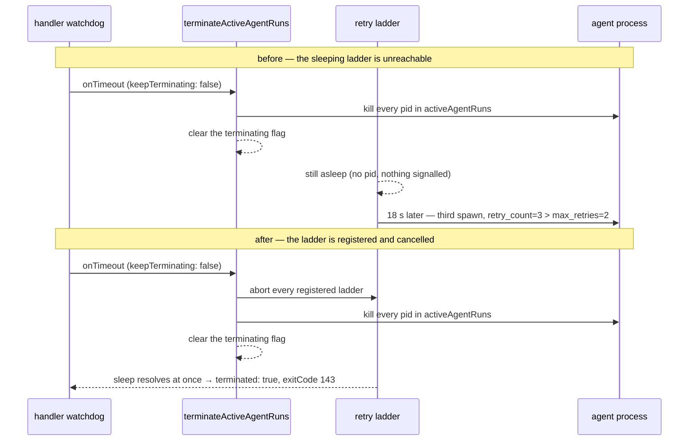
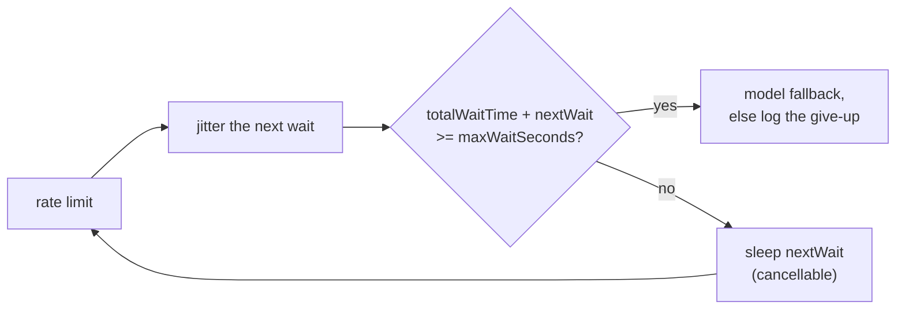

# Cancel a watchdog-abandoned retry ladder and keep it under its budget

## Summary

`runClaudeWithRetry`'s rate-limit backoff ladder sleeps in-process between
attempts, and in that state it owns no pid — so `terminateActiveAgentRuns`,
which kills what is in `activeAgentRuns`, reached nothing. On a handler
abandonment the flag was cleared (`keepTerminating: false`, Issue #55) while
the ladder slept, and eighteen seconds later the ladder woke and spawned a
third agent with `retry_count=3 max_retries=2`, behind a
`[watchdog] … abandoning handler` line.

Separately the ladder clamped its next wait down to whatever budget remained
(`min(jittered, maxWaitSeconds - totalWaitTime)`), so a 375 s wait followed by
a 225 s wait put the next spawn at exactly 600 s — the handler watchdog's own
budget — and the watchdog abandoned the ladder rather than the ladder giving
up.

Three changes:

- **A cancellation the ladder honours.** Each in-flight `runClaudeWithRetry`
  call registers an `AbortController` in a module-level set beside
  `activeAgentRuns`; `terminateActiveAgentRuns` aborts every registered ladder
  before anything can clear the flag. The ladder consults its own signal ahead
  of the process-global flag — first in the loop, ahead of the invocation
  budget — so an abandoned ladder always reports the existing run-end shape
  (`terminated: true`, `exitCode: 143`) rather than a give-up.
- **A cancellable `Clock.sleep`.** The seam takes an optional `AbortSignal`;
  `systemClock` and the test fake both resolve the sleep the moment it aborts,
  and both treat an already-aborted signal as "do not wait". The sleep always
  *resolves* rather than rejecting, so a cancelled ladder decides what to do
  next instead of unwinding through a throw.
- **A budget strictly below the watchdog.** The jittered next wait is computed
  before the exhaustion check, and `totalWaitTime + nextWait >= maxWaitSeconds`
  now takes the same fallback-or-give-up branch. The clamp is gone, so the
  ladder never schedules a wait that reaches its ceiling and logs its own
  give-up instead.

Closes #1667.

## Evidence

Backend-only change — no web interface to screenshot. The evidence is the
tests below, each observed failing against the unfixed runner and passing
after the fix (see **Reproduction**), plus a full `./quality.sh` run: **PASSED
(with skipped checks)** — `config integration` is the pre-existing environment
skip, every other check including `deno lint`, `deno type check`, `deno fmt`,
`semgrep` and the full `deno test` suite passed.

The abandonment path before and after:

And the budget, per model tier:

## Reproduction

- **symptom** — a handler abandoned by the watchdog while its rate-limit
  ladder slept between attempts spawned another agent minutes later
  (`[SECURITY] [RATE_LIMIT] retry_count=3 max_retries=2` after
  `[watchdog] … abandoning handler`), and a ladder that ran its budget out
  slept to exactly `maxWaitSeconds` — the watchdog's own budget — instead of
  giving up
- **status** — `verified` — each regression test was run against the unfixed
  `claude_runner.ts` and observed failing, then against the fix and observed
  passing. The recorded reds: the ceiling test asserted `[]` and got
  `[600000]`; the total-wait test reported `total wait 600s must stay under
  the 600s ceiling (waits: 87000, 218000, 295000)` — the issue's symptom
  exactly; both abandonment tests failed with the abandoned ladder never
  ending (`timed out waiting for the abandoned ladder to end`)
- **regression test** —
  `worker/deno/tests/claude_runner_rate_limit_fallback_test.ts::runClaudeWithRetry - a ladder abandoned mid-sleep ends without spawning again (Issue #1667)`
  and
  `worker/deno/tests/run_core_watchdog_test.ts::run_core watchdog - abandonment ends a sleeping retry ladder and still clears the flag (Issue #1667)`

## Acceptance Criteria

<!-- vibe-spec-review inputs="diff+issue-body" -->

- **met** — a handler abandoned while its ladder sleeps spawns nothing further
  (fake-clock test asserts the spawn count stays at 2) — evidence:
  `worker/deno/tests/claude_runner_rate_limit_fallback_test.ts::runClaudeWithRetry - a ladder abandoned mid-sleep ends without spawning again (Issue #1667)`
  asserts `models.length === 2` and no `retry_count=3` line — reviewer: met
- **met** — the terminating flag is clear for the next priority after the
  abandonment — evidence:
  `worker/deno/tests/run_core_watchdog_test.ts::run_core watchdog - abandonment ends a sleeping retry ladder and still clears the flag (Issue #1667)`
  samples `isAgentRunsTerminating()` inside the *next* Priority 1.x handler —
  reviewer: met
- **partial** — the ladder's total wait stays strictly below `maxWaitSeconds`;
  a run-out ladder logs its own give-up rather than being abandoned by the
  watchdog — evidence: `worker/deno/lib/claude_runner.ts` (the
  `totalWaitTime + jitteredWait >= maxWaitSeconds` guard) and
  `claude_runner_rate_limit_fallback_test.ts::runClaudeWithRetry - the total
  served wait stays strictly below maxWaitSeconds (Issue #1667)` —
  reviewer: partial — reason: the guard is per model tier, and the
  pre-existing model-fallback rung deliberately resets `totalWaitTime` for a
  fresh per-tier backoff (Issue #3648's comment says so explicitly), so with
  `enableModelFallback: true` a multi-tier walk can still accumulate past
  600 s of wall clock; closing that needs the `deadlineEpochMs` clamp the
  issue listed as optional and told this PR not to widen
- **met** — existing rate-limit fallback and invocation-budget (#3648) tests
  pass unchanged — evidence: no existing test body was modified; the three
  pre-existing tests in `claude_runner_rate_limit_fallback_test.ts` and all
  four in `claude_runner_invocation_budget_3648_test.ts` pass — reviewer: met
- **met** — quality gate passes — evidence: `./quality.sh` run after the final
  edit, `Result: PASSED (with skipped checks)` — reviewer: missing — reason:
  the reviewer saw only the diff and correctly reported `deno lint` red at
  `clock.ts:84` and `fake_clock.ts:226` (two `prefer-const` errors); both were
  fixed in response and the full gate was re-run green here
- **unrequested** — `docs/INTERNALS.md` gains a clause that a wait cut short by
  the abandonment is not recorded against `usage_blocked_seconds`, and
  `docs/CONFIGURATION.md`'s `max_rate_limit_wait` row is rewritten —
  reviewer: unrequested — reason: both are documented surfaces whose meaning
  this diff changes; the standards reviewer flagged the `max_rate_limit_wait`
  row as a docs change owed by the code change
- **unrequested** — five `Clock`-seam cancellation tests in
  `worker/deno/tests/clock_test.ts` — reviewer: unrequested — reason: the new
  `signal` parameter is public API on a shared seam and had no direct
  coverage; the issue named only the two end-to-end files
- **unrequested** — `writeRateLimitSignal` now publishes the unclamped
  jittered wait to other workers on the machine — reviewer: unrequested —
  reason: a direct consequence of removing the clamp, which the issue did ask
  for; the value published is now simply the wait actually about to be served

## Standards Review

<!-- vibe-standards-review inputs="diff+CODING-STANDARDS.md" -->

- **violation** — an unbounded `while (true)` polling loop drove the fake clock
  in the abandonment test; the reviewer reproduced a hang in 4 of 9 runs under
  CPU load — evidence: `worker/deno/tests/claude_runner_rate_limit_fallback_test.ts`
  (the `while (true) { await clock.advance(60_000); … }` rendezvous) — reason:
  fixed here. The test now parses the exact wait from the ladder's own
  `Retry N of M. Waiting Ss` line and rendezvouses with
  `FakeClock.armedFor(wait * 1000)` before advancing by exactly that delay, so
  it never pre-expires the run's own watchdogs. Every wait is wrapped in a
  bounded `within()` helper that fails loudly instead of hanging. Verified
  stable: 8 consecutive runs green with 6 busy loops on a 7-core host
- **violation** — `deno lint` failed with two `prefer-const` errors introduced
  by the diff — evidence: `worker/deno/lib/clock.ts:84`,
  `worker/deno/tests/support/fake_clock.ts:226` — reason: fixed here by
  declaring the timer handle before the abort listener that closes over it
- **violation** — the run_core watchdog test mirrored the loop's wiring
  instead of driving it, so it would stay green if `run_core` stopped calling
  `terminateActiveAgentRuns` — evidence:
  `worker/deno/tests/run_core_watchdog_test.ts` (its own `runWithWatchdog` call
  with a hand-written `onTimeout`) — reason: fixed here. The test now drives
  the real `runCoreLoop` with the real `terminateActiveAgentRuns` injected as
  `RunCoreDeps.terminateActiveAgentRuns`, and asserts on the `[watchdog]` line
  the loop itself logs
- **violation** — `docs/CONFIGURATION.md` still described `max_rate_limit_wait`
  as "Maximum total wait time for rate limit retries" after the served total
  changed — evidence: `docs/CONFIGURATION.md` (the `max_rate_limit_wait` row) —
  reason: fixed here; the row now states the ladder gives up before scheduling
  a wait that would reach the ceiling
- **violation** — two verbatim sixteen-line run-end `return` blocks — evidence:
  `worker/deno/lib/claude_runner.ts` (the cancelled-ladder and
  terminating-flag branches) — reason: fixed here; both now call a shared
  `terminatedRunResult(reason)` local, so the two cannot drift
- **violation** — a tautological assertion:
  `assert(systemClock.now() >= before)` held whether or not the sleep waited —
  evidence: `worker/deno/tests/clock_test.ts` (the "sleep without a signal is
  unchanged" case) — reason: fixed here; the case now pins that an *unaborted*
  signal does not short-circuit the wait, with no absolute timing assertion
- **violation** — the ladder-abort loop sat outside the `try` whose `finally`
  clears the flag, and its comment said the ladder checks its signal "rather
  than" the flag when it checks both — evidence:
  `worker/deno/lib/claude_runner.ts` (`terminateActiveAgentRuns`) — reason:
  fixed here; the loop is inside the `try` and the comment says "ahead of"
- **violation** — the commit subject carried no `(Issue #NNNN)`, unlike every
  recent commit on `main` — evidence: the branch's single commit — reason:
  fixed here; the branch was rebuilt as one commit whose subject names the
  issue
- **violation** — no `docs/archive/pr-summaries/pr-summary-1667.md` existed on
  the branch — evidence: the branch tree — reason: fixed here; this file
- **clean** — Australian English throughout (no `canceled`, `behavior`,
  `color`, `initializ…`); `deno fmt`/`deno check`/`deno lint` clean, no `any`
  and no assertion escapes; the optional `AbortSignal` keeps every existing
  `Clock` implementer valid; `deno task check:manifests` 622 passed; no
  `Deno.env.set`/`Deno.chdir` added, so parallel safety is unaffected and both
  new tests reset the `agentRunsTerminating` singleton in a `finally`;
  fail-loud preserved — the cancelled ladder returns the same explicit
  `terminated: true` / `143` shape with a warning first, no new empty catch,
  and `Clock.sleep` resolving rather than rejecting is documented with its
  reason; no existing test removed or commented out and nothing pinned the
  reworded give-up message; commit safety — no hidden or credential-shaped
  path staged, `Vibe-Coder-Run-Id` trailer present; Deno-native throughout
  with `@std/assert` only

## Test Plan

Added:

- `worker/deno/tests/claude_runner_rate_limit_fallback_test.ts`
  - `runClaudeWithRetry - a ladder abandoned mid-sleep ends without spawning
    again (Issue #1667)` — drives two rungs on a fake clock, abandons the
    handler during the second sleep, and asserts the ladder ends
    `terminated: true` / `exitCode 143` with the spawn count still at 2, no
    `retry_count=3` line, and the terminating flag clear.
  - `runClaudeWithRetry - gives up rather than sleeping into the
    maxWaitSeconds ceiling (Issue #1667)` — every jittered wait already exceeds
    the ceiling, so the ladder must give up with **no** wait scheduled.
  - `runClaudeWithRetry - the total served wait stays strictly below
    maxWaitSeconds (Issue #1667)` — a doubling ladder must stop before the
    accumulated wait can reach 600 s, not clamp onto it.
- `worker/deno/tests/run_core_watchdog_test.ts`
  - `run_core watchdog - abandonment ends a sleeping retry ladder and still
    clears the flag (Issue #1667)` — drives the real `runCoreLoop` with the
    real `terminateActiveAgentRuns` injected, and asserts the loop's own
    `[watchdog]` abandonment log, the flag clear *as the next priority sees
    it*, the ladder ended `terminated: true`, and one spawn only.
- `worker/deno/tests/clock_test.ts` — five cases covering the new `signal`
  parameter on both `systemClock` and the fake: early resolution on abort, an
  already-aborted signal never waiting or arming a timer, cancellation not
  moving the fake clock or leaving a timer armed, and an unaborted signal
  still waiting for its timer.

Unchanged and re-run green: the three pre-existing tests in
`claude_runner_rate_limit_fallback_test.ts`, all four in
`claude_runner_invocation_budget_3648_test.ts`, plus
`agent_run_termination_test.ts`, `claude_runner_test.ts`,
`claude_runner_usage_limit_test.ts`, `claude_runner_killed_test.ts`,
`claude_runner_model_unavailable_fallback_test.ts`,
`claude_runner_stdin_prompt_test.ts`, `agent_mcp_config_test.ts` and
`run_core_maintenance_lane_test.ts`. Full `./quality.sh`: PASSED.
