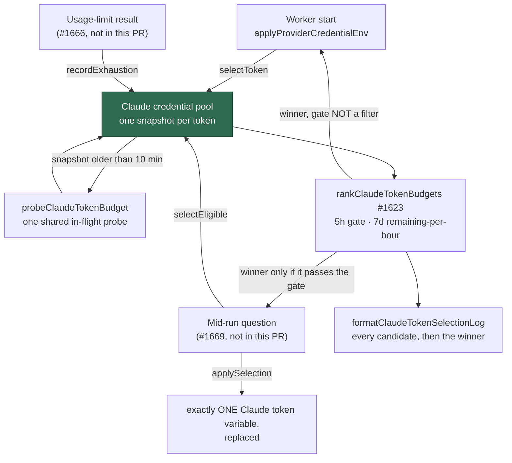

# Claude credential pool: budget snapshots, one 20% gate, and a mid-run token switch

## Summary

Adds `worker/deno/lib/claude_credential_pool.ts`, the process-wide pool that
holds one budget snapshot per Claude subscription token, refreshes only what
has gone stale, applies #1623's gate and ranking on demand, and replaces the
run's single exported token when asked. Worker start now selects through the
pool, so start-up and any later selection share one snapshot store, one rule
and one shape of log line — the record that was missing when a host burned two
retry ladders at 13:27Z without ever asking whether its other subscription had
quota.

`POOL_BUDGET_FLOOR` is no longer a floor of its own: it is the five-hour gate
constant, read against the five-hour window, because "worth restarting for" and
"worth switching to" are one question. Closes #1668.

The mechanism ships here; the pre-spawn gate that consults it mid-run is #1669
and the `rate_limit_event` parser that feeds `recordBudget` is #1666.
`docs/SETUP.md` says so plainly rather than claiming a switch already happens.

## Evidence

Backend/CLI change with no web interface, so no screenshot: the evidence is the
test suite below plus the full gate.



Full gate after the final edit:

```text
Result: PASSED (with skipped checks)
```

(`config integration` is the pre-existing environment-dependent skip.)

## Acceptance Criteria

<!-- vibe-spec-review inputs="diff+issue-body" -->

- **met** — with tokens at 0% and 60% five-hour, `selectEligible` returns the 60% token and the log lists both candidates' shares plus the chosen label — evidence: `worker/deno/tests/claude_credential_pool_test.ts::claude credential pool - 0% and 60% five-hour: the 60% token wins and both shares are logged` — reviewer: met
- **met** — among two eligible tokens the higher seven-day remaining-per-hour wins, delegating to #1623's ranking — evidence: `worker/deno/tests/claude_credential_pool_test.ts::claude credential pool - the higher seven-day remaining-per-hour wins among eligible tokens` — reviewer: met — reason: the reviewer noted the figures (75%/168h vs 22%/11h) are the parent issue's worked example, not the SETUP.md one; both express the same "use it or lose it" comparison, so the figures were left as the parent stated them
- **met** — with every token at or below 20%, `selectEligible` returns `null` and still logs every candidate — evidence: `worker/deno/tests/claude_credential_pool_test.ts::claude credential pool - every token at or below the gate selects nothing, and still logs` — reviewer: met
- **met** — after `applySelection` the environment holds exactly one Claude token variable, with the new value — evidence: `worker/deno/tests/claude_credential_pool_test.ts::claude credential pool - applySelection leaves exactly one Claude token variable` — reviewer: met — reason: the reviewer flagged a real hole its diff still carried — a pool file with a second recognised credential would leave the previous file's key beside the new token — so `applySelection` now refuses such a file by name (`worker/deno/lib/claude_credential_pool.ts:344`), pinned by `claude credential pool - applySelection refuses a file carrying a second credential`
- **met** — `POOL_BUDGET_FLOOR` and the gate are one constant, stated once in `docs/SETUP.md` — evidence: `worker/deno/lib/claude_pool_budget.ts:50`, `worker/deno/lib/claude_token_selection.ts:127`, `docs/SETUP.md` rule 2 — reviewer: met — reason: the standards reviewer showed "one constant" was not "one comparison" — the restart check read the *most constrained* window — so it now reads the five-hour window the gate reads, pinned by `poolHasAnotherTokenWithBudget - the floor is read on the five-hour window, not the most constrained one`
- **met** — quality gate passes — evidence: `./quality.sh` run after the final edit, `Result: PASSED` — reviewer: met
- **partial** — the snapshot comes "from the latest `rate_limit_event`" — evidence: `worker/deno/lib/claude_credential_pool.ts::recordBudget/recordExhaustion` — reviewer: partial — reason: the seam and its tests ship here, but nothing parses a `rate_limit_event` yet; that parser is #1666 and the issue scopes it there
- **unrequested** — `docs/audits/security-sweep-1668-claude-credential-pool.md` and the `12k` slice in `docs/audits/lib-sweep-coverage.json` — reviewer: unrequested — reason: gate-mandated — `tests/lib_sweep_coverage_test.ts` fails on any unclaimed `lib/` module, so the gate cannot pass without a written sweep record
- **unrequested** — `CLAUDE_FIVE_HOUR_GATE_MIN_REMAINING` is a new exported constant, with `CLAUDE_FIVE_HOUR_GATE_MAX_USED` derived from it — reviewer: unrequested — reason: the issue asked for one shared constant; 0.8-used is not a remaining floor, and `1 - 0.8` is `0.19999999999999996`, so the remaining share is the exact figure and the usage share is derived
- **unrequested** — `providerPoolCandidates` extracted in `credential_preflight.ts` and used by all three callers — reviewer: unrequested — reason: the issue required "the same filter `claude_pool_budget.ts` uses"; the three copies had already drifted (`.length` vs `.trim().length`), so one function is the only way to keep that true
- **unrequested** — `>=` became `>` in the restart check — reviewer: unrequested — reason: the floor is now the gate, and the gate fails at exactly 20% remaining; pinned by `poolHasAnotherTokenWithBudget - exactly at the floor is not worth restarting for`
- **unrequested** — fail-loud validation on the new API (empty label, non-finite time, an exhaustion naming no window, a switch that cannot leave one credential) — reviewer: unrequested — reason: the repo's fail-loud rule forbids an operation that quietly does nothing; each guard has a test
- **unrequested** — extra injection options (`url`, `timeoutMs`, `dir`, `env`, `provider`, `discover`, `fallback`, `snapshotMaxAgeMs`) — reviewer: unrequested — reason: test seams, mirroring `ClaudeBudgetSelectorOptions`; they are what keeps every test offline and clock-free
- **unrequested** — the SETUP.md "one gap" paragraph was rewritten rather than only the "Nothing re-selects mid-run" sentence — reviewer: unrequested — reason: that paragraph asserted "the runner has no route back to the selector", which this change makes false; leaving it would have been a stale claim

## Standards Review

<!-- vibe-standards-review inputs="diff+CODING-STANDARDS.md" -->

- **violation** — the unified floor was compared against the probe's headline figure, the *most constrained* window, while the gate applies to the five-hour window — evidence: `worker/deno/lib/claude_pool_budget.ts:139` — reason: fixed here — the restart check now reads the five-hour window (`fiveHourRemaining`), so a token with a fresh five hours and a nearly spent week is again worth restarting for; two new tests pin both directions
- **violation** — a fourth near-copy of the pool-candidacy predicate, where the existing three had already drifted — evidence: `worker/deno/lib/claude_credential_pool.ts:197` — reason: fixed here — `providerPoolCandidates` in `credential_preflight.ts` is now the one spelling, used by the pool, `claude_pool_budget.ts` and `claude_token_selection.ts`
- **violation** — snapshots and in-flight probes keyed by a bare file stem every vendor reproduces, while the selector is offered to every enabled provider — evidence: `worker/deno/lib/claude_credential_pool.ts:253` — reason: fixed here — `selectToken` defers to the fallback for any provider that is not the pool's own, so another vendor's tokens are never ranked here nor sent to Anthropic's endpoint
- **violation** — the module doc claimed "the pre-spawn gate protects the spawn", a mechanism this diff does not ship — evidence: `worker/deno/lib/claude_credential_pool.ts:27` — reason: fixed here — reworded, and `docs/SETUP.md` states plainly that nothing consults the pool before a spawn yet
- **violation** — a `Deno.test` asserting only constant equality, duplicating an assertion in `claude_pool_budget_test.ts` — evidence: `worker/deno/tests/claude_credential_pool_test.ts:435` — reason: fixed here — removed; the surviving copy sits beside the behaviour it constrains
- **violation** — no test at the exact floor, the one edge the `>=` → `>` flip changes — evidence: `worker/deno/tests/claude_pool_budget_test.ts:167` — reason: fixed here — `poolHasAnotherTokenWithBudget - exactly at the floor is not worth restarting for`
- **violation** — `createClaudeBudgetTokenSelector` keeps a `decided` memo the pool's `selectToken` does not, and now has no production caller — evidence: `worker/deno/lib/claude_token_selection.ts:559` — reason: stands, deliberately — a memo that "no later call can re-select" is exactly what #1668 removes; the run's credential is still fixed at start because `checkCredentials` is called once, and the snapshot store makes a repeat call free rather than a second round of probes. Its doc comment now points at the pool
- **violation** — `recordBudget`, `recordExhaustion`, `selectEligible` and `applySelection` have no production caller — evidence: `worker/deno/lib/run_worker.ts:316` — reason: stands — the issue scopes the consumers to #1669 (pre-spawn gate) and #1666 (`rate_limit_event` parser); `docs/SETUP.md` records the gap rather than implying the switch already happens
- **clean** — Australian English throughout (the only US spellings are verbatim HTTP header names); no token value reaches a log line or an error message, positively asserted by a test; fail-loud on every refusal path; tests call real functions with injected `fetch`, clock and token list, with no source-grepping, no env mutation and no wall-clock sleep; every export documented; no hidden paths staged; both the module registration (`lib-sweep-coverage.json`) and its written sweep record present

## Test Plan

Added `worker/deno/tests/claude_credential_pool_test.ts` (10 tests):

- a recorded exhaustion makes a token ineligible with **no** probe;
- a stale snapshot costs exactly one probe per stale candidate, even under two
  concurrent `selectEligible` calls, and none at all once refreshed;
- 0% vs 60% five-hour → the 60% token wins, both shares logged, no value leaks;
- the higher seven-day remaining-per-hour wins among eligible tokens;
- every token at or below the gate → `null`, every candidate still logged;
- a start never refuses even where the gate would, and reuses the snapshot;
- `applySelection` leaves exactly one Claude token variable with the new value;
- `applySelection` refuses a file with no subscription token, and one carrying
  a second credential, without switching anything.

Added to `worker/deno/tests/claude_pool_budget_test.ts` (3 tests): the floor is
the gate constant and 15% no longer clears it; the floor is read on the
five-hour window, not the most constrained one (both directions); exactly at
the floor is not worth restarting for.

Existing suites re-run unchanged: `claude_token_selection_test.ts` (27),
`credential_preflight_test.ts`, `run_worker_test.ts`, `lib_sweep_coverage_test.ts`.
