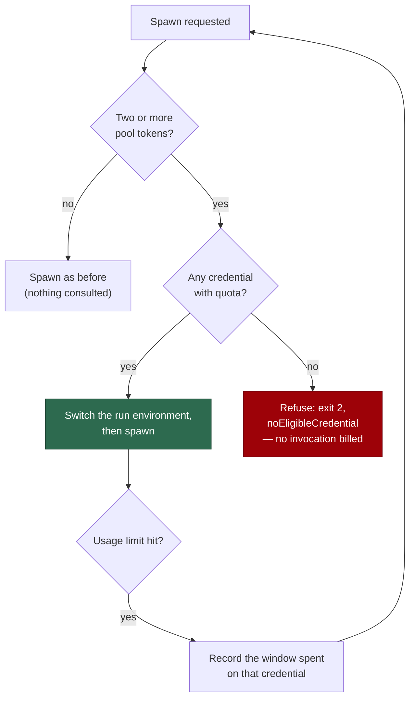

## Summary

Every agent spawn now passes a quota gate over the Claude credential pool
(#1668), and a subscription usage limit no longer pauses the host. Closes
#1669.

- **`runClaudeWithRetry`** consults the gate beside the existing
  `agentRunsTerminating` check. An eligible credential is applied to the run
  environment *before* the child environment is copied from it; when every
  candidate is spent the call returns terminally — `exitCode: 2`,
  `noEligibleCredential: true`, and `usageLimit` carrying the soonest
  five-hour reset among the pool — **with no child process spawned**, so no
  invocation is billed against a closed window.
- **The usage-limit branch no longer writes `writeRateLimitSignal(…, "usage")`.**
  That signal is what `run_core` reads to drain its whole slot pool, so one
  subscription's spent window idled a host that still had work needing no
  agent. The exhaustion is recorded against that credential on the pool
  instead (windows from the stream `rate_limit_event` when it carried them,
  else the five-hour window with the parsed reset). The rate-limit ladder's
  own signal write is unchanged.
- **The health check** records the exhaustion, asks for another credential,
  and reports **healthy** on a switch (one probe, not two). With none
  eligible it reports unhealthy with exit
  `NO_ELIGIBLE_CREDENTIAL_EXIT_CODE` (4) and **no** `pauseSeconds`, so the
  consumer in `run_core_production_deps.ts` writes no signal. A rate limit
  keeps its exit-3 pause.
- **Single-token hosts are untouched**: fewer than two pool candidates is
  answered `"no-pool"` — no ranking, no probe, no new log line — and so is
  any spawn belonging to another vendor.

## Evidence

Backend/CLI only — there is no web interface to screenshot. The evidence is
the test output below and the flow the change installs:



```text
deno test tests/claude_runner_usage_limit_test.ts          ok | 5 passed
deno test tests/claude_health_credential_switch_test.ts    ok | 4 passed
deno test tests/claude_spawn_gate_test.ts                  ok | 2 passed
deno test tests/claude_credential_pool_test.ts             ok | 17 passed
deno test tests/run_core_rate_limit_resume_test.ts         ok | 11 passed
```

## Reproduction

- **symptom** — a Claude subscription usage limit wrote the durable `usage`
  rate-limit signal; `run_core` then drained its slot pool
  (`Rate limit signal active — no further claims`) and the host idled for the
  window — a wait past the run-duration cap ending as a quota pause (exit 75)
  — while another credential in the pool still had quota.
- **status** — `verified` — with the `writeRateLimitSignal(…, "usage")` call
  restored in the usage branch,
  `tests/claude_runner_usage_limit_test.ts::runClaudeWithRetry - a stderr-only usage limit is terminal…`
  fails on `a usage limit wrote a signal in <workDir>`; with the call removed
  it passes.
- **regression test** —
  `worker/deno/tests/claude_runner_usage_limit_test.ts::runClaudeWithRetry - a stderr-only usage limit is terminal: no fallback ladder, exit 2, evidence carried (Issue #4315)`
  (no signal, `isRateLimitActive()` false) and
  `worker/deno/tests/run_core_rate_limit_resume_test.ts::run_core resume - a Claude usage limit writes no signal, so the run never quota-pauses (Issue #1669)`

## Test Plan

- `tests/claude_runner_usage_limit_test.ts` — **modified**: the existing
  stderr-only usage-limit test asserted the durable signal *was* written to
  `WORK_DIR`; that assertion is inverted by this change (no signal in
  `WORK_DIR` or in the per-issue cwd, and `isRateLimitActive()` false). Added:
  every candidate spent → no child spawned and `noEligibleCredential` set;
  a 10%/60% pool → the child environment carries the 60% token only, with
  both shares on the selection log.
- `tests/claude_health_credential_switch_test.ts` — **new**: usage limit with
  an eligible credential → healthy after one probe with the switch applied;
  with none → exit 4, no `pauseSeconds`; a single-token host keeps exit 3 and
  logs nothing; a rate limit keeps exit 3.
- `tests/claude_spawn_gate_test.ts` — **new**: a spent pool refuses while a
  single-token host does not; another vendor's spawn is gated on nothing.
- `tests/claude_credential_pool_test.ts` — **added**: `poolSize` separates a
  spent pool from no pool, `soonestFiveHourReset` reads the snapshots, and
  `activeLabel` derives the carried credential from the environment before
  any switch (and answers null rather than guessing).
- `tests/run_core_rate_limit_resume_test.ts` — **added**: a real usage-limit
  run against a temp work volume leaves no signal, so `runCoreLoop` returns
  `quotaPaused: false`.
- `docs/audits/security-sweep-1669-claude-spawn-gate.md` — the chunk-12o
  security sweep for the new module, registered in
  `docs/audits/lib-sweep-coverage.json`.
