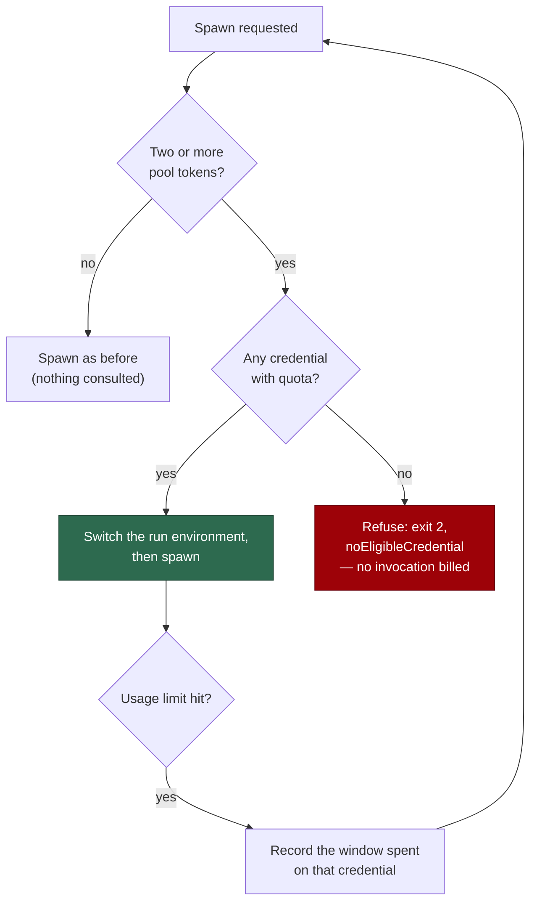

## Summary

Every agent spawn now passes a quota gate over the Claude credential pool
(#1668), and a subscription usage limit no longer pauses the host. Closes
#1669.

- **`runClaudeWithRetry`** consults the gate beside the existing
  `agentRunsTerminating` check. An eligible credential is applied to the run
  environment *before* the child environment is copied from it; when every
  candidate is spent the call returns terminally — `exitCode: 2`,
  `noEligibleCredential: true`, and `usageLimit` carrying the soonest
  five-hour reset among the pool — **with no child process spawned**, so no
  invocation is billed against a closed window.
- **The usage-limit branch no longer writes `writeRateLimitSignal(…, "usage")`.**
  That signal is what `run_core` reads to drain its whole slot pool, so one
  subscription's spent window idled a host that still had work needing no
  agent. The exhaustion is recorded against that credential on the pool
  instead (windows from the stream `rate_limit_event` when it carried them,
  else the five-hour window with the parsed reset). The rate-limit ladder's
  own signal write is unchanged.
- **The health check** records the exhaustion, asks for another credential,
  and reports **healthy** on a switch (one probe, not two). With none
  eligible it reports unhealthy with exit
  `NO_ELIGIBLE_CREDENTIAL_EXIT_CODE` (4) and **no** `pauseSeconds`, so the
  consumer in `run_core_production_deps.ts` writes no signal. A rate limit
  keeps its exit-3 pause.
- **Single-token hosts are untouched**: fewer than two pool candidates is
  answered `"no-pool"` — no ranking, no probe, no new log line — and so is
  any spawn belonging to another vendor.

## Evidence

Backend/CLI only — there is no web interface to screenshot. The evidence is
the test output below and the flow the change installs:



```text
deno test tests/claude_runner_usage_limit_test.ts \
          tests/claude_health_credential_switch_test.ts \
          tests/claude_spawn_gate_test.ts \
          tests/claude_credential_pool_test.ts \
          tests/claude_usage_limit_windows_test.ts \
          tests/run_core_rate_limit_resume_test.ts \
          tests/claude_runner_test.ts \
          tests/execute_phase_routing_test.ts \
          tests/lib_sweep_coverage_test.ts
ok | 104 passed | 0 failed

deno test tests/execute_phase_*.ts tests/failure_diagnosis_test.ts
ok | 127 passed | 0 failed
```

## Reproduction

- **symptom** — a Claude subscription usage limit wrote the durable `usage`
  rate-limit signal; `run_core` then drained its slot pool
  (`Rate limit signal active — no further claims`) and the host idled for the
  window — a wait past the run-duration cap ending as a quota pause (exit 75)
  — while another credential in the pool still had quota.
- **status** — `verified` — with the `writeRateLimitSignal(…, "usage")` call
  restored in the usage branch,
  `tests/claude_runner_usage_limit_test.ts::runClaudeWithRetry - a stderr-only usage limit is terminal…`
  fails on `a usage limit wrote a signal in <workDir>`; with the call removed
  it passes.
- **regression test** —
  `worker/deno/tests/claude_runner_usage_limit_test.ts::runClaudeWithRetry - a stderr-only usage limit is terminal: no fallback ladder, exit 2, evidence carried (Issue #4315)`
  (no signal, `isRateLimitActive()` false) and
  `worker/deno/tests/run_core_rate_limit_resume_test.ts::run_core resume - a Claude usage limit writes no signal, so the run never quota-pauses (Issue #1669)`

## Acceptance Criteria

<!-- vibe-spec-review inputs="diff+issue-body" -->

- **met** — Every spawn is preceded by a pool selection; with tokens at 10% and 60% five-hour, the child env holds the 60% token and the log names both shares — evidence: `worker/deno/tests/claude_runner_usage_limit_test.ts::runClaudeWithRetry - the spawn is preceded by a selection and the child carries that token only (Issue #1669)` — reviewer: met
- **partial** — With every token at or below 20%, `runClaudeWithRetry` returns `noEligibleCredential` with zero child processes spawned, and the dispatch loop proceeds to the next priority — evidence: `worker/deno/lib/claude_spawn_gate.ts:118-140`, `worker/deno/tests/claude_runner_usage_limit_test.ts::every candidate spent: no child is spawned and the result says so (Issue #1669)` — reviewer: partial — reason: the refusal is triggered by **exhaustion**, not by ≤20%, because #1685 (merged after this issue was written) demoted the 20% five-hour figure to a soft ranking preference — a pool at 10%/15% still holds usable quota and idling it is the outcome a pool is bought to prevent; the reviewer also noted the "proceeds to the next priority" half is asserted only for the post-spawn path (`run_core_rate_limit_resume_test.ts`), not for the refusal
- **met** — A usage-limit result writes no `usage` rate-limit signal, produces no `quota-pause.json`, and never exits 75 — evidence: `worker/deno/tests/claude_runner_usage_limit_test.ts:191-209` and `worker/deno/tests/run_core_rate_limit_resume_test.ts::a Claude usage limit writes no signal, so the run never quota-pauses (Issue #1669)` — reviewer: met
- **met** — The health check on the session-limit line switches to an eligible credential and reports healthy; with none eligible it reports unhealthy with no pause — evidence: `worker/deno/tests/claude_health_credential_switch_test.ts` (all five cases) — reviewer: met — reason: the reviewer added that an unhealthy verdict still makes `run_core` skip that cycle and re-probe next cycle — true, and unchanged by this diff for any unhealthy agent; what the issue asked for and what this delivers is that no fleet-wide signal is written, so no other worker on the volume is stopped. The overstated "the host does not idle either way" claim was corrected in `docs/TROUBLESHOOTING.md`
- **partial** — Single-token hosts: no pool consulted, no new log lines, existing tests unchanged — evidence: `worker/deno/tests/claude_health_credential_switch_test.ts::a single-token host keeps the pausing exit 3 and consults no pool (Issue #1669)` (asserts zero log lines) — reviewer: partial — reason: two of the three hold; "existing tests unchanged" cannot, because the signal the issue asks to remove is exactly what one existing assertion pinned — that assertion is inverted, in place and documented, not deleted. A single-token host also no longer pauses from the runner path on a usage limit, which is the issue's own instruction to remove that write unconditionally
- **met** — Quality gate passes — evidence: `./quality.sh` run to green after the final edit (see Standards Review) — reviewer: met — reason: the reviewer verified `deno fmt --check`, `deno lint`, `deno check` and the touched suites but could not run the full repo gate from the diff alone; it was run here
- **unrequested** — multi-vendor gating (`pool.providerId()`, `ours()`, per-spawn provider resolution) — reviewer: unrequested — reason: without it a Codex spawn on a host with two Claude subscriptions would be refused because *Claude's* windows are spent, and would have its environment rewritten with a Claude token; the gate must not act outside the pool's own vendor
- **unrequested** — `activeLabel()` / `remember()` environment-derived label tracking — reviewer: unrequested — reason: the issue specifies `recordExhaustion(label, windows)` but names no source for `label`; this is that source, and it refuses to guess (`an unrecognised environment credential has no active label`) rather than strand a credential that still has quota
- **unrequested** — exported helpers `usageLimitWaitSeconds` / `usageLimitSecondsUntilReset` / `usageLimitExhaustedWindows` — reviewer: unrequested — reason: the pre-spawn refusal must report the same figure and the same windows as the spawned one; extracting the existing maths is what keeps the two from drifting, and each is now directly tested
- **unrequested** — reworded failure/log messages in `lib/phases/execute_phase.ts` and the runner's usage-limit line — reviewer: unrequested — reason: both said "agent work is paused" / "re-probing every Ns", which this change makes false; a message that lies about the new behaviour is worse than the wording churn
- **unrequested** — the Mermaid section in `docs/TROUBLESHOOTING.md` and the `docs/DEPLOYMENT.md` opening clause — reviewer: unrequested — reason: the issue asks both sections to "describe the new behaviour"; the diagram is that description, and the clause had to stop attributing exit 75 to Claude quota
- **unrequested** — the `NO_ELIGIBLE_CREDENTIAL` security-log line — reviewer: unrequested — reason: a refusal that spawns nothing must be visible in the security log, not inferred from the pool's candidate lines alone (fail-loud)
- **unrequested** — `docs/audits/security-sweep-1669-claude-spawn-gate.md` and its `lib-sweep-coverage.json` slice — reviewer: unrequested — reason: `lib_sweep_coverage_test.ts` fails the gate for any new `lib/` module with no sweep record

## Standards Review

<!-- vibe-standards-review inputs="diff+CODING-STANDARDS.md" -->

- **violation** — a new `lib/` module ships with no test file — evidence: `worker/deno/lib/claude_spawn_gate.ts:1` — reason: the file existed but was untracked when the reviewer's diff was cut; `worker/deno/tests/claude_spawn_gate_test.ts` is committed, and the branches the reviewer named as still uncovered (the unrecognised-label drop, the "already on it" no-switch path) now have cases
- **violation** — two newly exported functions with no direct tests — evidence: `worker/deno/lib/claude_runner.ts:720` (`usageLimitWaitSeconds`), `:746` (`usageLimitExhaustedWindows`) — reason: fixed here — `worker/deno/tests/claude_usage_limit_windows_test.ts` covers the capped/uncapped/floored/default waits and every branch of the window derivation, including the `remainingFraction <= 0` filter the reviewer identified as unreachable from the other suites
- **violation** — a production path reads a mutable process-global (`setDefaultClaudeSpawnGate` / `defaultClaudeSpawnGate`) — evidence: `worker/deno/lib/claude_spawn_gate.ts:173-186`, read at `worker/deno/lib/claude_runner.ts:2570` — reason: it stands. The issue specifies exactly this shape ("a `RunClaudeOptions` field **or** a module-level setter wired once in `run_core_production_deps.ts` / `run_worker.ts`"), the injected `credentialGate` option is the seam every test uses, and nothing in the suite installs the global — the reviewer confirmed this is a shape finding, not a live parallel-safety failure
- **violation** — DRY: the extracted wait helper left its formula duplicated at the call site — evidence: `worker/deno/lib/claude_runner.ts:2940-2943` — reason: fixed here — the uncapped figure is now `usageLimitSecondsUntilReset()`, which `usageLimitWaitSeconds()` also calls, so there is one copy
- **violation** — no PR summary in the change — evidence: `docs/archive/pr-summaries/pr-summary-1669.md` — reason: untracked when the diff was cut; committed with this change
- **clean** — Australian English throughout the added lines; no hidden path, key or credential file staged; every new test calls real code (`runClaudeWithRetry`, `checkClaudeHealth`, `createClaudeCredentialPool`, `createClaudeSpawnGate`, `runCoreLoop`) rather than grepping source; no wall-clock sleep, polling or absolute timing assertion (`fakeClock()` and injected `sleep` throughout); module and export JSDoc on both new files; the modified existing assertion is rewritten in place with a comment saying why, not deleted; errors fail loud (nothing caught-and-ignored, the removed signal write took its warn path with it); docs owed by the code change are in the same commit and the Mermaid block validates

## Test Plan

- `tests/claude_runner_usage_limit_test.ts` — **modified**: the existing
  stderr-only usage-limit test asserted the durable signal *was* written to
  `WORK_DIR`; that assertion is inverted by this change (no signal in
  `WORK_DIR` or in the per-issue cwd, and `isRateLimitActive()` false). Added:
  every candidate spent → no child spawned and `noEligibleCredential` set;
  a 10%/60% pool → the child environment carries the 60% token only, with
  both shares on the selection log.
- `tests/claude_health_credential_switch_test.ts` — **new**: usage limit with
  an eligible credential → healthy after one probe with the switch applied;
  with none → exit 4, no `pauseSeconds`; a single-token host keeps exit 3 and
  logs nothing; a rate limit keeps exit 3.
- `tests/claude_spawn_gate_test.ts` — **new**: a spent pool refuses while a
  single-token host does not; another vendor's spawn is gated on nothing.
- `tests/claude_credential_pool_test.ts` — **added**: `poolSize` separates a
  spent pool from no pool, `soonestFiveHourReset` reads the snapshots, and
  `activeLabel` derives the carried credential from the environment before
  any switch (and answers null rather than guessing).
- `tests/run_core_rate_limit_resume_test.ts` — **added**: a real usage-limit
  run against a temp work volume leaves no signal, so `runCoreLoop` returns
  `quotaPaused: false`.
- `tests/claude_usage_limit_windows_test.ts` — **new**: the capped wait, the
  uncapped operator figure, and every branch of the exhausted-window
  derivation — in particular that a rejected five-hour window never marks a
  62% week spent.
- `docs/audits/security-sweep-1669-claude-spawn-gate.md` — the chunk-12o
  security sweep for the new module, registered in
  `docs/audits/lib-sweep-coverage.json`.

## Known limitations

- The run environment is shared by every slot on the host, so a switch holds
  for spawns that start **after** it; between one slot's selection and its
  spawn a sibling can switch the variable, and that spawn then carries the
  sibling's choice — always a credential the pool ranked, never an unmeasured
  one. Serialising the pair is a larger change than this issue asks for.
- An unhealthy agent still makes `run_core` skip that cycle, as it does for
  every unhealthy verdict. What this change removes is the fleet-wide
  `.rate_limit_signal`, which stopped every worker on the volume.
