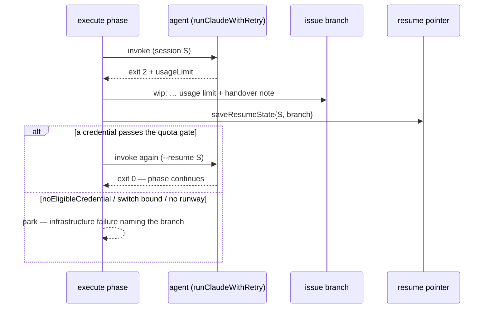

# Checkpoint an exhausted issue run to its branch, then resume on another credential or park it

## Summary

A usage-limit result used to fail the execute phase outright: nothing was
pushed, no resume pointer was written, and the release comment told a reader
only that "Agent work is paused for 3600s". The run's work — and the session
that produced it — were both lost to a window that reopens in an hour.

Now the exhausted run checkpoints first and acts second. On a usage-limit result
the execute phase pushes the work to the claim-locked issue branch as a
`wip: execute hit the Claude subscription usage limit …` commit carrying the
handover note (Issue #769), writes the durable resume pointer (session id +
branch), and only then either re-invokes the agent **once** with the same
`sessionResumeState` — so #1669's pre-spawn quota gate can place that session on
an eligible credential — or parks: an infrastructure failure whose release
comment names the branch and links the handover file (Issue #770), so the next
claim resumes the work instead of re-deriving it.

Closes #1670.

## Evidence

Backend/CLI change — no web interface to screenshot. The evidence is the
execute-phase suite below, which drives the real phase against a fake runner and
git seams and asserts the ordering through a call log.



Ordering, from the call log the test records
(`execute_phase_usage_limit_test.ts`):

```text
invoke#1 resumeState=absent
commit:wip: execute hit the Claude subscription usage limit after 0s — preserving 1 uncommitted file(s) (Issue #47)
invoke#2 resumeState=issue-1670-checkpoint-an-exhausted-run
```

…and the test compares the two invocations' `--resume` session ids directly, so
a _different_ session cannot pass for the same one.

### What is in the change

- `wip_checkpoint.ts` — new `"usage-limit"` cause, phrased "hit the Claude
  subscription usage limit", so the `wip:` subject and the handover note name it
  through `describeWipCause`.
- `phases/execute_phase.ts` — the invocation is now a closure (each invocation
  gets its own #4170 checkpoint loop and phase-end checkpoint), wrapped in a
  bounded loop: preserve → save the pointer → switch, or park. The exit-2
  failure names the window's reset and where the work went, and drops the "Agent
  work is paused for …" sentence, which asserted a loop-wide pause policy this
  phase neither owns nor can see. A parked run also skips the #1550 in-process
  retry, which would only bill a spawn into the same shut window.
- `claude_runner.ts` — the `noEligibleCredential` flag the pre-spawn gate (Issue
  #1669) sets on a refused spawn, which is what tells a park from a switch.
- `docs/TROUBLESHOOTING.md` — one paragraph on where the work goes, what the
  release comment says, and how a later claim resumes.

### Note for the reviewer — where `noEligibleCredential` comes from

Issue #1669 landed on the `milestone/1653-…` branch, not on `main`, so the
producer of this flag is not in this PR's base. On `main` the flag is simply
never set: an exhausted run still checkpoints, still saves the pointer, makes
its one switch, and parks on the second limit via the switch bound — all
behaviours the tests cover. When the milestone branch merges, the two halves
compose, and the field declaration in `claude_runner.ts` may need a trivial
conflict resolution (both sides add the same optional field beside
`usageLimit`).

## Standards Review

<!-- vibe-standards-review inputs="diff+CODING-STANDARDS.md" -->

- **violation** — no `docs/archive/pr-summaries/pr-summary-1670.md` in the diff
  — evidence: `git diff origin/main...HEAD --stat` — reason: fixed here; the
  reviewer read the diff before this file was written, and the modified fixture
  in `worker/deno/tests/wip_resume_handoff_test.ts:111` is documented in the
  Test Plan below.
- **violation** — the comment justifying the dropped pause sentence asserted
  that agent work "is no longer paused", which `claude_runner.ts`'s durable
  `.rate_limit_signal` write still contradicts on this base — evidence:
  `worker/deno/lib/phases/execute_phase.ts:1184` — reason: fixed here; the
  comment now says only what this phase does, and leaves the loop's pause policy
  to #1669 in the runner.
- **violation** — the switch log line and the new doc paragraph claimed the
  phase resumes "on another credential", which no code in this base does —
  evidence: `worker/deno/lib/phases/execute_phase.ts:731`,
  `docs/TROUBLESHOOTING.md:786` — reason: fixed here; both now say the phase
  re-invokes so the pre-spawn quota gate can place the session on an eligible
  credential, which is true whether or not that gate is present.
- **violation** — two park branches (the switch bound, the runway floor) and
  `isUsageLimitResult`'s named edge case had no test — evidence:
  `worker/deno/lib/phases/execute_phase.ts:158-165` — reason: fixed here; three
  tests added, listed below.
- **violation** — the fake runner reported `session=same` whenever any session
  id was present, so the assertion could not fail for the behaviour it named —
  evidence: `worker/deno/tests/execute_phase_usage_limit_test.ts:253` — reason:
  fixed here; the fake records the id itself and the test compares the two.
- **clean** — Australian English throughout; the new test drives the real
  `workOnIssueExecuteClaude` with no source-grepping and no wall-clock waits;
  fail-loud (the park logs at `warn` and returns a failure naming the branch,
  nothing is swallowed); KISS/DRY (the checkpoint start/stop is extracted into
  one closure rather than duplicated for the second invocation, and
  `USAGE_LIMIT_HEADING` is a shared constant); commit safety (no hidden paths
  staged, run-id trailer present); no stale references left to the removed
  "Agent work is paused" sentence.

## Test Plan

New — `worker/deno/tests/execute_phase_usage_limit_test.ts`:

- `execute #1670 - a usage limit checkpoints the work and the resume pointer
  BEFORE switching credential`
  — asserts the exact call order (invoke → `wip:` commit carrying the handover
  note → invoke with the same session and the pointer already on disk) and that
  the phase then runs to completion.
- `execute #1670 - with no eligible credential the run parks on the branch and
  stops`
  — two invocations only, `status: "failure"`, `preservedWip.branch` set, the
  reason naming the branch and `docs/archive/handover/issue-1670.md`, no "Agent
  work is paused" sentence, the resume pointer (branch + session id) on disk,
  and `detectFailureCategory` still reading `rate_limit`.
- `execute #1670 - a refused spawn keeps the exhausted invocation's output as
  the run's evidence`
  — the diagnostics carry the work the spent invocation did, not the refused
  spawn's empty output.
- `execute #1670 - a refused first spawn parks at once, with no switch to
  make`.
- `execute #1670 - the switch is bounded: a second usage limit parks rather
  than switching again`
  — the bound that ends the sequence on today's `main`.
- `execute #1670 - too little execute budget left to finish parks instead of
  billing a switch`
  — a phase budget under the 60 s floor makes no switch.
- `execute #1670 - exit 2 without usage-limit evidence is not a credential
  problem`
  — the #3648 invocation-budget give-up preserves nothing and switches nothing.

Extended:

- `wip_resume_handoff_test.ts::setup #148 - a matching resume pointer resumes
  the checkpointed branch`
  — now also asserts the pointer primes `--resume` with the saved session id and
  the checkpointed branch (the saved id is a UUID, because `loadResumeState`
  drops anything else — Issue #204).
- `wip_commit_marker_test.ts` and `handover_note_test.ts` — the cause lists gain
  `"usage-limit"`, so the new subject is still recognised as parked work and the
  new phrase reads apart from the other four.

All four new tests were observed failing against the unfixed code (0 passed, 3
failed before the fourth was added) and passing after. `./quality.sh`: PASSED
(with skipped checks — `config integration`, skipped in this environment as it
is on `main`).
