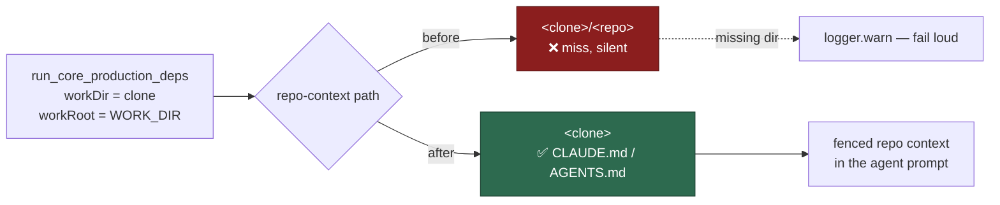

## Summary

Every PR-kind processor built its repo-context directory as
`<workDir>/<repoName>`, but production hands each of them the **clone** as
`workDir` (`run_core_production_deps.ts` passes `workDir: repoWorkDir`,
`workRoot: workDir`). The path therefore resolved to `<workRoot>/<repo>/<repo>`,
`readRepoContext` missed, and every PR feedback / CI fix / spelling fix / merge
conflict run went to the agent with no `CLAUDE.md`/`AGENTS.md` context — folded
silently into `repoContextContent = undefined`.

The clone already *is* the checkout, so the context is now read directly from
`workDir`, with the surviving `?? Deno.env.get("WORK_DIR") ?? "/tmp"` fallbacks
dropped with it. The shared `loadRepoContextContent` helper
(`worker/deno/lib/repo_context_reader.ts`) does the read and logs at `warn` when
the directory does not exist, so "nothing found" is distinguishable from "looked
in the wrong place" and a future mis-wiring is loud rather than a silently
degraded prompt.

Closes #1673.

## Evidence

Backend-only change — no web interface to screenshot. The evidence is the test
run: the eight new processor tests were observed failing against the unfixed
path expression and passing after the fix, and `./quality.sh` passes in full
(`deno tests`, `deno lint`, `deno type check`, `deno fmt`, semgrep and the
chokepoint checks all PASSED).

## Reproduction

- **symptom** — a `CLAUDE.md` sitting in the clone never reached the agent
  prompt on any PR-kind run, because the lookup was one directory too deep
- **status** — `verified` — the four "injects the clone's CLAUDE.md into the
  prompt" tests (and the four fail-loud warning tests) were run against the
  unfixed processors and failed 8/8, then passed 8/8 after the fix
- **regression test** —
  `worker/deno/tests/pr_feedback_processor_test.ts::processPrFeedback - injects the clone's CLAUDE.md into the prompt (Issue #1673)`
  (one equivalent per processor — see the Test Plan)

## Test Plan

Per-processor prompt assertions — each plants a `CLAUDE.md` carrying a sentinel
in the clone and asserts the captured agent prompt contains it:

- `worker/deno/tests/pr_feedback_processor_test.ts::processPrFeedback - injects the clone's CLAUDE.md into the prompt (Issue #1673)`
- `worker/deno/tests/pr_ci_processor_test.ts::processCiFailure - injects the clone's CLAUDE.md into the prompt (Issue #1673)`
- `worker/deno/tests/pr_spelling_processor_test.ts::processSpellingFailure - injects the clone's CLAUDE.md into the prompt (Issue #1673)`
- `worker/deno/tests/pr_merge_conflict_processor_test.ts::processMergeConflict - injects the clone's CLAUDE.md into the agent prompt (Issue #1673)`

Fail-loud assertions — each points the processor at a directory that does not
exist and asserts the warning is emitted:

- `…pr_feedback_processor_test.ts::processPrFeedback - warns when the checkout directory is missing (Issue #1673)`
- `…pr_ci_processor_test.ts::processCiFailure - warns when the checkout directory is missing (Issue #1673)`
- `…pr_spelling_processor_test.ts::processSpellingFailure - warns when the checkout directory is missing (Issue #1673)`
- `…pr_merge_conflict_processor_test.ts::processMergeConflict - warns when the checkout directory is missing (Issue #1673)`

Unit tests for the new helper in
`worker/deno/tests/repo_context_reader_test.ts`: reads the checkout itself, stays
quiet when the checkout has no context files, warns on a missing directory, and
warns when no directory is supplied.
