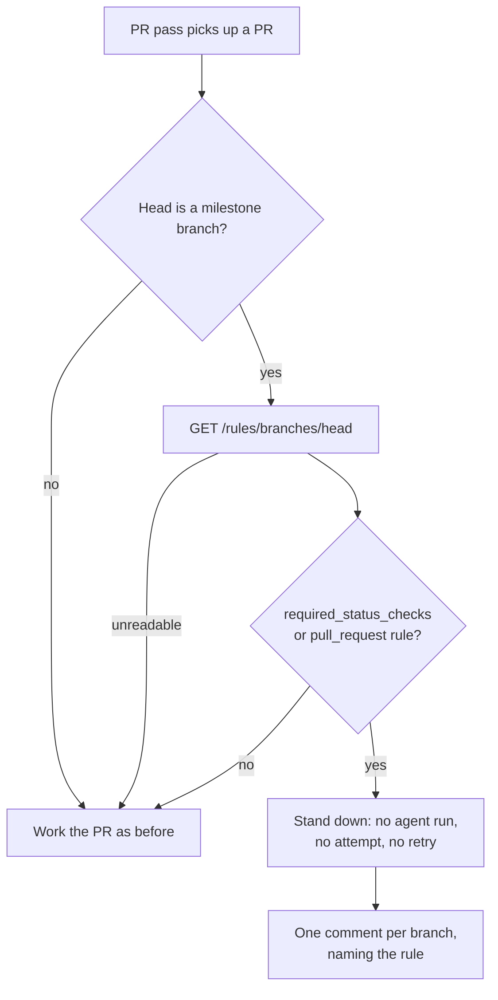

## Summary

The spelling, CI-fix and merge-conflict passes pushed straight to
`stSoftwareAU/GRQ#4702`'s head — a `milestone/**` branch under a
`required_status_checks` ruleset — and were refused with GH013 once per worker
run, each refusal spending a merge-conflict attempt or a CI-fix retry. The
spelling pass then claimed the refused push had landed.

Two changes:

1. **`worker/deno/lib/gated_head_guard.ts`** (new) asks
   `GET /repos/{repo}/rules/branches/{branch}` _before_ the branch is checked
   out. A gated head stops the pass there — the agent never runs, no attempt or
   retry is spent, and the PR carries one comment naming the rule instead of one
   GH013 per run. Only `milestone/**` heads are assessed: the rules endpoint
   does not account for the caller's bypass permission, so widening it would
   stand the passes down on repos that can push perfectly well. An unreadable
   ruleset fails **open** — the push is attempted exactly as before and a
   genuine refusal is still loud.
2. **`pr_spelling_processor.ts`** adopts `verifyPushLanded()` as the CI-fix and
   feedback passes do, and treats a failed `commitAndPushPending` as "not
   pushed" whatever the local HEAD did.

Closes #1679.

## Evidence

Backend/CLI change — no web interface to screenshot. Evidence is the test suite
and the full quality gate (`./quality.sh`: **PASSED**, all checks green,
`config integration` skipped as it is in this environment).

The stand-down sits ahead of every budget and every per-run artefact: before
`recordCiCheckRetry`, the CI heartbeat and its claim comment; before the
merge-conflict cross-host lock, lock comment, heartbeat and attempt marker.

Documented in [`docs/MERGE.md`](../../MERGE.md) under "Never push to a
ruleset-gated PR head", with a failure-mode row and a related-implementation
entry. The new `lib/` module is claimed by sweep slice `12l` with its own
written record, `docs/audits/security-sweep-1679-gated-head-guard.md`.

## Reproduction

- **symptom** — after a GH013-refused push the spelling pass posted "I've pushed
  fixes for the spelling issues", and all three passes re-attempted the same
  refused push every run, spending an attempt or a retry each time
- **status** — `verified` — both regression sets were observed failing against
  the unfixed code and passing after the fix. The spelling tests failed with
  `changesPushed: true` before the verification landed; the three pass tests
  were re-run with
  `worker/deno/lib/pr_{ci,spelling,merge_conflict}_processor.ts` checked out at
  the pre-guard commit `bfdad9d` and all three failed, then passed once the
  guard was restored
- **regression test** —
  `worker/deno/tests/pr_spelling_processor_test.ts::processSpellingFailure - a refused push with a moved HEAD is not claimed as pushed (Issue #1679)`
  and
  `worker/deno/tests/gated_head_passes_test.ts::spelling pass - stands down from a gated head without running the agent (Issue #1679)`

## Acceptance Criteria

<!-- vibe-spec-review inputs="diff+issue-body" -->

- **met** — a `milestone/**` head under a required-status-checks ruleset is
  never pushed to directly by the spelling, CI-fix or merge-conflict passes; one
  comment, not one GH013 per run — evidence:
  `worker/deno/tests/gated_head_passes_test.ts` (all three passes) and
  `worker/deno/tests/gated_head_guard_test.ts::guardGatedHead - a gated head is reported on the PR exactly once per run`
  — reviewer: partial — reason: the reviewer noted the stand-down still logs one
  line per pass per run and that non-`milestone/**` gated heads are unassessed.
  The per-branch **comment** is what the criterion names and it is deduped by
  marker across runs; the log line is a warning, not a push. The `milestone/**`
  scope is deliberate (bypass permission is invisible to the rules endpoint) and
  is stated in `docs/MERGE.md`
- **partial** — a GH013 refusal does not consume a merge-conflict attempt or a
  CI-fix retry — evidence: `worker/deno/lib/pr_ci_processor.ts` (guard above
  `recordCiCheckRetry`, returns `retryCount: currentRetries`) and
  `worker/deno/lib/pr_merge_conflict_processor.ts` (guard above the lock and the
  attempt marker) — reviewer: partial — reason: true for every head the guard
  recognises, which is the reported case. On a fail-open path (rules endpoint
  unreadable, or a gated head outside `milestone/**`) the push is still
  attempted and the refusal still spends the budget; refunding an
  already-recorded attempt is a change to attempt accounting that this issue
  does not ask for
- **met** — the spelling pass posts "I've pushed fixes" only when the remote
  head advanced; a refused push produces the "failed to push" reply once —
  evidence:
  `worker/deno/tests/pr_spelling_processor_test.ts::processSpellingFailure - a push the remote does not confirm is not claimed as pushed (Issue #1679)`
  — reviewer: met
- **met** — regression test: a `commitAndPushPending` failure with a moved local
  HEAD yields `changesPushed: false` — evidence:
  `worker/deno/tests/pr_spelling_processor_test.ts::processSpellingFailure - a refused push with a moved HEAD is not claimed as pushed (Issue #1679)`
  — reviewer: met
- **unrequested** — `docs/MERGE.md`, the sweep record and the `12l` slice in
  `docs/audits/lib-sweep-coverage.json` — reviewer: unrequested — reason: repo
  gates require them: a code change owes a docs change, and
  `lib_sweep_coverage_test.ts` fails until a new `lib/` module is claimed by a
  slice with a written record
- **unrequested** — `pull_request` alongside `required_status_checks` in the
  gating rule types — reviewer: unrequested — reason: a `pull_request` rule
  refuses a direct push for the same reason and produces the same GH013; leaving
  it out would let the identical fault through under a different rule
- **unrequested** — `formatVerifiedPushSuffix()` appended to the spelling pass's
  success reply — reviewer: unrequested — reason: it names the verified remote
  SHA, so the claim is falsifiable at a glance, exactly as the CI-fix and
  feedback replies already do

## Standards Review

<!-- vibe-standards-review inputs="diff+CODING-STANDARDS.md" -->

- **violation** — the merge-conflict stand-down sat below the lock, lock comment
  and heartbeat, so a gated PR still churned them every run — evidence:
  `worker/deno/lib/pr_merge_conflict_processor.ts:627` — reason: fixed here; the
  guard now runs before the lock, and the test asserts the lock is never
  acquired
- **violation** — the same ordering for the CI-fix pass (guard after the claim
  comment and heartbeat) — evidence: `worker/deno/lib/pr_ci_processor.ts:522` —
  reason: fixed here; the guard now runs immediately after the retry count is
  read, before the heartbeat and the claim comment
- **violation** — the pass tests did not set `workerId`, so they exercised the
  unlocked branch production never takes — evidence:
  `worker/deno/tests/gated_head_passes_test.ts:127` — reason: fixed here; both
  the CI-fix and merge-conflict cases now run under stubbed locks
- **violation** — `buildGatedHeadComment` rendered the literal `undefined` for
  an empty detail — evidence: `worker/deno/lib/gated_head_guard.ts:152` —
  reason: fixed here with a `capitalise()` helper that leaves an empty string
  empty
- **violation** — dead injection seam `assessFn`, and two constants exported but
  used nowhere else — evidence: `worker/deno/lib/gated_head_guard.ts:191` —
  reason: fixed here; the seam is removed and the constants are module-internal
- **violation** — an unreadable rules endpoint (a 404 maps to an empty list) was
  described as "no rule refuses a direct push", stating a finding where there
  was only an absence — evidence: `worker/deno/lib/gated_head_guard.ts:121` —
  reason: fixed here; the detail now says the endpoint returned no such rule
- **violation** — the sweep record claimed the branch-name allowlist "excludes
  every Markdown and HTML metacharacter", which overstates it — evidence:
  `docs/audits/security-sweep-1679-gated-head-guard.md:31` — reason: fixed here;
  it now names what the allowlist does and does not admit
- **violation** — module-level mutable `reported` set with a test-only reset —
  evidence: `worker/deno/lib/gated_head_guard.ts:173` — reason: stands. It is
  the established shape for exactly this job (`milestone_branch_rejection.ts`
  reports once per run for the same reason), and both new test files reset it
- **clean** — Australian English throughout; secret redaction (the `--body`
  chokepoint, no `gh` stderr in any comment); secure coding (argv-only `gh`
  calls, repo slug and branch validated before any path is built, untrusted JSON
  filtered to an allowlist, an unreadable comment thread throws rather than
  degrading to "no comments"); tests call real code with no sleeps or wall-clock
  budgets; manifests registered; `deno fmt`, `deno lint`, `markdownlint` and the
  mermaid check clean; commit safety (no hidden paths, `#1679` and
  `Vibe-Coder-Run-Id` on every commit)

## Test Plan

- **Added** `worker/deno/tests/gated_head_guard_test.ts` (11 tests) — milestone
  detection; a gated head under `required_status_checks` and under
  `pull_request`; a milestone head with no gating rule; a feature head making no
  API call at all; an unreadable ruleset failing open; the comment posted once
  per run and once per branch; an unreadable comment thread posting nothing and
  warning; the comment body naming the branch, the rule and the way forward.
- **Added** `worker/deno/tests/gated_head_passes_test.ts` (3 tests) — the
  spelling, CI-fix and merge-conflict passes each stand down on a gated head:
  the agent never runs, no retry is spent, no attempt marker or lock is taken,
  and exactly one comment is posted.
- **Added** to `worker/deno/tests/pr_spelling_processor_test.ts` (2 tests) — a
  `commitAndPushPending` failure with a moved HEAD yields
  `changesPushed: false`; a push the remote does not confirm is reported as
  failed.
- **Modified** four existing tests in
  `worker/deno/tests/pr_spelling_processor_test.ts` (lines 196, 543, 751, 835)
  to inject `verifyPushFn: REMOTE_CONFIRMS_PUSH`. This is a deliberate
  business-logic change: the spelling pass no longer claims a push on local
  evidence alone, so a test asserting `changesPushed: true` must now say the
  remote confirms it — the same pattern the CI-fix and feedback processor tests
  have carried since Issue #579. No test was removed or disabled.
- **Gate** — `./quality.sh` PASSED (all checks, `config integration` skipped by
  the environment).
