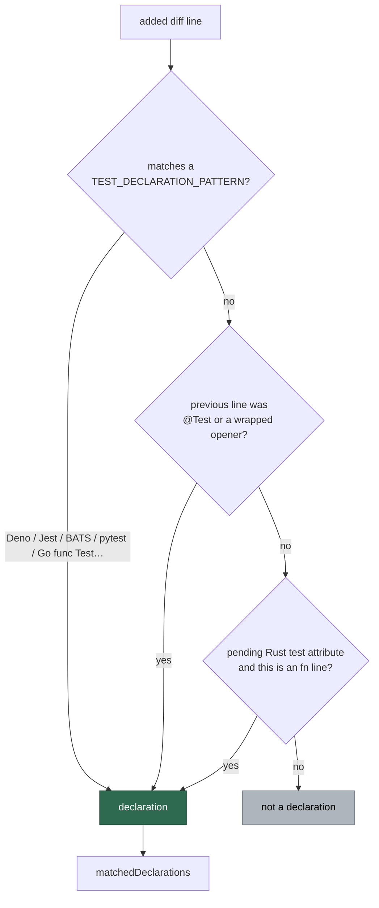

## Summary

The security-fix verification gate recognised no Rust or Go test declaration, so
a Rust-only or Go-only regression-test diff reported `matchedDeclarations=0` —
the gate saw no test declared at all, no citation could satisfy it, and the
in-run retry (#1575) could only fail the same way. `NEAT-AI-core#613` was
blocked at `completion` for exactly this reason.

`worker/deno/lib/security_fix_gate.ts` now covers the two remaining ecosystems
the fleet monitors:

- **Rust** — a test attribute alone on a line (`#[test]`, `#[tokio::test(…)]`,
  `#[async_std::test]`, `#[rstest]`, `#[proptest]`) marks the following `fn`
  line as the declaration, mirroring the existing JUnit `@Test` handling.
  Further attributes may sit in between (`#[should_panic]`), so the pending
  state carries across attribute lines and is closed by anything else — a `fn`
  with no test attribute above it still declares nothing. `#[cfg(test)]` is
  deliberately excluded: it gates a module, not a test function.
- **Go** — `^\s*func\s+Test\w*\s*\(` is a declaration on its own line.

Closes #1680.

## Evidence

Backend/CLI change with no web interface to screenshot. The evidence is the test
suite: the four new cases fail against the unfixed gate and pass after the fix
(full output below), and `./quality.sh` passes end to end.



Before the fix (the reproduction):

```text
citedTestIdentifierInDiff - matches a Rust test declared under a test attribute (Issue #1680) => FAILED
citedTestIdentifierInDiff - matches the async and stacked Rust attribute forms (Issue #1680) => FAILED
citedTestIdentifierInDiff - matches a Go test function (Issue #1680) => FAILED
matchedTestDeclarations - reports the Rust and Go declaration lines (Issue #1680) => FAILED
FAILED | 36 passed | 4 failed
```

After the fix:

```text
ok | 40 passed | 0 failed (10ms)   # tests/security_fix_gate_test.ts
ok | 71 passed | 0 failed (275ms)  # gate, retry, feedback and completion-retry suites
Result: PASSED (with skipped checks)  # ./quality.sh
```

## Reproduction

- **symptom** — a security fix whose regression test is a Rust `#[test] fn …`
  (or a Go `func TestX`) was blocked with
  `missing=test-identifier-in-diff matchedDeclarations=0`; the gate found no
  test declaration in the added lines, so no cited name could pass it
- **status** — `verified` — the four regression tests were observed failing
  against the unfixed gate (output above) and passing after the fix
- **regression test** —
  `worker/deno/tests/security_fix_gate_test.ts::citedTestIdentifierInDiff - matches a Rust test declared under a test attribute (Issue #1680)`

## Test Plan

Added to `worker/deno/tests/security_fix_gate_test.ts`:

- `citedTestIdentifierInDiff - matches a Rust test declared under a test attribute (Issue #1680)` —
  `#[test]` + `fn rejects_oob_index() {`, cited as `tests/index_test.rs::rejects_oob_index`.
- `citedTestIdentifierInDiff - matches the async and stacked Rust attribute forms (Issue #1680)` —
  `#[tokio::test(flavor = "multi_thread")]` with `async fn`, `#[rstest]`,
  `#[proptest]`, and `#[test]` + `#[should_panic(…)]` + `pub fn`.
- `citedTestIdentifierInDiff - a Rust fn only counts under a test attribute (Issue #1680)` —
  a plain helper `fn`, a `#[cfg(test)] mod`, and a name used only inside another
  test's body all stay blocked (the existing #1279 rule).
- `citedTestIdentifierInDiff - matches a Go test function (Issue #1680)` —
  `func TestRejectsOob(t *testing.T) {` passes; a non-test `func` carrying the
  name in its body does not.
- `matchedTestDeclarations - reports the Rust and Go declaration lines (Issue #1680)` —
  the operator-facing evidence list now names both declarations.

Docs: `docs/security-fix-gate-feedback.md` gains a
**Test declarations the gate recognises** table so `matchedDeclarations=0` can
be read against the syntaxes the gate actually knows.
