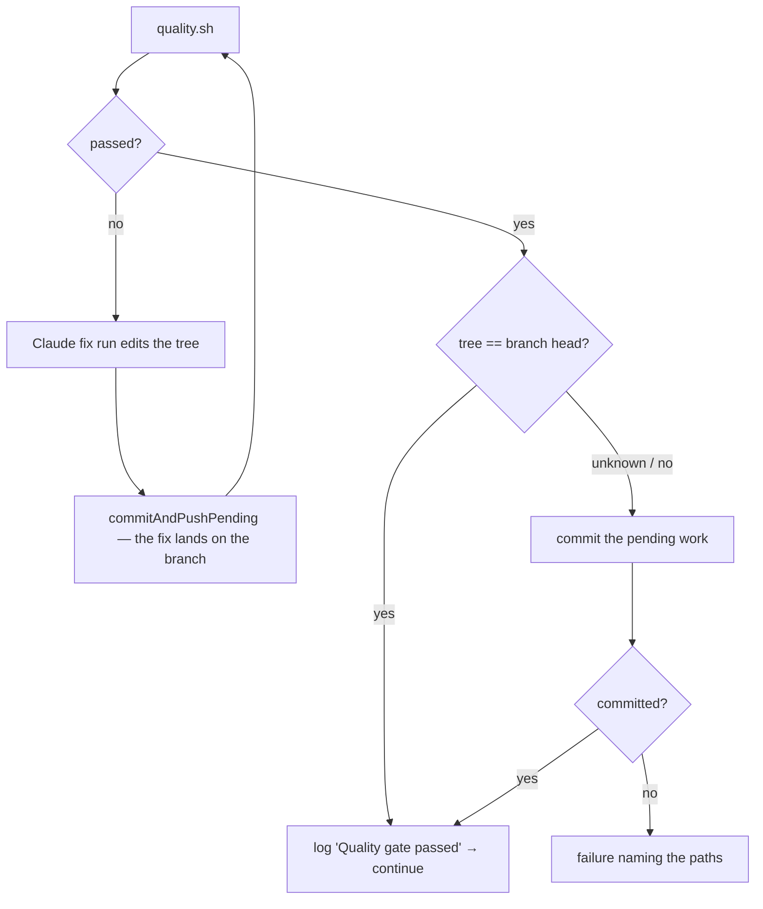

## Summary

The quality-gate remediation phase handed a failing `quality.sh` to a Claude fix
run, reran the gate against the edited working tree, logged
`Quality gate passed attempt=2` and returned — with nothing ever committing the
edit. The PR carried the branch, which was still the tree that had FAILED
attempt 1; the pre-PR rebase was declined for those very files, so CI ran twice;
and the next `reset --hard` threw the fix away. Closes #1684.

Four changes, one new shared module:

- **`worker/deno/lib/pending_work.ts`** (new) — lists uncommitted paths
  (worker-owned state excluded, per #1661), names them bounded at ten with
  control characters scrubbed, and commits them through `commitAndPushPending`,
  passing the repo's mandatory pre-flight gate spec (#3577). `git status`
  failing returns `null`, deliberately distinct from `[]`.
- **`quality_gate_remediation_phase.ts`** — commits the fix run's edits before
  the gate is rerun, so the rerun verifies the branch; and refuses to log
  `Quality gate passed` while non-worker paths are uncommitted (or while the
  tree cannot be read), failing loudly with the paths named.
- **`completion_phase.ts`** — preserves a dirty tree on a branch that is _ahead_
  of base, the way #218 preserves one that is _level_, before either rebase
  guard looks at the tree. Best effort, as #218's rescue is; a failure is
  reported with `logger.error` and the paths, never swallowed.
- **`stale_branch_lineage.ts`** — `rebaseOntoBase`'s dirty-tree refusal names
  the paths instead of a bare count.

## Evidence

Backend/CLI change — no web interface to screenshot. Verified by the tests
below, all run unattended (`< /dev/null`), plus the full `./quality.sh` gate:
`Result: PASSED (with skipped checks)` (`config integration` is skipped on this
host, as it is for every run here).

Follow-up filed: **stSoftwareAU/VibeCoder#1714** — `attemptBumpAudit`'s
`git reset --hard <beforeBumpSha>` now rewinds _published_ history on the one
path where a bump audit follows a pushed quality-fix commit, so a rejected bump
could still reach the PR. That is #1613's audit mechanism, not this fix; a code
comment at the reset cross-references it.

## Reproduction

- **symptom** — the quality-fix agent's edits were never committed: the gate
  logged a pass on the working tree, the PR was raised without the fix, and the
  pre-PR rebase was declined for the same uncommitted files
- **status** — `verified` — the five new phase tests and the extended
  `rebaseOntoBase` assertion were observed failing against the unfixed code
  (`git apply -R` of the lib diff: 6 failures, including `commits.length` 0 vs 1
  for the fix-run case) and passing after the fix
- **regression test** —
  `worker/deno/tests/quality_gate_commit_fix_test.ts::quality gate - a fix run that leaves a modified file produces a commit before the loop continues (Issue #1684)`

## Acceptance Criteria

<!-- vibe-spec-review inputs="diff+issue-body" -->

- **met** — a run whose quality-fix agent edits files ends with those edits in a
  commit on the issue branch, and the PR diff contains them — evidence:
  `worker/deno/lib/phases/quality_gate_remediation_phase.ts`
  (`commitWorkingTree` after the fix run) and
  `worker/deno/tests/quality_gate_commit_fix_test.ts::a fix run that leaves a modified file produces a commit before the loop continues`
  — reviewer: met
- **met** — `Quality gate passed attempt=N` is only logged when the passing tree
  equals the branch head — evidence:
  `worker/deno/tests/quality_gate_commit_fix_test.ts::a pass on a tree that could not be committed is a failure naming the paths`
  and
  `::an unreadable working tree refuses the pass rather than assuming it is clean`
  — reviewer: partial — reason: the reviewer saw the pre-review diff, where an
  unreadable `git status` was logged as "treating it as clean" and let the pass
  through; that hole is closed here — `commitWorkingTree` now returns `null` for
  an unreadable tree and the pass verdict fails on it, with a test
- **met** — `ensureBranchCurrent` is no longer declined for a dirty tree after a
  quality fix; other declines name the paths — evidence:
  `commitDirtyTreeOnAheadBranch` runs before both rebase guards
  (`worker/deno/lib/phases/completion_phase.ts`), and
  `worker/deno/tests/stale_branch_lineage_test.ts::rebaseOntoBase - refuses on a dirty working tree`
  asserts the refusal names `uncommitted.md` — reviewer: met — reason: the
  reviewer noted the rescue is skipped when the branch is level (#218's case) or
  the ahead-count is unreadable; both are deliberate and documented in the
  helper
- **met** — regression test: a remediation loop whose fix run leaves a modified
  file produces a commit containing that file before the loop returns `continue`
  — evidence:
  `worker/deno/tests/quality_gate_commit_fix_test.ts::a fix run that leaves a modified file produces a commit before the loop continues`
  — reviewer: met — reason: the reviewer noted `commitAndPushPending` is
  stubbed, so "the commit contains that file" is asserted through the porcelain
  seam rather than real git; the chokepoint's own committing behaviour is
  covered by `worker/deno/tests/commit_and_push_pending_test.ts`
- **unrequested** — the pass verdict also commits a dirty tree on attempt 1,
  where no fix run happened — reviewer: unrequested — reason: the issue's second
  bullet asks the loop to refuse a pass while the tree is dirty; committing
  first is what keeps that refusal from failing runs whose agent simply left
  work uncommitted, and it is the same "never discard it" rule the issue's third
  bullet states
- **unrequested** — `decodePorcelainPath` and porcelain parsing moved out of
  `run_wip_preservation.ts` into the new shared module — reviewer: unrequested —
  reason: three call sites now parse porcelain; one copy is the DRY answer and
  the move is behaviour-preserving (existing #218 tests unchanged and green)
- **unrequested** — `docs/audits/security-sweep-1684-pending-work.md` and the
  `12m` slice in `docs/audits/lib-sweep-coverage.json` — reviewer: unrequested —
  reason: mandated by an existing gate,
  `worker/deno/tests/lib_sweep_coverage_test.ts` fails for any new `lib/` module
  without a ledger slice
- **unrequested** — the `docs/INTERNALS.md` section and its Mermaid diagram —
  reviewer: unrequested — reason: the repo's "a code change owes a docs change"
  standard; the behaviour it describes is the change itself

## Standards Review

<!-- vibe-standards-review inputs="diff+CODING-STANDARDS.md" -->

- **violation** — an unreadable `git status` was reported as a clean tree, so a
  pass could be logged without positive confirmation — evidence:
  `worker/deno/lib/phases/quality_gate_remediation_phase.ts:154` (pre-review) —
  reason: fixed here — `commitWorkingTree` returns `null` and the pass verdict
  fails loudly; covered by
  `tests/quality_gate_commit_fix_test.ts::an unreadable working tree refuses the pass`
- **violation** — a push failure after a good commit left a clean tree, so the
  chokepoint's error was dropped — evidence:
  `worker/deno/lib/phases/quality_gate_remediation_phase.ts` (pre-review) —
  reason: fixed here — both call sites now warn with `outcome.error` even when
  the tree came back clean
- **violation** — tests re-implemented the WIP rule as
  `!message.startsWith("wip:")` instead of asking the real recogniser —
  evidence: `worker/deno/tests/quality_gate_commit_fix_test.ts:176` (pre-review)
  — reason: fixed here — both tests now call `isWipCommitSubject`
- **violation** — the new public helpers lacked tests for the control-character
  scrub and the `statusUnknown`-after-commit branch — evidence:
  `worker/deno/tests/pending_work_test.ts` (pre-review) — reason: fixed here —
  both branches now have tests, as does the pre-flight pass-through
- **violation** — the pre-flight enforcement gate (#3577) was not passed to the
  chokepoint at the new call sites — evidence: `worker/deno/lib/pending_work.ts`
  (pre-review) — reason: fixed here — `commitPendingWork` takes a `preFlight`
  spec and both phases pass
  `resolvePreFlightSpec(ctx.config.repoConfig, ctx.repo)`
- **violation** — an unrelated cosmetic re-encoding of `—` in
  `docs/audits/lib-sweep-coverage.json` — evidence:
  `docs/audits/lib-sweep-coverage.json:4` — reason: reverted here; the diff now
  adds only the new slice
- **violation** — the ahead-count block in `commitDirtyTreeOnAheadBranch`
  duplicates the later ahead-of-base guard in the same file — evidence:
  `worker/deno/lib/phases/completion_phase.ts:617` — reason: stands. The later
  guard carries its own logging and failure branches; extracting a shared
  counter would rewrite that guard, which this issue does not ask for. Both read
  the same refs via `resolveComparableBaseRef`, and the comment says so
- **violation** — 126 lines of rescue logic added inline to a 1799-line file
  rather than a new module — evidence:
  `worker/deno/lib/phases/completion_phase.ts:599` — reason: stands. It is
  completion-phase policy (what "ahead" means, which rescue owns which tree) and
  reads with the guards it sits between; the reusable half is already in
  `pending_work.ts`
- **violation** — `docs/INTERNALS.md` claimed `pending_work.ts` is "the one
  place" that parses porcelain, while `git_pull.ts` still hand-parses its own —
  evidence: `docs/INTERNALS.md:2782` — reason: wording narrowed here to the
  three paths this change touches
- **clean** — Australian English throughout; commit safety (nothing staged
  directly, every write through `commitAndPushPending` with its #1758/#1661/
  #2584/#2381 gates); fail-loud error handling (`null` ≠ `[]`, refusals name
  paths); tests call real phase entry points through injected seams with no
  sleeps, no `Deno.env` mutation and no source-grepping; new lib module
  registered in the sweep ledger with its written record

## Test Plan

- `worker/deno/tests/pending_work_test.ts` (new, 11 tests) — porcelain parsing
  (including git's C-quoting), the ten-path bound, the control-character scrub,
  worker-state exclusion, `null` for an unreadable status, commit/no-commit/
  refused-commit outcomes, and the #3577 pre-flight pass-through.
- `worker/deno/tests/quality_gate_commit_fix_test.ts` (new, 5 tests) — the fix
  run's edits are committed before the rerun; a pass over an uncommittable tree
  is a failure naming the paths and logs no pass; a dirty tree at the pass
  verdict is committed; worker state alone is not work; an unreadable tree
  refuses the pass.
- `worker/deno/tests/completion_phase_ahead_dirty_tree_test.ts` (new, 2 tests) —
  a dirty tree on a branch ahead of base is committed (non-WIP) before the
  rebase guards see it; a rescue the chokepoint refuses is reported with
  `logger.error` and the paths.
- `worker/deno/tests/stale_branch_lineage_test.ts` — one assertion added: the
  dirty-tree refusal names `uncommitted.md`.
- Regression suites re-run green: `completion_phase_*` (including #218's
  superseded-WIP tests), `quality_gate_phase_*`, `execute_phase_*`, `wip_*`,
  `lib_sweep_coverage_test.ts`, and the full `./quality.sh`.
