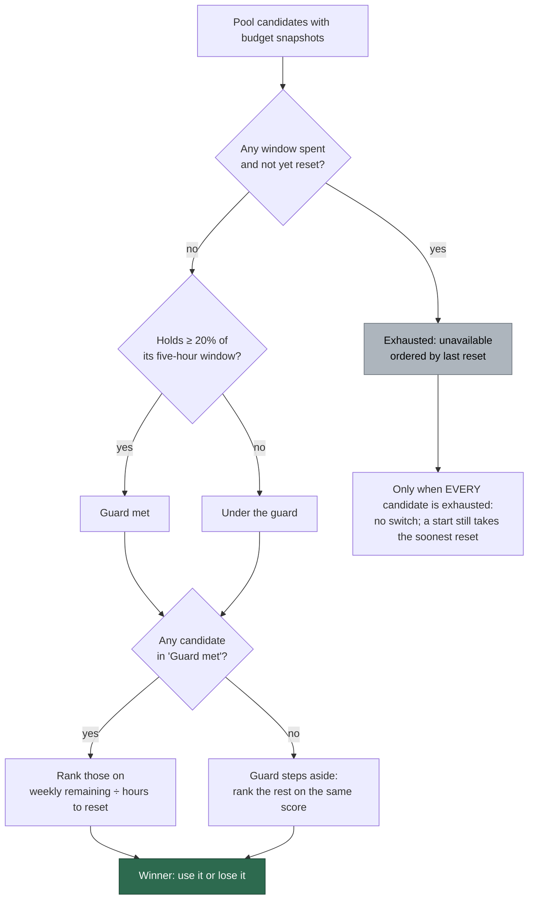

## Summary

The Claude credential pool now selects on the **weekly quota that is most
urgent to spend**, with the five-hour window as a soft guard rather than a hard
eligibility gate. Closes #1685.

Three rules changed:

1. **Exhaustion is the only hard condition.** A credential is unavailable while
   any window it reported has nothing left and has not yet reset; everything
   else is rankable.
2. **The 20% five-hour figure is a preference boundary.** While any usable
   credential holds at least 20%, selection is restricted to those. When none
   does, the guard steps aside and the same weekly ranking picks from what is
   left — a pool holding usable quota never idles. Exactly 20% remaining is
   usable; the guard bites *below* it.
3. **The 10% seven-day floor from #1623 is gone.** It placed a credential with
   8% of a week resetting in two hours behind one with 80% resetting in six
   days, which inverts use-it-or-lose-it. Ranking is now the weekly remaining
   fraction divided by the hours until the weekly reset, and nothing overrides
   it for a usable credential.

The restart check (`poolHasAnotherTokenWithBudget`, consulted on a quota pause)
read the same 20% figure and so idled a host whose other subscription was merely
low. It now reads exhaustion — on every window the probe reported, **and against
the same clock**, so its answer and the ranking's cannot disagree.

Names follow the semantics: `CLAUDE_FIVE_HOUR_GATE_MIN_REMAINING` →
`CLAUDE_FIVE_HOUR_GUARD_MIN_REMAINING`, `passesFiveHourGate` →
`meetsFiveHourGuard` (plus new `exhausted` / `availableAt` fields), and the log
field `gate=pass|fail` → `guard=pass|below|exhausted`.

## Evidence

Backend/CLI change with no web interface to screenshot; the evidence is the
test suites below, all run headless in the container.

```text
deno test tests/claude_token_selection_test.ts \
          tests/claude_credential_pool_test.ts \
          tests/claude_pool_budget_test.ts \
          tests/container_restart_backoff_test.ts \
          tests/run_worker_test.ts            →  ok | 135 passed | 0 failed
./quality.sh                                  →  Result: PASSED
```

How a spawn or a mid-run switch now picks a credential:



## Acceptance Criteria

<!-- vibe-spec-review inputs="diff+issue-body" -->

- **met** — A highest weekly score, A=70% / B=90% five-hour → A selected — evidence: `worker/deno/tests/claude_token_selection_test.ts::the weekly rate decides while both credentials clear the five-hour guard (Issue #1685)` — reviewer: met
- **met** — A highest weekly but A=19% / B=60% five-hour → B selected — evidence: `worker/deno/tests/claude_token_selection_test.ts::a credential under the five-hour guard loses to one above it, whatever its weekly rate (Issue #1685)`, `band()` in `worker/deno/lib/claude_token_selection.ts` — reviewer: met
- **met** — A=19% / B=18%, neither exhausted → still spawns, highest weekly wins — evidence: `worker/deno/tests/claude_token_selection_test.ts::with every credential under the guard the weekly rate still decides and nothing is refused (Issue #1685)`, `worker/deno/tests/claude_credential_pool_test.ts::every token under the guard still selects the best of them` — reviewer: met
- **met** — A=0% exhausted, B=15% → B selected — evidence: `worker/deno/tests/claude_token_selection_test.ts::an exhausted credential loses to a usable one under the guard (Issue #1685)`, `worker/deno/tests/claude_credential_pool_test.ts` — reviewer: met
- **met** — A=19% / B=21% → B, even on a worse weekly score — evidence: `worker/deno/tests/claude_token_selection_test.ts::21% of the five-hour window beats 19% even on a worse weekly rate (Issue #1685)` — reviewer: met
- **met** — A=20% / B=21% → both rankable; 20% is not excluded — evidence: `worker/deno/tests/claude_token_selection_test.ts::exactly 20% of the five-hour window is usable, not excluded (Issue #1685)` and `::the guard reads the utilisation the probe actually reports` — reviewer: met — reason: the reviewer verified the float round-trip itself, since the probe yields `0.19999999999999996` for a reported 80% utilisation; the guard compares usage (`<= 0.8`) precisely so that case is usable
- **met** — a low weekly balance with an imminent reset beats a high one days away — evidence: `worker/deno/tests/claude_token_selection_test.ts::an imminent weekly reset beats a far larger weekly balance days away (Issue #1685)` and `::a token under 10% of its seven-day window is ranked on its rate like any other (Issue #1685)` — reviewer: met
- **met** — no special 10% weekly floor overriding the ranking — evidence: `CLAUDE_SEVEN_DAY_LOW_REMAINING` deleted, no live references repo-wide, `band()` carries no floor, `docs/SETUP.md` rule 5 documents the removal — reviewer: met — reason: the reviewer noted the test module header still described the removed floor as live behaviour; that header was rewritten in commit `a6e9833`
- **met** — a pool with usable credentials never idles solely on <20% five-hour — evidence: `worker/deno/lib/claude_credential_pool.ts` `selectEligible` filters only on exhaustion/unknown, `selectToken` filters nothing, `POOL_BUDGET_FLOOR = 0`, `worker/deno/tests/claude_pool_budget_test.ts::a low but usable window is worth restarting for (Issue #1685)` — reviewer: met
- **met** — single-token behaviour backward compatible — evidence: `pool.length < 2` early-outs on all three surfaces; `worker/deno/tests/claude_pool_budget_test.ts::one subscription asks nothing and answers no` asserts zero probes — reviewer: met
- **met** — quality gate passes — evidence: full `./quality.sh` run after the final edit → `Result: PASSED (with skipped checks)` — reviewer: met — reason: the reviewer saw only the diff and could not run the full gate, so it re-ran the constituent checks (61/61 and 73/73 suites, `deno check`/`lint`/`fmt`, markdownlint) and found them clean; the full gate was run here
- **unrequested** — exhaustion generalised from the five-hour window to *any* reported window (`worker/deno/lib/claude_token_selection.ts`, `const spent = windows.filter(...)`) — reviewer: unrequested — reason: the issue names only the five-hour window in rule 1, but a spent week cannot be spent from however fresh the five hours are, and leaving it out would let the restart check and the ranking disagree; documented in `docs/SETUP.md` and covered by `::a seven-day exhaustion is exhaustion too, whatever the five hours hold`
- **unrequested** — the restart path (`poolHasAnotherTokenWithBudget`) was re-specified: `POOL_BUDGET_FLOOR` `0.2 → 0`, read over every reported window rather than the five-hour one — reviewer: unrequested — reason: the `0.2 → 0` half is forced by "a pool with usable credentials never idles" — that constant *was* the 20% guard, shared by reference; the window half keeps it agreeing with the ranking's exhaustion rule
- **unrequested** — exhausted credentials are now ordered by `availableAt`, the *last* of their spent windows to reset — reviewer: unrequested — reason: the issue does not say how to order exhausted credentials, but the previous rule (soonest five-hour reset) could name a token whose week is still spent; a token is usable again only once every spent window has reset
- **unrequested** — operator-visible log contract change: `gate=pass|fail` → `guard=pass|below|exhausted`, plus renamed reason codes — reviewer: unrequested — reason: the three-state field is the behaviour this issue introduces (exhausted and below-guard are now different outcomes); a two-state field cannot express it, and `docs/SETUP.md` was updated in the same change
- **unrequested** — exported-symbol renames `CLAUDE_FIVE_HOUR_GATE_* → *_GUARD_*`, `passesFiveHourGate → meetsFiveHourGuard` — reviewer: unrequested — reason: the issue's central point is that this is a guard and not a gate; leaving the old names would leave the code asserting the behaviour the issue removed. No consumer exists outside the four files changed here

## Standards Review

<!-- vibe-standards-review inputs="diff+CODING-STANDARDS.md" -->

- **violation** — DRY / single source of truth: the restart check and the ranking answered "is this credential spent?" differently, while the diff newly asserted in four places that they cannot — evidence: `worker/deno/lib/claude_pool_budget.ts:68` (`usableRemaining` took no clock and read `remainingFraction` raw) against `worker/deno/lib/claude_token_selection.ts:259` (`rankWindow` counts an elapsed reset as full) — reason: **fixed here** in commit `a6e9833` — `usableRemaining` now takes `now` and applies the same rollover rule. The Spec reviewer found the identical defect independently
- **violation** — test coverage: the modified public function's exhaustion boundary was never exercised against a live window, because every fixture hard-coded reset instants already in the past — evidence: `worker/deno/tests/claude_pool_budget_test.ts:50`, `:52`, `:185` — reason: **fixed here** — the suite now injects a pinned clock (`NOW`) and the resets are named constants, and `::a window whose reset has passed is full, exactly as the ranking reads it (Issue #1685)` pins both surfaces to one verdict. It was observed failing against the unfixed `usableRemaining` and passing after
- **clean** — Australian English throughout the added prose (`utilisation`, `behaviour`); the only `color` hits are CSS properties inside Mermaid `style` directives
- **clean** — commit safety: no hidden path staged, no `git add -f`, no `--no-verify`; every commit references `(Issue #1685)` and carries a `Vibe-Coder-Run-Id` trailer
- **clean** — tests exercise real code: every case calls `rankClaudeTokenBudgets`, `createClaudeCredentialPool(...)`, `poolHasAnotherTokenWithBudget` or `formatClaudeTokenSelectionLog` with injected fetch/clock/env seams and asserts on returned values or emitted log lines; no source-grepping assertions
- **clean** — unit-test hygiene: no `Deno.env` mutation, no `chdir`, no sleep/poll/spawn, no wall-clock thresholds; clocks passed as `now: () => NOW`
- **clean** — docs accompany the code change: the renames and retired reason codes are swept out of every live surface (`docs/SETUP.md`, `docs/CONTAINER.md`, the module doc comments); old names survive only under the correctly frozen `docs/archive/`
- **clean** — KISS: the change is subtractive where it can be (the weekly floor and its constant are gone, `band()` shrinks to three lines); both new `RankedClaudeToken` fields are consumed and asserted

### Reviewer findings recorded, not actioned

- The Spec reviewer noted `selectEligible` / `recordExhaustion` / `applySelection` still have **no production caller** — `worker/deno/lib/run_worker.ts:316` wires only `selectToken` into start-up. That is #1669's per-spawn wiring, which the issue explicitly scopes elsewhere; this change makes the library answer correctly for when it lands.
- The Spec reviewer observed that dropping `POOL_BUDGET_FLOOR` to `0` removes #1668's anti-thrash protection with no replacement, so a credential with 0.5% left can trigger a restart that re-pauses. This is the behaviour the issue mandates ("exhaustion is the hard condition"), so it stands as specified rather than being softened here.
- The Standards reviewer noted `PoolBudgetOptions.floor` is now injected by no caller. It was already unused before this diff, so removing it is outside this issue's scope.

## Test Plan

Added (`worker/deno/tests/claude_token_selection_test.ts`):

- `the weekly rate decides while both credentials clear the five-hour guard`
- `a credential under the five-hour guard loses to one above it, whatever its weekly rate`
- `with every credential under the guard the weekly rate still decides and nothing is refused`
- `an exhausted credential loses to a usable one under the guard`
- `21% of the five-hour window beats 19% even on a worse weekly rate`
- `exactly 20% of the five-hour window is usable, not excluded`
- `an imminent weekly reset beats a far larger weekly balance days away`
- `with every credential exhausted the soonest reset wins and a winner is still named`
- `an exhausted token becomes usable again only when its LAST spent window resets`
- `an exhausted window whose reset has passed is usable again`
- `a seven-day exhaustion is exhaustion too, whatever the five hours hold`

Added (`worker/deno/tests/claude_credential_pool_test.ts`):

- `every token under the guard still selects the best of them`
- `exactly 20% of the five-hour window is eligible`
- `only an exhausted pool selects nothing, and still logs`
- `a start on an exhausted pool takes the soonest reset`
- `an unmeasured pool is not a switch target`

Added (`worker/deno/tests/claude_pool_budget_test.ts`):

- `a low but usable window is worth restarting for`
- `the restart floor is exhaustion, not the five-hour guard`

**Modified tests, and why** (business logic changed, so the assertions had to;
none were removed or commented out — each now asserts the inverted outcome and
says so at the point it does):

| Test | Was | Now |
|------|-----|-----|
| `ranking puts a token at 80% … behind one at 79%` | 20% remaining failed the gate | states the case either side of 20%: 19% is under the guard, 21% meets it |
| `the gate reads the utilisation the probe actually reports` | `1-0.80` failed | `1-0.80` is exactly 20% and usable; `1-0.81` is not |
| `ranking puts a passing token under 10% of its seven-day window behind every passing token above it` | 8% weekly demoted by the floor | renamed `a token under 10% … is ranked on its rate like any other`; 8% lapsing within the hour wins |
| `ranking orders two sub-10% tokens by rate…` | reason `low-seven-day-remaining-highest-rate` | reason `highest-remaining-per-hour`; that floor no longer exists |
| `ranking orders gate-failing tokens by the soonest five-hour reset` | five-hour reset decided | renamed; the weekly rate decides, since neither is exhausted |
| `every token at or below the gate selects nothing` | `selectEligible` → `null` | renamed `every token under the guard still selects the best of them`; the pool no longer idles |
| `a start never refuses, even when the gate would` | tie fell to the soonest five-hour refill | the weekly rate decides on both surfaces; an exhausted-pool start is now its own test |
| `a sliver of budget is not worth a restart loop` | 10% five-hour → no restart | renamed `a low but usable window is worth restarting for`; only exhaustion blocks the restart |
| `the restart floor is the five-hour selection gate` | `POOL_BUDGET_FLOOR === 0.2` | `POOL_BUDGET_FLOOR === 0`, below the guard |
| `the floor is read on the five-hour window, not the most constrained one` | five-hour only | renamed `… on every window the response reported`; a spent week blocks the restart too, so the restart and the ranking cannot disagree |

Added after the independent review (`worker/deno/tests/claude_pool_budget_test.ts`):

- `a window whose reset has passed is full, exactly as the ranking reads it` —
  the regression test for the reviewers' shared finding; observed failing
  against the unfixed `usableRemaining` and passing after.

Every case in that suite now injects a pinned clock rather than reading
`Date.now()`, because its fixtures' reset instants have since passed and the
assertions genuinely depend on which side of them the clock sits.

Docs updated in the same change: `docs/SETUP.md` (the ordering rules, the log
sample, the `guard=` field and the reason table) and `docs/CONTAINER.md`.
