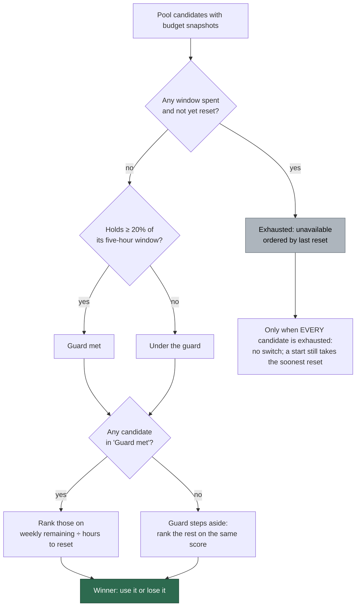

## Summary

The Claude credential pool now selects on the **weekly quota that is most
urgent to spend**, with the five-hour window as a soft guard rather than a hard
eligibility gate. Closes #1685.

Three rules changed:

1. **Exhaustion is the only hard condition.** A credential is unavailable while
   any window it reported has nothing left and has not yet reset; everything
   else is rankable.
2. **The 20% five-hour figure is a preference boundary.** While any usable
   credential holds at least 20%, selection is restricted to those. When none
   does, the guard steps aside and the same weekly ranking picks from what is
   left — a pool holding usable quota never idles. Exactly 20% remaining is
   usable; the guard bites *below* it.
3. **The 10% seven-day floor from #1623 is gone.** It placed a credential with
   8% of a week resetting in two hours behind one with 80% resetting in six
   days, which inverts use-it-or-lose-it. Ranking is now the weekly remaining
   fraction divided by the hours until the weekly reset, and nothing overrides
   it for a usable credential.

The restart check (`poolHasAnotherTokenWithBudget`, consulted on a quota pause)
read the same 20% figure and so idled a host whose other subscription was merely
low. It now reads exhaustion — on every window the probe reported, so its answer
and the ranking's cannot disagree.

Names follow the semantics: `CLAUDE_FIVE_HOUR_GATE_MIN_REMAINING` →
`CLAUDE_FIVE_HOUR_GUARD_MIN_REMAINING`, `passesFiveHourGate` →
`meetsFiveHourGuard` (plus new `exhausted` / `availableAt` fields), and the log
field `gate=pass|fail` → `guard=pass|below|exhausted`.

## Evidence

Backend/CLI change with no web interface to screenshot; the evidence is the
test suites below, all run headless in the container.

```text
deno test tests/claude_token_selection_test.ts \
          tests/claude_credential_pool_test.ts \
          tests/claude_pool_budget_test.ts   →  ok | 61 passed | 0 failed
./quality.sh                                  →  Result: PASSED
```

How a spawn or a mid-run switch now picks a credential:



## Test Plan

Added (`worker/deno/tests/claude_token_selection_test.ts`):

- `the weekly rate decides while both credentials clear the five-hour guard`
- `a credential under the five-hour guard loses to one above it, whatever its weekly rate`
- `with every credential under the guard the weekly rate still decides and nothing is refused`
- `an exhausted credential loses to a usable one under the guard`
- `21% of the five-hour window beats 19% even on a worse weekly rate`
- `exactly 20% of the five-hour window is usable, not excluded`
- `an imminent weekly reset beats a far larger weekly balance days away`
- `with every credential exhausted the soonest reset wins and a winner is still named`
- `an exhausted token becomes usable again only when its LAST spent window resets`
- `an exhausted window whose reset has passed is usable again`
- `a seven-day exhaustion is exhaustion too, whatever the five hours hold`

Added (`worker/deno/tests/claude_credential_pool_test.ts`):

- `every token under the guard still selects the best of them`
- `exactly 20% of the five-hour window is eligible`
- `only an exhausted pool selects nothing, and still logs`
- `a start on an exhausted pool takes the soonest reset`
- `an unmeasured pool is not a switch target`

Added (`worker/deno/tests/claude_pool_budget_test.ts`):

- `a low but usable window is worth restarting for`
- `the restart floor is exhaustion, not the five-hour guard`

**Modified tests, and why** (business logic changed, so the assertions had to;
none were removed or commented out — each now asserts the inverted outcome and
says so at the point it does):

| Test | Was | Now |
|------|-----|-----|
| `ranking puts a token at 80% … behind one at 79%` | 20% remaining failed the gate | states the case either side of 20%: 19% is under the guard, 21% meets it |
| `the gate reads the utilisation the probe actually reports` | `1-0.80` failed | `1-0.80` is exactly 20% and usable; `1-0.81` is not |
| `ranking puts a passing token under 10% of its seven-day window behind every passing token above it` | 8% weekly demoted by the floor | renamed `a token under 10% … is ranked on its rate like any other`; 8% lapsing within the hour wins |
| `ranking orders two sub-10% tokens by rate…` | reason `low-seven-day-remaining-highest-rate` | reason `highest-remaining-per-hour`; that floor no longer exists |
| `ranking orders gate-failing tokens by the soonest five-hour reset` | five-hour reset decided | renamed; the weekly rate decides, since neither is exhausted |
| `every token at or below the gate selects nothing` | `selectEligible` → `null` | renamed `every token under the guard still selects the best of them`; the pool no longer idles |
| `a start never refuses, even when the gate would` | tie fell to the soonest five-hour refill | the weekly rate decides on both surfaces; an exhausted-pool start is now its own test |
| `a sliver of budget is not worth a restart loop` | 10% five-hour → no restart | renamed `a low but usable window is worth restarting for`; only exhaustion blocks the restart |
| `the restart floor is the five-hour selection gate` | `POOL_BUDGET_FLOOR === 0.2` | `POOL_BUDGET_FLOOR === 0`, below the guard |
| `the floor is read on the five-hour window, not the most constrained one` | five-hour only | renamed `… on every window the response reported`; a spent week blocks the restart too, so the restart and the ranking cannot disagree |

Docs updated in the same change: `docs/SETUP.md` (the ordering rules, the log
sample, the `guard=` field and the reason table) and `docs/CONTAINER.md`.
