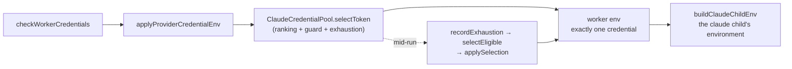

# Claude pool: table-driven tests for weekly urgency and the five-hour guard

## Summary

Issue #1685 clarified what the Claude credential scheduler decides, and the
distinction it drew — weekly quota per hour is the balancing rule, the 20%
five-hour figure is a soft guard, exhaustion is the only hard exclusion — is
easy to lose the next time quota handling is touched. This change pins it as a
table so it cannot be lost quietly.

Test-only: no production code is modified. Two new files add 27 tests.

- `worker/deno/tests/claude_pool_policy_matrix_1686_test.ts` — the twelve
  required matrix rows plus the named edge cases. Each row is stated once and
  asserted on **both** surfaces that read the policy, so neither can drift from
  the other: `rankClaudeTokenBudgets` (the winner and the reason it won) and
  `ClaudeCredentialPool.selectEligible` (whether a child spawn is allowed).
- `worker/deno/tests/claude_pool_spawn_policy_1686_test.ts` — the same policy
  through the real start-up credential path, ending at the environment a
  `claude` child would receive.

Closes #1686.

## Evidence

Backend/CLI only — there is no web interface to screenshot. The evidence is the
tests, and in particular that they fail against the two behaviours the issue
names as regressions. Both were verified by mutating the implementation,
running the suite, and restoring the tree:

| Mutation | Failures |
|---|---|
| `selectEligible` refuses when the winner is under the guard (the old `all <=20% => no eligible credential`) | 6 tests fail |
| `compareCandidates` bands `< 10%` weekly behind `>= 10%` (the old weekly floor) | 1 test fails — `a very low weekly balance is still the urgent one` |

Both mutations were reverted; `git status` is clean and no `lib/` file is in the
diff.

The path the runner-level file exercises:

Quality gate: `./quality.sh` PASSED (config integration SKIPPED, as it is on
this host). 27 new tests pass in under 300 ms; nothing added touches the
network, the wall clock, the filesystem outside a temp dir, or the process
environment.

### Recorded, not endorsed

The spec reviewer found that the missing-seven-day fallback ranks a credential
on its **five-hour** rate and compares that straight against weekly rates, so a
credential whose response omits the seven-day header outranks every healthy one
by roughly forty times. The issue asked that this "cannot outrank a known
healthy candidate accidentally" — today it can. Correcting it is a change to the
ranking algorithm, which this issue explicitly excludes, so it is filed as
**#1731** and the test asserts today's behaviour with the reason written beside
it, so that fix flips a test deliberately rather than moving the policy in
silence.

## Acceptance Criteria

<!-- vibe-spec-review inputs="diff+issue-body" -->

- **met** — Every required matrix row is represented by an automated test with deterministic quota/reset values — evidence: `worker/deno/tests/claude_pool_policy_matrix_1686_test.ts` `MATRIX` (12 rows, fixed `NOW = 2026-09-09T00:00:00Z`) — reviewer: met
- **met** — The tests fail against the old `all <=20% => no eligible credential` behaviour — evidence: reviewer mutated `claude_credential_pool.ts::selectEligible` and saw 6 failures — reviewer: met
- **met** — The tests fail if the old `<10% weekly => always rank behind >=10%` override is reintroduced — evidence: reviewer mutated `claude_token_selection.ts::compareCandidates` and saw `claude pool policy - a very low weekly balance is still the urgent one` fail — reviewer: met
- **met** — Exact 20% five-hour remaining is tested as usable — evidence: `claude_pool_policy_matrix_1686_test.ts::exactly 20% of the five-hour window is usable, so the week decides` and `::19.999%, 20% and 20.001% land on the right side of the guard` — reviewer: met
- **met** — A four-credential scenario is covered, matching the expected real fleet configuration — evidence: `claude_pool_policy_matrix_1686_test.ts::a four-credential pool with every five-hour window low still runs`, `::a four-credential pool picks the best week of the pair that clears the guard`, `::one usable credential among three exhausted ones still spawns` — reviewer: met
- **partial** — Pure ranking tests and at least one runner-level spawn/no-spawn integration test are included — evidence: `worker/deno/tests/claude_pool_spawn_policy_1686_test.ts` — reviewer: partial — reason: the spawn side reaches `checkWorkerCredentials` → `buildClaudeChildEnv` but never spawns a real child, and the no-spawn side asserts `selectEligible === null` on an API with no production caller yet, because #1669 (quota-gate every spawn) and #1670 (checkpoint/park) are still open
- **met** — Quality gate passes — evidence: `./quality.sh` run after the final edit, all checks PASSED — reviewer: met — reason: the reviewer ran `deno task quality` itself and saw exit 0
- **unrequested** — probe-count and "no request at all" assertions (`probes() === 3`, `=== 0`, `lines === []`) — reviewer: unrequested — reason: kept, because "spawn allowed" is only meaningful if the decision is the recorded snapshot's rather than a fresh probe's, and the single-token no-cost guarantee is what makes the pool free on every host today
- **unrequested** — secret-leak and log-content assertions over the pool's decision log — reviewer: unrequested — reason: kept, one line, and it is the standing #902 guarantee that no token value reaches a log
- **unrequested** — the assertion that a start-up with every credential exhausted still succeeds on the soonest to recover — reviewer: unrequested — reason: kept, because the issue's row 12 says "no spawn" while #1685's design says a start never refuses; asserting both is what stops the two being reconciled by accident later
- **unrequested** — `a reset landing exactly on now is already rolled over` — reviewer: unrequested — reason: kept, it is the `<=` half of the "reset already in the past" edge case the issue does ask for
- **unrequested** — per-row assertions on the `ClaudeTokenSelectionReason` string — reviewer: unrequested — reason: kept, the reason code is what an operator reads out of the log to tell the guard stepping aside from the guard being met

## Standards Review

<!-- vibe-standards-review inputs="diff+CODING-STANDARDS.md" -->

- **violation** — unsafe non-null assertions, `pool.applySelection(next!, …)` and `snapshotOf(candidates[0]!)`, against `prompts/best_practices/buckets/typescript.md` rule 8 — evidence: `worker/deno/tests/claude_pool_spawn_policy_1686_test.ts:365` and `worker/deno/tests/claude_pool_policy_matrix_1686_test.ts:718` — reason: fixed in this diff (commit `66fd0e0`) with an explicit `assert(next !== null)` and a named `const`
- **violation** — `docs/archive/pr-summaries/pr-summary-1686.md` missing — evidence: `docs/archive/pr-summaries/` — reason: fixed — this file, written after the code was committed as the process requires
- **violation** — DRY: several matrix rows restate policy facts already asserted in `claude_token_selection_test.ts:783-937` and `claude_credential_pool_test.ts:304-562` with different figures — evidence: `worker/deno/tests/claude_pool_policy_matrix_1686_test.ts:207` — reason: stands. The issue asks for one consolidated matrix that states the whole policy in a single readable table so a future quota fix cannot change its meaning a row at a time; the older per-rule tests were written incrementally across #919, #1623, #1668 and #1685 and each pins one rule in isolation. The overlap is the point, and the new file adds what none of them has: the `selectEligible` spawn half of every row, the four-credential pool, the 19.999/20/20.001 triple and the start-up-to-child-environment path
- **clean** — Australian English throughout (the only `utilization` strings are literal Anthropic response header names); real-code tests that call `rankClaudeTokenBudgets`, `createClaudeCredentialPool`, `checkWorkerCredentials` and `buildClaudeChildEnv` and assert on returned values, with no source-text greps; no wall-clock sleeps, polls or spawned processes (injected `now` and `fetchFn` everywhere, 27 tests in under 300 ms); parallel-safe, with no `Deno.env` mutation and no manifest entry needed; no host-state inheritance — the pool is always given its `dir` and fixtures live in a temp tree at `0o600`, removed in `finally`; no hidden path staged and all token fixtures synthetic; no existing test removed or commented out; commit messages carry `(Issue #1686)` and the run-id trailer

## Test Plan

New — `worker/deno/tests/claude_pool_policy_matrix_1686_test.ts` (21 tests):

- the 12-row `MATRIX`, each row asserting the ranking winner, the winning
  reason, the credential a child may spawn on (or `null`), and that the
  decision cost no probe;
- `the guard's boundary is 20%, the figure every row above is written against`;
- `19.999%, 20% and 20.001% land on the right side of the guard`;
- `a reset already in the past is a full window, never a negative rate`;
- `a reset landing exactly on now is already rolled over`;
- `equal weekly rates break towards the soonest reset, then discovery order`,
  including the same pool discovered in reverse;
- `a credential reporting no seven-day window is ranked on the window it did
  report, and that lets it outrank a healthy one` (see #1731);
- `an unknown budget ranks last without being dropped, and cannot outrank a
  healthy credential`;
- `a credential reporting no five-hour window has no guard to fall under`;
- `a freshly recorded exhaustion beats a cached snapshot that still showed
  quota`.

New — `worker/deno/tests/claude_pool_spawn_policy_1686_test.ts` (6 tests):

- `every credential under the guard still spawns one child, on the best week`;
- `the child environment carries the selected credential and no other`;
- `an explicitly exhausted credential is not selected`;
- `a mid-run usage limit moves the next spawn to another usable credential`;
- `with every credential exhausted there is no spawn target, and a start still
  names the soonest to recover`;
- `a single-credential host makes no request and starts on its one credential`.

No existing test was modified or removed.
