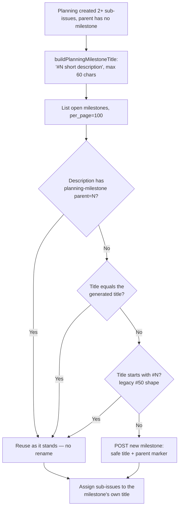

# Generate safe, short milestone names from issue titles

## Summary

The planning auto-milestone (Issue #2863) named milestones by copying the
parent issue title verbatim, which is how milestone #50 ended up as
`#1653 The CLI now says "hit your session limit", which …` — long, quoted, and
awkward in every CLI and search context.

`buildPlanningMilestoneTitle()` in `worker/deno/lib/planning_milestone.ts` is
now the one helper that names a planning milestone:

- **Shape** — `#<N> <short description>`. The `#<N>` prefix is the stable,
  unambiguous part: two parents with near-identical titles cannot collide.
- **Bounded** — at most `MAX_MILESTONE_TITLE_LENGTH` (60) characters including
  the prefix, cut on a word boundary so the last kept word is whole, and on a
  whole character so an astral-plane character is never split into a lone
  surrogate.
- **Safe** — quotes are dropped; everything outside an allowlist of letters,
  digits, spaces and `- _ . , :` becomes a space, so newlines, control
  characters, shell metacharacters and glob characters cannot reach the title.
- **Explicit short title preferred** — `plannedShortTitle` wins over the issue
  title when a caller has one (an optional input the issue asks for; no
  production caller supplies one yet).

Lookup and reuse were changed with it, so existing milestones keep working:

- Every new milestone's description leads with the structured marker
  `<!-- planning-milestone parent="N" -->`, and lookup matches that **before**
  it looks at any title — identity no longer depends on parsing
  human-readable text.
- Fallbacks are exact title, then a leading `#<N>` on the title. That is how
  a pre-existing milestone #50-style title stays discoverable.
- A reused milestone is used **as it stands** — never renamed, never PATCHed —
  and sub-issues are assigned to the title the milestone actually has, so an
  active milestone branch and in-flight work are untouched.
- The listing asks for `per_page=100`; the default page of 30 would miss an
  existing milestone in a busy repo and POST a duplicate.

Closes #1690.

## Evidence

Backend/CLI change with no web interface to screenshot. The evidence is the
test suite below plus the full quality gate.

The generated title for the #1653 regression fixture, produced by running the
real helper:

```text
input : The CLI now says "hit your session limit", which is misleading when the
        credential pool still has spare capacity — reword it
output: #1653 The CLI now says hit your session limit, which is   (55 chars)
```

Milestone resolution order — structured data first, human-readable text only
as a fallback:



`./quality.sh` → `Result: PASSED (with skipped checks)` (only
`config integration` skipped, as it is in this environment by default).

## Acceptance Criteria

<!-- vibe-spec-review inputs="diff+issue-body" -->

- **met** — a parent issue with embedded quotes, punctuation and a very long
  title produces a short, readable title with no embedded quotes or control
  characters — evidence:
  `worker/deno/tests/planning_milestone_test.ts::buildPlanningMilestoneTitle — #1653 quoted session-limit title is short and quote-free`
  — reviewer: partial — reason: the reviewer marked this partial because
  `boundToWords` sliced by UTF-16 unit and could emit a lone surrogate for an
  astral-plane title; fixed in `fa699c2` (`cutToLength`,
  `planning_milestone.ts`) with the regression test
  `buildPlanningMilestoneTitle — truncation never splits an astral character`
- **met** — the title has a stable issue-number prefix and a documented
  maximum length — evidence: `worker/deno/lib/planning_milestone.ts`
  (`MAX_MILESTONE_TITLE_LENGTH = 60`), documented in `DESIGN-PRINCIPLES.md`
  and `docs/workflows/planning-and-questions.md` — reviewer: met
- **met** — two different parent issues with similar titles cannot accidentally
  collide — evidence:
  `worker/deno/tests/planning_milestone_test.ts::buildPlanningMilestoneTitle — similar titles on different parents cannot collide`
  — reviewer: met
- **met** — repeated planning for the same parent reuses the existing milestone
  rather than creating a duplicate — evidence:
  `worker/deno/tests/planning_milestone_test.ts::maybeCreatePlanningMilestone — reuses by structured marker after a rename`
  and `… — reuses existing milestone, no POST` — reviewer: partial — reason:
  the reviewer marked this partial for the unpaged milestone listing (default
  30) missing an existing milestone in a busy repo; fixed in `fa699c2` by
  requesting `per_page=100`, covered by
  `maybeCreatePlanningMilestone — lists a full page of milestones`
- **met** — existing milestone #50-style titles remain discoverable and usable
  without an unsafe automatic rename — evidence:
  `worker/deno/tests/planning_milestone_test.ts::maybeCreatePlanningMilestone — reuses a legacy long-titled milestone (#50 shape)`,
  which asserts no POST, no PATCH, and that sub-issues are assigned to the
  legacy title — reviewer: partial — reason: the only gap the reviewer named
  was the same `per_page` caveat, now fixed
- **met** — tests exercise the real title-generation and
  milestone-creation/reuse logic, including a regression fixture based on
  #1653's quoted `session limit` title — evidence: the `SESSION_LIMIT_TITLE`
  fixture and the 24 tests in
  `worker/deno/tests/planning_milestone_test.ts`, all calling the real
  functions with an injected `ghCommandFn` — reviewer: met
- **met** — repository quality gate passes — evidence: `./quality.sh` run
  after the final edit, `Result: PASSED (with skipped checks)` — reviewer: met
- **partial** — "use the generated title consistently for … logging" —
  evidence: `worker/deno/lib/planning_milestone.ts` (`maybeCreatePlanningMilestone`)
  — reviewer: partial — reason: the reviewer found the ensure-failure warn had
  dropped `milestoneTitle`; naming and ensuring are now logged apart and the
  ensure warn carries the title again, but a title that fails to build has no
  title to log by definition
- **unrequested** — `buildPlanningMilestoneTitle` throws on a parent issue
  number that is not a positive integer, and the caller logs and skips —
  evidence: `worker/deno/lib/planning_milestone.ts` — reviewer: unrequested —
  reason: kept deliberately as input validation on the one public entry point
  (the coding standards require validating external input, and a milestone
  named after a bad number is worse than none); it is caught at the single
  chokepoint so the best-effort contract is unchanged
- **unrequested** — `parseMilestone` falls back to the posted title when the
  create response omits `title` — evidence:
  `worker/deno/lib/planning_milestone.ts` — reviewer: unrequested — reason:
  the milestone number is the identity that must be present; refusing an
  otherwise-valid response over a missing echo of the title we just sent would
  turn a created milestone into a failure

## Standards Review

<!-- vibe-standards-review inputs="diff+CODING-STANDARDS.md" -->

- **violation** — the module header still described the old
  `#<N> <title>` convention it now contradicts — evidence:
  `worker/deno/lib/planning_milestone.ts:6` — reason: fixed in `12473c8`
- **violation** — the earlier §2863 section of the planning workflow doc still
  said `#<N> <title>` and "a long parent title is truncated to fit" — evidence:
  `docs/workflows/planning-and-questions.md:665` and `:674` — reason: fixed in
  `12473c8`
- **violation** — the call-site comment still named the old convention —
  evidence: `worker/deno/lib/planning_processor.ts:2276` — reason: fixed in
  `12473c8` (and one matching comment in `planning_processor_test.ts`)
- **violation** — `sanitiseMilestoneTitleText` was exported "for reuse" with no
  consumer outside the module — evidence:
  `worker/deno/lib/planning_milestone.ts:81` — reason: made module-private in
  `12473c8`; `buildPlanningMilestoneTitle` is the shared helper the issue asked
  for
- **violation** — `plannedShortTitle` is an option no production caller
  supplies — evidence: `worker/deno/lib/planning_milestone.ts` and the call
  site in `planning_processor.ts` — reason: it stands. The issue explicitly
  requires "prefer an explicit short planning title when available"; the
  optional input is that requirement, documented and tested, and nothing in
  the planner produces a short title to wire it to yet
- **violation** — throwing rather than returning `Result<T, E>` for the invalid
  parent-number path — evidence: `worker/deno/lib/planning_milestone.ts` —
  reason: it stands, with the handling improved. `Result` is the convention for
  expected control flow; an unusable issue number is a caller bug on a public
  helper, so it throws with context and is caught at the single chokepoint,
  which now logs it apart from a GitHub failure rather than blending the two
- **violation** — an existing test was modified without explicit documentation
  — evidence: `worker/deno/tests/planning_milestone_test.ts` — reason:
  documented here. `buildPlanningMilestoneTitle — truncates over the limit`
  asserted the old `…` ellipsis suffix; the convention now truncates on a word
  boundary with no marker character, so that one assertion became
  `startsWith("#1 x")`. The test still exercises the same behaviour (a title
  over the limit is cut to exactly `MAX_MILESTONE_TITLE_LENGTH`). No test was
  removed or commented out
- **clean** — Australian English throughout (`sanitise`, `behaviour`,
  `honoured`); Deno-native tooling only; module ↔ test-file pairing and
  `@std/assert`; tests call real functions and assert on results, with no
  source-grepping, sleeps or wall-clock budgets; commit messages carry the
  issue reference and the `Vibe-Coder-Run-Id` trailer; no hidden or credential
  paths staged; the Mermaid diagram in the workflow doc updated in step

## Test Plan

All in `worker/deno/tests/planning_milestone_test.ts` (24 tests, all passing),
plus `tests/planning_processor_test.ts` and `tests/native_sub_issues_test.ts`
re-run unchanged.

Added:

- `buildPlanningMilestoneTitle — #1653 quoted session-limit title is short and
  quote-free` — the regression fixture from milestone #50.
- `buildPlanningMilestoneTitle — strips newlines and control characters`.
- `buildPlanningMilestoneTitle — shell metacharacters become spaces`.
- `buildPlanningMilestoneTitle — truncates on a word boundary, no trailing
  punctuation`.
- `buildPlanningMilestoneTitle — truncation never splits an astral character`.
- `buildPlanningMilestoneTitle — similar titles on different parents cannot
  collide`.
- `buildPlanningMilestoneTitle — a title of only unsafe characters falls back
  to the number`.
- `buildPlanningMilestoneTitle — prefers an explicit short planning title`.
- `buildPlanningMilestoneTitle — rejects a non-positive issue number`.
- `maybeCreatePlanningMilestone — reuses a legacy long-titled milestone (#50
  shape)` — no POST, no PATCH, assignment uses the legacy title.
- `maybeCreatePlanningMilestone — reuses by structured marker after a rename`.
- `maybeCreatePlanningMilestone — new milestone carries the safe title and the
  parent marker`.
- `maybeCreatePlanningMilestone — lists a full page of milestones`.

Modified:

- `buildPlanningMilestoneTitle — truncates over the limit` — the ellipsis-suffix
  assertion became a prefix assertion, because the convention no longer appends
  `…`. The length assertion is unchanged. Documented under Standards Review
  above.
