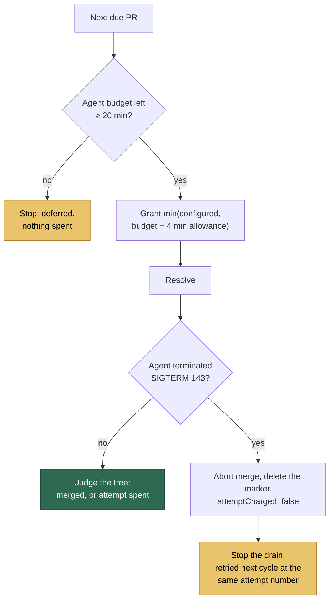

## Summary

The merge-conflict pass started a resolution with 736 s of handler budget,
granted its agent the configured 3600 s, and the maintenance-lane watchdog
SIGTERMed that agent mid-edit at the cycle end. The pass then read the
half-merged tree as the agent's verdict — `attempt=1 maxAttempts=2`, "the agent
left 6 path(s) unmerged" — and spent one of `NEAT-AI-core#637`'s two attempts on
a budget it never had.

Two changes, both in the merge-conflict subsystem:

- **The drain never starts a resolution on time the cycle does not have.** The
  floor is sized for an AI-fallback resolution — 20 minutes of *agent* budget,
  measured after a four-minute allowance for everything the attempt does outside
  the agent — and it is checked before the first resolution, not only between
  them. What the drain does start is granted
  `min(configured, budget left − allowance)`, read immediately before the
  resolution begins, so the agent's timeout always fits inside the handler's
  budget.
- **A run the worker itself ended is not the PR's failure.** An agent that comes
  back terminated (SIGTERM, exit 143) has its attempt **withdrawn**: the attempt
  marker is deleted, no conclusion is posted, the merge is aborted, and the
  result carries `attemptCharged: false`. Neither the two-attempt budget nor the
  three-disruption budget moves, the PR keeps its deferral streak so it leads
  the next pass, and the drain stops there rather than opening and withdrawing
  another marker.

Closes #1693.

## Evidence

Backend/CLI change with no web interface to screenshot. The evidence is the
regression tests below, run against the unfixed code and after the fix, plus
`./quality.sh` passing (`deno tests`, `deno lint`, `deno type check`,
`deno fmt`, `semgrep`, `markdownlint`, `mermaid` — `Result: PASSED (with
skipped checks)`; only the unrelated `config integration` check is skipped as it
is on `main`).

## Reproduction

- **symptom** — a merge-conflict resolution started with 736 s of handler budget
  was SIGTERMed mid-edit at the cycle end, and the kill was recorded as the
  PR's own failed attempt (`attempt=1 maxAttempts=2`, "the agent left 6 path(s)
  unmerged")
- **status** — `verified` — with `worker/deno/lib/merge_conflict_drain.ts` and
  `worker/deno/lib/pr_merge_conflict_processor.ts` restored to `HEAD` and the
  new tests in place, `deno test --no-check tests/merge_conflict_drain_test.ts
  tests/pr_merge_conflict_processor_test.ts` reported
  `refuses to start a resolution the cycle cannot cover ... FAILED`,
  `never grants an agent more time than the budget left ... FAILED`,
  `grants the configured agent timeout when it fits ... FAILED` and
  `a watchdog SIGTERM withdraws the attempt instead of failing it ... FAILED`;
  with the fix restored all of them pass (`74 passed | 0 failed` across the five
  merge-conflict suites)
- **regression test** —
  `worker/deno/tests/pr_merge_conflict_processor_test.ts::processMergeConflict - a watchdog SIGTERM withdraws the attempt instead of failing it`
  and
  `worker/deno/tests/merge_conflict_drain_test.ts::drainConflictingPrs - refuses to start a resolution the cycle cannot cover`

## Acceptance Criteria

<!-- vibe-spec-review inputs="diff+issue-body" -->

- **met** — a merge-conflict resolution is never started with less handler
  budget than the agent timeout it would be granted — evidence:
  `worker/deno/lib/merge_conflict_drain.ts` (the floor at the top of the loop
  and `grantFor()`), `worker/deno/tests/merge_conflict_drain_test.ts::drainConflictingPrs - never grants an agent more time than the budget left`
  — reviewer: partial — reason: the reviewer read the grant as computed at the
  top of the loop, before `findNext`, the lease and the clone; the grant is now
  read immediately before the resolution starts and the reserve was widened from
  a post-agent tail to a four-minute allowance covering the clone, fetch, merge
  and marker as well, so the listing and the lease no longer come out of the
  agent's share. The allowance is an estimate, not a measurement, which the docs
  now say — a pathologically slow clone can still overrun it, and the withdrawal
  is what covers that
- **met** — an agent run ended by the watchdog does not increment the PR's
  attempt count; the next cycle retries it at the same attempt number —
  evidence: `worker/deno/lib/pr_merge_conflict_processor.ts::withdrawCutShortAttempt`
  (the attempt marker is deleted, and `pr_merge_conflict_scan.ts` derives both
  the concluded and the disrupted counts from that marker) — reviewer: met
- **met** — regression tests for both — evidence:
  `worker/deno/tests/merge_conflict_drain_test.ts` (four budget tests plus
  `an attempt the run ended stops the pass`),
  `worker/deno/tests/pr_merge_conflict_processor_test.ts` (the SIGTERM
  withdrawal, its negative twin `an agent that finishes still spends its
  attempt`, and the unwithdrawable-marker warning),
  `worker/deno/tests/merge_conflict_drain_fairness_test.ts::an attempt the watchdog cut short keeps its streak`
  — reviewer: met
- **unrequested** — the per-attempt agent-timeout grant (`ConflictAttemptBudget`,
  `agentTimeoutMs`, the attempt overhead reserve, and
  `claudeTimeout: budget?.agentTimeoutSeconds ?? config.claudeTimeout` in the
  wiring) — reviewer: unrequested — reason: the issue asks only for a start-time
  floor check, but the criterion it states ("never started with less handler
  budget than the agent timeout it would be granted") cannot hold with a fixed
  floor: the configured merge-conflict agent timeout is 3600 s and the cycle is
  3600 s, so a floor of the full configured timeout would starve the lane
  permanently. Granting a timeout that fits satisfies the criterion by
  construction without stopping the pass from ever running
- **unrequested** — the drain stops after a withdrawn attempt — reviewer:
  unrequested — reason: raised by the spec reviewer; a withdrawal means the run
  is ending, so continuing would open and withdraw a marker on every remaining
  PR
- **unrequested** — the docs section in `docs/workflows/merge-conflicts.md`
  (bounds table row, TL;DR sentence, two subsections and a Mermaid diagram) —
  reviewer: unrequested — reason: a code change owes a docs change; the bounds
  table stated the old 10-minute floor as operator-facing fact

Known boundary, stated deliberately: an agent that exhausts a *truncated* grant
still concludes as a timed-out attempt and spends one. The floor is what makes
that fair — a resolution is only started when at least 20 minutes of agent
budget exists — and treating a self-timeout as free would let a PR be retried
indefinitely without ever spending its budget.

## Standards Review

<!-- vibe-standards-review inputs="diff+CODING-STANDARDS.md" -->

- **violation** — `deleteAttemptMarker`'s failure warning was hardcoded to "after
  a clone fault", so the new withdrawal path reported the wrong cause —
  evidence: `worker/deno/lib/pr_merge_conflict_processor.ts` (`deleteAttemptMarker`)
  — reason: fixed here; the helper now takes the reason it was called with and
  both call sites name theirs
- **violation** — a null comment id returned silently while the docs promised the
  case was said out loud (fail-loud gap) — evidence:
  `worker/deno/lib/pr_merge_conflict_processor.ts` (`deleteAttemptMarker`) —
  reason: fixed here; it warns and the doc now names both failure shapes
- **violation** — `withdrawCutShortAttempt` had only a happy-path test —
  evidence: `worker/deno/lib/pr_merge_conflict_processor.ts` —
  reason: fixed here by
  `pr_merge_conflict_processor_test.ts::a marker that cannot be withdrawn is never silent`
- **violation** — the docs claimed an agent that runs to its full grant "stops
  itself inside the handler's budget", which the pre-agent clone and merge can
  break — evidence: `docs/workflows/merge-conflicts.md` — reason: fixed here;
  the reserve now covers the pre-agent work and the claim is hedged
- **violation** — the floor constant's summary said "cycle time that must
  remain" while the code compares it against the budget less the reserve —
  evidence: `worker/deno/lib/merge_conflict_drain.ts` — reason: fixed here
- **violation** — the incident narrative was retold in full in six places —
  evidence: `worker/deno/lib/merge_conflict_drain.ts`,
  `worker/deno/lib/pr_merge_conflict_processor.ts` — reason: partly fixed; the
  module doc and the helper doc now point at
  `docs/workflows/merge-conflicts.md` instead of retelling it
- **violation** — the test harness took a `Record<string, unknown>` bag for the
  agent-result overrides, so a mis-keyed field would compile — evidence:
  `worker/deno/tests/pr_merge_conflict_processor_test.ts` — reason: fixed here;
  it takes `Partial<ClaudeRunResult>`
- **violation** — KISS: a one-field `ConflictAttemptBudget` and a tri-state
  `attemptCharged?: boolean` where plainer types would do — evidence:
  `worker/deno/lib/merge_conflict_drain.ts` — reason: stands. The named budget
  type documents itself at three call sites and has somewhere to grow; the
  tri-state is deliberate — `undefined` means "this path concluded or never
  opened an attempt", which is not the same claim as `true`
- **clean** — Australian English throughout; no wall-clock sleeps, real-clock
  waits or timing assertions in the new tests (every case injects `now`, the
  deadline and an agent stub); tests call the real `drainConflictingPrs` and
  `processMergeConflict` and assert on outcomes, not source text; no
  `Deno.env`/`chdir`/module singletons; no hidden paths or credential-shaped
  files staged; Deno-native tooling only; the one documented surface for the
  10 → 20 minute default was updated in the same change

## Test Plan

Added to `worker/deno/tests/merge_conflict_drain_test.ts`:

- `refuses to start a resolution the cycle cannot cover` — the incident's 736 s
  budget; nothing is asked for and nothing is started
- `never grants an agent more time than the budget left` — a 60-minute
  configured timeout against a 30-minute budget grants 26 minutes
- `grants the configured agent timeout when it fits`
- `a pass that declares no agent timeout grants none` — an unbounded pass is
  unchanged
- `an attempt the run ended stops the pass`

Added to `worker/deno/tests/pr_merge_conflict_processor_test.ts`:

- `a watchdog SIGTERM withdraws the attempt instead of failing it` —
  `attemptCharged: false`, the marker deleted, no conclusion posted, the merge
  aborted, nothing pushed
- `an agent that finishes still spends its attempt` — the negative twin: an
  agent that concluded and left the tree unmerged is still judged
- `a marker that cannot be withdrawn is never silent`

Added to `worker/deno/tests/merge_conflict_drain_fairness_test.ts`:

- `an attempt the watchdog cut short keeps its streak`

No existing test was removed or modified except the drain test asserting the
granted seconds, which tracks the widened reserve.
