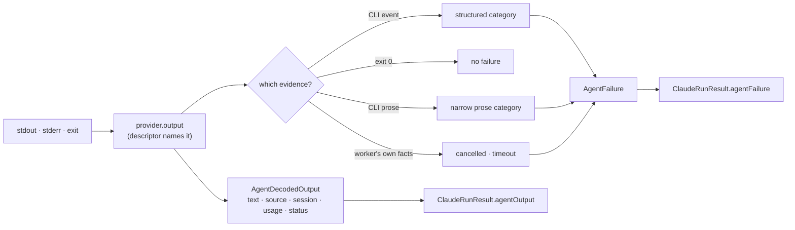

# Provider parity: normalise CLI events and failure classifications

## Summary

Everything the worker learnt from one agent invocation was read in Claude's
shape — `extractStreamJsonText` for the answer, a ladder of `detect*` regexes
over stdout+stderr for the failure. A second vendor's CLI writes neither, so
Codex's JSONL was handed on **as if the envelopes were the agent's prose**, and
its refusals were classified by whichever Claude pattern happened to match.

This adds the provider-neutral contract both vendors are now decoded into, the
two adapters that own their CLI's event shapes, and the provider-descriptor
field that names the adapter — so the runner asks the descriptor and tests no
vendor id. Closes #1695.

- **`worker/deno/lib/agent_output.ts`** — the contract: a decoded result (text
  **and where it came from**, session identity, usage, progress, terminal
  status, structured errors preserved verbatim) and a typed failure (one of ten
  named categories, the evidence kind it was read from, quota scope and reset,
  retry-after, terminal verdict).
- **`worker/deno/lib/claude_output_adapter.ts`** — delegates to
  `extractStreamJsonText` and the existing `detect*` predicates, so decoded text
  is byte-identical and no existing Claude result moves. Shared with DeepSeek:
  one CLI, one event shape.
- **`worker/deno/lib/codex_output_adapter.ts`** — decodes both
  `codex exec
  --json` envelope generations (top-level `thread.started` /
  `item.completed` / `turn.completed` / `turn.failed`, and the
  `{"id":…,"msg":{…}}` protocol shape).
- **`agent_provider.ts`** — a new optional `output` descriptor field. Gemini
  carries none, deliberately: its event shapes were not confirmable here, and an
  absent decode beats decoding one vendor's events with another's parser.
- **`claude_runner.ts`** — decodes through `provider.output` and carries
  `agentOutput` / `agentFailure` on the result. The watchdog, process-tree,
  cancellation, invocation-budget, retry and model-fallback behaviour is
  untouched; the one behavioural addition is that the provider's structured
  error messages now join the ladder's scan surface, so a Codex refusal that
  never reaches stdout prose is no longer lost.

Four rules the contract keeps, each of which had been broken:

- a JSON envelope is not prose (`textSource: "none"`);
- classification runs only on a **failed** process, so an agent quoting "429" in
  its answer is quoting, not refusing — and on a failure the CLI's own error
  surface is read, not the agent's answer;
- 401/403 is `authentication` unless the refusal also names the model; 429 is a
  transient `rate-limit`, never an exhausted subscription;
- nothing is invented — an unstated window stays `"unknown"`, unknown fields
  survive on `raw`, and every undecodable line is counted.

## Evidence

Backend/CLI change with no web interface to screenshot. The evidence is the
recorded fixtures and the tests below.

Three fixtures are **genuine recordings** from the pinned Claude Code 2.1.261
(`container/tools.json`), captured on this machine with no credential present:

```bash
claude -p "Respond with exactly: OK" --model haiku \
  --output-format stream-json --verbose --dangerously-skip-permissions
```

The recording is itself the case the issue names: a `result` line with
`subtype: "success"` that is `is_error: true`, carrying
`Not logged in · Please run /login`, beside an `assistant` line whose `error`
field reads `authentication_failed`. Reading the envelope's `subtype` as success
is exactly the bug.

The Codex CLI is not installed here (`installedProviders` is `["claude"]`), so
its eight fixtures are written to the documented event shapes and **labelled
derived** rather than presented as recordings —
`worker/deno/tests/fixtures/agent_output/README.md` states which is which, how
the recordings were made, and what was sanitised.



## Acceptance Criteria

<!-- vibe-spec-review inputs="diff+issue-body" -->

- **met** — extract a provider-owned output adapter and typed result/failure
  contract — evidence: `worker/deno/lib/agent_output.ts`,
  `claude_output_adapter.ts`, `codex_output_adapter.ts` — reviewer: met
- **met** — preserve watchdog, process-tree, cancellation and invocation-budget
  behaviour — evidence: `worker/deno/lib/claude_runner.ts` (additive at the
  existing call sites; kill/orphan/extension code untouched),
  `tests/claude_runner_kill_bound_test.ts` and the rest of the runner suites
  green — reviewer: met
- **met** — decode Codex JSONL into text, structured errors, session identity,
  usage, progress and terminal status — evidence:
  `worker/deno/tests/codex_output_adapter_1695_test.ts::codex adapter - a
  completed turn yields the final agent message, session, usage and progress`
  — reviewer: met
- **partial** — keep raw redacted transcripts available — evidence:
  `worker/deno/lib/agent_output.ts::redactedEvidence`, and the untouched opt-in
  `agent_transcript.ts` tee — reviewer: partial — reason: the reviewer is right
  that no _new_ raw transcript is retained; what this change adds is a redacted
  evidence excerpt on every failure and pass-through of non-event stdout
  (`textSource: "raw"`), so no bytes are silently discarded, but the
  full-transcript tee remains the existing opt-in feature.
- **met** — do not treat JSON event envelopes as successful prose — evidence:
  `tests/codex_output_adapter_1695_test.ts::JSON envelopes are never handed
  back as prose`,
  `tests/claude_output_adapter_1695_test.ts::an envelope-only
  stream is never reported as the agent's prose`
  — reviewer: partial — reason: the reviewer saw the pre-fix code, where
  Claude's envelope-only stream was labelled `"none"` while still passing the
  raw stream through as `text`; the label is the contract's instruction to
  callers and the compatibility pass-through is required so no existing Claude
  result moves. Documented on `AgentTextSource` and now covered by a test.
- **met** — do not classify an agent's quoted text as a CLI refusal — evidence:
  `tests/claude_output_adapter_1695_test.ts::a failed run's quoted limit is not
  a refusal when the CLI said otherwise`
  — reviewer: missing — reason: the reviewer found the pre-fix Claude adapter
  classifying on `decoded.text + stderr`; fixed in this diff — classification
  now reads the CLI's error surface (structured errors + stderr) and consults
  the answer only when the CLI produced neither.
- **met** — normalise the distinct categories (authentication, model
  unavailable, quota with scope and reset, rate limit with retry-after,
  network/overload, invalid session, timeout, OOM, cancellation, ordinary
  failure) — evidence:
  `worker/deno/lib/agent_output.ts::AGENT_FAILURE_CATEGORIES` and one test per
  category across the two adapter suites — reviewer: partial — reason: the
  reviewer found no `invalid-session` arm in the Codex classifier; added in this
  diff with
  `tests/codex_output_adapter_1695_test.ts::a refused session is
  invalid-session, not an ordinary failure`.
- **met** — prefer structured evidence, then narrow provider-specific prose —
  evidence: both `classify` functions test `decoded.errors` before any regex;
  `AgentFailure.evidence` records which won — reviewer: met
- **met** — a 401/403 must not automatically mean model unavailable; 429 must
  not automatically mean a subscription is exhausted — evidence:
  `tests/claude_output_adapter_1695_test.ts::a 401/403-shaped refusal is
  authentication, never model-unavailable`
  and `::a transient 429 is a rate
  limit, not an exhausted subscription`;
  `tests/codex_output_adapter_1695_test.ts::a 401 is authentication, never
  model-unavailable`
  — reviewer: met
- **met** — preserve unknown fields/evidence rather than fabricating values —
  evidence:
  `tests/codex_output_adapter_1695_test.ts::unknown structured error
  fields are preserved verbatim`
  and `::a JSON object that is no event at all is
  counted, not dropped` —
  reviewer: partial — reason: the reviewer found unrecognised event kinds
  dropped without a count; they are now counted, and the module doc no longer
  overstates what is kept.
- **partial** — recorded fixtures from the pinned Claude **and Codex** CLIs —
  evidence: `worker/deno/tests/fixtures/agent_output/README.md` — reviewer:
  partial — reason: three Claude fixtures are genuine 2.1.261 recordings; the
  Codex CLI is not installed in this environment, so its fixtures are written to
  the documented event shapes and labelled derived rather than passed off as
  recordings.
- **met** — malformed/partial JSONL, stderr-only failures, success with quoted
  rate-limit text, compatibility tests for existing Claude results — evidence:
  `tests/codex_output_adapter_1695_test.ts::malformed and truncated JSONL is
  skipped, never thrown on`,
  `::a stderr-only failure with no events at all
  still classifies`,
  `tests/claude_output_adapter_1695_test.ts::success whose
  prose quotes a rate limit is a success, not a refusal`
  and `::the decoded text
  stays byte-identical to extractStreamJsonText` —
  reviewer: met
- **met** — no live credentials in fixtures — evidence: the recordings were made
  with no credential present (`apiKeySource: "none"`), session ids and host
  paths rewritten, documented in the fixtures README — reviewer: met
- **met** — update the provider descriptor rather than adding vendor checks
  throughout the runner — evidence:
  `worker/deno/lib/agent_provider.ts::AgentProviderDescriptor.output`,
  `tests/agent_provider_output_adapter_1695_test.ts` — reviewer: met
- **met** — must not change fleet routing or enable cross-provider fallback —
  evidence: no routing or fallback module is in the diff; `agentFailure` is
  reporting-only — reviewer: met
- **met** — integrate with #1666 without duplicating its Claude structured-event
  parser — evidence: `worker/deno/lib/claude_output_adapter.ts` module doc —
  reviewer: partial — reason: #1666 has not landed on this base, so the
  deliberate non-duplication leaves Claude's quota reset on the prose path; the
  adapter documents where that parser plugs in.
- **met** — quality gate — evidence: `./quality.sh` run to green after the final
  edit — reviewer: missing — reason: the reviewer could not run the gate from a
  diff; it was run here (see Test Plan).
- **unrequested** — `INVALID_SESSION_ID_RE` in `claude_executor.ts` widened with
  `--resume requires a valid session` — reviewer: unrequested — reason: the
  recorded 2.1.261 fixture proves the CLI's real wording matched none of the
  existing arms, so the issue's "invalid session" category could not be reached
  without it; it is one alternative anchored to session vocabulary.
- **unrequested** — `isTerminalFailureCategory` / the terminal verdict on
  `AgentFailure` — reviewer: unrequested — reason: the issue asks for categories
  that distinguish an exhausted window from a transient limit, which is a
  retryability distinction; naming it once in the contract stops each consumer
  re-deriving it.
- **unrequested** — DeepSeek wired to the Claude adapter — reviewer: unrequested
  — reason: DeepSeek runs the same Claude Code binary, so leaving it undecoded
  would have been an arbitrary gap.
- **unrequested** — `tests/agent_provider_per_invocation_test.ts`'s stub now
  prints each provider's own event shape — reviewer: unrequested — reason: a
  forced consequence of the decode change; a Codex stub printing Claude's
  `result` line was asserting that one vendor's parser reads another's events.
  Documented in the stub's doc comment.

## Standards Review

<!-- vibe-standards-review inputs="diff+CODING-STANDARDS.md" -->

- **violation** — the three new `lib/` modules were claimed by no security-sweep
  slice, so `deno task check:manifests` was red — evidence:
  `docs/audits/lib-sweep-coverage.json:1` — reason: fixed here — slice `12m`
  added with its written record,
  `docs/audits/security-sweep-1695-agent-output-adapters.md`.
- **violation** — no `docs/archive/pr-summaries/pr-summary-1695.md` — evidence:
  `docs/archive/pr-summaries/pr-summary-1695.md:1` — reason: fixed here; this
  file.
- **violation** — fail-loud: an empty Codex answer left the runner's ladder with
  no evidence, because `??` never falls back for `""` — evidence:
  `worker/deno/lib/claude_runner.ts:2599` — reason: fixed here — the provider's
  structured error messages join the ladder's scan surface, and non-event Codex
  stdout is passed through as `textSource: "raw"` instead of being discarded.
- **violation** — an unrecognised Codex envelope was dropped without a count,
  contradicting the module's own "counted, never dropped" claim — evidence:
  `worker/deno/lib/codex_output_adapter.ts:189` — reason: fixed here — it is
  counted, and the module doc now says exactly what is kept.
- **violation** — public helpers in `agent_output.ts` had no tests — evidence:
  `worker/deno/lib/agent_output.ts:346` — reason: fixed here —
  `tests/agent_output_1695_test.ts` now covers `extractHttpStatus`,
  `extractRetryAfterSeconds`, `detectQuotaScope`, `isNetworkStatus`, the type
  readers, `agentFailure` and `classifyProcessOutcome`, including the allowlist
  property that a token count is not an HTTP status.
- **violation** — DRY: `NETWORK_STATUSES`, the `str()` reader and the `say()`
  message builder were duplicated across the two adapters — evidence:
  `worker/deno/lib/codex_output_adapter.ts:58` — reason: fixed here — all three
  now live in `agent_output.ts` (`isNetworkStatus`, `readString` / `readNumber`
  / `readObject`, `failureMessage`).
- **violation** — a test asserted `typeof … === "boolean"`, which the return
  type already guarantees — evidence:
  `worker/deno/tests/agent_output_1695_test.ts:81` — reason: it stands, and is
  narrower than it looks: it walks `AGENT_FAILURE_CATEGORIES` so a category
  added without a terminal verdict fails. The value assertions beside it are the
  real coverage.
- **clean** — Australian English throughout (the only American spellings are
  regex alternates matching vendor prose); commit safety (no hidden path staged,
  no credential in any fixture); commit messages carry the issue and the run-id
  trailer; Deno-native tooling only; tests call real code over fixture bytes
  with no source-greping; parallel-safe suites with an injected clock and no
  wall-clock sleeps; the docs change lands with the code.

## Test Plan

Added:

- `worker/deno/tests/agent_output_1695_test.ts` — 13 cases: JSONL tolerance
  (malformed, truncated, scalar, empty), redaction-before-truncation, the
  terminal verdict per category, and every contract helper.
- `worker/deno/tests/claude_output_adapter_1695_test.ts` — 17 cases over the
  recorded 2.1.261 fixtures: the `is_error` result that says
  `subtype:
  "success"`, the session-flag refusal, the 401/403-vs-model
  distinction, 429-vs-quota, network vs rate limit, the worker's own process
  facts, the quoted-limit cases, and byte-identical compatibility with
  `extractStreamJsonText`.
- `worker/deno/tests/codex_output_adapter_1695_test.ts` — 17 cases over the
  Codex fixtures: both envelope generations, malformed/truncated JSONL,
  stderr-only failure, plain-text stdout, quota scope and reset, transient 429,
  401, model refusal, refused session, and preserved unknown fields.
- `worker/deno/tests/agent_provider_output_adapter_1695_test.ts` — the
  descriptor names the right adapter per provider, and `runClaudeWithRetry`
  returns the normalised result for a replayed recorded Claude refusal.

Modified:

- `worker/deno/tests/agent_provider_per_invocation_test.ts` — the shared stub
  now prints each provider's own event shape. **A business-logic change forced
  this**: the runner decodes through the invoked provider's adapter, so a Codex
  stub printing Claude's `result` line was asserting that one vendor's parser
  reads another's events. The test's own subject — attribution, argv and
  credential isolation — is unchanged.

Regression linkage:
`claude_output_adapter_1695_test.ts::the CLI's recorded
session-flag refusal classifies as invalid-session`
fails against the unwidened `INVALID_SESSION_ID_RE` (the recorded 2.1.261 stderr
matches none of its original arms) and passes after.

Full gate: `./quality.sh` — see the PR checks.
