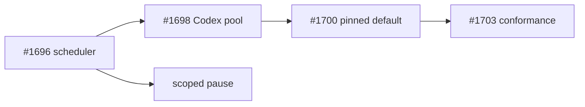

# PR summary — Issues #1696, #1698, #1700, #1703

## Summary

Give every coding-agent provider the same quota ranker, scope a usage
cooldown to the vendor that ran out, rank multiple Codex accounts
without sharing their secrets, and keep cross-provider failover
**opt-in and off** for the production fleet.

Closes #1696.
Closes #1698.
Closes #1700.
Closes #1703.

## What changed

- Shared ranker `provider_quota.ts` (Claude policy + Codex policy).
- Host pause ignores a Claude usage signal when Codex is enabled.
- Claude usage signals now carry `provider: "claude"`.
- Isolated Codex child env; API-key budgets stay unknown.
- `agent_provider_fallback` config key, default empty (pinned).
- Offline conformance suite and `docs/PROVIDER-PARITY.md`.

## Out of scope

Parent #1694 stays open until this lands and the remaining limitations
in the runbook are accepted. Live Codex smoke stays opt-in and off CI.
