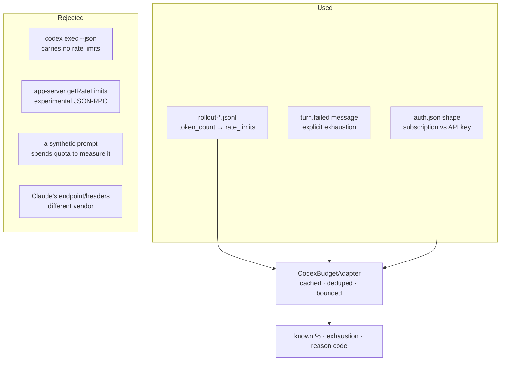

## Summary

Verified what the **pinned** Codex CLI actually exposes about remaining quota —
`openai/codex` at tag `rust-v0.147.0`, the exact release
`container/providers/codex.sh` downloads and checksums against
`container/tools.json` — and built a bounded, read-only budget adapter on the
sources that verification found. Closes #1697.

The headline finding is a negative one: **`codex exec --json` carries no
rate-limit data at all.** Under `--json` the exec front end emits `ThreadEvent`
(`codex-rs/exec/src/exec_events.rs`) — `thread.started`, `turn.*`, `item.*`,
`error` — and there is no `rate_limits` field anywhere in that enum. The
rate-limit-bearing `token_count` event belongs to the internal `EventMsg`
protocol, which `--json` never prints. Parsing the worker's existing Codex
stdout for quota would have found nothing, for ever.

What _does_ carry it is the rollout session file: `should_persist_event_msg`
(`codex-rs/rollout/src/policy.rs`) returns `true` for `EventMsg::TokenCount(_)`,
and those lines land in `$CODEX_HOME/sessions/YYYY/MM/DD/rollout-*.jsonl`. That
is the source the adapter reads, because it is free — the file was already
written by a run the worker already paid for. **There is no probe and none is
possible**: Codex has no zero-output `max_tokens` equivalent, so a probe would have to
run a real turn, spending quota to measure quota.

None of Claude's mechanism was assumed: no OAuth endpoint, no
`anthropic-ratelimit-*` header, no browser cookie, no widened scope, and no
percentage derived from a token count.

### What landed

| File                                     | What                                                                                              |
| ---------------------------------------- | ------------------------------------------------------------------------------------------------- |
| `docs/CODEX-BUDGET-SOURCES.md`           | The verification record: every claim cites the pinned source file, plus what was rejected and why |
| `worker/deno/lib/codex_budget_source.ts` | The verified shapes and their parsers                                                             |
| `worker/deno/lib/codex_auth_mode.ts`     | Subscription login vs API-key billing, reading credential _presence_ only                         |
| `worker/deno/lib/codex_budget.ts`        | The bounded, read-only adapter                                                                    |
| `worker/deno/commands/codex_budget.ts`   | The opt-in redacted live diagnostic                                                               |



### The five facts the issue named

| Fact                       | Exposed?  | Where                                                                                                                                              |
| -------------------------- | --------- | -------------------------------------------------------------------------------------------------------------------------------------------------- |
| Remaining quota            | ✅        | `used_percent`, a percentage `0`–`100`                                                                                                             |
| Window duration            | ✅        | `window_minutes`, and **not** fixed between snapshots                                                                                              |
| Reset time                 | ⚠️ partly | `resets_at` (epoch **seconds**) on a snapshot; unrecoverable from an exhaustion _message_, which the CLI renders in host-local time with no offset |
| Retry-after                | ❌        | `CodexErr::retry_delay` drives the CLI's own retry loop and is never serialised; `ThreadErrorEvent` is `{ message }` only                          |
| Account / credential scope | ✅        | `limit_id`, `limit_name`, `plan_type`; the account is scoped by `CODEX_HOME`, one adapter each                                                     |

## Evidence

Backend/CLI change with no web interface, so no screenshot applies. The evidence
is the test suite, the full quality gate, and the diagnostic's own output.

**Full quality gate: PASSED** (`./quality.sh`, run after the final edit) — all
21 checks green, `config integration` skipped as it is on `main`.

The opt-in diagnostic, run against a throwaway `CODEX_HOME` holding the
subscription fixture:

```text
$ deno run --allow-read --allow-env mod.ts codex-budget --codex-home /tmp/codexhome-smoke
Codex budget snapshot for CODEX_HOME=/tmp/codexhome-smoke
  auth mode: unknown
  source: rollout-token-count
  read at: 2026-09-09T04:34:11.870Z
  captured at: 2026-09-09T01:05:00.000Z
  remaining: 7.5% (secondary window)
  limit id: codex
  plan: pro
  credits: has=true unlimited=false
  primary: 82.0% remaining (used 18%) window=300m resets=2026-09-04T01:00:00.000Z
  secondary: 7.5% remaining (used 92.5%) window=10080m resets=2026-09-08T01:00:00.000Z
```

Metadata only — no token, key, account id, email or credit balance, and the
whole message passes through `redactSecrets`.

**Two honest limitations, both documented rather than papered over.** A bare
`429` is a per-request throttle, not a spent window, so it is recorded as
`transient-rate-limit`. And because the worker provisions Codex with
`OPENAI_API_KEY` (`codex_env.ts`), an API-key credential has no subscription
window at all — against today's provisioning this adapter honestly answers
`api-key-account` every time. A percentage needs a ChatGPT-login `CODEX_HOME`,
which #1698 introduces.

## Acceptance Criteria

<!-- vibe-spec-review inputs="diff+issue-body" -->

- **partial** — Verify the telemetry against official documentation — evidence:
  `docs/CODEX-BUDGET-SOURCES.md` — reviewer: partial — reason: the record cites
  pinned Rust source paths rather than published docs; the reviewer
  independently re-fetched `rust-v0.147.0` and confirmed every shape claim is
  accurate, so the verification is genuine but source-based
- **partial** — Verify against captured, redacted CLI output — evidence:
  `worker/deno/commands/codex_budget.ts`,
  `worker/deno/tests/fixtures/codex_budget/` — reviewer: missing — reason: the
  reviewer is right that no live output was captured — the Codex CLI is not
  installed in this container, a default image being Claude-only — so the
  fixtures are derived field-for-field from the pinned structs (the reviewer
  diffed them against the real `RateLimitSnapshot` and they match). The
  `codex-budget` diagnostic exists precisely to capture the live half against a
  real credential; recorded as `partial` rather than `missing` only because that
  mechanism ships here
- **met** — Distinguish ChatGPT subscription login from API-key billing —
  evidence: `worker/deno/tests/codex_auth_mode_test.ts` — reviewer: met
- **met** — Establish which mechanism exposes quota, window, reset, retry-after
  and scope — evidence: `docs/CODEX-BUDGET-SOURCES.md` "The five facts the issue
  asked about" — reviewer: met
- **met** — No Claude endpoint/headers, no cookies, no broader scopes, no
  percentages fabricated from token counts — evidence:
  `worker/deno/lib/codex_budget_source.ts` "What was rejected" — reviewer: met —
  reason: the reviewer confirmed no `fetch`, no `Deno.Command` and no
  token-count arithmetic anywhere in the diff
- **met** — Bounded, read-only adapter preferring already-received events over
  probes — evidence: `worker/deno/lib/codex_budget.ts` (3 files, 14 day dirs,
  256 KiB tail) — reviewer: met
- **met** — A probe must not consume quota to estimate quota — evidence:
  `worker/deno/lib/codex_budget.ts` — reviewer: met — reason: no network or
  subprocess path exists at all
- **met** — Cache snapshots with timestamps — evidence:
  `CodexBudgetSnapshot.readAt` / `capturedAt` / `evidenceAt` — reviewer: met
- **met** — Deduplicate concurrent refreshes — evidence:
  `worker/deno/tests/codex_budget_test.ts::CodexBudgetAdapter - exhaustion recorded during an in-flight read survives it`
  — reviewer: partial — reason: the reviewer reproduced an in-flight refresh
  clobbering an exhaustion recorded during it; fixed in this diff by `#store`
  evidence ordering, with that reproduction as a regression test
- **met** — Record explicit exhaustion immediately — evidence:
  `worker/deno/tests/codex_budget_test.ts::CodexBudgetAdapter - a later refresh cannot overwrite exhaustion with an older reading`
  — reviewer: partial — reason: the reviewer reproduced the record being lost to
  the next due recheck, and noted the snapshot's own `rate_limit_reached_type`
  was unparsed; both fixed here, the second with
  `::backend-declared exhaustion rides in on the snapshot`
- **met** — Retain unknown/rejected responses with safe reason codes — evidence:
  `worker/deno/lib/codex_budget_source.ts` `CodexBudgetUnknownReason` —
  reviewer: partial — reason: the reviewer found `auth-mode-unknown` dead and
  `no-rate-limit-data` unreachable from the rollout path; the dead code is
  removed and a present-but-malformed `rate_limits` is now retained rather than
  skipped
- **met** — Document the limitation and use exhaustion/reset evidence with
  conservative bounded rechecks — evidence: `docs/CODEX-BUDGET-SOURCES.md` "Two
  honest limitations" — reviewer: partial — reason: the reviewer's objection was
  that the 60s recheck destroyed the exhaustion record, which is the clobbering
  bug now fixed; the recheck bound itself was never in doubt
- **partial** — API-key accounts use their actual rate-limit/billing
  constraints, not a fictional weekly allowance — evidence:
  `worker/deno/lib/codex_budget.ts` api-key branch — reviewer: partial — reason:
  the "no fictional allowance" half is met, but nothing models the _actual_
  per-account limits; the reviewer also showed today's provisioning means the
  adapter always answers `api-key-account`, which is now stated in the doc
  rather than left implicit
- **met** — Fixture-driven tests for the verified response shapes — evidence:
  `worker/deno/tests/fixtures/codex_budget/rollout_chatgpt_subscription.jsonl` —
  reviewer: met
- **met** — Tests for malformed/missing data — evidence:
  `worker/deno/tests/codex_budget_source_test.ts::parseCodexRateLimitSnapshot - missing and malformed data is unknown, never zero`
  — reviewer: met
- **met** — Tests for 429 — evidence:
  `worker/deno/tests/codex_budget_test.ts::CodexBudgetAdapter - a bare 429 is a throttle, not a spent window`
  — reviewer: met
- **partial** — Tests for 401/403 — evidence:
  `worker/deno/tests/codex_budget_test.ts::CodexBudgetAdapter - a rejected credential is auth-rejected, not zero budget`
  — reviewer: partial — reason: the adapter records a rejection correctly but
  nothing _detects_ one in production — wiring `isCodexAuthError` into the run
  path belongs to the executor work of #1695/#1696, so no 403 case is exercised
  here
- **met** — Tests for reset units/timezones — evidence:
  `worker/deno/tests/codex_budget_source_test.ts::parseCodexRateLimitSnapshot - a relative reset is dropped, not fabricated`
  — reviewer: partial — reason: the reviewer found only the upper bound guarded,
  so a relative `3600` became a 1970 reset; a floor and that test were added
  here
- **met** — Tests for stale snapshots — evidence:
  `worker/deno/tests/codex_budget_test.ts::CodexBudgetAdapter - staleness is reported, not silently corrected`
  — reviewer: met
- **met** — Tests for concurrent refreshes — evidence:
  `worker/deno/tests/codex_budget_test.ts::CodexBudgetAdapter - concurrent refreshes share one read`
  — reviewer: met
- **met** — Tests for temporary quota changes — evidence:
  `worker/deno/tests/codex_budget_test.ts::CodexBudgetAdapter - rechecks are bounded by the refresh interval`
  — reviewer: met
- **met** — Tests that no secret values reach logs — evidence:
  `worker/deno/tests/codex_budget_command_test.ts::codex-budget - renders no credential for an API-key account`
  — reviewer: met
- **met** — Small opt-in live diagnostic, redacted metadata only, no credentials
  committed — evidence: `worker/deno/commands/codex_budget.ts` — reviewer: met
- **met** — Quality gate — evidence: full `./quality.sh` run after the final
  edit, 21 checks green — reviewer: partial — reason: the reviewer saw only the
  diff and did not run the gate; it was run here and passed
- **met** — No automatic provider switching — evidence: the only consumer of
  `CodexBudgetAdapter` is `commands/codex_budget.ts` — reviewer: met
- **unrequested** — `docs/audits/security-sweep-1697-codex-budget.md` and the
  `12m` slice in `docs/audits/lib-sweep-coverage.json` — reviewer: unrequested —
  reason: not asked for by the issue, but `tests/lib_sweep_coverage_test.ts`
  fails the build for any unswept `lib/` module, so the gate cannot pass without
  it
- **unrequested** — `README.md` documentation-index row — reviewer: unrequested
  — reason: repo convention that a code change owes a docs change; one line
- **unrequested** — "most constrained window" as the headline
  `remainingFraction` — reviewer: unrequested — reason: the reviewer reads this
  as ranking policy deferred to #1696; kept because `windows` still exposes both
  and a consumer can rank differently without re-reading, and because reporting
  the _primary_ window would understate a nearly-spent weekly one
- **unrequested** — `credits { hasCredits, unlimited }` parsing and rendering —
  reviewer: unrequested — reason: outside the five named facts; kept because a
  credit-depleted account is exhaustion the percentages do not show, and the
  balance is dropped at parse time
- **unrequested** — public `readCount` getter — reviewer: unrequested — reason:
  it is what lets the tests _prove_ deduplication and the recheck bound
  prevented reads rather than assume it; three lines, documented as such

## Standards Review

<!-- vibe-standards-review inputs="diff+CODING-STANDARDS.md" -->

- **violation** — Never fail silently: an unreadable `sessions/` directory was
  reported as `no-session-file` — evidence:
  `worker/deno/lib/codex_budget.ts:139` — reason: fixed here — `entryNames`
  returns `[]` only for `NotFound` and rethrows everything else, which `#read`
  converts to `read-error`; covered by
  `::an unwalkable sessions path fails loud, not as 'no sessions'`
- **violation** — Never fabricate a figure: a transient `429` was recorded as
  `remainingFraction: 0` — evidence: `worker/deno/lib/codex_budget.ts:338` —
  reason: fixed here — it is now `transient-rate-limit`, an honest unknown
- **violation** — DRY: three inline `(name) => Deno.env.get(name)` lambdas
  instead of `processEnvLookup` — evidence:
  `worker/deno/lib/codex_auth_mode.ts:88`,
  `worker/deno/lib/codex_budget.ts:380`,
  `worker/deno/commands/codex_budget.ts:36` — reason: fixed here
- **violation** — DRY: `describeWindow` restated the `CodexBudgetWindow` shape
  inline — evidence: `worker/deno/commands/codex_budget.ts:45` — reason: fixed
  here — the exported type is imported
- **violation** — A code change owes an accurate docs change:
  `auth-mode-unknown` was declared and documented but produced by no code path —
  evidence: `worker/deno/lib/codex_budget_source.ts:136` — reason: fixed here —
  the dead reason code and its doc row are removed
- **violation** — Doc comment did not match behaviour: `read-error` was
  documented as the directory case, which could not reach it — evidence:
  `worker/deno/lib/codex_budget_source.ts:127` — reason: fixed here — the
  directory case now genuinely reaches it
- **violation** — TDD: a test asserted on the command's prose description rather
  than behaviour — evidence:
  `worker/deno/tests/codex_budget_command_test.ts:135` — reason: fixed here —
  replaced with `::codex-budget - reads nothing it was not pointed at`, which
  asserts the read-only claim
- **violation** — Commit safety: a committed literal that the repo's own
  `containsSecret()` returns true for — evidence:
  `worker/deno/tests/codex_budget_command_test.ts:84` — reason: fixed here — the
  value is constructed, matching the existing convention in
  `secret_redaction_redos_test.ts`
- **violation** — KISS: `await Promise.resolve()` filler in two
  otherwise-synchronous test bodies — evidence:
  `worker/deno/tests/codex_budget_test.ts:361,378` — reason: fixed here — the
  callbacks are synchronous
- **violation** — DRY: `readFileTail` resembles `readBuildLogTail` — evidence:
  `worker/deno/lib/codex_budget.ts:199` vs
  `worker/deno/lib/container_build_heal.ts:289` — reason: **stands.** The
  contracts genuinely differ — this one is synchronous, returns `null` instead
  of throwing, and drops the partial first line, which is what makes a JSONL
  tail parseable. Unifying them would mean editing a build-healing module this
  issue does not touch; recorded rather than done
- **violation** — Only what was asked: `recordAuthRejected`, `isStale` and
  `latest` have no production caller — evidence:
  `worker/deno/lib/codex_budget.ts:361` — reason: **stands.** All three are
  named requirements of the issue — "retain unknown/rejected responses with safe
  reason codes", "cache snapshots with timestamps", "stale snapshots" — and the
  consumers are #1696/#1698 by the issue's own "no automatic provider switching"
  clause
- **clean** — Australian English throughout; tests drive real code against real
  temp `CODEX_HOME` trees with no source-grepping; 54 tests in ~120 ms with an
  injected clock, no sleeps and no wall-clock assertions; no
  `Deno.env.set`/`chdir`/module-level mutable state; no hidden or
  credential-shaped paths staged; every commit carries the issue reference and a
  `Vibe-Coder-Run-Id` trailer; Deno-native tooling only; registry, `mod_test`
  count and sweep-ledger registration all complete; `redactSecrets` at the
  outbound sink; file sizes 153–460 lines, one responsibility each

## Test Plan

54 new tests across four suites, all offline and clock-injected:

- `worker/deno/tests/codex_budget_source_test.ts` (24) — the verified snapshot
  shape, most-constrained headline, epoch-seconds conversion and both reset
  bounds, over-consumption clamping, malformed and missing data, secondary-only
  snapshots, credits without the balance, backend-declared exhaustion, rollout
  line parsing, and every exhaustion wording plus the ordinary failures that are
  not exhaustion.
- `worker/deno/tests/codex_budget_test.ts` (20) — newest-line and newest-file
  selection, concurrent-refresh deduplication, the bounded recheck, temporary
  window changes, staleness, the API-key branch, every reason code, the bounded
  tail over a large file, and the four regression tests for the reviewer
  findings: exhaustion surviving a later recheck, exhaustion surviving an
  in-flight read, a genuinely newer rollout line replacing it, and a bare 429 as
  a throttle.
- `worker/deno/tests/codex_auth_mode_test.ts` (7) — env precedence, every
  `auth_mode` spelling, shape fallback, and that no credential value escapes.
- `worker/deno/tests/codex_budget_command_test.ts` (6) — the rendered metadata,
  an honest unknown, no credential for an API-key account, exhaustion without a
  reset guess, `CODEX_HOME` resolution, and that the diagnostic writes nothing.

`worker/deno/tests/mod_test.ts` records the new command (148 → 149).
