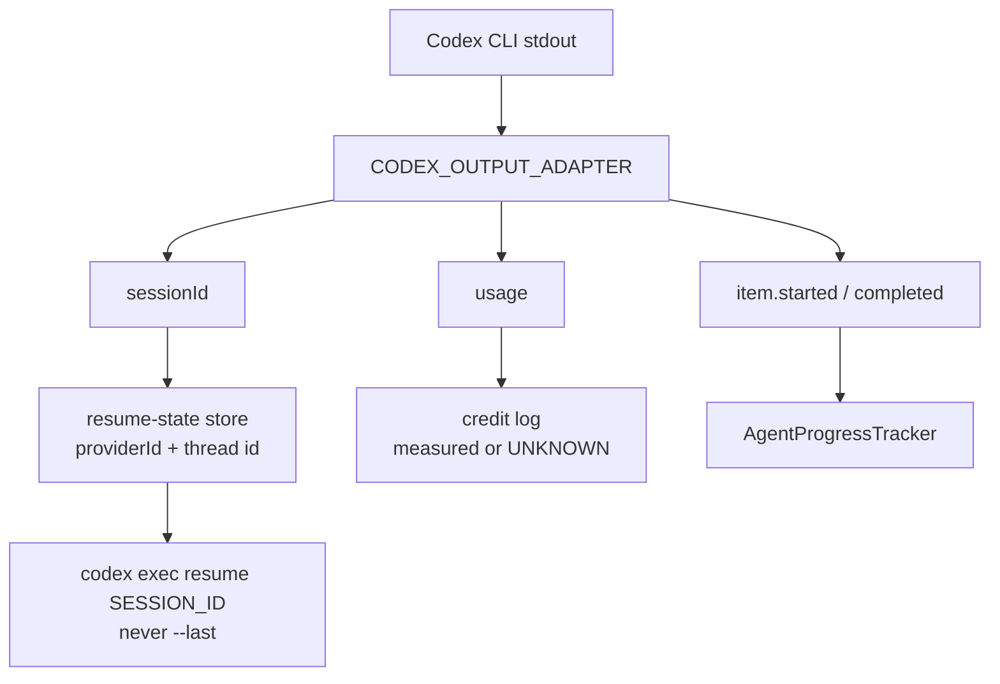

# Codex sessions, usage accounting, and execution parity

## Summary

Three ready children of the CodeX milestone, landed together because they
share the same invocation and resume path. Closes #1699, Closes #1701,
Closes #1702.

`--last` is not safe for unattended concurrent slots: two issues sharing a
working directory would resume each other's Codex threads. The worker now
captures the CLI's own session id from the #1695 adapter, persists it with
provider and credential scope, and resumes with `codex exec resume
<SESSION_ID>`. A Claude UUID is never fed to Codex, and a Codex thread is
never passed as Claude's `--resume`.

Usage, context windows and large-input escalation honour the **selected
provider**. Codex `turn.completed` counts reach the credit log as measured
usage; ChatGPT subscription traffic stays unpriced (conservative upper bound,
never a fabricated API bill, never a silent zero). `summarise` on Codex stays
on `gpt-5-mini` — it is never escalated to Claude aliases such as `sonnet`.

The prompt travels on stdin (`-`), Playwright is wired through Codex's `-c
mcp_servers.*` overrides (no `--mcp-config`), and the progress tracker counts
Codex command/MCP items so progress-aware deadlines see tool activity.

Blocked children (#1696, #1698, #1700, #1703) and the parent (#1694) are
untouched: they wait on the Claude credential pool and on this landing.

## Evidence

Backend/CLI change with no web interface to screenshot. The evidence is the
tests below, `deno task lint`, `deno task check`, and `deno task
check:manifests`.

## Test plan

- [x] First Codex phase is plain `exec`; a later phase with a captured id is
      `exec resume <id>`; `--last` is never emitted.
- [x] Interleaved issues A/B resume their own thread ids.
- [x] A Claude session is dropped at Codex invocation; a Codex thread is
      dropped at Claude invocation.
- [x] A missing capture does not relabel the worker UUID as a Codex thread.
- [x] Codex thread ids (UUID-shaped and not) round-trip with `providerId`.
- [x] Execute phase adopts the captured id and persists it; setup restores
      `providerId` / `credentialScope`.
- [x] Codex JSONL usage is measured; a stream without usage is UNKNOWN, not
      zero.
- [x] `gpt-5-codex` / `gpt-5` / `gpt-5-mini` are unpriced (upper bound) and
      have a 400k context window.
- [x] Codex `summarise` never receives `sonnet` or `haiku`.
- [x] `promptViaStdin` puts `-` last and keeps a 200k prompt off argv.
- [x] Per-invocation spawn tests: Codex argv ends in `-` and the prompt
      is on stdin, not argv, even when Claude is the active provider.
- [x] Playwright JSON becomes `-c mcp_servers.playwright.*`; a missing path
      fails closed.
- [x] Codex `command_execution` items count as tool calls; started+completed
      of the same id counts once.
- [x] Existing Claude session, routing, DeepSeek and Gemini tests stay green.
