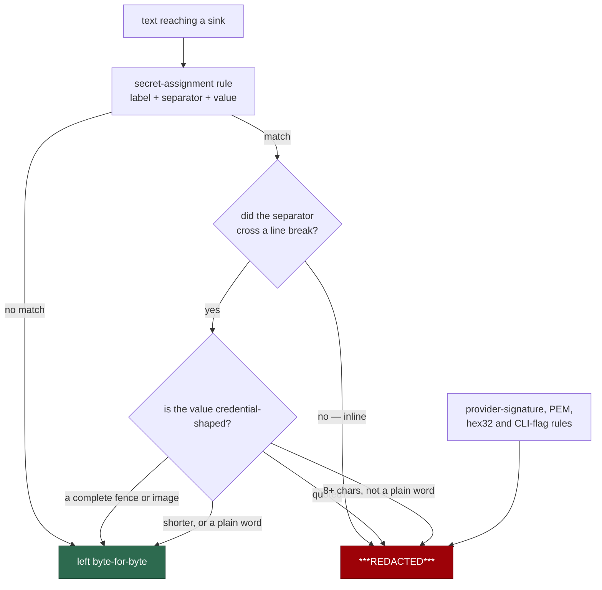

# Judge an assignment's value, so a credential label cannot mask a Markdown fence

## Summary

The `secret-assignment` redaction rule masked the line *after* any prose line
ending in a credential-ish label. Its separator — `["']?\s*[=:]\s*` — spans
line breaks, so a sentence ending in `credential:` adopted the next non-blank
line as the assignment's value. When that line was a Mermaid fence, the fence
itself was published as `***REDACTED***` and the diagram
`CODING-STANDARDS.md` requires stopped rendering in the PR body.

The fix is entirely on the value side, as the issue asks — the label side of
the rule stays as blunt as it was, because it is catching real secrets.
`isCredentialShapedValue(value, sameLine)` runs before the substitution, and
**only judges a value the separator reached across a line break**:

- An **inline** assignment is masked exactly as it always was.
- Across a line break, **complete** Markdown is never a credential: a fence
  line (three or more backticks or tildes plus at most a language tag), or a
  closed inline image. Both match the *whole* value, never a prefix.
- Anything else across a line break needs at least eight characters and a shape
  that is not a single word without a digit, symbol or internal capital.

`containsSecret` asks the same predicate the replacement does, through
`detectsSecretAssignment`, so detection and redaction cannot drift apart.

Closes #1727.

## Evidence

Backend-only change to a pure string function; there is no web interface to
screenshot. The evidence is the reproduction below, the tests, and the full
`./quality.sh` gate: **PASSED** (20,008 tests, 0 failed; every check passed,
`config integration` skipped as it always is locally).

Observed against the unfixed code (`worker/deno/lib/secret_redaction.ts` at
`064b2da`), driving `redactSecrets` with the Issue #1726 body:

```text
How a spawn or a mid-run switch now picks a credential:

***REDACTED***
flowchart TD
    A[Pool] --> B[Selected credential]
```

and the prose variant, `"How a spawn picks a credential:\n\n***REDACTED*** pool
ranks every candidate.\n"`. After the fix both are returned byte-for-byte
unchanged, and `containsSecret` on the Mermaid body goes from `true` to `false`.

Where the judgement sits in the pass:



The signature rules are independent of this predicate, so a provider-prefixed
token on the line after a label is still masked — the fence beside it survives.

## Reproduction

- **symptom** — a PR body whose lead-in sentence ended in `credential:` had the
  Mermaid fence on the next line published as `***REDACTED***`, so the diagram
  did not render; the committed `pr-summary-1685.md` was unaffected
- **status** — `verified` — the regression tests were observed failing against
  the unfixed code at `064b2da` (fence replaced by the placeholder,
  `containsSecret` returning `true`, and the prose variant losing its first
  word) and passing after the fix
- **regression test** —
  `worker/deno/tests/secret_redaction_markdown_1727_test.ts::Issue #1727 - a credential lead-in keeps its Mermaid fence`

## Adversarial review of the first cut

The first cut of this change was reviewed by an independent agent given only
the diff, with one instruction: find a secret that *was* masked and no longer
is. It found five, all now fixed and each pinned by a test:

| Finding | Fix |
|---|---|
| Excluding a Markdown **prefix** on **any** line turned the chokepoint off — `AWS_SECRET_ACCESS_KEY: ` + fence + a 40-character key was published verbatim | The exclusion matches a **complete** fence or image, and is consulted only across a line break |
| An unbounded plain-word test read any all-letters value as prose however long — `correcthorsebatterystaple` escaped | The word test is length-bounded at 15 characters |
| The emphasis strip's unanchored `[*_]+$` was quadratic and reachable from an issue body: 160 KB cost **10.7 s** on the worker's only thread | Bounded to at most three markers; 512 KB now costs 4.6 ms |
| Detecting by running **every** rule's `replace` and comparing silently narrowed `pem-body-block`, whose callback legitimately returns its input unchanged | Only the assignment rule consults its value predicate; the rest keep their pattern scan |
| The length floor ran on the emphasis-stripped scalar, so `**hunter7**` fell under it | The floor is measured on the whole value |

The review also confirmed clean: no `lastIndex` carry-over in the rewritten
detection, and no super-linearity in the other three new patterns.

## Coverage traded, stated plainly

The rule now masks strictly less, so the cost is named rather than buried, and
it is **one rule**: a credential shorter than eight characters, or one whose
emphasis-stripped value is a single lower-case word, sitting alone on the line
**after** its label. `worker/deno/tests/secret_redaction_markdown_1727_test.ts::Issue #1727 - the accepted cost is one rule, and it is only this`
pins it so it cannot widen unnoticed.

An inline assignment is masked exactly as before, a quoted value of any length
is masked, and a credential in that position carrying a provider prefix is
masked by its own signature rule. A floor of six was tried and put back to
eight: it masked the opening of every sentence that began with an inline-code
span, which is the same class of defect as the fence this issue is about.
`SECURITY.md` records the trade-off.

## Test Plan

- Added `worker/deno/tests/secret_redaction_markdown_1727_test.ts` — 17 tests
  driving the public chokepoints (`redactSecrets`, `redactGhBodyText`,
  `redactGhBodyArgs`, `containsSecret`) plus the predicate's own boundaries:
  - the Issue #1726 Mermaid body survives every chokepoint byte-for-byte;
  - seven label spellings × three gaps (including CRLF) keep the fence;
  - ten Markdown shapes and seven prose sentences after a trailing label
    survive redaction;
  - **a fence must not smuggle a secret**, inline or across a line break — six
    inline and three cross-line shapes carrying an AWS key, an ImgBB key or a
    short password stay masked;
  - a lower-case passphrase, a capitalised one, a YAML continuation and a
    30-character run stay masked;
  - the exclusion does not reach legitimate password characters — backtick-,
    `#`-, `>`- and `|`-carrying inline values stay masked;
  - inline assignments, including `secret_scanning: enabled` and
    `PASSWORD=12345`, are masked exactly as before;
  - the decode-then-rescan pass keeps the same verdicts, including the
    non-uniform PEM body run whose replacement returns its input unchanged;
  - detection carries no `lastIndex` between calls;
  - the accepted cost is exactly the one rule above.
- Added two behavioural super-linearity regressions to
  `worker/deno/tests/secret_redaction_redos_test.ts` (its documented
  convention: no stopwatch — feed 512 KB of the adversarial shape and assert
  the output, because a quadratic strip does not overrun a budget, it does not
  return). No existing test in that file was changed.
- Re-ran the 192 existing tests across the redaction suite — all pass
  unmodified. **No existing test was changed, commented out or removed.**
- Measured `containsSecret` throughput old vs new on a 140 KB input, with and
  without a secret present: 6.23 → 5.26 ms/call and 5.70 → 4.37 ms/call.

## Notes for the reviewer

- The interrupted earlier session on this branch had also reformatted unrelated
  parts of `secret_redaction.ts` and reworded doc comments it did not touch.
  Those edits are reverted; the net diff to that file is the predicate, the
  named assignment pattern, the rule's `replace` callback, and the detection
  split.
- The predicate lives in `secret_redaction.ts` rather than its own module
  because a new `worker/deno/lib/` module must be claimed by a slice in the
  chunk-12 security-sweep ledger (`docs/audits/lib-sweep-coverage.json`), and
  no sweep has read this code — claiming it would record a sweep that never
  happened.
