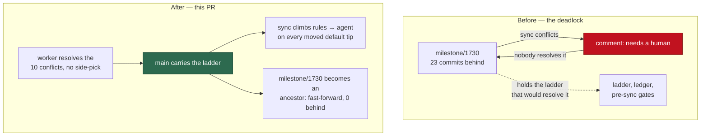

## Summary

Merges `milestone/1730-resolve-merge-conflicts-without-humans-sync` into `main`,
landing the fifteen closed children of this milestone (#1766–#1780) on the
default branch. Closes #1730.

The milestone branch had drifted 23 commits behind `main` and could no longer
merge: the periodic sync posted a "needs a human — both sides prepared" comment
on this issue at 01:00, 02:06, 03:51 and 04:47 UTC and stopped there. The fix
for that class of conflict — the ladder, the attempt ledger, the pre-sync gates
— was itself trapped on the branch that could not merge, so the fleet went on
escalating conflicts it now knows how to resolve. This merge breaks that
deadlock: the ten conflicts were resolved here, by the worker, without a human
side-pick, which is the behaviour the issue asks for.

**What lands on `main`**

| Behaviour | Child |
| --- | --- |
| Conflict budget of 3, with a persisted per-branch attempt ledger | #1766 |
| The merge-conflict agent runner takes a branch target, not only a PR | #1767 |
| Deterministic "both inserted, nothing deleted → keep both" rule | #1768 |
| Milestone escalations comment on an existing issue; no diagnostic issue is ever filed | #1769 |
| Merged-PR sweeps honour a roll-back marker | #1770 |
| Roll-back mechanics: revert the merged children that touch the conflicting files, newest first | #1771 |
| A ruleset-refused push spends no attempt; milestone heads are left to the sync | #1772 |
| PR abandon rung closes the PR and reopens an issue it may not re-label | #1773 |
| Every PR pass re-reads live PR state before claiming | #1774 |
| Milestone child runs skip the dependency bump | #1775 |
| Every milestone branch syncs on every cycle in which the default tip moved | #1776 |
| Milestone sync climbs the ladder before any escalation | #1777 |
| Sync conflicts are charged to the branch ledger | #1778 |
| No child PR merges into a milestone branch that is behind | #1779 |
| The child run syncs the milestone branch inline and defers when it cannot | #1780 |

**How each conflict was resolved** — no side was picked on the strength of being
"ours" or "theirs"; each was decided on what the two sides mean.

| File | Resolution |
| --- | --- |
| `docs/RELEASE-NOTES.md`, `docs/GH-API-OPTIMISATION.md`, `docs/audits/lib-sweep-coverage.json` | Append-only ledgers — both sides kept |
| `worker/deno/lib/auto_merge_sweep.ts` | Both kept: `main`'s #1800 draft skip runs first, then the milestone's #1774 live-state read |
| `worker/deno/lib/milestone_branch_sync.ts` | The milestone's ladder is the successor of `main`'s per-conflict escalation and already carries `main`'s #1786 conflict-keyed dedup, so it stands. `main`'s #1488 closed-issue gate goes because #1776 deleted the question it answered |
| five test files | Follow their modules |

Three ledger repairs this merge owes: the deleted `milestone_activity_gate.ts`
claim is dropped, the nine modules the milestone adds are claimed (its own
top-up slices renumbered `12q`–`12u` clear of `main`'s `12m`–`12p`, with each
sweep record restated to match), and the invalidation-table row naming the
deleted module is removed. `docs/RELEASE-NOTES.md` gains the migration line for
the `milestone_sync_cooldown_seconds` key #1776 retires.

## Evidence

Backend/worker change — no web interface to screenshot. The evidence is the gate
and the suites.

- `./quality.sh < /dev/null` — **PASSED** (21 checks; `config integration`
  skipped as it always is outside a configured host). Includes `deno tests`,
  `deno lint`, `deno type check`, `deno fmt`, `semgrep`, `markdownlint`,
  `mermaid`, and every chokepoint check.
- `deno task test:unit` — passed, parallel and serial passes.
- `deno test tests/lib_sweep_coverage_test.ts` — 22 passed, which is what proves
  the audit ledger repair above is real and not just plausible.

The deadlock this merge breaks:

## Acceptance Criteria

The issue states its criteria under **"### Accepted scope so far"**; each bullet
is one criterion below. Verdicts are the Spec reviewer's, which saw the diff and
the issue body and nothing of this run's reasoning.

<!-- vibe-spec-review inputs="diff+issue-body" -->

- **met** — Periodic sync runs every cycle in which the default tip moved; the hourly cooldown and the closed-issue gate are removed — evidence: `worker/deno/lib/milestone_branch_sync.ts:641` (`shouldSyncMilestone`), `worker/deno/lib/milestone_default_tip.ts:78`, `worker/deno/tests/milestone_sync_cadence_test.ts` — reviewer: met
- **partial** — Milestone sync climbs the PR pass's ladder — dependency rules, then the agent, then roll-back — before any escalation — evidence: `worker/deno/lib/milestone_conflict_ladder.ts:226` (`climbConflictLadder`), `worker/deno/lib/run_core_production_deps.ts:4621` — reviewer: partial — reason: rungs 2 and 3 are wired; the roll-back rung is the open child #1781, so `deps.rollbackFn` is unset in production and `defaultRollbackFn` logs instead
- **partial** — A merge conflict never produces `needs-human` or a diagnostic issue while an automatic rung remains — evidence: `worker/deno/lib/milestone_branch_sync.ts:1158` (per-conflict escalation removed), `:1108` — reviewer: partial — reason: nothing is posted while attempts remain, but the stated observable — escalation text naming why roll-back itself was impossible — arrives with #1781; today exhaustion is a per-cycle WARNING and no post
- **met** — No new diagnostic issue is ever filed for a milestone sync failure — evidence: `worker/deno/lib/milestone_branch_sync.ts:1284` and `:1352` (`escalateToExistingIssue`), `:1372` (`escalateMergeGateFailure`) — reviewer: met
- **partial** — Sync before new work: no child branch is cut, and no child PR merges, while the milestone branch is behind — evidence: `worker/deno/lib/phases/setup_branch_phase.ts:347`, `worker/deno/lib/pr_auto_merge.ts:465` (`requireSyncedBase: true`) — reviewer: partial — reason: the reviewer found `worker/deno/lib/direct_merge.ts:737` calls `decideMilestoneBaseMerge` without `requireSyncedBase`, so `pr_manager` and `pr_maintenance` are not opted in; that gap is #1779's, unchanged by this merge, and is recorded here rather than widened
- **met** — The child's run performs the sync inline, one attempt on the shared budget, and defers with `deferred: milestone behind default branch` — evidence: `worker/deno/lib/milestone_presync.ts:76` (`MILESTONE_BEHIND_DEFER_REASON`), `worker/deno/tests/setup_branch_presync_test.ts` — reviewer: met
- **partial** — Roll-back of a stuck branch: revert the touching children newest-first, keep history, reopen and re-queue only those children, close their PRs — evidence: `worker/deno/lib/milestone_rollback.ts:645` (`executeRollback`), `worker/deno/tests/milestone_rollback_test.ts` — reviewer: partial — reason: #1771 landed the git half and its tests; the issue half and the call site are #1781, which is open
- **missing** — A reverted child with no re-appliable pickup label is still reopened and listed in the roll-back comment — reviewer: missing — reason: #1781 is the child that lands it; `buildRollbackMarker` has readers but no production writer yet
- **met** — Budget of 3 concluded attempts for both ladders; disrupted attempts not charged; not reset by a moved default tip — evidence: `worker/deno/lib/pr_merge_conflict_scan.ts:112` (`DEFAULT_MAX_CONFLICT_ATTEMPTS = 3`), `worker/deno/lib/milestone_sync_streak.ts:37`, `:432` (`resetConflictLedgerOnSuccess`) — reviewer: met
- **met** — "Stuck" counts conflict failures only; a gate failure keeps today's `needs-human` — evidence: `worker/deno/lib/milestone_branch_sync.ts:418` (`judgeSyncFailure`), `:1372` — reviewer: met
- **met** — A ruleset-rejected push spends no attempt; a GRQ#4702-shaped summary PR lands through the sync-PR fall-back — evidence: `worker/deno/lib/pr_merge_conflict_processor.ts:1397` (`withdrawRulesetRefusedAttempt`), `worker/deno/lib/milestone_sync_pr.ts:47` — reviewer: met — reason: the reviewer notes the second half is met by substitution — the PR ladder stands down on `milestone/**` heads and the sync's own fall-back lands it, rather than the ladder learning the fall-back
- **missing** — Branch stuck with nothing left to roll back: one comment plus `needs-human` on the parent planning issue, reopened, else the oldest open child — reviewer: missing — reason: `NOTHING_LEFT_REASON` exists with no consumer; the consumer is #1781
- **met** — PR abandon rung when the issue carries no pickup label the worker may re-apply: close the PR, reopen the issue, name it — evidence: `worker/deno/lib/conflict_abandon_restart.ts:322` (`abandoned-unlabelled`), `:366` — reviewer: met
- **met** — Every PR pass re-reads live PR state before claiming and skips a closed or merged PR — evidence: `worker/deno/lib/pr_live_state.ts:113` (`skipped: PR closed`), `worker/deno/lib/pr_ci_processor.ts:369`, `worker/deno/lib/auto_merge_sweep.ts:217` — reviewer: met
- **unrequested** — Deterministic "both inserted, nothing deleted → keep both" rule, registered fleet-wide — evidence: `worker/deno/lib/both_inserted_conflict_rule.ts`, `worker/deno/lib/dependency_conflict_apply.ts:52` — reviewer: unrequested — reason: the reviewer read only the issue body, where this sits under "Open questions"; it was answered and landed as closed child #1768, so it is traceable to this issue through its milestone rather than being creep this run added
- **unrequested** — The dependency bump is skipped on every milestone child run — evidence: `worker/deno/lib/phases/bump_deps_phase.ts:437` — reviewer: unrequested — reason: same shape — an Open Question in the body, answered and landed as closed child #1775
- **unrequested** — The merge-conflict PR pass stands down on every `milestone/**` head — evidence: `worker/deno/lib/pr_merge_conflict_processor.ts:665` — reviewer: unrequested — reason: landed as closed child #1772, which the issue's "Related open issues" section anticipates; kept, because the sync is the pass that owns a milestone head
- **unrequested** — A `milestone-behind` skip reason filtering all five discovery tiers — evidence: `worker/deno/lib/find_oldest_issue.ts:403-417` — reviewer: unrequested — reason: landed as closed child #1780's pacing half; it stops a behind milestone's issues being claimed at all, which is the same intent as the bullet, applied one step earlier
- **unrequested** — `rollbacks?: number` on the streak ledger with no writer — evidence: `worker/deno/lib/milestone_sync_streak.ts:123` — reviewer: unrequested — reason: the field is #1781's seam, declared by #1778; #1781 is the open child that writes it
- **unrequested** — A process-global 60 s memo of the milestone-vs-default compare — evidence: `worker/deno/lib/milestone_children_gate.ts` (`MILESTONE_BEHIND_MEMO_TTL_MS`) — reviewer: unrequested — reason: landed as closed child #1779, which needed the compare not to cost one API call per child PR per cycle

## Standards Review

<!-- vibe-standards-review inputs="diff+CODING-STANDARDS.md" -->

- **violation** — A Code Change Owes a Docs Change: the chunk renumber changed the JSON ledger but not the five sweep records its `ledger` field points at — evidence: `docs/audits/lib-sweep-coverage.json:1201` against `docs/audits/security-sweep-1767-merge-conflict-agent.md:4` — reason: fixed here in `0ea7086`; the `12q` gap is closed and each record's chunk id, predecessor and "claimed by" line restated to match the ledger
- **violation** — Each renumbered entry's `definition` stated a predecessor range contradicting its new position — evidence: `docs/audits/lib-sweep-coverage.json:1204`, `:1216`, `:1228`, `:1240`, `:1252` — reason: fixed in the same commit; the chain now reads `12q` after `12p`, `12r` after `12q`, and so on
- **violation** — `bindMilestoneConflictAgent` is exported with a decision branch and no test file of its own; the returned closure's body is never executed — evidence: `worker/deno/lib/milestone_conflict_agent_binding.ts:50`, uncovered body at `:54`–`:75` — reason: it stands. The module arrived with closed child #1777 and is not something this merge authored; adding its suite is a change to #1777's code, which this run has no mandate to make, and the reviewer measured 100% function coverage — the closure is constructed by the wiring, only never invoked in a test
- **violation** — No `docs/archive/pr-summaries/pr-summary-1730.md` existed for a merge that closes #1730 — evidence: `docs/archive/pr-summaries/` held 1766–1780 and no 1730 — reason: fixed — this file
- **clean** — Australian English on every added line (the only `color` hits are Mermaid `style` attributes); commit safety — no dot-prefixed path, `.pem`, `.key`, `credentials.json` or `service-account*` in the staged set; no commented-out, skipped or ignored tests, net +222 `Deno.test`, and the four files with removals are documented renames or signature-driven rewrites; the twelve new suites call real code, none greps source text; no `Deno.env.set` / `Deno.chdir` / `setTimeout` added to any test; fail-loud at every new catch site; DRY (`unionIsWellFormed` imported, not duplicated); no `as any`, `@ts-ignore` or lint suppressions; no leftover conflict markers outside deliberate fixtures; `deno task check:manifests` 633 passed / 0 failed

## Test Plan

No new behaviour is introduced by this merge, so no new test is written for it —
the deliverable is the resolution of ten conflicts, and the suites the two sides
each brought are what verify it. Both sides' cases survive:

- `worker/deno/tests/milestone_branch_sync_test.ts` — the milestone's #1776
  cadence cases and #1769 escalation cases together.
- `worker/deno/tests/auto_merge_sweep_test.ts` — `main`'s #1800 draft-skip cases
  and the milestone's #1774 live-state cases together, which is what proves the
  keep-both resolution of `auto_merge_sweep.ts` is real.
- `worker/deno/tests/pr_auto_merge_test.ts` — `main`'s #1800/#1763 cases beside
  the milestone's #1779 behind-base cases; 113 passed across the five conflicted
  suites.
- `worker/deno/tests/milestone_sync_conflict_analysis_escalation_test.ts`,
  `worker/deno/tests/milestone_sync_escalation_reachable_1465_test.ts` — the
  #1778 budget contract that replaced the per-conflict comment.
- `worker/deno/tests/lib_sweep_coverage_test.ts` — 22 passed; the case that
  fails on a module claimed twice, claimed by nobody, or claimed after deletion
  is what caught the first attempt at the ledger resolution and what verifies
  the repair.

**Still open after this PR:** #1781 wires `executeRollback` into the sync and
posts the roll-back notice. Until it lands, an exhausted budget is a per-cycle
WARNING naming the branch and the spent attempts, and nothing is posted to any
issue — which is the intermediate state #1778 designed and documented.
