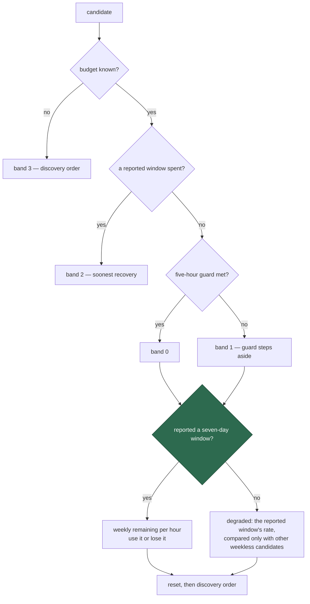

## Summary

A Claude credential whose probe omitted the seven-day header outranked healthy
credentials, because `rankingView` fell back from the absent weekly window to
`windows[0]` and `compareCandidates` then read that **five-hour**
`remaining / hours-to-reset` straight against genuine **weekly** rates. The two
describe different windows: 60% of five hours resetting in four is `15%/h`
against a real week's `0.35%/h`, so the least-measured subscription looked
roughly forty times the more urgent and kept winning.

Ranking now carries `hasSevenDayTelemetry` and compares it **inside** the
existing band, after exhaustion and the five-hour soft guard, so a missing week
never becomes a third eligibility gate. A credential without one is
degraded-but-usable: when a whole band lacks the window those candidates are
ranked against each other on the same-scale window they did report, and nothing
about the gap is remembered, so the next probe that carries a week ranks
normally again. Closes #1731.



The green node is the new comparison; every band above it is unchanged from
#1685.

## Evidence

Backend/CLI only — the ranking is a pure function and a log line, with no web
interface to screenshot. The evidence is the test output and the decision log
the tests pin.

Before the fix, the issue's own example selected the wrong credential
(`rankClaudeTokenBudgets` on the unfixed code):

```text
[SECURITY] claude token candidate provider (#1): five_hour=60.0% resets=2026-09-09T04:00:00.000Z seven_day=absent rate=15.00%/h guard=pass
[SECURITY] claude token candidate provider-2 (#2): five_hour=70.0% resets=2026-09-09T04:00:00.000Z seven_day=50.0% resets=2026-09-15T00:00:00.000Z rate=0.35%/h guard=pass
[SECURITY] claude token selected provider (#1) of 2: highest-remaining-per-hour rate=15.00%/h remaining=60.0% resets=2026-09-09T04:00:00.000Z
```

After it, the measured week leads and the reason names why:

```text
[SECURITY] claude token selected provider-2 (#2) of 2: seven-day-telemetry-preferred rate=0.35%/h remaining=50.0% resets=2026-09-15T00:00:00.000Z
```

Full gate: `./quality.sh` → `Result: PASSED (with skipped checks)` (only
`config integration`, which is skipped on every run here).

## Reproduction

- **symptom** — a credential whose probe carried no seven-day header was
  selected ahead of a usable credential with known weekly quota, because its
  five-hour rate was the larger number
- **status** — `verified` — the matrix row was observed failing against the
  unfixed code (winner `provider`, the weekless credential, exactly as the
  issue describes) and passing after the fix
- **regression test** —
  `worker/deno/tests/claude_pool_seven_day_telemetry_1731_test.ts::claude pool telemetry quality - a known week beats a missing one whose five-hour rate is far larger (Issue #1731)`

## Acceptance Criteria

<!-- vibe-spec-review inputs="diff+issue-body" -->

- **met** — a usable credential with known seven-day telemetry beats an otherwise-usable one with no seven-day window, however much larger its five-hour rate — evidence: `worker/deno/lib/claude_token_selection.ts` (`compareCandidates`), `worker/deno/tests/claude_pool_seven_day_telemetry_1731_test.ts::a known week beats a missing one whose five-hour rate is far larger` — reviewer: met
- **met** — two credentials that both have seven-day telemetry still rank solely by the #1685 weekly urgency policy — evidence: `worker/deno/tests/claude_pool_seven_day_telemetry_1731_test.ts::two credentials with weekly telemetry still rank on weekly urgency`, and the whole #1685/#1686 suite unchanged and green — reviewer: met
- **met** — with every usable candidate lacking seven-day telemetry exactly one is still selected and the worker does not idle — evidence: `…1731_test.ts::with no weekly telemetry anywhere the pool still selects, on the same-scale window`, asserted through `ClaudeCredentialPool.selectEligible` — reviewer: met
- **met** — the all-missing fallback compares like-for-like windows only and is deterministic — evidence: `…1731_test.ts::the degraded fallback is deterministic and total` (forward and reversed discovery order, reset tie-break, discovery tie-break) — reviewer: met
- **met** — the guard is applied before the telemetry tie-break, in both directions — evidence: `…1731_test.ts::the five-hour guard is applied before the telemetry tie-break`, `::a missing week under the guard stays behind a known week above it`, `::at the guard's boundary the band decides, not the telemetry gap` — reviewer: met — reason: the reviewer noted the boundary rows did not cross the exact 20% figure; the boundary row was added in response
- **met** — an explicitly exhausted credential remains unavailable regardless of telemetry — evidence: `…1731_test.ts::an exhausted credential with weekly telemetry loses to a usable one without it` — reviewer: met
- **met** — a later snapshot containing seven-day data immediately restores normal weekly ranking, with no history-based penalty — evidence: `…1731_test.ts::a later snapshot with a week restores normal ranking, with no lingering penalty`; `hasSevenDayTelemetry` is derived per call in `rankingView`, so no state exists to persist — reviewer: met
- **met** — missing five-hour data keeps its documented #1686 behaviour and is not conflated with missing seven-day data — evidence: `…1731_test.ts::a missing five-hour window is not conflated with a missing week`; `meetsFiveHourGuard` is unchanged — reviewer: met
- **met** — table-driven tests cover known-vs-missing, all-missing, mixed four-credential pools, guard boundaries, exhaustion and stable ties — evidence: the ten-row `MATRIX` in `…1731_test.ts`, plus the four standalone cases below it — reviewer: met
- **met** — quality gate passes — evidence: `./quality.sh` run after the final edit — reviewer: met
- **unrequested** — two new reason codes, `seven-day-telemetry-preferred` and `no-seven-day-telemetry-degraded-fallback`, with their rows in the `docs/SETUP.md` table — reviewer: unrequested — reason: kept; without them the winner of a telemetry-decided comparison would still log `highest-remaining-per-hour`, which after this change is untrue, and an operator would have no way to see the pool running on five-hour figures alone
- **unrequested** — the degraded code takes precedence over `below-five-hour-guard-highest-remaining-per-hour` when a below-guard winner also lacks a week — reviewer: unrequested — reason: kept; the guard fact still shows in every candidate line (`guard=below`) and in the winner's `five_hour=` detail, while the telemetry gap has no other surface
- **unrequested** — a below-guard winner level on rate and reset now reports `tied-discovery-order` rather than the guard code — reviewer: unrequested — reason: kept as the coherent "name the last discriminator applied" rule, and pinned by a new test (`claude_token_selection_test.ts::a below-guard winner level on every figure names the tie-break that decided it`) so it is no longer untested behaviour
- **unrequested** — `worker/deno/tests/support/claude_pool_fixtures.ts`, and the #1686 matrix suite rewired onto it — reviewer: unrequested — reason: the new suite would otherwise duplicate ~125 lines of the #1686 harness verbatim, which the standards review flagged as a DRY breach

## Standards Review

<!-- vibe-standards-review inputs="diff+CODING-STANDARDS.md" -->

- **violation** — `docs/archive/pr-summaries/pr-summary-1731.md` absent — evidence: commit `8197518` — reason: fixed here; this file is it
- **violation** — the `no-seven-day-telemetry-degraded-fallback` row described a state the code does not produce ("no candidate *beside the winner*"), and the guard row was stale for a below-guard winner without a week — evidence: `docs/SETUP.md:934`, `docs/SETUP.md:931` — reason: fixed here; both rows now state what `winningReason` returns
- **violation** — no test pinned a below-guard winner that itself lacks a week, the one branch where the two new signals collide — evidence: `worker/deno/tests/claude_pool_seven_day_telemetry_1731_test.ts` — reason: fixed here; the row `a below-guard pool with no weekly telemetry anywhere still runs` covers it
- **violation** — ~125 lines of matrix harness duplicated between the #1686 and #1731 suites — evidence: `worker/deno/tests/claude_pool_seven_day_telemetry_1731_test.ts:52-177` against `claude_pool_policy_matrix_1686_test.ts:70-208` — reason: fixed here; both now import `tests/support/claude_pool_fixtures.ts`
- **violation** — a flipped test kept a name teaching the old rule — evidence: `worker/deno/tests/claude_token_selection_test.ts:187` — reason: fixed here; renamed to say the comparison is only between figures describing the same window
- **clean** — Australian English throughout; no hidden paths staged; run-id trailer on both commits; fail-loud (a missing week is a named, logged, degraded-but-usable state, never a silent exclusion); tests call real code on both surfaces with injected clock, discovery and fetch; `@std/assert`, `deno fmt`/`lint`/`check` clean; every other doc surface grepped for the ranking prose and the reason codes

## Test Plan

Added `worker/deno/tests/claude_pool_seven_day_telemetry_1731_test.ts` — a
ten-row table asserted on both policy surfaces (`rankClaudeTokenBudgets` and
`ClaudeCredentialPool.selectEligible`), plus standalone cases for the ranking
view, the deterministic degraded fallback, the no-memory recovery and the
decision log.

Added `worker/deno/tests/support/claude_pool_fixtures.ts`, the shared snapshot
harness both policy suites now build their rows from.

Modified, deliberately, because the policy they recorded is the policy this
issue changes:

- `claude_pool_policy_matrix_1686_test.ts` — the case that recorded the scale
  mismatch "NOT endorsed, so the fix flips a test deliberately" now asserts the
  corrected order, the new reason code, and that the weekless credential is
  still a usable candidate;
- `claude_token_selection_test.ts` — the #1623 mixed-window ranking case (its
  fixtures compare a five-hour rate with a weekly one, which is exactly what is
  now forbidden), and three reason-code assertions on all-five-hour fixtures.
  One test was added: the below-guard tie-break reason.

No test was removed, disabled or weakened.
