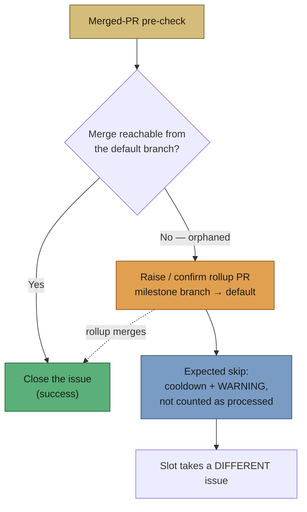

# PR Summary — Issue #175

## Summary

The merged-PR pre-check refused to close GRQ#4173 because its PR merged into
`milestone/4168-…` **after** that milestone's rollup PR had merged into
`Develop` — the merge commit never reached `Develop`, so the work was orphaned
(Issue #4396's landing check working as designed). The refusal was then
reported as a **success**, so the scan forgot the issue immediately and both
pool slots re-claimed it every ~2.5 minutes — 13 times in the first 40 minutes
of one run — while no rollup PR was ever raised and every bounce was counted in
`WORKER_SUMMARY` as a processed issue.

This change closes the loop at both ends. **Closes #175.**

1. **Self-heal (defect 1).** New
   `worker/deno/lib/orphaned_rollup.ts` raises a fresh rollup PR
   (`milestone/<n>-… → <default>`) when the milestone branch is ahead of the
   default branch. It is idempotent (an already-open rollup PR for the branch
   is reported, never duplicated), raises nothing when the branch is not ahead,
   and validates repo/branch names against the existing argument allowlist
   before any `gh` call. Once the rollup lands, the merge commit becomes
   reachable and the ordinary close-on-merge path closes the issue — no human
   action.
2. **A refused pre-check is a bounce, not a success (defect 2).**
   `ensureIssueClosedIfPrMerged` now hands the landing verdict back
   structurally (`CloseIfMergedResult.unlanded`) instead of only a prose
   `reason`. The pre-check acts on it: self-heal, log the refusal **and** the
   self-heal outcome at `WARNING` naming the cooldown, then return
   `early_exit` with the new `expectedSkip` flag. `workOnIssue` reports
   `success: false, expectedSkip: true` with a `no_pr_expected` outcome, and
   `isExpectedSkipResult` (new, in `issue_worker_types.ts`) routes it down the
   main loop's existing **skip** path: retry cooldown recorded, claim released,
   no failure tracking, no circuit-breaker counting, and no
   `WORKER_SUMMARY` processed-issue increment (defect 3 / acceptance 3).
3. **Pool starvation (defect 3).** The cooldown state is file-backed, shared
   across slots and re-read on every `findNextIssue`, so once one slot bounces
   an issue the sibling slot no longer sees it as a candidate — the pool moves
   on to other work instead of both slots livelocking on the same issue.

A repair that fails is reported loudly in the `WARNING` line (`rollup repair
FAILED — …`); no failure path returns a quiet "nothing to do".

### Deliberately not changed

The claim-release comment still omits the outcome on the skip path, matching
the existing behaviour for claim-rejection skips. The `WARNING` line carries
the full explanation, which is what acceptance criterion 2 asks for.

## Evidence

Backend/CLI change — no web interface to screenshot. Verified by unit tests
that call the real functions with injected `gh` doubles and assert on the
commands issued and the results returned.

Before → after, for the exact GRQ#4173 shape (`tests/issue_worker_test.ts`
drives the real `verifyMergeLanded` against a gh double reproducing rollup
#4195 merging at 08:29Z and the child PR at 18:02Z):

| | Before | After |
| --- | --- | --- |
| `workOnIssue` result | `success: true` | `success: false`, `expectedSkip: true` |
| Rollup PR | never raised | raised in the same cycle |
| Cooldown | none — re-claimed in ~2.5 min | base retry cooldown recorded |
| `WORKER_SUMMARY` | counted as processed | not counted |
| Failure tracking | — | still untouched (a bounce is not a fault) |

## Test Plan

New:

- `worker/deno/tests/orphaned_rollup_test.ts` (10 tests) — raises the rollup
  PR with the right `--head`/`--base`/body; idempotent when one is already
  open; an unrelated open PR does not count as the rollup; `nothing-to-merge`
  when the branch is not ahead; `not-applicable` for a non-milestone base; a
  failed create **and** a failed lookup are both reported as `failed` (never
  "create anyway"); an out-of-allowlist branch name is refused before any `gh`
  call; the default branch is resolved when the caller supplies none.
- `worker/deno/tests/expected_skip_result_test.ts` (4 tests) —
  `isExpectedSkipResult` classifies a phase-declared bounce and the existing
  claim rejections as skips, and a genuine failure (or a success) as not.

Extended:

- `worker/deno/tests/merged_pr_precheck_phase_test.ts` — four new tests
  driving the real landing check: an orphaned merge returns
  `expectedSkip: true` with the `merged_pr_did_not_land` reason, does not close
  the issue, and warns naming the cooldown; it raises a fresh rollup PR; an
  existing open rollup PR is not duplicated; a landed merge still takes the
  ordinary success early-exit and raises no rollup PR.
- `worker/deno/tests/issue_worker_test.ts` — orchestrator-level regression for
  the GRQ#4173 shape: `phase: merged_pr_precheck`, `success: false`,
  `expectedSkip: true`, outcome `no_pr_expected`.
- `worker/deno/tests/run_core_test.ts` — a skip records exactly one cooldown,
  records no failure, and reports `issues_processed = 0`.
- `worker/deno/tests/issue_lifecycle_test.ts` — the existing "did not land"
  test now also asserts the structural `unlanded` verdict is returned.

No existing tests were removed or commented out.

`./quality.sh` passes every gate except `deno tests`, which reports 10
failures in `fleet_health_test.ts`, `host_workdir_guard_test.ts`,
`optional_feature_env_test.ts` and `setup_workdir_reminder_test.ts`. All 10
are **pre-existing and environment-dependent** — they fail identically on a
stashed clean tree on this host and touch nothing this change goes near.
Everything else is green: 14,684 tests passed, lint, type check and fmt all
PASSED.

Docs updated: `docs/workflows/issue-processing.md`
(→ Orphaned milestone merge) and `DESIGN-PRINCIPLES.md`
(→ A refused pre-check is a bounce, never a success), both with the Mermaid
flow above.

## Pre-PR Security Self-Check

- **Input validation** — repo and branch names are checked against the
  existing `REPO_PATTERN` / `BRANCH_PATTERN` allowlists before any `gh` call.
- **Secrets** — none added; no hidden files staged.
- **Injection surface** — all `gh` calls pass argument arrays (no shell string
  concatenation); the branch name reaches `--head`/`--base` only after the
  allowlist check.
- **Output encoding** — the rollup PR body is Markdown written to a `--body`
  argument; the branch name is fenced in backticks.
- **Authorisation** — the repair writes only to the issue's own repository, so
  the per-run write-repo allowlist (Issue #3311) already covers it.
- **Error handling** — every failure returns a reason string for the worker
  log; no stack traces or paths are posted to GitHub.
- **Dependencies** — none added.
