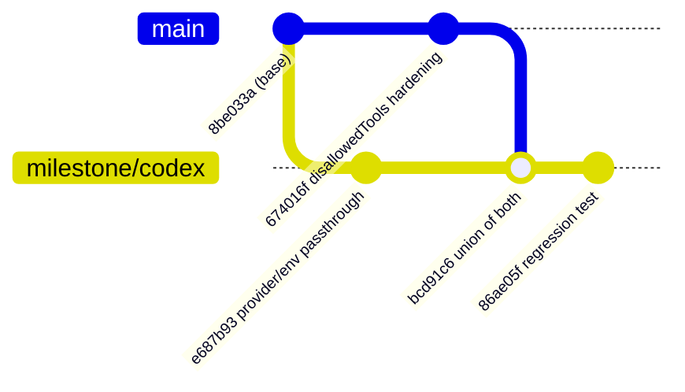

## Summary

Resolved the escalated `main` → `milestone/codex` sync conflict with a real
merge, landed through the sanctioned door: `sync/milestone-codex` →
**[PR #1760](https://github.com/stSoftwareAU/VibeCoder/pull/1760)** into
`milestone/codex`. Closes #1754.

The escalation asked a human to choose between "two designs for the same
problem". They were not two designs — both conflicted files were a **union**:

- `worker/deno/lib/claude_runner.ts` — one conflicted hunk, inside
  `summariseLargeContent`'s `runner({ … })` call. `main` added the Issue #1607
  hardening (`disallowedTools: [...SUMMARISE_DISALLOWED_TOOLS]`);
  `milestone/codex` added the Issue #1701 per-invocation `agentProvider` / `env`
  passthrough, so a Codex worker never escalates to a Claude model alias. The
  two are independent properties of the same call, so the resolution keeps both.
  The triage classified it `rival-designs` because `SUMMARISE_DISALLOWED_TOOLS`
  appears in one export list and not the other — which is what any purely
  additive export looks like.
- `docs/RELEASE-NOTES.md` — `main` added two rows and the milestone side added
  none, so both sides' rows are kept.

The merge is against `main`'s current tip `674016f`, not the `69c1e76` this
issue names, so it also settles the same conflict reported as #1756.

This branch carries the documentation only. The resolution itself cannot land on
`main` — the Issue #1701 provider passthrough exists only on `milestone/codex` —
so it is in PR #1760 against that branch, where the fleet's own
`sync/milestone-*` handling merges it as a **merge commit** rather than a
squash, preserving the ancestry a later rollup needs.

## Evidence

Backend-only change; there is no web interface to screenshot.

- `./quality.sh` on the merged tree — **PASSED** (all checks;
  `config
  integration` skipped as it always is). Run from
  `/home/vibe/auto-issue-work/sync-1754`, a worktree at the merge result.
- The new regression test was observed **red against each single-sided
  resolution** and green against the union:

  | Resolution taken                             | `claude_runner_test.ts --filter "Issue #1754"` |
  | -------------------------------------------- | ---------------------------------------------- |
  | milestone side alone (`disallowedTools: []`) | `FAILED \| 0 passed \| 1 failed`               |
  | `main` side alone (no `agentProvider`/`env`) | `FAILED \| 0 passed \| 1 failed`               |
  | union (what PR #1760 lands)                  | `ok \| 45 passed \| 0 failed`                  |

## Test Plan

Both tests live on `sync/milestone-codex` (PR #1760), because the behaviour they
cover exists only on `milestone/codex`:

- Added
  `worker/deno/tests/claude_runner_test.ts::summariseLargeContent - keeps
  both the restricted tool set and the per-invocation provider (Issue #1754)`
  — asserts `disallowedTools`, `agentProvider` and `env` on one stubbed runner
  call, so dropping either half of the merge is red.
- Existing `worker/deno/tests/claude_runner_test.ts` — 45 passed, 0 failed.
- Full `./quality.sh` on the merged tree — PASSED.
