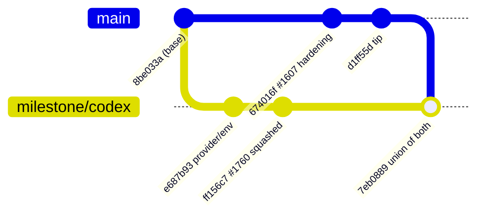

## Summary

Resolved the escalated `main` → `milestone/codex` sync conflict with a real
merge, landed through the sanctioned door: `sync/milestone-codex` →
**[PR #1782](https://github.com/stSoftwareAU/VibeCoder/pull/1782)** into
`milestone/codex`. Closes #1756.

The escalation asked a human to choose between "two designs for the same
problem". They were not two designs — both conflicted hunks were a **union**,
and the `main` side of each was *empty*, so the resolution drops nothing:

- `worker/deno/lib/claude_runner.ts` — one hunk inside `summariseLargeContent`'s
  `runner({ … })` call. `main`'s Issue #1607 hardening
  (`disallowedTools: [...SUMMARISE_DISALLOWED_TOOLS]`) auto-merged cleanly; the
  branch's Issue #1701 per-invocation `agentProvider` / `env` passthrough is
  kept beside it, so a Codex worker still never escalates to a Claude model
  alias. The triage classified it `rival-designs` because
  `SUMMARISE_DISALLOWED_TOOLS` appears in one export list and not the other —
  which is what any purely additive export looks like.
- `worker/deno/tests/claude_runner_test.ts` — keeps the Issue #1754 regression
  test that pins both halves of that call. This file was not conflicted when
  #1756 was filed; it became conflicted because #1754's resolution squashed
  onto `milestone/codex`.

The merge is against `main`'s current tip `d1ff55d`, not the `674016f` this
issue names.

This branch carries the documentation only. The resolution itself cannot land on
`main` — the Issue #1701 provider passthrough exists only on `milestone/codex` —
so it is in PR #1782 against that branch.

### Root cause of the recurrence — filed as #1783

#1756 is #1754 again, and #1754 was #1744, #1713 and #1709 before it. The
resolutions were never wrong; the merge base never moves. `milestone_sync_pr.ts`
is explicit (Issue #1048) that a sync must land as a **merge commit**, and
`armSyncPrAutoMerge` arms `--merge` — but this repository answers:

```console
$ gh api repos/stSoftwareAU/VibeCoder --jq '{allow_merge_commit,allow_squash_merge}'
{"allow_merge_commit":false,"allow_squash_merge":true}
```

so the `squashedSyncWarning` fallback is taken on every cycle. PR #1760's merge
commit `ff156c7` has a **single parent**, and
`git merge-base --is-ancestor origin/main origin/milestone/codex` is still false
after it merged. The remedy is a repository setting the fleet must not change
for itself, so it is filed as **#1783** for a human — not fixed here.

**Confirmed during this run.** PR #1782 was pushed as a genuine merge commit
with both parents and merged while this summary was being written — and GitHub
squashed it, discarding the second parent:

```console
$ git log --format="%H %P %s" -1 origin/milestone/codex
52a6531… ff156c7… Sync main into milestone/codex (#1782)     # one parent

$ git merge-tree --write-tree --name-only origin/milestone/codex origin/main
CONFLICT (content): Merge conflict in worker/deno/lib/claude_runner.ts
CONFLICT (content): Merge conflict in worker/deno/tests/claude_runner_test.ts
```

The next sync re-conflicts on the same two files. The resolution below is
correct and complete; the recurrence is #1783's to stop.

## Evidence

Backend-only change; there is no web interface to screenshot.

- `./quality.sh` on the merged tree — **PASSED** (20,167 tests passed, 0 failed;
  `config integration` skipped as it always is). Run from
  `/home/vibe/auto-issue-work/sync-1756`, a worktree at the merge result.

  A first run from a worktree under `/tmp` reported 2 failures in
  `tests/cache_secret_redaction_1261_test.ts` (`expected a work-volume
  directory, got a shared-tmp path`). That is the checkout location, not the
  merge: the same tree outside `/tmp` passes.
- The Issue #1754 regression test was observed **red against the single-sided
  resolution** and green against the union:

  | Resolution taken                                        | `claude_runner_test.ts --filter "Issue #1754"` |
  | ------------------------------------------------------- | ---------------------------------------------- |
  | `main` side alone (no `agentProvider` / `env`)          | `FAILED \| 0 passed \| 1 failed`               |
  | union (what PR #1782 lands)                             | `ok \| 8 passed \| 0 failed`                   |

- The merge commit has **both** parents, which is the whole point:

  ```console
  $ git log --format="%H %P %s" -1
  7eb0889… ff156c7… d1ff55d… Merge branch 'main' into milestone/codex (Issue #1756)
  ```



## Test Plan

The tests covering the merged behaviour live on `sync/milestone-codex`
(PR #1782), because the behaviour they cover exists only on `milestone/codex`:

- Carried through the merge:
  `worker/deno/tests/claude_runner_test.ts::summariseLargeContent - keeps both
  the restricted tool set and the per-invocation provider (Issue #1754)` —
  asserts `disallowedTools`, `agentProvider` and `env` on one stubbed runner
  call, so dropping either half of the merge is red. Verified red against the
  `main`-only resolution before the union was committed.
- `worker/deno/tests/claude_runner_test.ts` — 8 `summariseLargeContent` tests
  passed, 0 failed.
- Full `./quality.sh` on the merged tree — PASSED.

No test was added on this branch: it carries the PR summary only, and the
behaviour under test does not exist on `main`.
