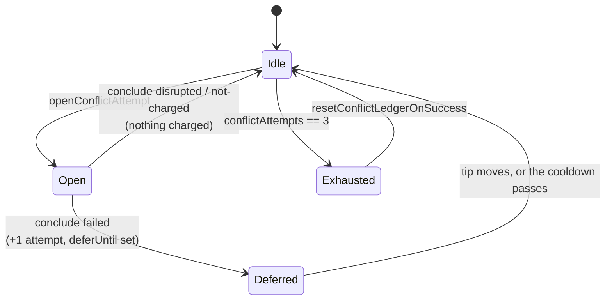

# Raise the merge-conflict budget to 3 and give milestone branches a persisted attempt ledger

## Summary

`DEFAULT_MAX_CONFLICT_ATTEMPTS` goes from 2 to 3, so a conflicting PR gets the
first attempt and **two** judged retries against a base that has moved on since
before the abandon rung runs. Milestone branches gain the per-branch conflict
ledger that spends the same constant: `milestone_sync_streak.ts` exports
`MILESTONE_CONFLICT_ATTEMPT_BUDGET = DEFAULT_MAX_CONFLICT_ATTEMPTS` — one
constant, two consumers — plus the pure helpers that open, conclude, pace and
reset an attempt, persisted in `milestone_sync_failures.json` so a milestone
branch's attempts survive worker restarts. Charging the ledger from the sync
pass is Issue #1778's job; this change is the state and the rules it obeys.

Closes #1766.

Attempt charging, in one picture:

## Evidence

Backend/CLI change with no web interface to screenshot. The evidence is the
test suite and the full gate:

- `./quality.sh < /dev/null` → **PASSED** (all checks; `config integration`
  skipped as it is on this host).
- `deno test tests/milestone_sync_streak_test.ts` → 16 passed, 0 failed.
- `deno test tests/*conflict*_test.ts tests/milestone*_test.ts` → 958 passed,
  0 failed.

Two defects found by the independent Spec reviewer were fixed in commit
`72f78af` before this summary was written:

- `recordDefaultSha` dropped the cooldown on its **first** call, because an
  entry with no `lastSyncedDefaultSha` read as "the tip moved" against the very
  tip the failure ran on — exactly the 30-second re-attempt loop the deferral
  exists to prevent.
- An unparseable `deferUntil` was dropped at load time, so corruption read as
  "no cooldown applies" on disk while being refused in memory. It is now
  refused in both places, and the next tip move clears it.

## Acceptance Criteria

<!-- vibe-spec-review inputs="diff+issue-body" -->

- **met** — A PR conflict thread with 2 concluded failures is attempted a third time; the third failure runs the abandon rung — evidence: `worker/deno/lib/pr_merge_conflict_scan.ts` (`DEFAULT_MAX_CONFLICT_ATTEMPTS = 3`), `worker/deno/tests/pr_merge_conflict_scan_test.ts::findConflictingPr - two concluded failures still buy a third attempt (Issue #1766)` and `worker/deno/tests/pr_merge_conflict_processor_test.ts::processMergeConflict - the third attempt is the one that abandons (Issue #1766)` — reviewer: met
- **met** — A ledger entry with 3 concluded failures reports exhausted; one with 2 failures and an open, unconcluded attempt does not — evidence: `worker/deno/tests/milestone_sync_streak_test.ts::conflict ledger - exhaustion counts concluded failures only (Issue #1766)` — reviewer: met
- **met** — A failed attempt on SHA X is not due again on SHA X until `deferUntil`; it is due immediately on SHA Y — evidence: `worker/deno/tests/milestone_sync_streak_test.ts::conflict ledger - a failure defers the same tip and not a moved one (Issue #1766)` — reviewer: met — reason: the reviewer also found the adjacent case wrong (an uncharged conclusion on a moved tip kept pacing against the old tip, and the first `recordDefaultSha` call dropped the cooldown outright); both are fixed in `72f78af` and covered by `conflict ledger - an uncharged conclusion on a moved tip clears the deferral (Issue #1766)`
- **met** — Changing `lastSyncedDefaultSha` leaves `conflictAttempts` unchanged; `resetConflictLedgerOnSuccess` zeroes it and clears `deferUntil` — evidence: `worker/deno/tests/milestone_sync_streak_test.ts::conflict ledger - a moved tip clears the deferral but not the count (Issue #1766)` and `::conflict ledger - only success zeroes the ledger (Issue #1766)` — reviewer: met
- **met** — A pre-change `milestone_sync_failures.json` loads without error and reads as zero attempts — evidence: `worker/deno/tests/milestone_sync_streak_test.ts::conflict ledger - a pre-change streak file loads as zero attempts (Issue #1766)` — reviewer: met
- **met** — `./quality.sh < /dev/null` passes — evidence: full gate run after the final edit, `Result: PASSED` — reviewer: missing — reason: the reviewer ran the gate against the first commit, where `deno fmt` was red on two test files; `deno fmt` was applied and the gate re-run green here
- **unrequested** — `recordDefaultSha`, a sixth exported helper beyond the five the issue lists — evidence: `worker/deno/lib/milestone_sync_streak.ts` — reviewer: unrequested — reason: it is the mechanism for the issue's own stated rule that `deferUntil` is "cleared when the default tip moves"; there is no other way to express that rule as a pure helper
- **unrequested** — the loader validates and discards malformed *present* ledger fields (a non-numeric `conflictAttempts`, an `outcome` outside the three) rather than only tolerating missing ones — evidence: `worker/deno/lib/milestone_sync_streak.ts` (`readConflictLedger`) — reviewer: unrequested — reason: `SyncStreakEntry` is read from disk into typed code, so a malformed value would otherwise flow into the budget arithmetic as `NaN`
- **unrequested** — a Mermaid state diagram in the `docs/INTERNALS.md` section — evidence: `docs/INTERNALS.md` — reviewer: unrequested — reason: the repo's documentation standard asks for a diagram where it aids understanding of state transitions, which is exactly what the ledger is
- **unrequested** — `docs/workflows/merge-conflicts.md` updated to the budget of 3 — evidence: `docs/workflows/merge-conflicts.md` — reviewer: unrequested — reason: "A Code Change Owes a Docs Change"; that doc stated the old budget as present-tense fact in five places

## Standards Review

<!-- vibe-standards-review inputs="diff+CODING-STANDARDS.md" -->

- **violation** — `recordDefaultSha` discarded the cooldown on a branch's first conflict, defeating the pacing its own comment promised — evidence: `worker/deno/lib/milestone_sync_streak.ts` (`clearDeferralIfTipMoved`) — reason: fixed in `72f78af`; only a tip seen before can be observed to have moved, and the unmoved-tip case is now asserted in `conflict ledger - a moved tip clears the deferral but not the count (Issue #1766)`
- **violation** — the test for the unmoved-tip case masked that bug with a `?? "sha-x"` fallback and never asserted `deferUntil` — evidence: `worker/deno/tests/milestone_sync_streak_test.ts` — reason: fixed in `72f78af`; the test now pins the tip explicitly and asserts the cooldown still runs
- **violation** — `deno fmt --check` was red on two test files, so the gate failed — evidence: `worker/deno/tests/milestone_sync_streak_test.ts`, `worker/deno/tests/pr_merge_conflict_processor_test.ts` — reason: fixed; `deno fmt` applied and the full gate re-run green
- **violation** — the budget change was not propagated to `docs/workflows/merge-conflicts.md`, which stated "at most **2 concluded attempts**" in five places — evidence: `docs/workflows/merge-conflicts.md` — reason: fixed in `72f78af`; the two genuine historical quotes (`attempt 1 of 2` in the NEAT-AI-core#637 and GRQ#4408 narratives) are left as quotes and annotated
- **violation** — a malformed `conflictAttempts` silently read as an unspent budget, the permissive direction on a safety bound — evidence: `worker/deno/lib/milestone_sync_streak.ts` (`readConflictLedger`) — reason: stands, deliberately, for the *count*: the issue requires missing fields to read as zero, and a branch that cannot be shown to have spent anything must not be refused an attempt. The permissive direction on the *deferral* was the real fault and is fixed — a corrupt `deferUntil` is now kept and refused rather than dropped. The rejection branches are covered by `conflict ledger - a malformed ledger field is never trusted (Issue #1766)`
- **violation** — the docs asserted a live milestone bound that no production path yet spends — evidence: `docs/MERGE.md`, `docs/INTERNALS.md` — reason: fixed in `72f78af`; both now say the ledger and helpers land here and Issue #1778 wires the sync pass to charge them
- **violation** — `rollbacks` is a declared field nothing writes — evidence: `worker/deno/lib/milestone_sync_streak.ts` — reason: stands; the issue names it explicitly in the ledger schema, and Issue #1781 (milestone roll-backs) is the writer. Persisting the whole schema in one change is what keeps the state file's shape from migrating twice
- **violation** — the ledger helpers are not called from `milestone_branch_sync.ts` — evidence: `worker/deno/lib/milestone_sync_streak.ts` — reason: stands; this issue is scoped to the state and the pure helpers, and Issue #1778 ("Charge milestone sync conflicts to the branch ledger") is the sibling that spends them. Wiring here would be the scope creep the Change Scope rule forbids
- **clean** — Australian English throughout code, comments, tests and docs; no hidden path staged; every test calls the real functions and asserts on returned state (no source-grepping); no wall-clock sleeps or absolute timing thresholds — every test takes an injected `nowMs`; no existing test removed or weakened; the single-constant re-export keeps the two ladders' budgets from drifting, and the test fixtures were retargeted at the constant rather than at a new literal; `deno lint`, `deno check`, markdownlint and mermaid all clean

## Test Plan

Added to `worker/deno/tests/milestone_sync_streak_test.ts` (16 tests in the file, 10 new):

- the budget equals the PR ladder's and is 3
- only a concluded failure is charged — opening, `disrupted` and `not-charged` all spend nothing
- exhaustion counts concluded failures only; 2 failures plus an open attempt is not exhausted
- a failure defers the same tip and not a moved one, in both directions
- a moved tip clears the deferral but never the count, including the first recording of a tip
- an uncharged conclusion on a moved tip clears the deferral; on the same tip it does not
- only `resetConflictLedgerOnSuccess` zeroes the ledger; `rollbacks` and the last-attempt record survive
- a pre-change `milestone_sync_failures.json` loads and reads as zero attempts
- a malformed ledger field is never trusted (bad count, bad outcome, corrupt deferral)
- a full ledger — open marker and live deferral included — survives a save/load round trip
- a corrupt `deferUntil` holds the branch back rather than forward

Added to the PR ladder's suites:

- `pr_merge_conflict_scan_test.ts::findConflictingPr - two concluded failures still buy a third attempt (Issue #1766)`
- `pr_merge_conflict_processor_test.ts::processMergeConflict - the third attempt is the one that abandons (Issue #1766)`
- `pr_merge_conflict_processor_test.ts::processMergeConflict - the second failure neither escalates nor abandons (Issue #1766)`

Modified (retargeted at `DEFAULT_MAX_CONFLICT_ATTEMPTS` instead of a literal 2, so the fixtures track the budget): `pr_merge_conflict_scan_test.ts` (new `concludedFailures` helper, `exhaustedComments`), `pr_merge_conflict_processor_test.ts`, `merge_conflict_intent_processor_test.ts`, `conflict_abandon_restart_test.ts`. No test was removed or disabled.
