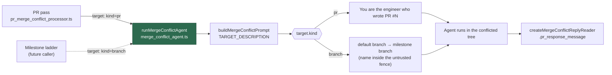

## Summary

`runResolutionAgent` and its prompt build were private to
`pr_merge_conflict_processor.ts`, and `buildMergeConflictPrompt` assumed a PR
number, so the milestone ladder could not run the rung the PR pass climbs. Both
now live in `worker/deno/lib/merge_conflict_agent.ts` behind a target that is
either a pull request or a bare branch pair, under the same both-sides-survive
contract. Closes #1767.

- **`runMergeConflictAgent({ repo, target, baseBranch, conflictedFiles,
  issueContext, workDir, timeouts, promptsDir, … })`**
  — builds the prompt, runs the injected agent runner, and reports what the run
  left behind. Every failure is returned with its cause named; a worker-ended
  run is reported as `terminated` rather than judged (Issue #1693), exactly as
  before.
- **`createMergeConflictReplyReader(workDir)`** — the memoised
  `.pr_response_message` read, so both targets consume the reply the same way.
- **`prompts/merge_conflict/prompt.md`** — the PR opening is now
  `{{TARGET_DESCRIPTION}}`: rendered verbatim as today for a PR, and as the
  default branch being merged into a fenced milestone branch name for a branch
  target. The contract, both carve-outs and the worked examples are unchanged.
- **The milestone branch name is fenced exactly as the base branch is** — both
  are chosen on GitHub, so both render only inside this run's untrusted
  boundary, and the integrity instruction names both.
- `pr_merge_conflict_processor.ts` is a thin caller: it keeps every merge,
  guard, attempt-accounting and escalation decision and delegates only the agent
  run.

## Evidence

Backend/CLI change with no web interface to screenshot. The evidence is the test
suites below plus a full `./quality.sh < /dev/null` run, which passed
(`deno tests`, `deno lint`, `deno type check`, `deno fmt`, semgrep,
markdownlint, completeness checks — `config integration` skipped as it always is
locally).

## Acceptance Criteria

<!-- vibe-spec-review inputs="diff+issue-body" -->

- **met** — `pr_merge_conflict_processor_test.ts` passes with only import-path
  changes — evidence: the test file is untouched by the diff and
  `deno test -A worker/deno/tests/pr_merge_conflict_processor_test.ts` reports
  38 passed — reviewer: met
- **met** — a branch-target prompt renders with no PR number, both branch names
  inside untrusted fences, and no unrendered `{{...}}` placeholder — evidence:
  `worker/deno/tests/merge_conflict_agent_test.ts::merge conflict agent - a branch target renders with no PR number`,
  `::both branch names render inside the untrusted fence and nowhere else`,
  `::a branch target leaves no unrendered placeholder` — reviewer: met
- **met** — `merge_conflict_prompt_v2_test.ts` and
  `merge_conflict_prompt_fence_1377_test.ts` pass — evidence: both suites green
  (24 tests); the only edits are `prNumber: "4321"` →
  `target: { kind: "pr", prNumber: 4321 }` and the `PR_NUMBER` →
  `TARGET_DESCRIPTION` placeholder assertion, which the issue's own prompt
  change requires — reviewer: met
- **met** — `./quality.sh < /dev/null` passes — evidence: full gate run after
  the final edit, `Result: PASSED` (`config integration` SKIPPED as it always is
  locally) — reviewer: met
- **unrequested** — `docs/audits/lib-sweep-coverage.json` slice `12m` and
  `docs/audits/security-sweep-1767-merge-conflict-agent.md` — reviewer:
  unrequested — reason: the repo's own completeness gate
  (`lib_sweep_coverage_test.ts`) fails on a `lib/` module claimed by no sweep
  slice, and the ledger refuses a slice whose written record does not name the
  module, so a new module cannot land without both
- **unrequested** — the 6-line entry for the new module in
  `docs/workflows/merge-conflicts.md` — reviewer: unrequested — reason: "a code
  change owes a docs change" — that file's further-reading index lists every
  module in this subsystem
- **unrequested** — `prompts/merge_conflict/prompt.md`: the sentence after the
  opening now reads "a merge of the base into **that branch**" rather than "into
  **the PR branch**" — reviewer: unrequested — reason: the opening became
  target-neutral, so the sentence that refers back to it had to; it is one noun
  phrase and the contract, carve-outs and worked examples are untouched
- **unrequested** — the boundary-integrity instruction names "the base and
  milestone branch names" for a branch target — reviewer: unrequested — reason:
  the instruction must name every fenced block, and a branch target fences one
  more value than a PR target
- **unrequested** — `DEFAULT_CONFLICT_AGENT_TIMEOUT` / `…_NO_OUTPUT_TIMEOUT` /
  `…_RATE_LIMIT_RETRIES` are exported rather than module-private — reviewer:
  unrequested — reason: they moved out of the processor with the runner, and the
  milestone caller needs to name the same bounds; the values are unchanged

## Standards Review

<!-- vibe-standards-review inputs="diff+CODING-STANDARDS.md" -->

- **violation** — the `MergeConflictPromptOptions` doc comment was orphaned by
  the new type inserted above the interface — evidence:
  `worker/deno/lib/prompt_builder.ts:2072` — reason: fixed here in commit
  `a181e6d`; the comment is back on the interface and `baseBranch` no longer
  describes only a PR branch
- **violation** — the branch-target description restated the fence convention
  the template's base-branch paragraph already states, two paragraphs apart —
  evidence: `worker/deno/lib/prompt_builder.ts:2133` — reason: fixed here; the
  description now names the branch as untrusted in one clause and leaves the
  convention to the paragraph that follows
- **violation** — the runner fake was `Record<string, unknown>` behind a double
  cast, so a rename in `runClaudeWithRetry`'s options would not fail the suite —
  evidence: `worker/deno/tests/merge_conflict_agent_test.ts:78` — reason: fixed
  here; the fake is typed from `Parameters<RunAgent>` and the cast is gone
- **violation** — a branch-target prompt's _body_ still says "this PR's change",
  "The PR's commits", "onto the PR", "for the PR comment" — evidence:
  `prompts/merge_conflict/prompt.md:16,22,56,110` — reason: stands. The issue
  scoped the prompt change to the opening and required the contract, carve-outs
  and worked examples to be unchanged, and no branch-target caller exists yet.
  Recorded on the consuming issue instead: stSoftwareAU/VibeCoder#1777 (comment)
- **violation** — the PR-target tests pin the prompt's exact opening sentence
  rather than a property — evidence:
  `worker/deno/tests/merge_conflict_agent_test.ts:145` — reason: stands,
  deliberately. "Rendered as today for a PR" is the criterion, so the exact
  sentence _is_ the property; every other assertion in the file is structural
  (fence regions, absent placeholders, absent PR number)
- **violation** — the two target-rendering helpers were added to
  `prompt_builder.ts`, already the largest module in `lib/` — evidence:
  `worker/deno/lib/prompt_builder.ts:2126` — reason: stands. They are prompt
  rendering and belong beside `buildMergeConflictPrompt` and the other fence
  helpers, which are private to that module; splitting it is separate work this
  issue did not ask for
- **violation** — no `docs/archive/pr-summaries/pr-summary-1767.md` — evidence:
  absent from the reviewed diff — reason: fixed — this file, written after the
  reviewers ran, as the workflow prescribes
- **clean** — Australian English throughout; fail-loud error handling on every
  path of `runMergeConflictAgent` (unbuildable prompt, failed run, hard timeout,
  silence timeout) with `terminated` reported rather than judged; commit safety
  (no hidden paths, Issue reference and `Vibe-Coder-Run-Id` trailer on every
  commit); Deno-native tooling, no shell, injected runner; module→test pairing
  with happy path, four error paths and reply-consumption edges; no existing
  test removed or disabled; the docs owed by the rename updated with no stale
  `PR_NUMBER` left for `merge_conflict`

## Test Plan

- **Added** `worker/deno/tests/merge_conflict_agent_test.ts` (14 tests): the PR
  opening is byte-identical to today's; the run carries the `merge_conflict`
  phase and the caller's bounds; a branch target names no PR number, leaves no
  placeholder, fences both branch names and nowhere else, names the milestone
  fence in the integrity instruction, and scrubs a forged boundary marker; a
  terminated run is reported not judged; hard timeout, silence timeout, failed
  run and unbuildable prompt each fail loudly with the cause named, and no agent
  runs without a prompt; the reply reader consumes the file once and reads
  `undefined` when there is none.
- **Updated** `worker/deno/tests/merge_conflict_prompt_v2_test.ts` and
  `worker/deno/tests/merge_conflict_prompt_fence_1377_test.ts` — the builder now
  takes `target` instead of `prNumber`, and the template's required placeholder
  is `TARGET_DESCRIPTION`. No test was removed or weakened; the placeholder
  assertion changed because the issue's prompt change requires it.
- **Unchanged** `worker/deno/tests/pr_merge_conflict_processor_test.ts` — 38
  tests pass with no edit at all, which is the no-behaviour-change evidence.
- Full gate: `./quality.sh < /dev/null` → `Result: PASSED`.
