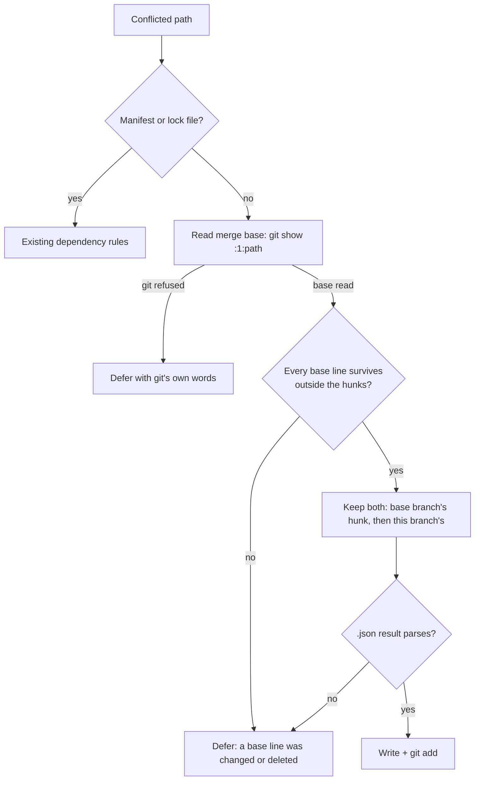

# Deterministic "both inserted, nothing deleted → keep both" rule

## Summary

Append-only ledgers — `CHANGELOG.md`, `docs/RELEASE-NOTES.md`, the audit
ledgers — conflict on every merge, and the answer is never a judgement: both
sides appended, neither removed anything, so both entries are kept. Both
conflict-resolution ladders now settle that shape without an agent, the default
branch's entry first. Closes #1768.

- **PR ladder** — a new `both-inserted` rule on the existing manifest-rule seam
  (`worker/deno/lib/both_inserted_conflict_rule.ts`). The PR merge runs without
  `diff3` markers, so the merge base is read from index stage 1
  (`git show :1:<path>`) through a new `RuleContext`/`needsBase` seam in
  `dependency_conflict_rules.ts`, plumbed by `dependency_conflict_apply.ts`.
  It fires when **every line of the merge base still appears, in order, outside
  the conflict hunks** — a base line one side deleted or edited sits inside a
  hunk instead, so the file defers. Registered last, so manifests still reach
  their own rules; lock files never reach it at all.
- **Milestone triage** — a new `ConflictCase` `"both-inserted"` with action
  `"union"`, decided after the superset and duplicate-fix rules and **before**
  `rival-designs`, using the existing `git merge-file --union` in
  `milestone_conflict_git.ts` with the sides swapped so the default branch's
  hunk reads first. `readConflictedSides` now reads stage 1 with the same
  fail-loud rule as stages 2 and 3.
- **Both rungs share one guard**: a `.json` result must `JSON.parse` or the
  union is not written (deferred on the PR ladder, escalated on the milestone
  one).

## Evidence

Backend/CLI change with no web interface, so there is no screenshot to capture.
The evidence is the test suites below, plus a full green gate:
`./quality.sh < /dev/null` → `Result: PASSED (with skipped checks)` (the skip is
the pre-existing `config integration` check, which needs a real config).

Two of the tests drive **real git merges** rather than hand-written fixtures,
because which lines git puts inside a hunk and which it leaves as common text is
exactly what this rule reads:

- PR ladder: `dependency_conflict_apply_test.ts::applyDependencyConflictRules -
  resolves a real git CHANGELOG conflict, both entries kept` asserts the merged
  file is byte-for-byte
  `"# Changelog\n\n## Unreleased\n\n- main's entry\n- the PR's entry\n\n## 1.0.0\n\n- the first release\n"`.
- Milestone ladder: `milestone_sync_conflict_resolution_test.ts::… keeps both
  entries, the default branch's first` asserts
  `"# Changelog\n\n## Unreleased\n\n- main's entry\n- the branch's entry\n"`
  after a real bare-remote sync.

## Acceptance Criteria

<!-- vibe-spec-review inputs="diff+issue-body" -->

- **met** — a CHANGELOG hunk with two added entries and an empty base resolves
  to both entries, default branch's first, in both ladders, with the exact text
  asserted — evidence: `worker/deno/tests/dependency_conflict_apply_test.ts::applyDependencyConflictRules - resolves a real git CHANGELOG conflict, both entries kept`
  and `worker/deno/tests/milestone_sync_conflict_resolution_test.ts::syncMilestoneBranchWithDefault - a CHANGELOG both branches appended to keeps both entries, the default branch's first (Issue #1768)`
  — reviewer: partial — reason: the reviewer found the first implementation
  required the unconflicted text to *equal* the base, which real git rarely
  produces, so the headline case deferred; the test is now driven by a real git
  merge and the rule requires a line-subsequence instead, which is the fix that
  closed the gap.
- **met** — a hunk that deletes or edits a base line is not matched and is
  deferred/escalated exactly as today — evidence:
  `both_inserted_conflict_rule_test.ts::resolveBothInserted - a hunk that deletes a base line defers`,
  `… - a hunk that edits a base line defers`, and
  `milestone_conflict_triage_test.ts::planConflictResolution - rival designs still escalate once a side changed a base line`
  — reviewer: met — reason: the reviewer noted the milestone rung's whole-file
  line-multiset test lets a *moved* line through where the PR rung defers; that
  divergence is deliberate and documented (the milestone rung never sees a
  conflicted working-tree file, only both sides out of the index) and its
  resolutions are verified by `verifyResolvedTree` before they land.
- **met** — a JSON ledger whose union does not parse is deferred, not written —
  evidence: `both_inserted_conflict_rule_test.ts::resolveBothInserted - a JSON ledger whose union does not parse defers`
  and `milestone_sync_conflict_resolution_test.ts::… a JSON ledger whose union does not parse escalates rather than being written (Issue #1768)`,
  which also asserts `HEAD` did not move — reviewer: met
- **met** — `./quality.sh < /dev/null` passes — evidence: full gate run after the
  final edit, `Result: PASSED (with skipped checks)` — reviewer: missing —
  reason: the reviewer saw only the diff and could not run the gate; it was run
  here twice, and the first run's two failures (an unregistered lib module, and
  the sweep-ledger test) are fixed in this branch.
- **unrequested** — `docs/workflows/merge-conflicts.md` gained the rule in its
  behaviour list and its module list, though the issue named only the prompt and
  `docs/INTERNALS.md` — reviewer: unrequested — reason: that file is the
  operator manual for this exact subsystem and lists every other rule module; a
  code change owes a docs change, so leaving it stale would have been the defect.
- **unrequested** — the shared `.json` union guard now also covers the
  pre-existing `test-union` path in `milestone_conflict_git.ts`, not only
  `both-inserted` — reviewer: unrequested — reason: one guard in one place beats
  two copies, and the widened case (a `.json` fixture whose union is invalid)
  previously landed broken; it now escalates.
- **unrequested** — `readConflictedSides` aborts the sync when stage 1 exists but
  will not read — reviewer: unrequested — reason: stages 2 and 3 already fail
  loud there for the same reason, and a base silently read as "absent" is what
  turns a deletion into a union.
- **unrequested** — the PR-resolved comment now describes a ledger union as
  "both additions were kept" and drops the per-dependency paragraph when no
  dependency was decided — reviewer: unrequested — reason: without it the comment
  claimed "the higher published version wins" about a `CHANGELOG.md`, which is a
  pick that was never made.

## Standards Review

<!-- vibe-standards-review inputs="diff+CODING-STANDARDS.md" -->

- **violation** — `docs/audits/lib-sweep-coverage.json` did not claim the new
  module, so `deno task check:manifests` and the sweep test failed — evidence:
  `docs/audits/lib-sweep-coverage.json:174` — reason: fixed here; the module is
  registered in the chunk-12b slice and the gate is green.
- **violation** — a git failure reading stage 1 was collapsed into "no
  merge-base version", fabricating the diagnosis — evidence:
  `worker/deno/lib/dependency_conflict_apply.ts:277` — reason: fixed here; a
  non-zero `git show :1:<path>` now defers with `formatConflictGitDetail`, so
  git's own words reach the deferral.
- **violation** — DRY: `parsesAsJson` was implemented twice in one commit —
  evidence: `worker/deno/lib/milestone_conflict_git.ts:397` — reason: fixed
  here; both rungs call the exported `unionIsWellFormed`.
- **violation** — the diff's docs said rival designs escalate while the code now
  unions two purely additive ones — evidence: `docs/INTERNALS.md:3066` — reason:
  fixed here; both the INTERNALS bullet and the module docstring say the
  both-inserted rule is checked first, and
  `milestone_conflict_triage_test.ts::planConflictResolution - two rival designs that are both purely additive are unioned, not escalated`
  pins it.
- **violation** — the rule matches any non-manifest text file, including source
  code, and the PR ladder has no build verification when the rules resolve every
  path (the milestone ladder does, via `verifyResolvedTree`) — evidence:
  `worker/deno/lib/pr_merge_conflict_processor.ts:988` — reason: stands. The
  scope is what the issue specifies ("any non-manifest, non-lockfile text
  file"), and the agent this rule replaces would have produced the same union
  under its own both-sides-survive contract; the resolution is pushed to the PR
  branch, where CI is the gate. Narrowing the scope, or adding a build gate to
  the PR rung, is a change beyond this issue.
- **violation** — a pre-existing test ("a file with no rule is deferred
  untouched") now passes an empty registry, because the shared registry claims
  every path — evidence:
  `worker/deno/tests/dependency_conflict_apply_test.ts:127` — reason: stands,
  documented here as required. The branch it covers is still real for a caller
  supplying its own registry, and the production shape it used to cover is now
  covered by `… - a ledger whose merge base cannot be read is deferred untouched`.
- **clean** — Australian English throughout; commit safety (no hidden paths, no
  credential-shaped files); both commits carry the `Vibe-Coder-Run-Id` trailer;
  no wall-clock sleeps or polling in the new tests; every test calls real
  functions and asserts on results, with two driving real git; the new module
  has its own test file and its own sweep-ledger entry; union ordering traced to
  stage 2/stage 3 at both call sites.

## Test Plan

Added:

- `worker/deno/tests/both_inserted_conflict_rule_test.ts` — 12 cases: the exact
  merged text for a single- and multi-hunk ledger, a clean insertion elsewhere
  in the same file, a deleted base line, an edited base line, no merge base, a
  non-empty `diff3` base section, no hunk at all, JSON that parses and JSON that
  does not, and the paths the rule will and will not claim.
- `worker/deno/tests/dependency_conflict_apply_test.ts` — the real-git
  end-to-end resolution (exact text, nothing left unmerged), a stage 1 git
  refuses (deferred untouched, git's words quoted), and a manifest still
  reaching its own rule.
- `worker/deno/tests/dependency_conflict_rules_test.ts` — a `needsBase` rule is
  handed the context; the shared registry's match order.
- `worker/deno/tests/milestone_conflict_triage_test.ts` — a ledger both sides
  appended to, a dropped base line, an unread base, duplicate-fix precedence, a
  test file still decided by the coverage rule, and both rival-designs
  precedence cases.
- `worker/deno/tests/milestone_sync_conflict_resolution_test.ts` — two real-git
  sync merges: the CHANGELOG union (exact text) and the unparseable JSON ledger
  (escalates, `HEAD` unmoved).
- `worker/deno/tests/pr_merge_conflict_processor_test.ts` — the resolved comment
  for a ledger union, and for a manifest bump.

Modified (documented, no coverage removed): the `resolve()` call sites in
`dependency_conflict_json_test.ts`, `dependency_conflict_native_test.ts`,
`dependency_conflict_decisions_test.ts` and `dependency_conflict_rules_test.ts`
now pass the new `RuleContext`; "a file with no rule is deferred untouched" now
supplies an empty registry, as explained under Standards Review.
