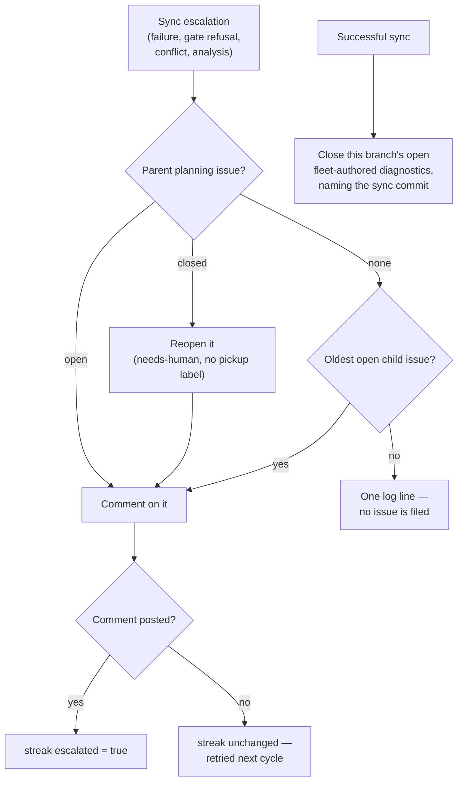

# Milestone escalations comment on an existing issue only

> **Archive note (Issue #1826).** This is PR #1809's own record, kept verbatim.
> #1809 merged only into the #1730 milestone branch, so the change was landed
> on `main` separately by PR for Issue #1826, which resolved a conflict with
> main's Issue #1786 conflict dedup and re-ran the gate on the merged tree —
> the evidence for what is on `main` is in `pr-summary-1826.md`.

## Summary

No milestone-sync outcome files an issue any more. Every escalation —
`escalateSyncFailure`, `escalateMergeGateFailure`, `escalateConflictAnalysis`
and `escalateSyncConflict` — now resolves a destination that already exists:
the milestone's parent planning issue (reopened, labelled `needs-human` and
never a pickup label, when planning has closed it), else its oldest open
non-tracking child **issue**, else nowhere, which is one log line and a streak
marked escalated so the line is not repeated. `fileStuckSyncDiagnostic` is
deleted, and a branch that syncs closes the open fleet-authored diagnostics the
old path filed for it, commenting with the commit the branch now stands at.

Planning closes the parent issue as soon as the sub-issues are filed, so almost
every milestone took the old "no `#NNN` in the title" path and the fleet grew
one `needs-human` issue per branch and per conflicting commit (#1754, #1756,
#1764, NEAT-AI-scorer#612/#613, GRQ-AutoTrader#120) that nothing ever closed.

Closes #1769.

## Evidence

Backend-only change — no web interface to screenshot. The evidence is the test
suites below plus the full gate: `./quality.sh < /dev/null` → **PASSED**
(`completeness checks`, `semgrep`, `deno tests` 20k+, lint, type check, fmt all
green; `config integration` skipped as it always is locally).

## Reproduction

- **symptom** — a milestone sync failure on a milestone with no `#NNN` title
  filed a fresh `needs-human` issue per branch and per default-branch commit,
  and nothing ever closed one once the branch synced
- **status** — `verified` — with `lib/milestone_branch_sync.ts` restored to the
  pre-fix commit (`git checkout HEAD~1 -- lib/milestone_branch_sync.ts`), the
  four new tests in `worker/deno/tests/milestone_branch_sync_test.ts` failed
  (an `["issue","create",…]` argv was issued, no diagnostic was closed); with
  the fix in place all four pass
- **regression test** —
  `worker/deno/tests/milestone_branch_sync_test.ts::syncMilestoneBranches - no escalation path ever files an issue (Issue #1769)`

## Acceptance Criteria

<!-- vibe-spec-review inputs="diff+issue-body" -->

- **met** — With no parent issue and no open child, a sync failure makes no
  `gh issue create` call and one log line; the streak records `escalated: true`
  — evidence:
  `worker/deno/tests/milestone_branch_sync_test.ts::syncMilestoneBranches - a streak escalation with nowhere to go is recorded as escalated (Issue #1769)`
  — reviewer: met
- **met** — With a closed parent planning issue, the escalation reopens it,
  adds no label other than `needs-human`, comments once; a second cycle posts
  nothing — evidence:
  `worker/deno/tests/milestone_branch_sync_test.ts::syncMilestoneBranches - a closed parent planning issue is reopened and commented on once (Issue #1769)`
  — reviewer: met
- **met** — `escalated` stays false when the comment call throws — evidence:
  `worker/deno/tests/milestone_branch_sync_test.ts::syncMilestoneBranches - a comment that throws leaves the streak unescalated (Issue #1769)`
  — reviewer: met
- **met** — After a successful sync an open fleet-authored diagnostic for that
  branch is closed with a comment; a same-titled issue by a non-fleet author is
  left alone — evidence:
  `worker/deno/tests/milestone_sync_diagnostic_closeout_test.ts` (six cases)
  and
  `worker/deno/tests/milestone_branch_sync_test.ts::syncMilestoneBranches - a successful sync closes the branch's own diagnostics (Issue #1769)`
  — reviewer: met
- **met** — `./quality.sh < /dev/null` passes — evidence: full gate re-run
  after registering both new modules in `docs/audits/lib-sweep-coverage.json`,
  `Result: PASSED` — reviewer: missing — reason: the reviewer ran the gate
  against the diff before that registration and saw `completeness checks` and
  `deno tests` fail on `lib_sweep_coverage_test.ts`; the ledger entries were
  added in response and the gate now passes.
- **unrequested** — `titleMatches` predicate added to
  `findFleetAuthoredIssuesTitled` — reviewer: unrequested — reason: the
  conflict diagnostic's title carries the conflicting commit, so the close-out
  cannot know the exact title; the predicate defaults to the existing exact
  comparison and never widens the author check, and it is now covered by three
  tests in `worker/deno/tests/idle_task_wrapper_dedup_author_test.ts`.
- **unrequested** — `conflictDiagnosticTitlePrefix` exported from
  `milestone_sync_conflict.ts` — reviewer: unrequested — reason: one definition
  of the title both halves must agree on; `conflictDiagnosticTitle` is built
  from it, so the search key and the filed title cannot drift.
- **unrequested** — `stuckSyncDiagnosticTitle` moved to the new
  `milestone_sync_diagnostic_closeout.ts` — reviewer: unrequested — reason: it
  survives only as a close-out search key, so it lives beside the close-out; it
  had no other importer.
- **unrequested** — `dedupAuthors` added to `MilestoneBranchSyncDeps` and
  `milestoneNumber` to `ActiveMilestone` — reviewer: unrequested — reason: the
  close-out needs the fleet identity (production omits it and reads the
  configured fleet) and the child lookup needs the milestone number.
- **unrequested** — child **PRs** are excluded from the escalation destination
  — reviewer: unrequested — reason: reviewer finding; `fetchOpenMilestoneChildren`
  also returns PRs, and the milestone merge auto-closes them, which would bury
  the escalation. `decideMilestoneEscalationTarget` skips `kind: "pr"` and the
  branch-based PR query is no longer made at all.

## Standards Review

<!-- vibe-standards-review inputs="diff+CODING-STANDARDS.md" -->

- **violation** — both new `lib/` modules unclaimed by any sweep slice, so
  `deno task check:manifests` was red — evidence:
  `docs/audits/lib-sweep-coverage.json:279` — reason: fixed here, both modules
  registered; the full gate now passes.
- **violation** — duplicate Mermaid node id `R` in the same `flowchart TD`, so
  the reopen node inherited the "Reset to the pre-merge commit" label —
  evidence: `docs/INTERNALS.md:3110` — reason: fixed here, renamed to `RO`.
- **violation** — the widened `findFleetAuthoredIssuesTitled` had no test in
  its own suite — evidence: `worker/deno/lib/idle_task_wrapper_dedup.ts:105` —
  reason: fixed here; three tests added, including a non-fleet author matched
  by the loose predicate and still excluded.
- **violation** — a `needs-human` escalation could land on a child PR the
  milestone merge auto-closes — evidence:
  `worker/deno/lib/milestone_escalation_target.ts:84` — reason: fixed here,
  `kind: "pr"` children are never a destination.
- **violation** — an escalation with nowhere to go returns `true` and records
  `escalated: true` — evidence:
  `worker/deno/lib/milestone_branch_sync.ts:955` — reason: stands, and it is
  what acceptance criterion 1 asks for. The alternative is the log line
  repeating every cycle for ever; the failure itself is still reported loudly
  by the `WARNING` line and the `sync_failed` self-heal event on every cycle,
  so nothing is silenced — only the escalation attempt is not repeated.
- **clean** — Australian English throughout; Deno-native tooling only; tests
  call the real exported functions through injected `gh` stubs with no
  source-grepping, sleeps or wall-clock assertions; every `catch` logs the
  error with context and its consequence; no hidden paths staged;
  `docs/INTERNALS.md` updated in the same change; `milestone_branch_sync.ts`
  shrank by ~100 lines into two focused modules.

## Test Plan

- **New** `worker/deno/tests/milestone_escalation_target_test.ts` — 11 tests:
  the pure decision (parent wins, oldest child, child PRs excluded, nonsense
  numbers, nowhere) and the `gh` wrapper (open parent untouched, closed parent
  reopened with `needs-human` only, failed reopen still targets the parent,
  child fallback with no `pr list` call, unreadable children → `none`).
- **New** `worker/deno/tests/milestone_sync_diagnostic_closeout_test.ts` — 6
  tests: stuck diagnostic closed naming the sync commit, conflict diagnostic
  matched despite its per-commit title, stranger's issue left alone, another
  branch's diagnostic left alone, no commit lookup when there is nothing to
  close, a failed close reported rather than swallowed.
- **Extended** `worker/deno/tests/milestone_branch_sync_test.ts` — the
  failure-detection assertion (no `["issue","create",…]` argv across the
  conflict, plain-failure, merge-gate and conflict-analysis paths), the streak
  `escalated: true` with nowhere to go, the closed-parent reopen, the comment
  that throws, and the close-out through a successful sync.
- **Extended** `worker/deno/tests/idle_task_wrapper_dedup_author_test.ts` —
  three tests for the `titleMatches` predicate, including the author check
  under a loose title.
- **Reversed** `worker/deno/tests/milestone_sync_escalation_reachable_1465_test.ts`
  — its "file where no tracking issue exists" premise is now "comment on the
  oldest open child, and file nothing"; the `#NNN` tracking-issue path is
  unchanged and still asserted.
- **Updated** `worker/deno/tests/milestone_sync_conflict_escalation_test.ts` —
  the no-tracking-issue conflict now lands on the oldest open child.
- Full gate: `./quality.sh < /dev/null` → PASSED.
