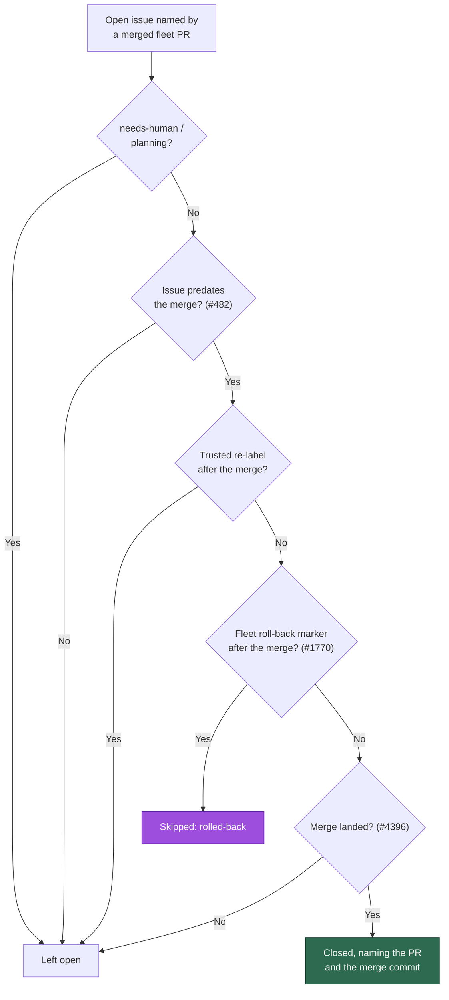

## Summary

A child issue reopened because a milestone roll-back reverted its merged PR was
closed again on the very next cycle: the PR stays `merged` for ever, so both
merged-PR closers saw a merged, landed PR naming an open issue and shut it.

New `worker/deno/lib/milestone_rollback_marker.ts` owns the vocabulary —
`ROLLBACK_MARKER`, `buildRollbackMarker({ prNumber, revertSha, branch })` and
`findRollbackAfter(comments, mergedAt, fleetAuthors)` — with the same trust
rules as the VibeCoder#42 re-label hatch it sits beside: the marker counts only
when a **fleet** login authored it and it postdates the merge **strictly**. Both
closers then skip such an issue with a reason opening `rolled-back`, and never
close it. Closes #1770.

The issue names `pr_maintenance.ts closeIssuesForMergedPrs (priority 1.67)`;
priority 1.67 is in fact wired to `pr_issue_linking.ts`'s function of the same
name (`run_core_production_deps.ts:2528`). Both carry the check, so the named
file and the path production actually runs are covered.

## Evidence

Backend/CLI change with no web interface, so there is no screenshot to capture.
The evidence is the tests below and the full gate:
`./quality.sh < /dev/null` → `Result: PASSED (with skipped checks)` (only the
environment-gated `config integration` check is skipped).

## Acceptance Criteria

<!-- vibe-spec-review inputs="diff+issue-body" -->

- **met** — an issue whose PR merged at T with a fleet roll-back marker at T+1 is
  skipped by both sweeps with reason `rolled-back`; the same marker by a
  non-fleet author is ignored and the issue closes as today — evidence:
  `worker/deno/tests/merged_pr_issue_sweep_test.ts::sweepMergedPrIssues - a fleet roll-back after the merge skips the close as rolled-back (Issue #1770)`
  and `…the same roll-back marker from a non-fleet author still closes`;
  `worker/deno/tests/merged_pr_close_rollback_1770_test.ts::closeIssuesForMergedPrs - a fleet roll-back after the merge keeps the child open (Issue #1770)`
  (and its `pr_maintenance` twin) — reviewer: met
- **met** — a marker dated before the merge does not block the close — evidence:
  `worker/deno/lib/milestone_rollback_marker.ts` (`postedMs <= mergedMs` is
  rejected, so a marker at the merge is rejected too) with
  `milestone_rollback_marker_test.ts::findRollbackAfter - a marker dated before the merge does not count`
  and the per-closer cases — reviewer: met
- **met** — `./quality.sh < /dev/null` passes — evidence: full gate run in this
  worktree, `Result: PASSED (with skipped checks)` — reviewer: met (the reviewer
  ran the gate itself and saw the same result)
- **unrequested** — the roll-back check in `pr_issue_linking.ts`
  `closeIssuesForMergedPrs` plus its `fleetAuthors`/`logFn` options and the
  `run_core_production_deps.ts` wiring — reviewer: unrequested — reason: the
  issue names `pr_maintenance.ts`, but priority 1.67 runs the `pr_issue_linking`
  function, so without this the requirement would have no production effect
- **unrequested** — fail-closed handling of an unreadable comment thread in all
  three call sites — reviewer: unrequested — reason: an unreadable thread cannot
  prove the issue was *not* rolled back, so the close is deferred with the cause
  named rather than taken on an unproven assumption
- **unrequested** — `listMergedPrs` now requests `number,title,mergedAt` and
  `PrEntry` gains `mergedAt` — reviewer: unrequested — reason: the
  `pr_maintenance` closer has no merge time without it, and the check needs one
- **unrequested** — `findRollbackAfterMerge`, `rollbackSkipReason` and the
  throwing validation in `buildRollbackMarker` — reviewer: unrequested — reason:
  the fetch wrapper keeps the three call sites to one line each (DRY), and the
  validation stops a worker-authored marker from breaking its own grammar
- **unrequested** — `docs/audits/security-sweep-1770-milestone-rollback-marker.md`
  and the `lib-sweep-coverage.json` slice — reviewer: unrequested — reason:
  mandated by the repo's own gate; `lib_sweep_coverage_test.ts` fails any `lib/`
  module no sweep slice claims
- **unrequested** — the new `docs/INTERNALS.md` mermaid node and module-table row
  — reviewer: unrequested — reason: the paragraph the issue asked for describes a
  decision the diagram beside it already draws; leaving the diagram stale would
  contradict it

Two reviewer observations recorded rather than changed: the marker's `pr` value
is not compared to the PR being closed (the issue specifies "dated after the
PR's merge", and a re-done PR merges *after* the marker, so the strictly-after
rule already covers the ordinary case); and a rolled-back child holds the
watermark back, costing one bounded comment read per cycle until it closes.
Nothing in the tree posts the marker yet — the roll-back that writes it is a
sibling child of #1730; this PR is the read side the issue asked for.

## Standards Review

<!-- vibe-standards-review inputs="diff+CODING-STANDARDS.md" -->

- **violation** — the new fetch's throw was routed into a pre-existing silent
  `catch {}`, contradicting the comment beside it and `docs/INTERNALS.md` —
  evidence: `worker/deno/lib/pr_issue_linking.ts:1038`,
  `worker/deno/lib/pr_maintenance.ts:1764` — reason: fixed here — each closer now
  catches its own roll-back lookup and logs the cause, covered by
  `merged_pr_close_rollback_1770_test.ts::…an unreadable comment thread leaves the child open, loudly`
  in both closers
- **violation** — `isFleetAuthor` attributed to `alert_dedup_authors.ts` in the
  module doc and the sweep ledger — evidence:
  `worker/deno/lib/milestone_rollback_marker.ts:20` — reason: fixed here; it is
  defined in `fleet_authors.ts`, which the text now says
- **violation** — `deps.findRollbackFn` was declared "tests inject" but nothing
  injected it — evidence: `worker/deno/lib/merged_pr_issue_sweep.ts:157` —
  reason: fixed here; the seam is removed and the tests drive the real path
  through the `gh` mock
- **violation** — the `pr_maintenance` copy of the check is duplication on a path
  production never runs — evidence: `worker/deno/lib/pr_maintenance.ts:1721` —
  reason: stands. The issue names that file explicitly; the shared helper keeps
  the three call sites to one call each rather than three copies of the logic
- **violation** — `buildRollbackMarker` has no production caller — evidence:
  `worker/deno/lib/milestone_rollback_marker.ts:93` — reason: stands. #1770 is
  the read side; the roll-back that posts the marker is a sibling child of #1730
- **clean** — Australian English throughout; no hidden paths staged; every test
  calls real functions with real data (no source-grepping, no sleeps, no
  wall-clock budgets); the marker uses the canonical `vibe-` + `key="value"`
  grammar so `marker_grammar_test.ts` needs no new deviation; `deno fmt`, `lint`,
  `check` and markdownlint clean; regexes linear (no ReDoS pair)

The reviewer also noted a residual risk it did not class as a breach: a
fleet-authored comment that *quotes* untrusted text carries whatever that text
contains. It is now recorded in the sweep ledger, with the reason it is accepted
— the only effect of a false match is that an issue stays **open**.

## Test Plan

- Added `worker/deno/tests/milestone_rollback_marker_test.ts` (16 tests): the
  marker grammar, the sha/branch validation that throws, and every trust rule —
  fleet author, non-fleet author, before/at/after the merge, no configured fleet,
  malformed marker, both comment shapes, newest-wins, and the fetch wrapper's
  loud failure.
- Added `worker/deno/tests/merged_pr_close_rollback_1770_test.ts` (8 tests): both
  closers keep a rolled-back child open, still close on a non-fleet or
  pre-merge marker, spend no call without a fleet identity, and leave the issue
  open naming the cause when the thread cannot be read.
- Extended `worker/deno/tests/merged_pr_issue_sweep_test.ts` (4 tests): the same
  four cases for the housekeeping sweep.
- Verified red-before-green: with the three `if (rollback)` branches disabled,
  the three "keeps the child open" tests fail and the rest stay green.
- Full gate: `./quality.sh < /dev/null` → PASSED.
