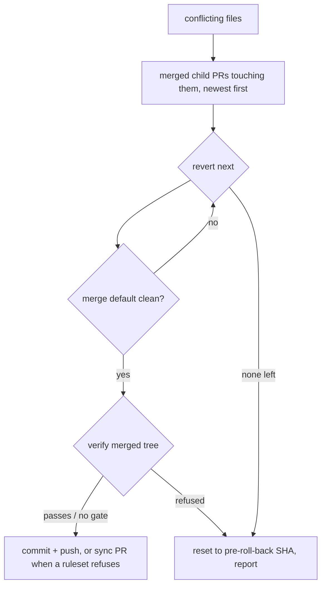

## Summary

Adds `worker/deno/lib/milestone_rollback.ts` — the roll-back mechanics for a
milestone branch whose merge of the default branch conflicts. `planRollback` is
pure and decides *what* is undone: the merged child PRs touching a conflicting
path, newest first, never a `sync/milestone-*` PR, never one already reverted
(read from the branch's own `Revert child PR #N` commits and from the ledger
list the caller passes), never one with no merge commit. `executeRollback`
reverts them one at a time and re-tries `git merge origin/<default>` after each,
so the roll-back stops at the first child whose removal is enough — the smallest
amount of work to redo. Closes #1771.

History is kept and no push is forced: every undo is a `git revert` commit
(`-m 1` for a two-parent merge) named
`Revert child PR #N "<title>" — milestone roll-back (Issue #1730)`, and the
milestone branch is pushed as an ordinary fast-forward — or, when a `milestone/**`
ruleset refuses the push, landed through the Issue #589 sync PR. Nothing
half-done is published: the pre-roll-back SHA is recorded first and every
outcome short of a clean merge ends at `git reset --hard <pre-roll-back SHA>`
with nothing pushed. The default branch is never written to.

## Evidence

Backend module with no web interface, so there is no screenshot to take. The
evidence is the real-git test suite: the executing half runs against a
bare-upstream fixture (the shape `commit_and_push_pending_test.ts` uses) and
asserts observable state — the remote SHA, the file contents, the revert
commit's subject, and `merge-base --is-ancestor` for the child that was kept.
The ruleset case installs a real `pre-receive` hook in the bare upstream that
refuses `refs/heads/milestone/*` with GitHub's own wording, so the sync-PR
fallback is exercised against a genuinely rejected push rather than a stubbed
one.

```
deno test worker/deno/tests/milestone_rollback_test.ts
ok | 17 passed | 0 failed (16s)

./quality.sh < /dev/null
Result: PASSED (with skipped checks)   # "config integration" skips without a live config
```



## Acceptance Criteria

<!-- vibe-spec-review inputs="diff+issue-body" -->

- **met** — three merged children, two touching the conflicting files → plan lists exactly those two, newest first; a `sync/milestone-*` PR is never listed — evidence: `worker/deno/tests/milestone_rollback_test.ts::planRollback - lists only the children touching a conflicting file, newest first` (PRs 11/12/13 plus a sync PR 14 → `[13, 11]`) — reviewer: met
- **met** — real-git test (bare-upstream fixture): reverting one child makes the default merge clean → branch pushed, zero behind, revert commit names the PR, the untouched child's commit still present — evidence: `worker/deno/tests/milestone_rollback_test.ts::executeRollback - reverts the one child in the way, then pushes the merged branch` — reviewer: met
- **met** — every candidate reverted and the merge still conflicts → `merged: false`, local and remote branch equal the pre-roll-back SHA — evidence: `worker/deno/tests/milestone_rollback_test.ts::executeRollback - every candidate reverted and still conflicting leaves the branch untouched` — reviewer: met
- **met** — a ruleset-rejected push lands through the sync PR — evidence: `worker/deno/tests/milestone_rollback_test.ts::executeRollback - a ruleset-rejected push lands through the sync PR` (a real `pre-receive` hook refuses `refs/heads/milestone/*`) — reviewer: met
- **met** — `./quality.sh < /dev/null` passes — evidence: full gate run after the final edit, `Result: PASSED (with skipped checks)` — reviewer: met — reason: one reviewer ran the gate itself and confirmed it passes at HEAD; the other could not run it from the diff alone and called it unverified
- **met** — `planRollback` excludes children already reverted, read from a `Revert child PR #N` commit on the branch or from the ledger's reverted list — evidence: `lib/milestone_rollback.ts::revertedOnBranch` and the `alreadyReverted` dep, covered by `tests/milestone_rollback_test.ts::planRollback - never re-reverts a child…` — reviewer: partial — reason: the reviewer noted the ledger source has no producer yet, which is true — `milestone_sync_streak.ts` gains no reverted list here; wiring the exhaustion path that supplies it is explicitly out of this issue's scope, and the branch-log source works today
- **met** — `git revert --no-edit <sha>`, with `-m 1` for a two-parent SHA — evidence: `worker/deno/tests/milestone_rollback_test.ts::executeRollback - a child merged as a merge commit is reverted with -m 1` — reviewer: partial — reason: the reviewer found the `-m 1` branch untested; a real-git two-parent case was added after the review and fails when the `-m 1` argument is removed
- **met** — touched files from `git diff-tree --no-commit-id --name-only -r <sha>` — evidence: `lib/milestone_rollback.ts::readTouchedFiles` — reviewer: partial — reason: the literal one-argument form reports *nothing* for a two-parent merge and `-m` pools both parents' diffs, so the first parent is named explicitly (`<sha>^1 <sha>`, or `--root` for a root commit); the deviation is what makes the stated behaviour correct
- **met** — result `{ merged: true, reverted: […] }` or `{ merged: false, reverted: [], reason: … }` — evidence: `lib/milestone_rollback.ts::RollbackOutcome`, both stated reasons at `NOTHING_LEFT_REASON` and `revert conflicted on #N` — reviewer: partial — reason: both reviewers flagged that the reason union grew by two values; they are recorded as `unrequested` below rather than folded into the two documented ones, because reporting "the branch already merges cleanly" or "your gate refused the tree" as `nothing left to revert` is exactly the silent misreport this module exists to avoid
- **met** — never `push --force`; never touch the default branch — evidence: `lib/milestone_rollback.ts` pushes only `HEAD:refs/heads/<milestone>`; the default branch is only ever read as `origin/<default>` — reviewer: met
- **unrequested** — the optional `verify` seam, `VERIFICATION_REFUSED_REASON` and the `UNGATED:` log line — reviewer: unrequested — reason: `docs/INTERNALS.md` requires every automatic resolution on a milestone branch to be verified before it is pushed (Issue #974); a conflict-free merge only proves both sides were internally consistent, so the caller's gate decides and a roll-back without one says so
- **unrequested** — `ALREADY_CLEAN_REASON` and the trial merge that discovers the conflicting paths — reviewer: unrequested — reason: `executeRollback`'s stated dependency list carries no conflicting paths, so it has to establish them; a branch that turns out to merge cleanly must be reported, not reverted over
- **unrequested** — `--no-ff` on the merge — reviewer: unrequested — reason: Issue #1048 requires the default branch to land in this branch's *ancestry*; a fast-forward would leave nothing to commit and the roll-back with nothing to push
- **unrequested** — the fail-loud `Result` returns on `parseMergedChildPrs`, `parentCount`, `readTouchedFiles`, `revertedOnBranch` and a merge that failed with no conflicted files — reviewer: unrequested — reason: each previously returned emptiness, which the roll-back would report as `nothing left to revert` with every child still in place
- **unrequested** — `assertSafeGitRef` on both branch names, and the SHA format guard — reviewer: unrequested — reason: branch names and merge SHAs arrive from GitHub and reach git as positionals; the repo's git-ref chokepoint requires them checked
- **unrequested** — `docs/INTERNALS.md`, `docs/audits/security-sweep-1771-milestone-rollback.md` and slice `12n` of `docs/audits/lib-sweep-coverage.json` — reviewer: unrequested — reason: repo obligations, not features — the sweep registration is what `./quality.sh` demands of any new `lib/` module, and the docs section is the "a code change owes a docs change" rule

## Standards Review

<!-- vibe-standards-review inputs="diff+CODING-STANDARDS.md" -->

- **violation** — the new module was claimed by no sweep slice, so `deno task check:manifests` and `./quality.sh` failed — evidence: `docs/audits/lib-sweep-coverage.json` — reason: fixed here; slice `12n` and the written record `docs/audits/security-sweep-1771-milestone-rollback.md` were added and the gate now passes
- **violation** — fail-loud: a `gh` listing that would not parse, a failed `gh` call, an unreadable `diff-tree`/`rev-list`/`log`, and a merge that failed with no conflicted files all read as "nothing to revert" — evidence: `worker/deno/lib/milestone_rollback.ts:236,296,340,437,507` — reason: fixed here; each returns an error naming the cause, with tests for the `gh` and HEAD cases
- **violation** — the doc comment claimed a child "cannot be reverted twice" while the log read was capped at 500 commits — evidence: `worker/deno/lib/milestone_rollback.ts::revertedOnBranch` — reason: fixed here; the read is now bounded by the branch itself (`origin/<default>..HEAD`), which is where the revert commits live, and the phrase is matched only at the start of a line so a body quoting it excludes nothing
- **violation** — a merged tree was pushed with nothing verifying it, against the documented milestone-branch invariant — evidence: `docs/INTERNALS.md:3074` versus `worker/deno/lib/milestone_rollback.ts::commitAndPushMerge` — reason: fixed here; the caller's `verify` seam gates the push and a roll-back with no gate logs `UNGATED:`, matching the sync path's own note
- **violation** — dead field: `tryMerge` computed git's own explanation and discarded it — evidence: `worker/deno/lib/milestone_rollback.ts::tryMerge` — reason: fixed here; it is now the message of the fail-loud error for a non-conflict merge failure
- **violation** — missing error-path tests on new public functions (the `revert conflicted on #N` outcome, an unreadable branch state, an unreadable listing) — evidence: `worker/deno/tests/milestone_rollback_test.ts` — reason: fixed here; the suite grew from 9 to 17 cases, and `readTouchedFiles` was un-exported rather than left as untested public surface
- **violation** — DRY: `commitAndPushMerge` repeats the shape of `pushSyncedMilestoneBranch` — evidence: `worker/deno/lib/git_pull.ts:277` — reason: stands. That helper is private and bound to `runGitCommand`/`GitCommandOptions` and `spawnGh`, while this module takes injected `git`/`gh` seams as the issue specifies; extracting it would refactor the sync path, which this issue does not ask for. The genuinely shared parts — `isRuleViolationPush` and `raiseMilestoneSyncPr` — are imported, not copied
- **clean** — Australian English throughout both new files; `deno fmt`, `deno lint` and `deno check` pass; tests call real code (real `git` against a bare upstream, a real `pre-receive` hook) with no source-grepping, no sleeps and no wall-clock thresholds; `Result<T>` used for control flow; no hidden paths, key material or credential files staged; no `git add -f` and no `--no-verify`; the module never force-pushes and never writes the default branch

## Test Plan

`worker/deno/tests/milestone_rollback_test.ts` — 17 cases, seven pure and ten
against real git:

- `planRollback - lists only the children touching a conflicting file, newest first`
  — three merged children, two in the way, plus a `sync/milestone-*` PR that is
  never listed.
- `planRollback - never re-reverts a child, and never a candidate with no merge commit`.
- `parseRevertedChildPrs - reads the roll-back's own revert commits back` and
  `- a body merely quoting the phrase excludes nothing`.
- `parseMergedChildPrs - maps gh output, dropping what cannot be reverted` and
  `- an unreadable listing fails, never reads as no children`.
- `revertCommitMessage - names the PR, its title and the milestone roll-back`.
- `executeRollback - reverts the one child in the way, then pushes the merged branch`
  — the branch is pushed, zero behind `main`, the revert commit names the PR,
  and the untouched child's commit and file content survive.
- `executeRollback - every candidate reverted and still conflicting leaves the branch untouched`
  — local and remote both equal the pre-roll-back SHA.
- `executeRollback - a ruleset-rejected push lands through the sync PR`.
- `executeRollback - a revert that conflicts stops the roll-back and restores the branch`.
- `executeRollback - a merged tree the verification refuses is never pushed`.
- `executeRollback - a child merged as a merge commit is reverted with -m 1`
  — a two-parent merge commit, which `git revert` refuses without a mainline.
- `executeRollback - a branch that already merges cleanly reverts nothing` and
  `- a stale conflicting-path list cannot revert a branch that merges cleanly`.
- `executeRollback - an unreadable branch state fails loudly rather than reverting blind`
  and `- a listing gh will not give up fails, never reads as no children`.

Docs: `docs/INTERNALS.md` gains "Rolling a stuck milestone branch back" beside
the conflict-attempt ledger it follows from, with the flowchart above;
`docs/audits/security-sweep-1771-milestone-rollback.md` and slice 12n of
`docs/audits/lib-sweep-coverage.json` record the new module's security sweep.
