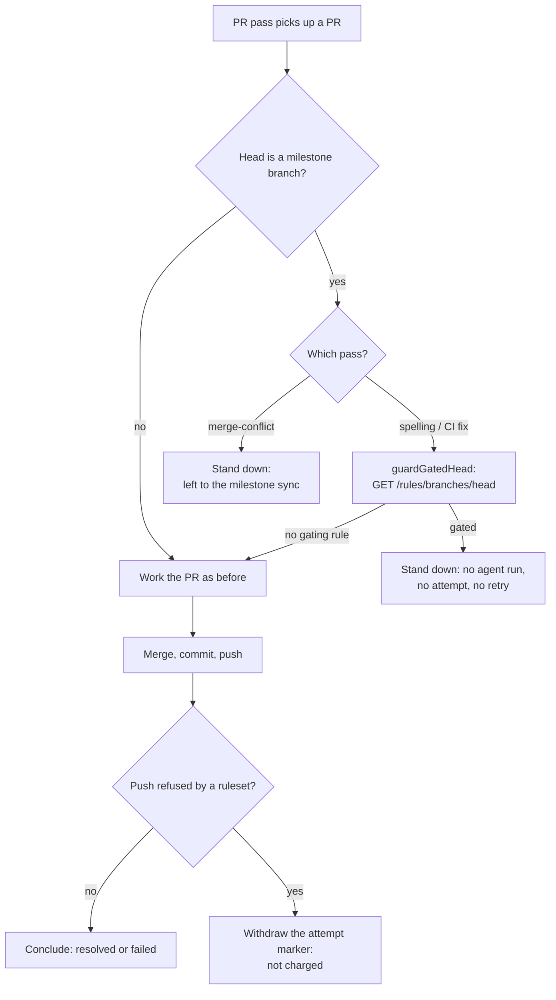

## Summary

The merge-conflict pass charged a PR's attempt budget for two things that are
not the PR's fault, and both now cost nothing.

- **A push a repository ruleset refuses spends no attempt.** GH013 recurs
  identically on every run for as long as the rule stands, so a `failAttempt`
  conclusion burned the two-attempt budget on a push that could never land and
  escalated a conflict nobody had failed to resolve. Whether the refusal comes
  back from `commitAndPushPending` or only from the `git push --dry-run` detail,
  the pass now posts **no** `CONFLICT_FAILED_MARKER`, withdraws the attempt
  marker, and logs `not charged: push rejected by ruleset`
  (`worker/deno/lib/pr_merge_conflict_processor.ts:1095`, `:1125`, `:1396`).
- **A milestone head is left to the milestone branch sync.** The every-cycle
  sync is the single owner of `default → milestone/*` merges and already lands
  them through a sync PR when a ruleset refuses its direct push (Issue #589).
  Running the PR ladder on the same branch would duplicate that merge and race
  the sync's push, so the pass stands down on the branch name alone — gated or
  not — before the lock, the heartbeat and the attempt marker
  (`worker/deno/lib/gated_head_guard.ts:289`). `guardGatedHead` is untouched and
  still serves the CI-fix and spelling passes.

Closes #1772.

## Evidence

Backend/CLI change — there is no web interface to screenshot. The evidence is
the test suite:
`deno test worker/deno/tests/pr_merge_conflict_processor_test.ts
worker/deno/tests/gated_head_guard_test.ts
worker/deno/tests/gated_head_passes_test.ts`
→ **67 passed, 0 failed**, and the full gate `./quality.sh < /dev/null` →
**PASSED** (21 checks; `config
integration` skipped as it always is locally).

Which pass does what with a `milestone/**` head:

## Reproduction

- **symptom** — a merge-conflict attempt whose push GitHub refused under a
  ruleset (`GH013: Repository rule violations found`) posted a
  `vibe-coder:merge-conflict-failed` conclusion and spent one of the PR's
  attempts, and a PR whose head was a `milestone/**` branch was worked by the
  ladder, duplicating the milestone sync's merge on the same branch
- **status** — `verified` — the four new processor tests were run against the
  unfixed `lib/` files (restored with `git checkout --`) and observed failing
  (`FAILED | 44 passed | 4 failed`), then passing after the fix
  (`ok | 48 passed | 0 failed`)
- **regression test** —
  `worker/deno/tests/pr_merge_conflict_processor_test.ts::processMergeConflict - a push refused by a ruleset spends no attempt (Issue #1772)`
  and
  `worker/deno/tests/pr_merge_conflict_processor_test.ts::processMergeConflict - a milestone head is left to the milestone sync (Issue #1772)`

## Acceptance Criteria

<!-- vibe-spec-review inputs="diff+issue-body" -->

- **met** — Push stderr containing `GH013` / `repository rule violations` → no
  failed marker, attempt marker withdrawn, log
  `not charged: push rejected by ruleset`, next scan counts zero attempts —
  evidence: `worker/deno/lib/pr_merge_conflict_processor.ts:1095` and `:1125`
  route to `withdrawRulesetRefusedAttempt` (`:1396`);
  `worker/deno/tests/pr_merge_conflict_processor_test.ts::processMergeConflict - a push refused by a ruleset spends no attempt (Issue #1772)`
  — reviewer: met — reason: the reviewer flagged that `isRuleViolationPush` did
  not match a bare `GH013` with no prose; `gh013` was added to the match set
  (`worker/deno/lib/milestone_sync_pr.ts:49`) with a case in
  `milestone_sync_pr_test.ts::isRuleViolationPush - recognises a gate refusing the push, and nothing else`
- **met** — A PR with head `milestone/x` (ruleset or not) → no merge run, no
  attempt marker, one skip log line, one stand-down comment (deduped by marker)
  — evidence:
  `worker/deno/tests/pr_merge_conflict_processor_test.ts::processMergeConflict - a milestone head is left to the milestone sync (Issue #1772)`
  and `... the milestone stand-down comments once per branch (Issue #1772)` —
  reviewer: met
- **met** — A non-milestone head keeps today's direct push and charging —
  evidence:
  `worker/deno/tests/pr_merge_conflict_processor_test.ts::processMergeConflict - a non-milestone head is worked as before (Issue #1772)`
  and `... an ordinary push failure is still charged (Issue #1772)` — reviewer:
  met
- **met** — `./quality.sh < /dev/null` passes — evidence: full gate run after
  the final edit, `Result: PASSED (with skipped checks)` — reviewer: met
- **unrequested** — `runEnded` split out from `attemptCharged`
  (`worker/deno/lib/merge_conflict_drain.ts:139`, `:470`, `:485`) — reviewer:
  unrequested — reason: the reviewer's highest-severity finding — the drain read
  `attemptCharged === false` as "the run ended", so an uncharged ruleset refusal
  would have stopped the whole pass and starved every other conflicting PR in
  the cycle. Fixed here rather than shipped, since the AC's "spends no attempt"
  is worthless if it costs the cycle.
- **unrequested** — `isRuleViolationPush` also matches classic
  `protected branch` refusals, so those are uncharged too — reviewer:
  unrequested — reason: the issue asked for that helper by name and the class it
  matches is exactly "a gate refused this push"; splitting it would duplicate
  the predicate.
- **unrequested** — `recordStandDownOnce` / `hasStandDownComment` extracted in
  `worker/deno/lib/gated_head_guard.ts:320` and the per-run registry re-keyed to
  `repo#pr#marker` — reviewer: unrequested — reason: DRY, and the re-key is
  required so the merge-conflict stand-down is not masked by a gated-head
  comment the CI-fix pass posted for the same PR.
- **unrequested** — a new `vibe-milestone-head` marker and comment builder
  (`worker/deno/lib/gated_head_guard.ts:170`) rather than reusing
  `vibe-gated-head` — reviewer: unrequested — reason: the comment says something
  different (the sync owns the branch, not "a rule refuses the push"), and one
  marker for both would let either stand-down silence the other.
- **unrequested** — the `docs/MERGE.md` mermaid rewrite and the per-pass table
  (`docs/MERGE.md:679`) — reviewer: unrequested — reason: the issue asked for a
  "merge-conflict row"; the existing section had no table, so one was added to
  hold it.
- **unrequested** — test-harness additions (`gh pr view`, scripted
  `push --dry-run` and `commitAndPushPending` failures) in
  `worker/deno/tests/pr_merge_conflict_processor_test.ts` — reviewer:
  unrequested — reason: the new cases cannot be driven without them.

## Standards Review

<!-- vibe-standards-review inputs="diff+CODING-STANDARDS.md" -->

- **violation** — the canonical PR summary was absent — evidence:
  `docs/archive/pr-summaries/pr-summary-1772.md` — reason: fixed here, this file
- **violation** — the related-implementation index still named only
  `guardGatedHead` for the merge-conflict pass, and the once-per-branch note
  listed only the `vibe-gated-head` marker — evidence: `docs/MERGE.md:811`,
  `docs/MERGE.md:717` — reason: both updated to name `standDownMilestoneHead()`
  and `vibe-milestone-head`
- **violation** — no error-path test for the new public `standDownMilestoneHead`
  — evidence: `worker/deno/tests/gated_head_guard_test.ts:352` — reason: added
  `standDownMilestoneHead - an unreadable comment thread posts nothing and says so`
- **clean** — Australian English throughout; `deno fmt` / `deno lint` /
  `deno check` clean on every changed file; markdownlint clean on
  `docs/MERGE.md`; no source-grepping tests, no sleeps and no wall-clock
  thresholds in the new cases; fail-loud preserved (the unreadable-thread throw
  still warns rather than being swallowed, ordinary push failures still reach
  `failAttempt`); `isMilestoneHead` and `isRuleViolationPush` reused rather than
  re-implemented; no hidden paths staged; every commit carries the
  `Vibe-Coder-Run-Id` trailer

## Test Plan

Added to `worker/deno/tests/pr_merge_conflict_processor_test.ts`:

- `a push refused by a ruleset spends no attempt (Issue #1772)` — the refusal
  arrives from `commitAndPushPending`: no `CONFLICT_FAILED_MARKER`, marker
  withdrawn, `not charged: push rejected by ruleset` in the log, and `runEnded`
  left unset so the drain carries on
- `a ruleset refusal reported by the dry run also spends no attempt (Issue #1772)`
  — the same, via `git push --dry-run` when the push helper returned commits
  unpushed
- `an ordinary push failure is still charged (Issue #1772)` — the boundary: a
  DNS failure still concludes and spends its attempt
- `a milestone head is left to the milestone sync (Issue #1772)` — no merge, no
  attempt marker, one skip log line, one stand-down comment carrying
  `vibe-milestone-head`
- `the milestone stand-down comments once per branch (Issue #1772)` — a PR
  already carrying the marker is left silent
- `a non-milestone head is worked as before (Issue #1772)` — an ordinary head
  still merges, pushes and opens its attempt

Added to `worker/deno/tests/gated_head_guard_test.ts`: five cases over
`standDownMilestoneHead` (ungated milestone head, ordinary head, already-marked
PR, not masked by a gated-head comment, unreadable thread) and one over
`buildMilestoneHeadComment`.

Added to `worker/deno/tests/merge_conflict_drain_test.ts`:
`an uncharged attempt that reached an answer does not stop the pass (Issue #1772)`.

Modified:
`merge_conflict_drain_test.ts::an attempt the run ended stops the pass` and
`merge_conflict_drain_fairness_test.ts` now set `runEnded: true` alongside
`attemptCharged: false` — the drain's stop signal moved to the new field, so the
stubs say which withdrawal they mean.
`gated_head_passes_test.ts::merge-conflict
pass - a milestone head opens no attempt`
keeps its assertions and gains one for the sync wording, because that pass now
stands down on the branch name rather than on the ruleset read. No test was
removed or disabled.
