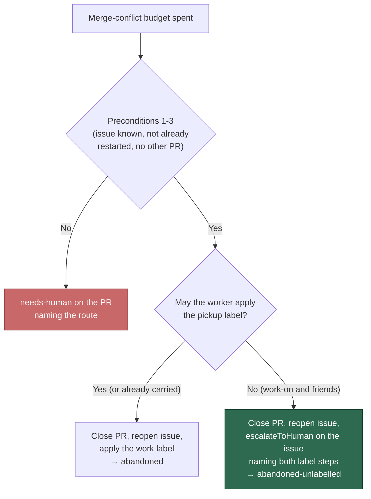

# PR Summary — Issue #1773

## Summary

The abandon-and-restart rung's fourth precondition no longer declines when the
originating issue's pickup label is one the worker may not apply. It now
abandons anyway: the restart marker is claimed on the issue first, the PR is
closed with `buildAbandonPrComment`, the issue is reopened if it was closed,
and it is handed to a human with `needs-human` plus a comment naming the label
to re-apply. The new outcome is `abandoned-unlabelled`; the decline reason
`requeue-not-permitted` is gone. Precondition 2 — one restart per originating
issue, fleet-attributed — is untouched, so a second exhaustion on the same
issue is still refused by the marker. Closes #1773.

Before this change the rung rested at `declined/requeue-not-permitted`, the PR
sat at `needs-human` and nothing was redone. Now the work is redone-able: the
PR is closed, the issue is back open in a human's queue, and two label
operations put it back in the pipeline.

Two departures from the issue's literal wording, both deliberate and both
raised by the independent reviewers:

- **`needs-human` is applied through `escalateToHuman`, not `addLabelToIssue`.**
  `needs_human_direct_label_check.ts` makes that helper the only sanctioned
  path to the label, and it is what ensures the label exists in the repository
  first — a direct add on a repo that has never used `needs-human` would have
  failed *after* the PR was closed, leaving the issue open and in nobody's
  queue.
- **The comments say to remove `needs-human` *and* re-apply the pickup label.**
  `needs-human` is an unconditional discovery blocker (`issue_filter.ts:190`,
  `find_issues_by_label.ts:169`), so naming only the pickup label would have
  promised a re-queue that could never happen.



## Evidence

Backend/CLI change — no web interface to screenshot. The evidence is the test
suite and the rendered comment bodies.

- `deno task test tests/conflict_abandon_restart_test.ts` — 37 passed, 0
  failed, including the four new `Issue #1773` cases.
- `deno task test tests/pr_merge_conflict_processor_test.ts
  tests/pr_merge_conflict_scan_test.ts
  tests/merge_conflict_decision_taxonomy_test.ts` — all passing, including the
  new processor and scan cases.
- `./quality.sh < /dev/null` — `Result: PASSED (with skipped checks)` after the
  final edit; the one skip is the pre-existing `config integration` check. The
  `needs-human chokepoint` check passes on merit now, not by regex escape.

The issue comment the unlabelled path posts (restart marker comment), rendered:

```text
<!-- vibe-merge-conflict-restart pr="org/repo#48" -->
♻️ **Reopened: the PR for this issue conflicted irreconcilably**
…
That PR is being closed and this issue reopened, but `work-on` is a label the
worker may not apply — so this issue rests at `needs-human` instead. **Remove
`needs-human` and re-apply `work-on` to re-queue this issue**, and the work is
redone off the current base rather than reconciled against it. …
```

`escalateToHuman` posts its own "why / next step" comment beside it and applies
the label.

## Acceptance Criteria

<!-- vibe-spec-review inputs="diff+issue-body" -->

- **met** — Issue labelled `work-on` at abandon time → PR closed, issue
  reopened, `needs-human` and a comment naming `work-on`; the worker never
  applies `work-on` — evidence: `worker/deno/tests/conflict_abandon_restart_test.ts::abandonAndRestart - an issue the worker cannot re-label is still abandoned, and named (Issue #1773)`
  — reviewer: met — reason: the reviewer noted that an issue *already*
  carrying `work-on` takes the plain `abandoned` path (nothing to apply); it
  read the "What Needs to Be Done" bullet as authoritative, as do I.
- **met** — Issue labelled `idle-task` → today's path (label re-applied, no
  `needs-human`) — evidence: `worker/deno/tests/conflict_abandon_restart_test.ts::abandonAndRestart - reopens a closed issue and applies an appliable work label`
  (pre-existing, untouched, asserts exactly one label add of `idle-task`) —
  reviewer: met
- **met** — A second exhaustion on the same issue is still refused by the
  restart marker — evidence: `worker/deno/tests/conflict_abandon_restart_test.ts::abandonAndRestart - an unlabelled abandon is still bound to one restart (Issue #1773)`
  — reviewer: met
- **met** — `./quality.sh < /dev/null` passes — evidence: full gate run after
  the final edit, `Result: PASSED (with skipped checks)` — reviewer: met
- **partial** — Docs: abandon-rung description in `docs/MERGE.md` /
  `docs/INTERNALS.md` — evidence: `docs/MERGE.md` and
  `docs/workflows/merge-conflicts.md` (prose, flowchart, precondition list,
  skip-reason row) — reviewer: partial — reason: `docs/INTERNALS.md` carries no
  abandon-rung description to update (`grep` for `1115` /
  `conflict_abandon_restart` finds nothing there); the canonical description
  lives in `docs/workflows/merge-conflicts.md`, which `docs/MERGE.md` links.
- **unrequested** — `awaitingLabel` added to the `abandoned-restarted` skip
  reason in `pr_merge_conflict_scan.ts`, with the branched log message and the
  taxonomy doc row — reviewer: unrequested — reason: handling the new outcome
  in the scan is forced (`exhaustedEscalationRoute` no longer accepts it, so
  the file would not type-check), and reporting a re-queue that did not happen
  would be a false operator-facing record; now covered by
  `tests/pr_merge_conflict_scan_test.ts::findConflictingPr - an abandon a human must re-queue names the label it awaits (Issue #1773)`.
- **unrequested** — `escalateNeedsHuman` / `ensureLabelExists` /
  `needsHumanLabel` seams on `AbandonRestartDeps`, and the configured label
  threaded from both callers — reviewer: unrequested — reason: the Standards
  reviewer's violations 1 and 2; without them the rung bypassed the
  `needs-human` chokepoint and ignored a renamed `needs_human_label`.

## Standards Review

<!-- vibe-standards-review inputs="diff+CODING-STANDARDS.md" -->

- **violation** — `needs-human` applied outside the `escalateToHuman`
  chokepoint, passing the gate only because the label sat in a variable —
  evidence: `worker/deno/lib/conflict_abandon_restart.ts:1145` (as reviewed) —
  reason: fixed here — the rung now calls `escalateToHuman` on the issue via
  `escalateAbandonedIssue`, which also ensures the label exists before applying
  it, closing the "label add fails after the PR is closed" hole the reviewer
  named.
- **violation** — hardcoded `"needs-human"` where the label is
  operator-configurable — evidence:
  `worker/deno/lib/conflict_abandon_restart.ts:102` (as reviewed) — reason:
  fixed here — renamed to `DEFAULT_NEEDS_HUMAN_LABEL`, with
  `deps.needsHumanLabel` threaded from `pr_merge_conflict_scan.ts` and
  `pr_merge_conflict_processor.ts`. The two pre-existing `?? "needs-human"`
  literals in the processor are left alone as out of scope.
- **violation** — the two modified public surfaces in
  `pr_merge_conflict_scan.ts` had no test — evidence:
  `worker/deno/lib/pr_merge_conflict_scan.ts:1264` (as reviewed) — reason:
  fixed here — new scan test asserts the `awaitingLabel` decision operand and
  that no `needs-human` lands on the PR.
- **violation** — 128-character line in a doc wrapped at 80 — evidence:
  `docs/workflows/merge-conflicts.md:31` (as reviewed) — reason: fixed here,
  paragraph rewrapped.
- **violation** — new mermaid node left unstyled beside 22 styled peers —
  evidence: `docs/workflows/merge-conflicts.md:83` (as reviewed) — reason:
  fixed here, `style Unlabelled` added.
- **violation** — the PR summary was not committed at review time — evidence:
  `docs/archive/pr-summaries/pr-summary-1773.md` untracked — reason: it is
  written and committed last by design; this file is that deliverable.
- **clean** — Australian English throughout (`labelled`, `unlabelled`,
  `behaviour`); fail-loud handling (every new `gh` step returns
  `failed(<step>, …)`, the `Result` from the escalation is checked, and a
  `needs-human` that did not land is now an explicit `issue-label` failure
  rather than a green outcome); commit safety (no hidden or credential paths
  staged, run-id trailer on every commit); no new outbound sink or unsanitised
  GitHub text in the comments; `pr close` still carries no `--delete-branch`
  and no force-push was added; tests call the real functions against a `gh`
  fake with no source-grepping, sleeps or spawned processes; docs updated in
  the same change and no live `requeue-not-permitted` reference remains.

## Test Plan

Added:

- `conflict_abandon_restart_test.ts::abandonAndRestart - an issue the worker
  cannot re-label is still abandoned, and named (Issue #1773)` — asserts the
  exact `gh` calls: one `pr close`, one `issue reopen`, exactly one label add
  and it is `labels[]=needs-human`, never `labels[]=work-on`; the label is
  ensured before it is applied; the issue comment carries the restart marker,
  the `Reopened:` heading and "Remove `needs-human` and re-apply `work-on` to
  re-queue this issue"; the PR comment does not promise a re-queue.
- `conflict_abandon_restart_test.ts::abandonAndRestart - an unlabelled abandon
  is still bound to one restart (Issue #1773)` — a second exhaustion returns
  `declined/already-restarted`, one `pr close` across both rounds.
- `conflict_abandon_restart_test.ts::abandonAndRestart - a needs-human that
  never landed is a named failure, not an abandon (Issue #1773)` — the
  escalation reports `labelAdded: false` → `failed/issue-label`.
- `conflict_abandon_restart_test.ts::abandonAndRestart - the escalation honours
  a renamed needs-human label (Issue #1773)` — a configured
  `escalate-to-a-person` reaches both the escalation and the comment text.
- `pr_merge_conflict_processor_test.ts::processMergeConflict - an abandon the
  worker cannot re-label names the issue and label (Issue #1773)` —
  `escalated` false, no `needs-human` on the PR, summary names issue #16 and
  `work-on`.
- `pr_merge_conflict_scan_test.ts::findConflictingPr - an abandon a human must
  re-queue names the label it awaits (Issue #1773)` — the decision record
  carries `awaitingLabel`, and the PR is not labelled.

Modified (documented business-logic change; no test removed):

- `abandonAndRestart - an unqueueable issue is refused before the close` became
  the first new test above: the rung's behaviour in exactly that scenario is
  what this issue changes, so the old assertion (`declined`, no close) is now
  the wrong outcome.
- `exhaustedEscalationRoute - the other two declines say what blocked them` →
  `- the other-PR decline says what blocked it`: its second half asserted the
  deleted `requeue-not-permitted` reason.

Unchanged and still passing: `abandonAndRestart - reopens a closed issue and
applies an appliable work label` covers the `idle-task` path.
