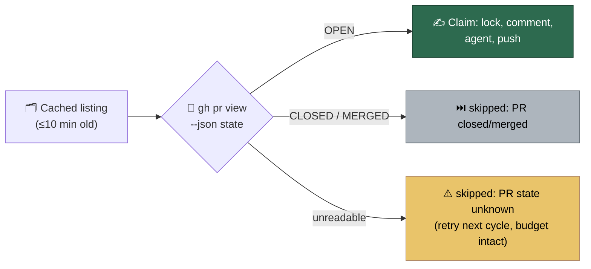

## Summary

The CI-fix, review-feedback, merge-conflict and auto-merge passes all select
work from the 10-minute listing cache in `issue_cache.ts`, and their only
freshness check was "does the head branch still exist on origin". VibeCoder#1732
was closed as superseded and, eight minutes later, the CI-fix pass claimed it
out of that cached listing and started writing to it.

New `worker/deno/lib/pr_live_state.ts` reads the live state at each claim point
— one uncached `gh pr view --json state`, taken **before** the first write.
`CLOSED`/`MERGED` is skipped with `skipped: PR closed` / `skipped: PR merged`
naming the repo and the number; an unreadable state is never treated as open,
logs `skipped: PR state unknown` at WARN and skips the PR for this cycle only,
with no CI retry recorded, no conflict attempt opened and no merge tried. The
listing cache is unchanged. Closes #1774.

## Evidence

Backend/CLI only — no web interface to screenshot. The evidence is the test
suite: the eleven new tests below were run against the unfixed code and against
the fix (see **Reproduction**), and `./quality.sh < /dev/null` passes.

Where the guard sits in each pass:

| Pass | Claim point | Writes it now precedes |
| --- | --- | --- |
| CI fix | top of `processCiFailure` | the cross-host lock comment, the retry counter, the agent run, the push |
| Review feedback | top of `processPrFeedback` | `claimPrComment`, the reaction, the reply |
| Merge conflict | `drainConflictingPrs`, before the repo lease | the clone, the attempt marker, the merge push |
| Auto-merge | `sweepAutoMerge`, before `attemptMerge` | `enableAutoMerge` |

## Reproduction

- **symptom** — a PR closed after the cached listing was taken still received a
  lock comment, a claim comment, an agent run and a push; VibeCoder#1732 was
  claimed by the CI-fix pass eight minutes after it was closed as superseded
- **status** — `verified` — every one of the eleven new regression tests was
  observed failing with the four guards disabled (`if (false && …)` at each
  claim point) and passing with them in place
- **regression test** —
  `worker/deno/tests/pr_ci_processor_test.ts::processCiFailure - a PR closed since the cached listing gets no push, comment or label (Issue #1774)`

## Acceptance Criteria

<!-- vibe-spec-review inputs="diff+issue-body" -->

- **partial** — for each of the four passes, a PR listed open but `CLOSED` on
  `pr view` is skipped with the log line and the injected gh/git log shows no
  push, comment or label call — evidence:
  `worker/deno/tests/pr_ci_processor_test.ts::processCiFailure - a PR closed since the cached listing gets no push, comment or label (Issue #1774)`
  (asserts exactly one `gh` call and nothing else),
  `worker/deno/tests/pr_feedback_processor_test.ts::processPrFeedback - a PR closed since the cached listing gets no push, comment or label (Issue #1774)`,
  `worker/deno/tests/merge_conflict_drain_test.ts::drainConflictingPrs - a PR closed since the listing is skipped, not resolved`,
  `worker/deno/tests/auto_merge_sweep_test.ts::a PR closed since the cached listing receives no merge attempt`
  — reviewer: partial — reason: the reviewer found one case the log line does
  not cover in production — a **merged** PR whose head branch GitHub auto-deleted
  reaches the pre-existing branch-missing skip (Issue #4376) in
  `run_core_production_deps.ts` before the processor is called, so it logs
  `branch_missing` rather than `skipped: PR merged`. No write reaches the PR
  either way, so the "no push, comment or label" half holds; moving the read
  ahead of `setupRepo` would add a second `pr view` per claim and a fifth call
  site the issue did not name, so it is left as it stands
- **met** — an open PR proceeds exactly as before — evidence:
  `worker/deno/tests/merge_conflict_drain_test.ts::drainConflictingPrs - an open PR is resolved exactly as before`
  (one read per claim, both PRs resolved),
  `worker/deno/tests/auto_merge_sweep_test.ts::an open PR is attempted exactly as before, after one state read`,
  and the ~20 existing fixtures updated to answer the read — reviewer: met
- **met** — `pr view` failure → skipped this cycle, no attempt or retry charged
  — evidence:
  `worker/deno/tests/pr_ci_processor_test.ts::processCiFailure - an unreadable PR state skips the cycle without spending a retry (Issue #1774)`
  asserts `getCiCheckRetryCount(...) === 0`;
  `worker/deno/tests/merge_conflict_drain_test.ts::drainConflictingPrs - an unreadable state skips the PR without an attempt`
  asserts no `attempted` decision — reviewer: met
- **met** — `./quality.sh < /dev/null` passes — evidence: full gate run after the
  final edit, every check PASSED (`config integration` SKIPPED as always) —
  reviewer: met — reason: the reviewer could not run the gate against the
  working tree mid-edit; it was run here after the last change and passed
- **unrequested** — `docs/audits/security-sweep-1774-pr-live-state.md` and the
  `12p` slice in `docs/audits/lib-sweep-coverage.json` — reviewer: unrequested —
  reason: `tests/lib_sweep_coverage_test.ts` fails any new `worker/deno/lib/`
  module that no swept slice claims, so the gate requires them
- **unrequested** — `guardPrStillOpen`, `prLiveSkipReason`, `logPrLiveSkip` and
  `isPrLiveStateRead` beside `readPrLiveState` — reviewer: unrequested — reason:
  they are the one place the skip line and the argv are decided, so four passes
  and the mock fleet cannot drift apart
- **unrequested** — `SweepAutoMergeSummary.prsSkippedNotOpen` and its line in the
  "Auto-merge sweep complete" record — reviewer: unrequested — reason: a sweep
  that attempted nothing because everything had landed must not read like a
  sweep that found nothing
- **unrequested** — the `pr-not-open` member of `ConflictSkipReason` — reviewer:
  unrequested — reason: the drain's per-PR decision is a required return value,
  so a new exit cannot be added without a taxonomy member; it is counted as
  queued so the skip is recorded at INFO where a stall investigation reads it
- **unrequested** — `createMockDeps`' default `runGhCommand` answers the state
  read with `OPEN` — reviewer: unrequested — reason: without it every fixture
  driving a PR pass would silently take the skip path; `createMockDeps` has no
  non-test caller
- **unrequested** — the Mermaid diagram in `docs/INTERNALS.md` beside the
  paragraph the issue asked for — reviewer: unrequested — reason: the repo's
  standards ask for a diagram where one aids understanding of a flow

## Standards Review

<!-- vibe-standards-review inputs="diff+CODING-STANDARDS.md" -->

- **violation** — the `gh pr view` argv was rebuilt rather than reused —
  evidence: `worker/deno/lib/pr_live_state.ts:88` — reason: fixed here;
  `readPrLiveState` now calls `makeGhPrStateFetcher` from `pr_branch_update.ts`,
  the module it already imported `classifyPrLiveState` from
- **violation** — `guardPrStillOpen`'s log-and-skip branch was re-implemented in
  the sweep and the drain — evidence: `worker/deno/lib/auto_merge_sweep.ts:186`
  — reason: fixed here; all four passes now call the shared `logPrLiveSkip`
- **violation** — the `isPrStateRead` predicate was duplicated into production
  `lib/` — evidence: `worker/deno/lib/issue_worker_wiring.ts:743` — reason:
  fixed here; `isPrLiveStateRead` lives beside the call it recognises in
  `pr_live_state.ts` and the test support re-exports it
- **violation** — `makeStateGh` and the write-call filter were byte-identical
  copies in two test files — evidence:
  `worker/deno/tests/pr_ci_processor_test.ts:1837` — reason: fixed here; both
  moved to `tests/support/pr_live_state_stub.ts` as `recordingStateGh` and
  `prWriteCalls`
- **violation** — the drain's guard was an optional seam, so it was off by
  omission — evidence: `worker/deno/lib/merge_conflict_drain.ts:189` — reason:
  fixed here; `prLiveState` is required, and the 41 existing drain call sites
  were updated
- **violation** — the merge-conflict skip-reason table did not document the new
  `pr-not-open` kind — evidence: `docs/workflows/merge-conflicts.md:592` —
  reason: fixed here; the table has its row
- **violation** — `prLiveSkipReason` had an unreachable `"skipped: PR open"`
  branch — evidence: `worker/deno/lib/pr_live_state.ts:106` — reason: fixed
  here; it now takes a `PrNotOpenReading`, so the branch cannot exist
- **violation** — the same `Issue #1774` comment was repeated 23 times across
  fixtures — evidence: `worker/deno/tests/pr_feedback_processor_test.ts` —
  reason: fixed here; the repeated comment lines were removed, leaving the
  one-line guard
- **violation** — the state read sat inside the auto-merge attempt's `try`, so a
  throwing seam would be logged as "Auto-merge attempt threw" — evidence:
  `worker/deno/lib/auto_merge_sweep.ts:180` (raised by the spec reviewer) —
  reason: fixed here; the read has its own `try` and a throw becomes an
  `unknown` reading
- **clean** — Australian English throughout; TDD with tests that drive real code
  and assert on outcomes, never on source text; fail-loud error handling (a `gh`
  failure is returned with its cause and never coerced to open); no hidden or
  secret paths staged; `pr_live_state.ts` is one 170-line module with one job;
  `docs/INTERNALS.md` updated alongside the code

## Test Plan

New:

- `worker/deno/tests/pr_live_state_test.ts` — 9 tests: the argv, `OPEN`,
  `CLOSED`/`MERGED` reported apart, a throwing `gh`, an unrecognised state, the
  three skip lines, and both logger branches of `guardPrStillOpen`.
- `worker/deno/tests/pr_ci_processor_test.ts` — a closed PR receives exactly one
  `gh` call and no comment, label, agent run or push; an unreadable state leaves
  the retry counter at 0.
- `worker/deno/tests/pr_feedback_processor_test.ts` — a closed PR gets no claim
  comment, reaction or reply; an unreadable state claims nothing.
- `worker/deno/tests/merge_conflict_drain_test.ts` — closed and merged PRs never
  reach the lease or the resolution; an unreadable state opens no attempt; an
  open PR is resolved exactly as before, one read per claim.
- `worker/deno/tests/auto_merge_sweep_test.ts` — closed, merged and unreadable
  PRs receive no merge attempt and are counted in `prsSkippedNotOpen`; an open
  PR is attempted after one read.

Modified (no test was removed or weakened):

- `worker/deno/tests/merge_conflict_decision_taxonomy_test.ts` — the new
  `pr-not-open` reason gains its sample and its exhaustive-switch arm.
- ~20 fixtures across the PR passes now answer the claim-point state read
  through `worker/deno/tests/support/pr_live_state_stub.ts`; the 41 existing
  `drainConflictingPrs` call sites supply the now-required `prLiveState` seam.

Full gate: `./quality.sh < /dev/null` — PASSED (`config integration` SKIPPED, as
it is on every run).
