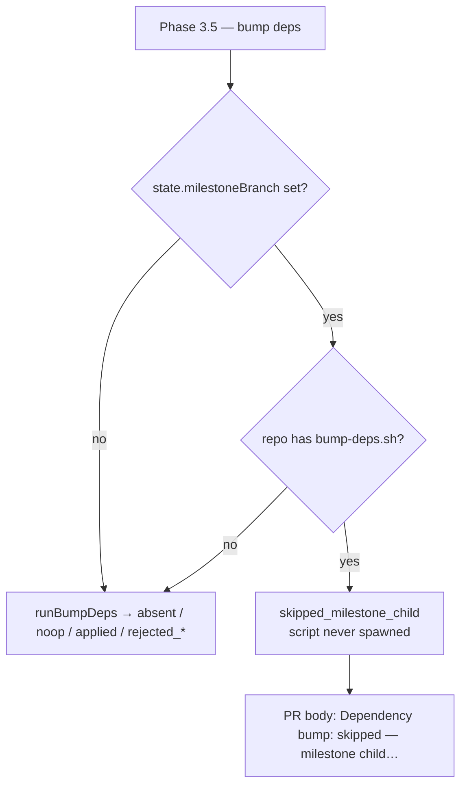

## Summary

The dependency-bump phase is now a deliberate no-op on a milestone child run.
A child PR targets `milestone/**`, where the default branch's own PRs already
bump dependencies and the every-cycle milestone sync carries those bumps down —
so bumping again in the child rewrote the same lockfile lines and handed every
child PR a conflict against the sync for no new versions.

`workOnIssueBumpDeps` returns before `runBumpDeps` when `state.milestoneBranch`
is set **and** the repo actually has a `bump-deps.sh`, records the new
`BumpInfo` status `skipped_milestone_child`, and the completion phase appends
the reason to the PR body. A milestone child in a repo with no bump script still
reports `absent`, so a PR never claims a skip that never happened.

Closes #1775.

## Evidence

Backend/CLI change with no web interface to screenshot. The evidence is the
tests below, all passing, plus a full `./quality.sh < /dev/null` run
(`Result: PASSED (with skipped checks)` — `config integration` is the
pre-existing environment-gated skip).

## Acceptance Criteria

<!-- vibe-spec-review inputs="diff+issue-body" -->

- **met** — Milestone child run → `bump-deps.sh` not executed,
  `bumpInfo.status === "skipped_milestone_child"`, PR body carries the note —
  evidence: `worker/deno/lib/phases/bump_deps_phase.ts` early return;
  `worker/deno/tests/bump_deps_phase_test.ts::workOnIssueBumpDeps - skips the script when the PR targets a milestone branch`
  and
  `worker/deno/tests/completion_phase_bump_comment_test.ts::completion - PR body carries the skip note on a milestone child run`
  (asserts the `gh pr create --body` argv) — reviewer: met
- **met** — Default-branch run → unchanged — evidence:
  `worker/deno/tests/bump_deps_phase_test.ts::workOnIssueBumpDeps - a default-branch run still bumps (no milestone branch)`
  and the unchanged Scenario 1–3 tests — reviewer: met
- **met** — `./quality.sh < /dev/null` passes — evidence: full gate run after
  the final edit, `Result: PASSED (with skipped checks)` — reviewer: partial —
  reason: the reviewer saw only the diff and could not run the gate; it was run
  here and passed.
- **partial** — Docs: `docs/INTERNALS.md` bump-phase paragraph and
  `docs/SUPPLY-CHAIN-GATE.md` "where it states the bump runs on every PR" —
  evidence: `docs/INTERNALS.md` bump-phase paragraph updated — reviewer:
  partial — reason: `docs/SUPPLY-CHAIN-GATE.md` contains no mention of
  `bump-deps.sh` or a per-PR bump (it documents the SHA-pin / frozen-lockfile
  gate only), so there was no claim there to correct; the surfaces that do make
  the every-PR claim — `prompts/coding_guidelines/prompt.md`,
  `docs/workflows/milestones.md`, `docs/TROUBLESHOOTING.md` — were updated
  instead.
- **unrequested** — `docs/workflows/milestones.md` per-issue happy path gains
  the skip and its rationale — reviewer: unrequested — reason: the milestone
  operator manual is where a reader looks for what a child run does; leaving it
  silent would make the new behaviour undiscoverable.
- **unrequested** — `prompts/coding_guidelines/prompt.md` gains two lines
  saying not to bump on a milestone child run — reviewer: unrequested —
  reason: the adjacent paragraph asserts the worker bumps on every PR, which is
  now false; kept to two lines because that block is injected into every run.
- **unrequested** — `docs/TROUBLESHOOTING.md` gains a row for "PRs into a
  `milestone/**` branch never carry a dep bump" — reviewer: unrequested —
  reason: that table is the operator index of bump outcomes, and the new one
  looks exactly like the failure modes above it.
- **unrequested** — the skip is gated on the repo actually having a
  `bump-deps.sh` — reviewer: unrequested — reason: without the guard a repo
  with no bump script got a PR body asserting a suppression that never
  happened; the literal criterion is still met for every repo that has a
  script.
- **unrequested** — a milestone skip leaves the `bump-deps.sh` rejection streak
  untouched rather than clearing it — reviewer: unrequested — reason: the
  streak records script failures, and a run where the script never executed is
  evidence of neither failure nor recovery.

## Standards Review

<!-- vibe-standards-review inputs="diff+CODING-STANDARDS.md" -->

- **violation** — no `docs/archive/pr-summaries/pr-summary-1775.md` in the first
  commit — evidence: `docs/archive/pr-summaries/` — reason: fixed here; this
  file is the summary.
- **violation** — test banner read "Scenario 5" with no Scenario 4 in the file
  — evidence: `worker/deno/tests/bump_deps_phase_test.ts:826` — reason: fixed;
  the banner is now unnumbered.
- **violation** — the test file docstring still claimed "the three scenarios"
  after the file grew — evidence:
  `worker/deno/tests/bump_deps_phase_test.ts:4` — reason: fixed; it now names
  the milestone-child skip.
- **violation** — `buildBumpSkipNote`'s doc comment called the return a
  "markdown section" when it is a bare paragraph — evidence:
  `worker/deno/lib/bump_deps.ts:285` — reason: fixed.
- **violation** — `docs/TROUBLESHOOTING.md` bump-outcome table gained no row
  for the new outcome — evidence: `docs/TROUBLESHOOTING.md:543` — reason:
  fixed; the row is added.
- **violation** — the note text is restated verbatim in prose — evidence:
  `docs/workflows/milestones.md:92` — reason: stands. Quoting the exact
  user-visible string is what makes the doc searchable from a PR body; the
  constant is the single source of truth for the code, and the doc quotes it as
  documentation does elsewhere in this repo.
- **violation** — the "every other outcome" test lists the six statuses by hand,
  so a seventh would not be covered — evidence:
  `worker/deno/tests/bump_deps_test.ts:615` — reason: stands. The production
  switch keeps exhaustiveness via `assertNever`
  (`worker/deno/lib/phases/bump_deps_phase.ts`), which fails `deno check` on a
  new status; duplicating that in the test buys no extra safety.
- **violation** — worker-internal phase routing added to the language-agnostic
  injected prompt — evidence: `prompts/coding_guidelines/prompt.md:972` —
  reason: reduced to two lines. It stays because the paragraph directly above
  it tells the agent the worker bumps on every PR, which is now wrong.
- **clean** — Australian English throughout; new tests call real functions and
  assert on results and side effects (no source grepping, no sleeps, no env
  mutation); fail-loud (the skip records a positive status and is stated in the
  PR body rather than leaving `bumpInfo` undefined); exhaustive switch extended
  ahead of `assertNever`; no hidden or credential paths staged; commit carries
  the issue reference and the `Vibe-Coder-Run-Id` trailer.

## Test Plan

Added to `worker/deno/tests/bump_deps_phase_test.ts`:

- `workOnIssueBumpDeps - skips the script when the PR targets a milestone branch`
  — asserts `runScript` is never called and `bumpInfo.status` is
  `skipped_milestone_child`.
- `workOnIssueBumpDeps - milestone child with no script reports absent, not skipped`
  — a repo with no `bump-deps.sh` reports `absent`.
- `workOnIssueBumpDeps - a milestone skip leaves the rejection streak untouched`
  — a real streak file: two rejections, then a milestone run that neither
  clears nor advances it.
- `workOnIssueBumpDeps - a default-branch run still bumps (no milestone branch)`
  — the unchanged default-branch path.

Added to `worker/deno/tests/bump_deps_test.ts`:

- `buildBumpSkipNote - states why a milestone child skipped the bump`
- `buildBumpSkipNote - empty for every other outcome` (including `undefined`)
- `buildBumpRejectionComment - a milestone skip is not a rejection`

Added to `worker/deno/tests/completion_phase_bump_comment_test.ts`:

- `completion - PR body carries the skip note on a milestone child run` —
  reads the `--body` value out of the recorded `gh pr create` argv.
- `completion - PR body carries no skip note on a default-branch run`

No existing test was modified beyond the two assertion updates the
script-existence guard required, and none was removed.
