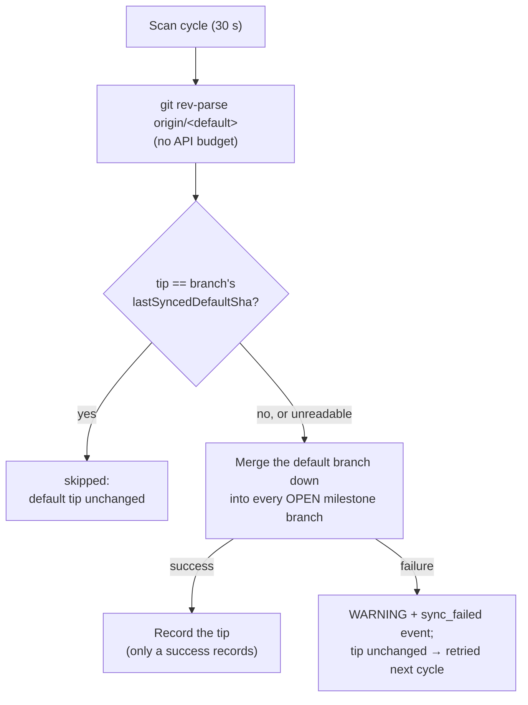

# Sync every milestone branch on every cycle in which the default-branch tip moved

## Summary

The periodic milestone-branch sync paced itself on two things that had nothing
to do with drift: an hourly per-branch cooldown held in memory, and a
closed-issue query that decided whether a milestone had "started". On a default
branch taking ~27 commits a day the first left a branch up to an hour behind for
no reason but the clock, and the second left a milestone with nothing closed yet
out of the sweep entirely — the branch nobody was watching.

Both are gone. The cadence is now one comparison: the default branch's tip as
local git reports it (`git rev-parse origin/<default>`, after the fetch
`ensureDefaultBranchCurrent` performs anyway), against the tip each branch was
last **successfully** synced against in the `milestone_sync_failures.json`
ledger (`lastSyncedDefaultSha`, the field Issue #1766 added). Priority 1.72
already dispatches every 30-second cycle, so a push to the default branch is
merged down into every open milestone branch within one cycle. Closes #1776.

What changed, concretely:

- `worker/deno/lib/milestone_branch_sync.ts` — `findActiveMilestoneBranches`
  returns every **open** milestone (idle-task milestones still filtered,
  Issue #2125); the closed-issue query and the activity-gate observation path
  are removed. `shouldSyncMilestone` now takes the branch's ledger entry and the
  current tip. `cooldownSeconds` and `lastSyncTimes` are gone from
  `MilestoneBranchSyncDeps`, replaced by an optional `defaultTipShaFn`.
- `worker/deno/lib/milestone_default_tip.ts` (new) — `readLocalDefaultTip`
  fetches `origin/<default>` via `ensureDefaultBranchCurrent` (which also
  validates the branch name as a ref component) and returns the 40-hex tip, or
  `undefined` when git cannot report one.
- `milestone_sync_cooldown_seconds` retired from `types.ts`, `lib/config.ts`,
  `lib/config_defaults.ts`, `lib/validation.ts`, `lib/config_unknown_keys.ts`,
  `lib/run_core_production_deps.ts` and `commands/milestone_branch_sync.ts`. A
  `.config.json` still carrying it loads normally and reports it once as an
  unknown key — a warning, never an error (it is deliberately **not** added to
  `REMOVED_CONFIG_KEYS`, which refuses the start).
- `lib/milestone_activity_gate.ts` and its test deleted — grep showed no
  importer left once the sync stopped using it.
- Docs: the Cadence paragraph and the closed-issue-gate section of
  `docs/INTERNALS.md`, the sync walk-through and config table of
  `docs/workflows/milestones.md`, and the Issue #1488 worked example in
  `docs/GH-API-OPTIMISATION.md` (whose example this change retires by deleting
  the question rather than gating it).

The one-shot `sync-milestone-branches` command keeps no ledger and no tip
reader: asking for it is asking for a sync now, so it merges down regardless of
the tip. The self-pacing pass is the periodic one in
`run_core_production_deps.ts`.

## Evidence

Backend change with no web interface to screenshot. The evidence is the test
suite and the gate:

- `deno test tests/milestone_sync_cadence_test.ts` → 6 passed, 0 failed. The
  file is the behavioural statement of the change: an unchanged tip syncs
  nothing, a moved tip syncs every open milestone (including one with zero
  closed issues) and makes no `--state closed` call, a success records the tip,
  a failure does not, an unreadable tip syncs and logs the reason git gave, and
  a closed milestone's ledger entry does not outlive it.
- `deno test tests/milestone_default_tip_test.ts` → 5 passed, 0 failed. Real
  git: a bare upstream, a clone, a pushed commit, an argument-injection branch
  name, and a `main` held by another worktree so the local ref cannot move.
- `deno test tests/milestone*_test.ts tests/config_unknown_keys_test.ts tests/lib_sweep_coverage_test.ts`
  → 571 passed, 0 failed (the last of those is the gate that caught the missing
  sweep slice).
- `./quality.sh < /dev/null` → **PASSED**: all 21 checks, with
  `config integration` SKIPPED as it is on this host.

No web interface is involved, so there is nothing to screenshot; the sequence
diagram above is the visual evidence for the cadence change.

## Acceptance Criteria

<!-- vibe-spec-review inputs="diff+issue-body" -->

- **met** — Default tip unchanged since the last successful sync → `syncBranchFn` not called, log `skipped: default tip unchanged` — evidence: `worker/deno/lib/milestone_branch_sync.ts` (the cadence guard in `syncMilestoneBranches`) and `worker/deno/tests/milestone_sync_cadence_test.ts::syncMilestoneBranches - an unchanged default tip syncs nothing (Issue #1776)` — reviewer: met
- **met** — Tip moved → every open milestone's branch is synced on that cycle, including one with zero closed issues — evidence: `worker/deno/tests/milestone_sync_cadence_test.ts::syncMilestoneBranches - a moved tip syncs every open milestone, including one with no closed issues (Issue #1776)` — reviewer: met
- **met** — A failed sync leaves `lastSyncedDefaultSha` unchanged so the next cycle retries — evidence: `worker/deno/tests/milestone_sync_cadence_test.ts::syncMilestoneBranches - a failed sync leaves the recorded tip alone so the next cycle retries (Issue #1776)`; only `recordSuccess` writes the field — reviewer: met
- **met** — `milestone_sync_cadence_test.ts` and `milestone_branch_sync_test.ts` updated; cooldown tests removed — evidence: `worker/deno/tests/milestone_branch_sync_test.ts` (four ledger-based `shouldSyncMilestone` cases replace the four cooldown ones) and the rewritten `milestone_sync_cadence_test.ts` — reviewer: met
- **met** — `./quality.sh < /dev/null` passes — evidence: full gate run after the final edit — reviewer: missing — reason: the reviewer ran against the first commit, where `lib_sweep_coverage_test.ts` was red (no slice claimed `milestone_default_tip.ts`, and the ledger still named the deleted `milestone_activity_gate.ts`); fixed in `4ed9dd0` with sweep slice 12q and its written record, and the gate re-run green here
- **unrequested** — `worker/deno/lib/milestone_default_tip.ts` calls its own `ensureDefaultBranchCurrent`, so a repo fetches `origin/<default>` once more per cycle than before — reviewer: unrequested — reason: the issue says "after the existing `ensureDefaultBranchCurrent`", but the existing one lives *inside* `syncMilestoneBranchWithDefault`, i.e. after the decision the tip is needed for. A cheap local fetch is the price of reading a current tip before deciding; it is also what makes the stuck-local-ref check below possible
- **unrequested** — the tip is the **local** `<default>` ref, and a disagreement with `origin/<default>` is a failure rather than a tip — evidence: `worker/deno/lib/milestone_default_tip.ts`, `worker/deno/tests/milestone_default_tip_test.ts::readLocalDefaultTip - a local ref that could not be moved is a loud failure, not the remote tip (Issue #1776)` — reviewer: unrequested — reason: the Spec reviewer found the first cut wrong here: the merge uses the local ref, `ensureDefaultBranchCurrent` can fail to move it and still report success (Issue #394), so recording the remote tip would claim a merge-down that never happened and park the branch until the next push
- **unrequested** — ledger entries for milestone branches a repo's listing no longer returns are pruned — evidence: `worker/deno/lib/milestone_branch_sync.ts` (`live` set before the milestone loop), `worker/deno/tests/milestone_sync_cadence_test.ts::syncMilestoneBranches - a closed milestone's ledger entry does not outlive it (Issue #1776)` — reviewer: unrequested — reason: entries now outlive a success because they carry the tip, so without this `milestone_sync_failures.json` grows without bound, one entry per milestone branch ever synced
- **unrequested** — `docs/GH-API-OPTIMISATION.md` rewritten (its Issue #1488 worked example and its cache-invalidation row both named the deleted module), and a new sweep record `docs/audits/security-sweep-1776-milestone-default-tip.md` with slice 12q in `docs/audits/lib-sweep-coverage.json` — reviewer: unrequested — reason: "A Code Change Owes a Docs Change" for the first, and `lib_sweep_coverage_test.ts` fails the build without the second
- **unrequested** — the one-shot `sync-milestone-branches` command is given neither a tip reader nor a ledger, so it always syncs — evidence: `worker/deno/commands/milestone_branch_sync.ts` — reviewer: unrequested — reason: invoking that command by hand is a request to sync now; the self-pacing pass is the periodic one. The cost is one no-op merge attempt if the periodic pass follows it immediately

## Standards Review

<!-- vibe-standards-review inputs="diff+CODING-STANDARDS.md" -->

- **violation** — `docs/audits/lib-sweep-coverage.json` claimed the deleted `milestone_activity_gate.ts` and no slice claimed the new `milestone_default_tip.ts`, so `deno test tests/lib_sweep_coverage_test.ts` was red in the committed tree — evidence: `docs/audits/lib-sweep-coverage.json:267` (pre-fix) — reason: fixed in `4ed9dd0`; slice **12q** added with its written sweep record, and the dangling claim removed
- **violation** — errors were swallowed: `readLocalDefaultTip` discarded `ensureDefaultBranchCurrent`'s `Result` error and `git rev-parse`'s exit code and stderr, so a failed fetch reached the operator as "git reported no commit" — evidence: `worker/deno/lib/milestone_default_tip.ts:39,45` (pre-fix) — reason: fixed in `4ed9dd0`; the function now returns `Result<string>` and every branch names the ref and what git said, which the sync logs verbatim. Asserted by `milestone_sync_cadence_test.ts::... a tip git cannot report is synced rather than silently skipped (Issue #1776)`
- **violation** — DRY: `recordSuccess` redefined what a success does to the ledger instead of using `resetConflictLedgerOnSuccess`, silently dropping `rollbacks`, `lastAttempt` and the open-attempt marker that Issue #1766 documents as surviving — evidence: `worker/deno/lib/milestone_branch_sync.ts` (`recordSuccess`, pre-fix) — reason: fixed in `4ed9dd0`; the helper now composes the ledger's own writer and only clears the failure-streak and escalation flags, which a success has always cleared
- **violation** — "A Code Change Owes a Docs Change": the section heading "The merge-down happens on closure" and its "Two behaviours … (Issue #1558)" lead-in still described the trigger this change removed — evidence: `docs/INTERNALS.md:3067,3071` (pre-fix) — reason: fixed in `4ed9dd0`
- **violation** — comment accuracy: "an idle cycle costs no API call at all" overstated the saving — the REST milestone listing is still spent per repo — evidence: `worker/deno/lib/milestone_branch_sync.ts` (cadence-guard comment, pre-fix) — reason: fixed in `4ed9dd0`; the comment now says only the per-milestone branch probe is avoided
- **violation** — the PR summary (`docs/archive/pr-summaries/pr-summary-1776.md`) did not exist when the reviewer read the tree, and with it the required documentation of the tests this change removes — evidence: absent file — reason: this file; the removed tests are listed under **Test Plan** with the reason each no longer describes the system
- **clean** — Australian English throughout code, comments, tests and docs; Deno-native tooling only (`deno lint`, `deno fmt --check`, `deno check`, `deno test` — no Node tooling added); every test calls the real functions and asserts on returned state or persisted files, none greps source; no wall-clock sleep, poll loop or absolute timing threshold (the `Date.now()`-bracketed cooldown assertion is removed, not replaced); new public functions carry happy-path, error-path and edge cases; the branch name reaches git only after `assertSafeRefComponent`, with an argument-injection test; no hidden path staged; both commit messages name Issue #1776 and carry the `Vibe-Coder-Run-Id` trailer

## Test Plan

Added — `worker/deno/tests/milestone_sync_cadence_test.ts` (rewritten, 6 tests):

- an unchanged default tip syncs nothing and logs `default tip unchanged`
- a moved tip syncs every open milestone, including one with zero closed issues,
  and makes no `--state closed` call
- a successful sync records the tip, so the next cycle skips it
- a failed sync leaves the recorded tip alone, so the next cycle retries
- a tip git cannot report is synced rather than silently skipped, and the reason
  git gave reaches the log
- a closed milestone's ledger entry does not outlive it

Added — `worker/deno/tests/milestone_default_tip_test.ts` (5 tests, real git):

- reports origin's tip; follows it when it moves
- an unreadable clone fails with a reason, not a guess
- a branch name that is not a safe ref component is refused
  (`--upload-pack=touch /tmp/pwned`)
- a local ref that could not be moved (another worktree holds `main`) is a loud
  failure, not the remote tip — the regression test for the defect the Spec
  reviewer found

Added — `worker/deno/tests/config_unknown_keys_test.ts`: a retired
`milestone_sync_cooldown_seconds` is warned about once and still validates.

Changed — `worker/deno/tests/milestone_branch_sync_test.ts`: the four
`shouldSyncMilestone` cooldown tests are replaced by four ledger-based ones (no
entry, matching tip, a failed branch carrying no tip, an unreadable tip);
`findActiveMilestoneBranches` now asserts **every** open milestone is returned,
that a milestone with zero closed issues is included, and that no closed-issue
query is made.

**Removed tests, and why** (business logic deliberately deleted — recorded here
as the standards require):

- `worker/deno/tests/milestone_activity_gate_test.ts` (whole file) — the module
  it tested is deleted; no importer remained.
- `syncMilestoneBranches - skips milestones on cooldown`,
  `- updates lastSyncTimes after successful sync`,
  `- does not update lastSyncTimes on failure` — the cooldown and its
  `lastSyncTimes` map no longer exist; their replacements are the cadence tests
  above.
- the six `findActiveMilestoneBranches - … (Issue #1488)` gate cases and the
  three `syncMilestoneBranches - … (Issue #1488)` cycle cases — they assert the
  closed-issue query is or is not spent, and that query is gone.

No test was weakened or commented out.
