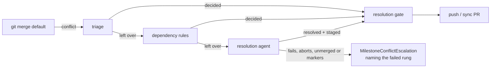

## Summary

`syncMilestoneBranchWithDefault` no longer aborts the moment the deterministic
triage cannot decide one file. What the triage leaves undecided now climbs the
same ladder the PR merge-conflict pass climbs, in the very clone the merge
conflicted in: the **deterministic dependency rules**, then the **resolution
agent** (injectable as `agentFn`, so tests need no model). Only a file *every*
rung leaves undecided aborts the merge and reaches a human, and the escalation
then names the rung that failed. Each settled file carries the rung that
settled it — `triage: <case>`, `rule: <reason>` or `agent` — on the merge
commit, in the sync's log line and in the existing `auto` report comment.

Closes #1777.

## Evidence

Backend/CLI change — no web interface to screenshot. The evidence is the test
run below (real git repositories throughout: a bare remote, a clone, a
milestone branch and a default branch that has moved on; the rules and agent
rungs injected).

```text
deno test -A tests/milestone_sync_conflict_resolution_test.ts   → 9 passed | 0 failed
deno test -A tests/milestone_conflict_ladder_test.ts            → 10 passed | 0 failed
deno test -A tests/milestone_conflict_triage_test.ts …          → 39 passed | 0 failed
```



Behaviour worth a reviewer's attention:

- The unmerged and marker checks run **before** anything is staged. `git add`
  on a conflicted path *is* how a conflict is marked resolved, so staging first
  would answer the question with its own side effect — an agent that touched
  nothing would have had the working-tree side committed as if it had decided.
- A git call that could not run is an error, never a clean tree
  (`listUnmergedPaths`, `hasConflictMarkers` both return `Result`).
- The agent's work is staged the way `commitAndPushPending` stages it: `git add
  -A`, worker state unstaged (Issue #1654), then the pre-commit safety gate — so
  a helper the agent extracted is committed rather than silently dropped, and a
  stray `.heartbeat_*` still cannot cost the resolution.

## Acceptance Criteria

<!-- vibe-spec-review inputs="diff+issue-body" -->

- **met** — A lockfile/manifest conflict left by the triage is resolved by the rules and pushed in the same call; the outcome lists `rule:` and no agent runs — evidence: `worker/deno/tests/milestone_sync_conflict_resolution_test.ts::a manifest conflict the triage cannot decide is settled by the dependency rules and pushed, with no agent run (Issue #1777)` — reviewer: met
- **met** — A source conflict neither triage nor rules can decide goes to the agent; a resolving agent leads to gate → push, an aborting agent leaves the branch at its pre-merge SHA and returns `MilestoneConflictEscalation` naming `agent` — evidence: same file, `a source conflict …handed to the agent, then gated and pushed` and `an agent that aborts leaves the branch at its pre-merge SHA and names the failed rung` — reviewer: partial — reason: the reviewer saw the abort case assert SHAs only and the "agent lied" guards untested; both were fixed after its review — the abort case now asserts a clean working tree and matches `agent: ` (which the no-agent wording cannot satisfy), and `worker/deno/tests/milestone_conflict_ladder_test.ts` covers the unmerged, marker, staging and terminated rungs
- **met** — A resolution the gate refuses is still `MilestoneConflictEscalation` with `gateFailure` set — evidence: `worker/deno/lib/git_pull.ts` gate-failure branch unchanged in shape; `…resolution_test.ts::a resolution nothing could verify is refused, not pushed` — reviewer: met — reason: the reviewer noted the per-file reasons in that escalation were stale (the triage's pre-ladder verdict); fixed by building the analyses from the settled decisions
- **met** — `./quality.sh < /dev/null` passes — evidence: full gate run after the final edit — reviewer: missing — reason: the reviewer was told not to run the gate; it was run here and passed
- **unrequested** — `logger` added as a parameter of `syncMilestoneBranchWithDefault` and threaded to the rules rung — reviewer: unrequested — reason: the rules rung's own deferral warnings are the only record of why a file skipped a rung; without it those diagnostics are dropped
- **unrequested** — `unstageWorkerStateFiles` / `UnstageWorkerStateResult` exported from `git_push.ts` — reviewer: unrequested — reason: needed to make the agent rung's staging genuinely `commitAndPushPending`-equivalent, which the issue asks for; no behaviour changed for existing callers
- **unrequested** — outcome and report prose rewritten beyond the per-file rung list — reviewer: unrequested — reason: the old wording claimed every file was decided "by a rule", which is no longer what happened

## Standards Review

<!-- vibe-standards-review inputs="diff+CODING-STANDARDS.md" -->

- **violation** — the new `lib/` module was claimed by no sweep slice — evidence: `docs/audits/lib-sweep-coverage.json:272` — reason: fixed here; `milestone_conflict_ladder.ts` added to the slice, `tests/lib_sweep_coverage_test.ts` green
- **violation** — `stillUnmerged` swallowed a failed git call, reading "the check could not run" as "nothing is unmerged" — evidence: `worker/deno/lib/milestone_conflict_ladder.ts:91` — reason: fixed here; replaced by `listUnmergedPaths`, which returns a `Result`
- **violation** — `hasConflictMarkers` could not tell `git grep`'s "no match" (exit 1) from a real failure (exit ≥ 2) — evidence: `worker/deno/lib/milestone_conflict_ladder.ts:113` — reason: fixed here; exit codes are distinguished and a failed check is an error
- **violation** — no test file for the new module, so its error rungs were uncovered — evidence: `worker/deno/lib/milestone_conflict_ladder.ts` — reason: fixed here; `worker/deno/tests/milestone_conflict_ladder_test.ts` adds 10 cases over real git
- **violation** — the operator-facing sync doc still said an undecidable conflict aborts the merge — evidence: `docs/workflows/milestones.md:252` — reason: fixed here; the ladder, its refusals and the per-file rungs are documented, and the mermaid flow updated
- **violation** — `stillUnmerged` duplicated the private `listConflictedFiles` in `git_pull.ts` — evidence: `worker/deno/lib/git_pull.ts:396` — reason: fixed here; `git_pull.ts` now uses the ladder's single listing helper and the private copy is gone
- **violation** — `syncMilestoneBranchWithDefault` now takes eight positional parameters, four of them injection seams — evidence: `worker/deno/lib/run_core_production_deps.ts:4563` passing `undefined, undefined` — reason: stands; converting the seam to an options object would rewrite every existing caller and test for this issue's benefit alone, which is out of its scope
- **clean** — Australian English throughout; tests call real code against real git repositories (no source grepping); fail-loud error handling on every new path; no hidden or secret path staged, no `git add -f`, no `--no-verify`; run-id trailer on both commits; the new module is single-purpose at ~330 lines; `deno fmt`, `deno lint` and `deno check` clean on every changed file

## Test Plan

- Added `worker/deno/tests/milestone_conflict_ladder_test.ts` — 10 cases over real git: the listing and marker helpers (including their fail-loud paths outside a repository), a rules-settled file that never reaches the agent, the no-agent stop, an agent that touches nothing, an agent that stages markers, a resolving agent whose extracted helper is staged with it, a worker-state file that does not cost the resolution, and a run the worker ended.
- Added three cases to `worker/deno/tests/milestone_sync_conflict_resolution_test.ts` — a manifest conflict settled by the rules and pushed with no agent run; a source conflict handed to the agent, gated and pushed; and an agent that aborts (both a failed run and one the worker ended) leaving the branch at its pre-merge SHA with a clean tree.
- Added two cases to `worker/deno/tests/milestone_conflict_triage_test.ts` — `describeDecisionRung` for all three rungs, and the merge commit naming each file's rung.
- Re-ran the adjacent suites: `milestone_sync_conflict_test.ts`, `milestone_sync_conflict_report_test.ts`, `milestone_sync_conflict_escalation_test.ts`, `milestone_sync_gate_escalation_test.ts`, `git_pull_conflict_test.ts`, `pr_merge_conflict_processor_test.ts`, `dependency_conflict_apply_test.ts`, `commit_and_push_pending_test.ts` — all green.
