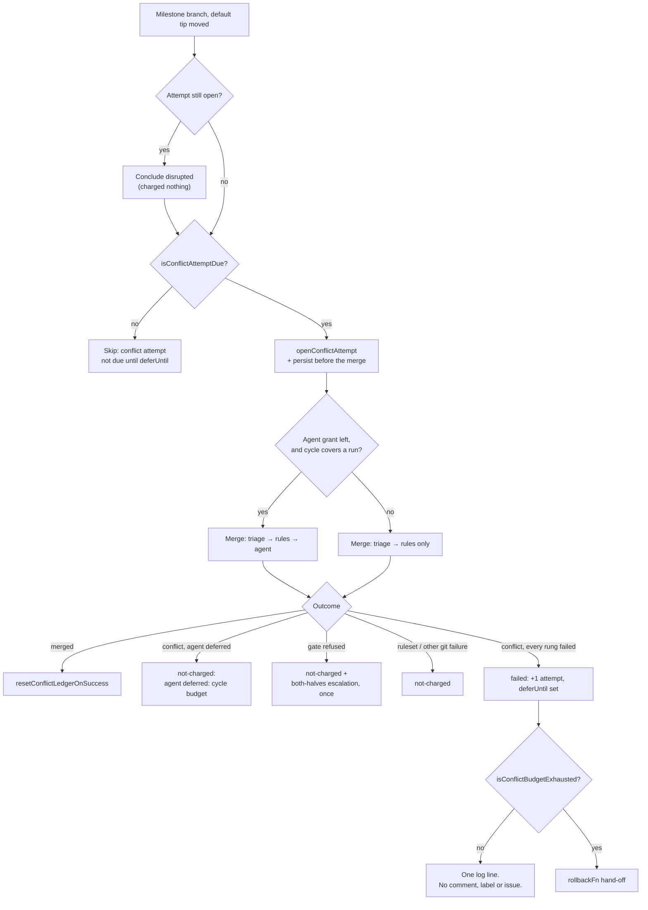

# Charge milestone sync conflicts to the branch ledger

## Summary

The milestone sync pass now spends the per-branch conflict ledger Issue #1766
built. Around every merge it makes, it opens an attempt, concludes it, and lets
the budget — not a human — decide when the automatic attempts are over.

- **Before the merge.** An attempt a killed run left open is concluded
  `disrupted` and charged nothing; a branch whose cooldown has not passed is
  skipped with `skipped: conflict attempt not due until <deferUntil>`;
  otherwise an attempt is opened **and persisted before the merge starts**, so
  the marker survives the kill it exists to record.
- **After the merge.** `judgeSyncFailure` charges exactly one thing: a conflict
  every automatic rung reached and none could settle. A ruleset-rejected push
  (`push rejected by ruleset`), a refused merge gate, a refused resolution and
  any other git failure are all `not-charged` and keep their existing
  reporting. A success calls `resetConflictLedgerOnSuccess`.
- **Nothing is posted while an attempt remains.** A conflict failure produces
  one log line — `conflict attempt n of 3 failed at rung <rung>` — and no
  comment, no label and no issue. The per-conflicting-commit
  `analysisEscalatedSha` escalation is gone: it fired before any of the three
  attempts had been spent. On exhaustion the branch is handed to a `rollbackFn`
  dep, which until Issue #1771's wiring lands logs
  `budget exhausted: roll-back not yet available` and posts nothing.
- **One agent run per cycle**, across every repo and milestone. `grantAgentRun`
  is the merge-conflict drain's rule with both halves: the drain's 20-minute
  **floor** decides whether a rung starts at all, and the grant handed down in
  `SyncBranchOptions.agentTimeoutSeconds` is **clamped** to the budget left, so
  an agent is never promised more time than the cycle holds (Issue #1693). The
  grant is spent on hand-out and refunded only for a merge that had no
  conflict, because over-spending is the safe direction for a bound that says
  "at most one". Every other conflicting branch that cycle climbs the triage
  and the deterministic rules only, and its attempt is `not-charged` with
  `agent deferred: cycle budget`.
- **A branch past its budget is not merged again.** It is the roll-back's, so
  the pre-merge guard skips it rather than charging a fourth attempt and
  re-entering the hand-off every cooldown.

Closes #1778.

## Evidence

Backend/CLI change with no web interface to screenshot. The evidence is the
test suite and the full gate:

- `./quality.sh < /dev/null` → **PASSED** (`config integration` skipped, as it
  is on this host).
- `deno test tests/milestone_branch_sync_test.ts` → 47 passed, 0 failed.
- `deno test` over every `milestone*`, `run_core*` and `*conflict*` suite →
  1444 passed, 0 failed.

What one cycle now does with a conflicting branch:

## Acceptance Criteria

<!-- vibe-spec-review inputs="diff+issue-body" -->

- **met** — Conflict failure with 1 prior failure → ledger `conflictAttempts: 2`, `deferUntil` set, no gh comment/label/issue call — evidence: `worker/deno/tests/milestone_branch_sync_test.ts::syncMilestoneBranches - a conflict failure charges one attempt and posts nothing (Issue #1778)` — reviewer: met
- **met** — Same default SHA before `deferUntil` → no merge attempted; moved SHA → attempted at once — evidence: `worker/deno/tests/milestone_branch_sync_test.ts::syncMilestoneBranches - the same tip waits out the cooldown and a moved tip does not (Issue #1778)` (counts `syncBranchFn` invocations across three cycles) — reviewer: met
- **met** — An attempt left open by a simulated kill reads `disrupted` next cycle and is not charged — evidence: `worker/deno/tests/milestone_branch_sync_test.ts::syncMilestoneBranches - a killed attempt persists as disrupted and the cooldown still stands (Issue #1778)` — reviewer: partial — reason: the reviewer was right that both original tests passed with the `disrupted` branch deleted; a new case drives the kill inside a live cooldown so `lastAttempt.outcome === "disrupted"` is what lands on disk, and the pre-existing case now asserts the conclusion's log line
- **met** — Ruleset-rejected push → `lastAttempt.outcome === "not-charged"`, reason `push rejected by ruleset` — evidence: `worker/deno/tests/milestone_branch_sync_test.ts::syncMilestoneBranches - a disrupted attempt is concluded, not charged, when the next attempt also fails (Issue #1778)` and `::judgeSyncFailure - only an unresolved conflict is charged (Issue #1778)` — reviewer: met — reason: the reviewer added a caveat worth recording — `git_pull.ts`'s `pushSyncedMilestoneBranch` folds a ruleset refusal into an `ok` outcome with a note (Issue #589), so today this arm is defence in depth rather than a live path. The issue names it explicitly and a refusal reaching the error path must not be charged, so it stands
- **met** — Two milestones conflicting in one cycle → the agent runs for at most one; the other's attempt is `not-charged` with `agent deferred: cycle budget` — evidence: `worker/deno/tests/milestone_branch_sync_test.ts::syncMilestoneBranches - only one milestone gets the agent rung in a cycle (Issue #1778)` and `::syncMilestoneBranches - a merge that fails after the agent ran keeps the grant spent (Issue #1778)` — reviewer: partial — reason: the reviewer found a real leak — the grant was spent only on a conflict outcome, so a merge that failed *after* the agent ran left it unspent and a second branch could start a second run. It is now spent on hand-out and refunded only for a conflict-free merge, with a test for each direction
- **met** — Third concluded failure → `rollbackFn` invoked exactly once; nothing posted — evidence: `worker/deno/tests/milestone_branch_sync_test.ts::syncMilestoneBranches - the third concluded failure hands off to the roll-back exactly once (Issue #1778)`, `::a branch past its budget is not merged again (Issue #1778)`, and `worker/deno/tests/milestone_sync_conflict_analysis_escalation_test.ts::milestone sync - the budget, not a comment, is what a repeated conflict spends (Issue #1778)` — reviewer: met — reason: the reviewer noted "exactly once" held only for the scripted case, since nothing consulted `isConflictBudgetExhausted` before opening an attempt; a pre-merge guard now skips a spent branch, so attempt 4 and the second hand-off cannot happen
- **met** — `./quality.sh < /dev/null` passes — evidence: full gate run after the final edit, `Result: PASSED (with skipped checks)` — reviewer: met — reason: the reviewer's first run failed on `markdownlint MD018 docs/INTERNALS.md:3161`; the wrap was fixed and the gate re-run green, twice more since
- **unrequested** — priority 1.72 is declared `agentBacked: true` in `run_core.ts` — evidence: `worker/deno/lib/run_core.ts:1583` — reviewer: unrequested — reason: Issue #1777 gave this handler a coding agent while leaving it on the flat 600-second watchdog, and this issue's own bound is stated in terms of "the handler's remaining time". Without it the handler's deadline is a flat 600 s, the grant floor can never be met and the rung is dead. It matches the drain's own handler (`run_core.ts:1494`), which is `agentBacked` for the same reason
- **unrequested** — `saveSyncStreaks` now throws when `atomicWrite` refuses, and the sweep logs the failure — evidence: `worker/deno/lib/milestone_sync_streak.ts:170`, `worker/deno/lib/milestone_branch_sync.ts` (`persistStreaks`) — reviewer: unrequested — reason: `atomicWrite` reports a refused write as a failed `Result`, which was discarded. This issue is the first thing to depend on a write having actually happened — an open attempt marker that never reached disk is charged next cycle as a failure nobody judged — so the silent path had to close
- **unrequested** — a `MilestoneConflictEscalation` carrying `gateFailure` keeps Issue #1559's both-halves escalation, keyed on `analysisEscalatedSha` — evidence: `worker/deno/lib/milestone_branch_sync.ts` (`escalateConflictAnalysis`) — reviewer: unrequested — reason: the issue removes the per-conflict escalation and says a gate failure "keeps its existing escalation"; a refused *resolution* is a gate failure whose existing escalation was this one. Dropping it made a refusal that no retry clears silent and unpaced forever, which the standards review caught. It uses its own dedup key, not `gateEscalated`, so the two refusals cannot suppress each other
- **unrequested** — `conflictAttemptDue` wraps `isConflictAttemptDue` so an unreadable default tip is never read as a *moved* one — evidence: `worker/deno/lib/milestone_branch_sync.ts` (`conflictAttemptDue`) — reviewer: unrequested — reason: the issue says to consult `isConflictAttemptDue`, which takes a tip; passing a tip nobody could read would clear the pacing and spend the whole budget inside one cooldown, so the unknown case reads as "not moved"
- **unrequested** — `docs/MERGE.md` updated alongside `docs/INTERNALS.md` — evidence: `docs/MERGE.md` — reviewer: unrequested — reason: it stated as future tense that "the sync pass is wired to charge that ledger by Issue #1778", which this change makes false; "A Code Change Owes a Docs Change"
- **unrequested** — the ladder narrative and flowchart in `docs/INTERNALS.md` were corrected — evidence: `docs/INTERNALS.md` — reviewer: unrequested — reason: three prose passages and one Mermaid node still described the deleted per-conflict escalation as the ladder's exit

Known limitation, not fixed here: the cycle's agent grant always goes to the
first *due* branch in iteration order, with no fairness cursor of the kind
`merge_conflict_drain.ts` keeps. A chronically conflicting branch therefore
takes the rung until it spends its three attempts, after which the cooldown and
the spent-budget guard skip it and the next branch gets its turn — so
starvation is bounded rather than eliminated. A cursor is out of scope for an
issue whose stated bound is "at most once per cycle".

## Standards Review

<!-- vibe-standards-review inputs="diff+CODING-STANDARDS.md" -->

- **violation** — a `catch {}` in `persistStreaks` swallowed a failed ledger write with no log and no rethrow, while the call site treats the write as load-bearing — evidence: `worker/deno/lib/milestone_branch_sync.ts` (`persistStreaks`) — reason: fixed; the failure is logged, and the root cause below it (`saveSyncStreaks` discarding `atomicWrite`'s failed `Result`) is fixed too. Covered by `::syncMilestoneBranches - a ledger that cannot be persisted is said out loud (Issue #1778)`
- **violation** — a resolution the verification refused was judged `not-charged`, fell into the conflict branch that posts nothing, and got no `deferUntil`, so the same refusal was retried every cycle with nothing reported — evidence: `worker/deno/lib/milestone_branch_sync.ts` (the `conflictError.gateFailure` branch) — reason: fixed; it keeps Issue #1559's both-halves escalation, reported once per conflicting commit. Covered by `::syncMilestoneBranches - a resolution the gate refused is not charged and still reports both halves (Issue #1778)`
- **violation** — four surfaces in `docs/INTERNALS.md` still described the deleted per-conflict escalation as the ladder's exit, in prose and in the Mermaid flowchart — evidence: `docs/INTERNALS.md` — reason: fixed in the same change
- **violation** — `buildConflictAnalysisComment` lost its only production caller and became dead code — evidence: `worker/deno/lib/milestone_conflict_triage.ts:748` — reason: fixed as a consequence of restoring the gate-refusal escalation, which is its caller again
- **violation** — the `"resolution-gate"` test fixture was declared and constructed but never used, so the one behaviour that silently regressed had no sweep-level test — evidence: `worker/deno/tests/milestone_branch_sync_test.ts` — reason: fixed; the fixture now drives a two-cycle test asserting the report goes out once and the attempt is not charged
- **violation** — `defaultRollbackFn` is the only roll-back path in production and had no test; every exhaustion test injected its own — evidence: `worker/deno/lib/milestone_branch_sync.ts` (`defaultRollbackFn`) — reason: fixed; `::syncMilestoneBranches - the default roll-back says the hand-off is not wired and posts nothing (Issue #1778)` runs it with no injection
- **violation** — the sweep's tail persistence block duplicated `persistStreaks` verbatim — evidence: `worker/deno/lib/milestone_branch_sync.ts` — reason: fixed; the tail calls the helper
- **violation** — `analysisEscalatedSha` was left as declared-but-never-written state — evidence: `worker/deno/lib/milestone_sync_streak.ts` — reason: fixed; it is the gate-refusal escalation's dedup key, which is what the field is named for, and its doc comment records the narrowed meaning
- **violation** — no `docs/archive/pr-summaries/pr-summary-1778.md` existed when the review ran — evidence: `docs/archive/pr-summaries/pr-summary-1778.md` — reason: fixed; this is that file, and it documents the two modified tests and their business-logic change
- **clean** — Australian English throughout code, comments, tests and docs; no hidden path staged and nothing matching the forbidden credential patterns; every test drives `syncMilestoneBranches` or a real exported helper with injected deps and asserts on the ledger read back from a real temp file, with no source-grepping; no wall-clock sleeps, no polling and no absolute timing thresholds — the sweep takes a `now` seam and every test injects fixed `nowMs`/`deadlineEpochMs`; no `Deno.env.set` or `Deno.chdir`, each test owns its temp dir and cleans up in `finally`; no test removed or disabled, and the two whose expectations inverted say so in place; the drain's budget constants and `MILESTONE_CONFLICT_ATTEMPT_BUDGET` are imported rather than restated; every commit carries the `Vibe-Coder-Run-Id` trailer

## Test Plan

Added to `worker/deno/tests/milestone_branch_sync_test.ts` (21 new):

- a conflict failure charges one attempt, sets `deferUntil`, and makes zero
  comment/label/issue gh calls
- the same tip waits out the cooldown (no merge attempted) and a moved tip does
  not
- an attempt a kill left open reads as `disrupted` and is not charged — where
  the next sync succeeds, where it fails for another reason, and where a live
  cooldown makes `lastAttempt.outcome === "disrupted"` the state on disk
- a ruleset-rejected push concludes `not-charged` with reason
  `push rejected by ruleset`
- only one milestone gets the agent rung in a cycle; the other's attempt is
  `not-charged` with `agent deferred: cycle budget`
- too little of the cycle left denies the agent to every branch
- a merge that fails *after* the agent ran keeps the grant spent, so a second
  branch cannot start a second agent run in the same cycle
- a clean merge refunds the grant to the next branch
- the third concluded failure invokes `rollbackFn` exactly once and posts
  nothing
- a branch past its budget is not merged again — no fourth charge, no second
  hand-off
- the production default hand-off logs
  `budget exhausted: roll-back not yet available` and posts nothing
- a refused merge gate is not charged and keeps its Issue #974 escalation
- a resolution the gate refused is not charged and still reports both halves,
  once
- a ledger that cannot be persisted is reported rather than swallowed
- the pure helpers: `grantAgentRun` (unbounded, the floor, and the clamp),
  `conflictAttemptDue`, `failedConflictRung`, `judgeSyncFailure`

Modified, with the business-logic change documented in place:

- `worker/deno/tests/milestone_sync_conflict_analysis_escalation_test.ts` — two
  cases now assert the opposite of what Issue #1559 asserted: a conflict no rung
  could settle posts nothing and charges the ledger, and a repeated conflict
  spends the budget rather than a comment. The file header records why. The
  third case (no streak file → no comment) is unchanged in intent.
- `worker/deno/tests/milestone_sync_streak_test.ts::sync streaks - a success
  clears the streak so it can re-escalate later` — a success still clears the
  streak and the escalation flag, but the ledger's `lastAttempt` audit record
  now survives it, so the entry outlives the streak. The assertion moved from
  "the entry is deleted" to "the streak and the budget are zeroed".

No test was removed or disabled.
