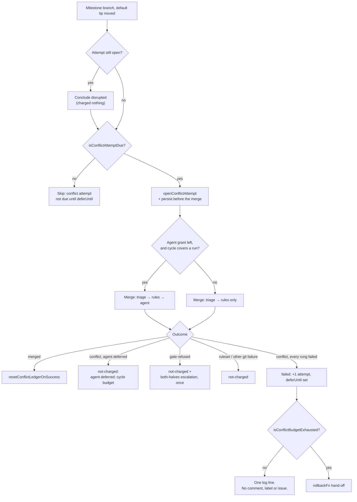

# Charge milestone sync conflicts to the branch ledger

## Summary

The milestone sync pass now spends the per-branch conflict ledger Issue #1766
built. Around every merge it makes, it opens an attempt, concludes it, and lets
the budget — not a human — decide when the automatic attempts are over.

- **Before the merge.** An attempt a killed run left open is concluded
  `disrupted` and charged nothing; a branch whose cooldown has not passed is
  skipped with `skipped: conflict attempt not due until <deferUntil>`;
  otherwise an attempt is opened **and persisted before the merge starts**, so
  the marker survives the kill it exists to record.
- **After the merge.** `judgeSyncFailure` charges exactly one thing: a conflict
  every automatic rung reached and none could settle. A ruleset-rejected push
  (`push rejected by ruleset`), a refused merge gate, a refused resolution and
  any other git failure are all `not-charged` and keep their existing
  reporting. A success calls `resetConflictLedgerOnSuccess`.
- **Nothing is posted while an attempt remains.** A conflict failure produces
  one log line — `conflict attempt n of 3 failed at rung <rung>` — and no
  comment, no label and no issue. The per-conflicting-commit
  `analysisEscalatedSha` escalation is gone: it fired before any of the three
  attempts had been spent. On exhaustion the branch is handed to a `rollbackFn`
  dep, which until Issue #1771's wiring lands logs
  `budget exhausted: roll-back not yet available` and posts nothing.
- **One agent run per cycle**, across every repo and milestone, and only while
  the handler's remaining budget covers a whole run — the merge-conflict
  drain's "too little of the cycle left" shape, spending the drain's own
  constants. Every other conflicting branch that cycle climbs the triage and
  the deterministic rules only, and its attempt is `not-charged` with
  `agent deferred: cycle budget`. An agent started with too little cycle left
  is killed mid-edit by the watchdog, and Issue #1693 is the record of what
  charging that kill costs.

Closes #1778.

## Evidence

Backend/CLI change with no web interface to screenshot. The evidence is the
test suite and the full gate:

- `./quality.sh < /dev/null` → **PASSED** (`config integration` skipped, as it
  is on this host).
- `deno test tests/milestone_branch_sync_test.ts` → 42 passed, 0 failed.
- `deno test` over every `milestone*`, `run_core*` and `*conflict*` suite →
  1441 passed, 0 failed.

What one cycle now does with a conflicting branch:

## Test Plan

Added to `worker/deno/tests/milestone_branch_sync_test.ts` (16 new):

- a conflict failure charges one attempt, sets `deferUntil`, and makes zero
  comment/label/issue gh calls
- the same tip waits out the cooldown (no merge attempted) and a moved tip does
  not
- an attempt a kill left open reads as `disrupted` and is not charged — both
  where the next sync succeeds and where it fails for another reason
- a ruleset-rejected push concludes `not-charged` with reason
  `push rejected by ruleset`
- only one milestone gets the agent rung in a cycle; the other's attempt is
  `not-charged` with `agent deferred: cycle budget`
- too little of the cycle left denies the agent to every branch
- the third concluded failure invokes `rollbackFn` exactly once and posts
  nothing
- the production default hand-off logs
  `budget exhausted: roll-back not yet available` and posts nothing
- a refused merge gate is not charged and keeps its Issue #974 escalation
- a resolution the gate refused is not charged and still reports both halves,
  once
- a ledger that cannot be persisted is reported rather than swallowed
- the pure helpers: `cycleCoversAgentRun`, `conflictAttemptDue`,
  `failedConflictRung`, `judgeSyncFailure`

Modified, with the business-logic change documented in place:

- `worker/deno/tests/milestone_sync_conflict_analysis_escalation_test.ts` — two
  cases now assert the opposite of what Issue #1559 asserted: a conflict no rung
  could settle posts nothing and charges the ledger, and a repeated conflict
  spends the budget rather than a comment. The file header records why. The
  third case (no streak file → no comment) is unchanged in intent.
- `worker/deno/tests/milestone_sync_streak_test.ts::sync streaks - a success
  clears the streak so it can re-escalate later` — a success still clears the
  streak and the escalation flag, but the ledger's `lastAttempt` audit record
  now survives it, so the entry outlives the streak. The assertion moved from
  "the entry is deleted" to "the streak and the budget are zeroed".

No test was removed or disabled.
