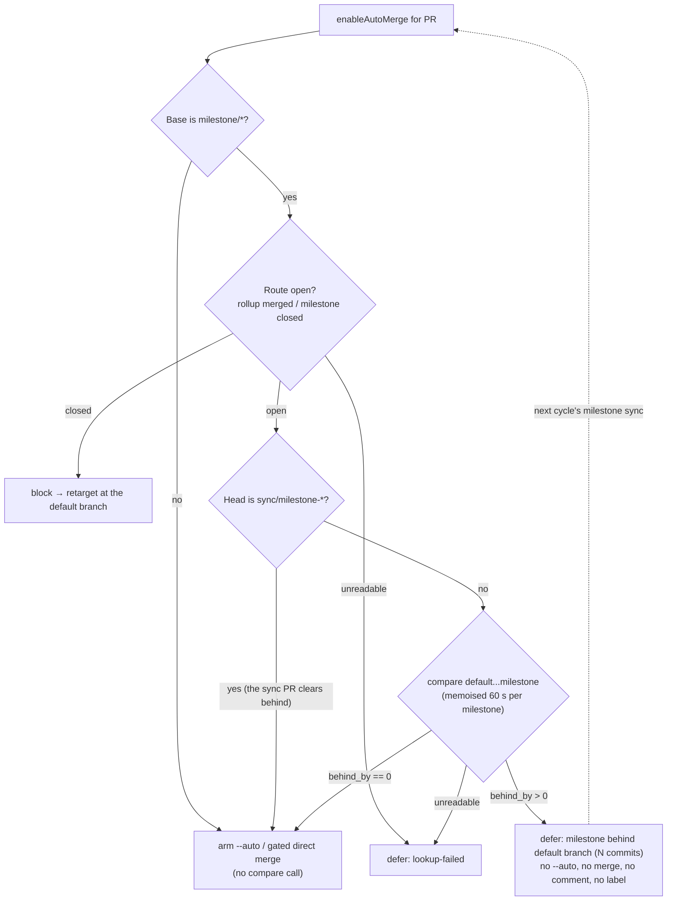

## Summary

A child PR is no longer armed or merged while its `milestone/*` base is behind
the default branch, so a child only ever lands on a synced milestone tip.
Closes #1779.

- `decideMilestoneBaseMerge` (`worker/deno/lib/milestone_children_gate.ts`)
  gains an opt-in `requireSyncedBase` check. When the route to the default
  branch is open it compares the two branches and returns
  `defer` / `milestone-behind` (carrying `behindBy`) while the milestone branch
  is behind. A comparison that cannot be read is `defer` / `lookup-failed`, as
  before.
- The comparison is memoised per (repo, default branch, milestone branch) for
  60 s (`MILESTONE_BEHIND_MEMO_TTL_MS`), so the N children of one milestone in
  a single Priority 1.65 sweep cost **one** API call. The TTL is well inside a
  cycle, so the next milestone sync is seen rather than a stale "behind"
  reading held for the life of the process.
- `enableAutoMerge` (`worker/deno/lib/pr_auto_merge.ts`) opts in. A
  `milestone-behind` defer returns before `--auto` is armed and before the
  gated direct merge runs, with no comment and no label;
  `logAutoMergeOutcome` records
  `Auto-merge deferred: milestone behind default branch (N commits) — …`.
  `auto_merge_sweep.ts` needed no change: it already forwards the outcome of
  `attemptMerge` to `recordOutcome`, which is `logAutoMergeOutcome` in
  production.
- The post-merge landing check (`merge_landing.ts`) deliberately does **not**
  opt in — that PR has already merged, and later drift says nothing about
  whether its work landed.
- **The milestone sync PR is exempt.** Its base *is* the milestone branch and
  its head is `sync/milestone-*`: it is the PR that clears "behind". Without
  the exemption the milestone deadlocks — the sync never lands, the branch
  never catches up, and no child ever merges.
- **The deferral names itself.** `EnableAutoMergeResult.deferral` is
  `"milestone-behind"`, so the PR-maintenance scan classifies it
  `milestone_base_behind` → `await_checks` instead of mapping any `deferred`
  to `merge_error` → escalate, which would have commented on the child and
  labelled it `needs-human` — the opposite of what the issue asks.

### Orientation — a deliberate departure from the issue text

The issue specifies `repos/{repo}/compare/{milestone}...{default}` with
`behind_by > 0`. In `compare/{base}...{head}` GitHub's numbers describe the
**head**, so that spelling returns how far the *default* branch is behind the
*milestone* branch — the ahead count. Every healthy milestone branch (which is
ahead by construction) would have deferred for ever. The implementation uses
`repos/{repo}/compare/{default}...{milestone}` and `.behind_by`, matching
`milestone_health.ts` and the orientation Issue #470 already settled in this
repo. `decideMilestoneBaseMerge - the compare is oriented default...milestone`
asserts the exact call, and `milestone_merge_behaviour_test.ts` answers the
comparison from a branch topology by GitHub's own rules, so an inverted query
would receive a truthfully-swapped answer and fail.

## Evidence

Backend/CLI change — no web interface to screenshot. Evidence is the test
suite:

```text
deno test tests/milestone_children_gate_test.ts tests/pr_auto_merge_test.ts
  ok | 66 passed | 0 failed
deno test tests/milestone_merge_behaviour_test.ts tests/pr_maintenance_test.ts \
  tests/merge_block_escalation_test.ts tests/route_gate_transient_failure_test.ts \
  tests/merge_landing_test.ts
  ok | 103 passed | 0 failed
./quality.sh < /dev/null   Result: PASSED (with skipped checks)
```



## Acceptance Criteria

<!-- vibe-spec-review inputs="diff+issue-body" -->

- **met** — Milestone base 3 behind → `defer/milestone-behind`, no `gh pr merge` call, outcome log line present — evidence: `worker/deno/tests/milestone_children_gate_test.ts::decideMilestoneBaseMerge - a milestone base 3 commits behind the default branch DEFERS`, `worker/deno/tests/pr_auto_merge_test.ts::a milestone base behind the default branch is DEFERRED: no --auto, no direct merge, no comment` and `::the behind deferral is recorded by logAutoMergeOutcome` — reviewer: met
- **met** — Milestone base 0 behind → existing `allow`/`block` logic unchanged — evidence: `worker/deno/tests/milestone_children_gate_test.ts::a milestone base level with the default branch is allowed as before` and `::a merged rollup still BLOCKS even when the branch is also behind` (the compare never runs on a closed route) — reviewer: met
- **met** — Default-branch base → no compare call; two children of one milestone → one compare call — evidence: `worker/deno/tests/milestone_children_gate_test.ts::a default-branch base makes no compare call` and `::two children of one milestone cost ONE compare call`; the same pair at `enableAutoMerge` level in `pr_auto_merge_test.ts` — reviewer: met — reason: the reviewer noted the memo is wall-clock (60 s) rather than sweep-scoped, so two children more than a minute apart pay two compares; that is deliberate — a sweep-scoped memo would hold a stale "behind" across the sync that clears it
- **met** — `./quality.sh < /dev/null` passes — evidence: full gate run after the final edit, `Result: PASSED (with skipped checks)` — reviewer: met
- **met** — task bullet: a `milestone-behind` defer neither arms `--auto` nor runs the gated direct merge; no comment, no label — evidence: `worker/deno/lib/pr_auto_merge.ts` returns before both paths; `worker/deno/lib/pr_maintenance.ts` maps the named deferral to `milestone_base_behind` → `await_checks` — reviewer: partial — reason: the reviewer found the PR-maintenance scan turned any `deferred` into `merge_error` → `escalate`, so a behind child would have been commented on and labelled `needs-human`; fixed in this diff by naming the deferral (`deferral: "milestone-behind"`) and adding the `milestone_base_behind` outcome kind, with `pr_auto_merge_test.ts::a behind deferral names itself so callers do not escalate it`
- **met** — task bullet: the known limit (the gate governs arming, not GitHub's merge) is stated in the docs — evidence: `docs/MERGE.md` "Known limit" bullet — reviewer: met
- **met** — task bullet: `docs/MERGE.md` "Defer-and-retry when behind" gains the milestone-base case — evidence: `docs/MERGE.md` → "The milestone base is behind the default branch" — reviewer: met
- **unrequested** — `requireSyncedBase` opt-in flag rather than an unconditional check — reviewer: unrequested — reason: `merge_landing.ts` calls the same function to verify an **already-merged** PR landed; unconditional, a behind branch would have made every merged child read as `orphaned`. The reviewer's consequential finding — that `direct_merge.ts` is therefore not covered — is answered in `docs/MERGE.md`: on the automated routes `directMergePr` is reached only after `enableAutoMerge` has run this gate (the fallback fires on `not_allowed`, never on a deferral), and the one route that reaches it directly is the operator command `merge-if-checks-passed`
- **unrequested** — `headRefName` / `defaultBranch` / `getDefaultBranchFn` / `nowMs` options, `MILESTONE_BEHIND_MEMO_TTL_MS`, `_resetMilestoneBehindMemo` — reviewer: unrequested — reason: `headRefName` carries the sync-PR exemption below; the rest are the test seams that let the memo, the TTL and the failure paths be tested without a clock or a subprocess, matching `_resetBaseProtectionMemo`
- **unrequested** — the milestone **sync PR** is exempt from the check — reviewer: unrequested — reason: the reviewer found the deadlock — the sync PR's base *is* the milestone branch, so deferring it for being behind means the sync never lands, the branch never catches up and no child ever merges. Added with `milestone_children_gate_test.ts::the milestone SYNC PR is exempt` and `pr_auto_merge_test.ts::the milestone sync PR is still armed while its base is behind`
- **unrequested** — memoising *failed* compares for the same 60 s — reviewer: unrequested — reason: kept. One transient 500 holds that milestone's children for at most a minute and costs one call instead of N; a defer is the safe direction and the next cycle re-reads
- **unrequested** — `BRANCH_PATTERN` check on the resolved default branch — reviewer: unrequested — reason: the value is interpolated into a `gh api` path, and every other branch value on that path is allowlisted first
- **unrequested** — `milestone_merge_behaviour_test.ts` fixture gains the default branch and a `/compare/` handler — reviewer: unrequested — reason: the fake must answer the read production now makes; it answers from the same topology by GitHub's own rules, so no assertion was weakened
- **unrequested** — the compare orientation is `{default}...{milestone}`, not the issue's `{milestone}...{default}` — reviewer: unrequested — reason: GitHub's `behind_by` describes the **head**, so the issue's spelling returns the ahead count and every healthy milestone branch would defer for ever; the code matches `milestone_health.ts` and Issue #470

## Standards Review

<!-- vibe-standards-review inputs="diff+CODING-STANDARDS.md" -->

- **violation** — `deno fmt --check` failed on one line of the new tests — evidence: `worker/deno/tests/milestone_children_gate_test.ts:533` — reason: fixed here; `deno fmt` was run over the tree and the full gate now passes
- **violation** — an empty compare answer was read as "level with the default branch" (`Number("")` is `0`), so a comparison that returned nothing would have armed the merge this gate exists to refuse — evidence: `worker/deno/lib/milestone_children_gate.ts:773` — reason: fixed here; an empty answer is now `defer` / `lookup-failed`, covered by `milestone_children_gate_test.ts::an EMPTY compare answer is unreadable, never 'level'`
- **violation** (observation) — `behindBy` was optional on the `milestone-behind` decision and rendered with `?? 0`, so a decision missing it would log `(0 commits)` — evidence: `worker/deno/lib/pr_auto_merge.ts:414` — reason: fixed here; the defer union is split by reason so `behindBy` is required on `milestone-behind` and the fallback is gone
- **clean** — Australian English throughout; tests call the real `decideMilestoneBaseMerge` / `enableAutoMerge` through injected seams and assert on decisions, log lines and issued `gh` argv (no source-grepping, no wall-clock sleeps); no existing test deleted or weakened; fail-loud error handling (every unreadable read defers with the underlying message); every value interpolated into a `gh api` path is allowlist-checked; no hidden paths staged; comments explain *why*; the module-level memo with a `_reset*` helper matches the repo's established pattern

## Test Plan

Added to `worker/deno/tests/milestone_children_gate_test.ts`:

- `a milestone base 3 commits behind the default branch DEFERS`
- `a milestone base level with the default branch is allowed as before`
- `a merged rollup still BLOCKS even when the branch is also behind`
- `a compare that cannot be read DEFERS as lookup-failed`
- `a default-branch base makes no compare call`
- `two children of one milestone cost ONE compare call`
- `the memoised compare expires so the next cycle's sync clears the defer`
- `the post-merge caller, which does not require a synced base, makes no compare call`
- `the compare is oriented default...milestone so behind_by means behind`
- `a default branch that cannot be resolved DEFERS as lookup-failed`
- `an EMPTY compare answer is unreadable, never 'level'`
- `the milestone SYNC PR is exempt: it is what clears 'behind'`
- `an unreadable head DEFERS rather than guessing which PR this is`
- `an ordinary child resolves its own head when the caller has none`

Added to `worker/deno/tests/pr_auto_merge_test.ts`:

- `a milestone base behind the default branch is DEFERRED: no --auto, no direct merge, no comment`
- `a milestone base level with the default branch still arms auto-merge`
- `the behind deferral is recorded by logAutoMergeOutcome`
- `two children of one behind milestone cost ONE compare call`
- `a default-branch base makes no milestone compare call`
- `the gate seam still governs: an injected behind decision defers without any gh call`
- `the milestone sync PR is still armed while its base is behind`
- `a behind deferral names itself so callers do not escalate it`

Modified `worker/deno/tests/milestone_merge_behaviour_test.ts`: its fake GitHub
now answers the REST comparison from the branch topology, and the topologies
name the default branch. No assertion was weakened — the behaviour under test
(a green, current, settled milestone child merges) is unchanged; the fixture
simply had to describe a milestone branch that is level with the default
branch, which the new gate reads.
