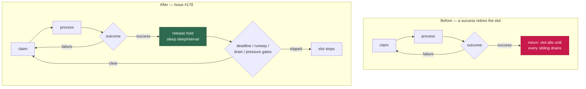

# Pool slots keep claiming after a success (Issue #178)

## Summary

`runSlot` in `worker/deno/lib/run_core.ts` returned from the slot loop on the
first **successful** issue, mirroring the serial loop's
`break; // Exit inner loop, earn normal sleep`. In the serial loop that hands
back to the outer loop, which runs the maintenance ladder and re-scans seconds
later. In the pool it retired the slot entirely: `runIssueScanPool` only
re-enters the outer loop after `drainSlots`, so the slot idled until **every**
sibling finished. With one slot inside a ~55 min execute, the other sat silent
for the rest of the cycle — `max_concurrent_issues: 2` gave two slots only until
the first success. Perversely, a slot that *failed* stayed busier than one that
*succeeded*, because the failure path `continue`s.

A successful slot now sleeps the normal `sleepInterval` and claims again,
re-gated by `slotShouldStop` (deadline / runway / drain / shutdown) and the
pre-claim guards (spend ceiling, rate limit, memory-pressure ceiling) at the top
of the loop. The sleep is taken **after** the in-flight registry hold is
released, so a sibling is never locked out of that repository while the slot
settles. The maintenance ladder runs when the pool next drains, as the issue
specifies.

Closes #178.

## Evidence

Backend/CLI change with no web surface, so no screenshot applies — the evidence
is the two new tests, which fail against the unfixed code and pass after the
fix.

Before (`deno test --filter "Issue #178"` on the unfixed tree):

```
slot pool - a success is followed by the normal sleep and another claim in the SAME slot ... FAILED
  [Diff] Actual / Expected
      "process:o/a#1",
  -   "sleep:26000",      ← the outer loop's jittered sleep: the pool drained
  +   "sleep:30000",
  +   "process:o/a#2",

slot pool - two slots, one long execute: the other slot completes issue after issue ... FAILED
  [Diff] Actual / Expected
      [ 2, +3, +4, +5 ]   ← the free slot stopped after its first success
FAILED | 0 passed | 2 failed
```

After the fix:

```
ok | 23 passed | 0 failed (920ms)   # whole run_core_slot_pool_test.ts
```

`./quality.sh` passes every gate except `deno tests`, which reports 10
pre-existing failures in `tests/setup_workdir_reminder_test.ts`,
`tests/fleet_health_test.ts`, `tests/host_workdir_guard_test.ts` and
`tests/optional_feature_env_test.ts`. Those are container work-dir/HOME layout
tests, unrelated to this change — verified by stashing the change and
re-running: the same 10 fail on a clean tree.

Slot lifecycle before and after:



## Test Plan

Added to `worker/deno/tests/run_core_slot_pool_test.ts`:

- **`slot pool - a success is followed by the normal sleep and another claim in
  the SAME slot, not a pool drain (Issue #178)`** — two issues in one repository
  (so only the slot holding it can take the next one) and a pool of 2. Asserts
  the ordered trace is `process o/a#1 → sleep 30 000 ms → process o/a#2`, and
  that `Issue scan pool:` was logged exactly once, proving the second claim came
  from the same pool invocation rather than a fresh one after a drain.
- **`slot pool - two slots, one long execute: the other slot completes issue
  after issue throughout (Issue #178)`** — the acceptance criterion from the
  issue: slot A runs one long execute while slot B works a queue. Asserts B
  completes all four short issues during A's run (`issues_processed` = N + 1),
  and that A's long run still completes. The long run's wait is bounded, so a
  regression fails the assertion instead of hanging the suite.

Both tests were written first and confirmed failing against the unfixed code.
No existing test was modified, commented out, or removed; all 21 pre-existing
slot-pool tests still pass.

## Documentation

`docs/CONFIGURATION.md` — the `max_concurrent_issues` row now states that each
slot keeps claiming for the whole cycle, sleeping `sleep_interval` between
issues, so a long execute in one slot never idles the others.
