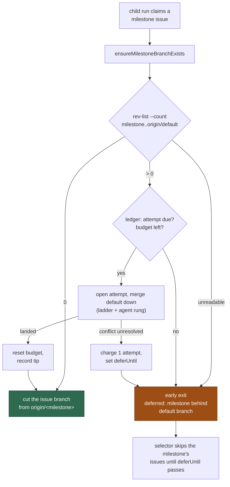

## Summary

A milestone child run now brings its milestone branch level with the default
branch **before** it cuts its issue branch, and defers the whole run when it
cannot — so no child branch is ever based on a milestone branch that is behind.
Closes #1780.

- **New `worker/deno/lib/milestone_presync.ts`.** `presyncMilestoneBranch` is
  one paced attempt at merging the default branch down, and every rule it
  applies is the periodic sweep's own: the ledger transitions from
  `milestone_sync_streak.ts`, the ledger key `syncStreakKey`, the pacing guard
  `conflictAttemptDue`, the failure verdict `judgeSyncFailure`, the agent grant
  `grantAgentRun`, the success transition `recordSuccess` and the conflict
  report `escalateSyncConflict` — imported, never restated, so a child run and
  the sweep can never disagree about what a branch has spent. The ordinary path
  is one fetch of the default branch (which is what makes the comparison
  truthful) plus one `rev-list --count`; at zero behind, nothing else runs and
  the ledger is not touched.
- **New `worker/deno/lib/milestone_conflict_agent_binding.ts`** — the one
  binding of the ladder's agent rung, now called by both the sweep and the
  pre-cut sync, so the grant-sized timeout (#1693) cannot drift between them.
- **`setup_branch_phase.ts` calls it** immediately after
  `ensureMilestoneBranchExists`, in the shared `${WORK_DIR}/<repo>` clone the
  sweep uses — never in the lane's worktree, whose checkout of the milestone
  branch git would then refuse to every other lane and to the sweep.
- **A deferral costs no agent spend and changes nothing on the issue.** The
  phase returns `early_exit` with reason
  `deferred: milestone behind default branch`, `expectedSkip: true` and its own
  `expectedNoPrOutcome` — so the issue keeps its pickup label, no failure is
  tracked, no `needs-human` is applied, no `Depends on` line is written, and the
  only comment is the ordinary claim-release comment, which states the reason.
  `issue_worker.ts` now carries a setup-phase `expectedSkip`/`outcome` through
  (it previously dropped both on the `early_exit` path).
- **Loop guard.** `findNextIssue` reads `milestone_sync_failures.json` once per
  scan — a local file, no API call — and `find_oldest_issue.ts` skips **every
  tier's** candidates in a milestone whose `deferUntil` is still in the future,
  logging `skipped: milestone behind default branch (paced until <deferUntil>)`
  once per paced milestone per scan and recording the new `milestone-behind`
  skip reason. Without it a paced milestone was claimed, deferred and commented
  on again every 30 seconds.
- **Docs.** `docs/INTERNALS.md` gains "Sync before new work — the child run's
  own pre-cut sync" (with a Mermaid flow) beside the conflict-ledger section,
  and the paced skip is listed in the issue-finder filtering-criteria table.

### Two deliberate judgements worth a reviewer's attention

**The child's attempt is granted the agent rung.** Only an attempt that climbed
the whole ladder may charge the branch's budget — `judgeSyncFailure` concludes
`not-charged` for a conflict the agent was never offered — and charging is what
writes the `deferUntil` that paces every other slot off the milestone. An
uncharged child attempt would therefore give the loop guard nothing to read, and
three uncharged children could otherwise spend a budget the agent never tried.
The grant is bounded by `grantAgentRun` against the run's own cycle deadline, so
a run without the runway for a full agent run climbs the deterministic rungs
only and its conflict is `not-charged`, exactly as in the sweep.

**An unwritable ledger warns and still merges.** Bringing the branch level is
idempotent, useful work; what a failed ledger write loses is the *pacing*, so
the fault is logged with that consequence named
(`… cannot be charged or paced`) rather than swallowed or turned into a hard
stop that would park every milestone child on a host with a bad work volume.
An unreadable *behind count*, by contrast, defers: a base nobody could measure
is a base no branch is cut from.

**Known bound: only a charged failure paces the milestone.** A ruleset-refused
push, a merge-gate refusal or any other `not-charged` verdict writes no
`deferUntil`, so the selector does not skip the milestone for it — charging the
branch for a fault that is not its own is exactly what Issues #1772 and #1778
removed. Those deferrals are bounded by the per-issue expected-skip cooldown
instead: one bounce per issue, then the issue is in cooldown. Recorded here
because both reviewers raised it; extending the pacing to uncharged verdicts
would need a second pacing signal and is a separate change.

## Evidence

Backend/CLI change — no web interface to screenshot. Evidence is the test
suite and the full gate:

```text
deno test tests/milestone_presync_test.ts tests/milestone_presync_git_test.ts \
  tests/setup_branch_presync_test.ts tests/find_oldest_issue_milestone_paced_test.ts \
  tests/issue_worker_test.ts tests/milestone_branch_sync_test.ts \
  tests/setup_branch_resume_test.ts
  ok | 193 passed | 0 failed
deno run --allow-all check_manifests.ts   ok | 633 passed | 0 failed
./quality.sh < /dev/null   Result: PASSED (with skipped checks)
```



## Acceptance Criteria

<!-- vibe-spec-review inputs="diff+issue-body" -->

- **met** — Milestone behind by N > 0, sync succeeds → branch cut from the new tip (test asserts the base SHA) — evidence: `worker/deno/tests/milestone_presync_git_test.ts::#1780 - the issue branch starts at the milestone tip the pre-cut sync produced` (real git: `createFeatureBranchFromBase` leaves `HEAD` at the post-sync `origin/<milestone>` tip, and the default tip is an ancestor of it) and `worker/deno/tests/setup_branch_presync_test.ts::a behind milestone branch is synced before the child branch is cut` — reviewer: met — reason: the reviewer's caveat was that a stale `origin/<default>` could read as "level"; fixed in this diff by reading (and so fetching) the default tip before the count, covered by `milestone_presync_test.ts::the default tip is read (and so fetched) before the branch is measured`
- **met** — Sync fails → early exit `deferred: milestone behind default branch`, ledger charged once, issue labels untouched, no comment other than the release comment — evidence: `worker/deno/tests/setup_branch_presync_test.ts::a failed sync defers the run, charges the ledger once and cuts no branch` asserts the reason, `expectedSkip`, the `no_pr_expected` outcome, `conflictAttempts === 1`, a live `deferUntil`, no branch cut and no `gh` comment/label call — reviewer: met — reason: the reviewer flagged that comment-absence was unasserted (added here) and that "charged once" holds only for the agent-granted unresolved-conflict class — true, and stated as a known bound in the Summary
- **partial** — Ledger `deferUntil` in the future → the selector skips the issue with the log line and no claim is made — evidence: `worker/deno/tests/find_oldest_issue_milestone_paced_test.ts::a paced milestone's issue is skipped and the unpaced one selected` (skip, `milestone-behind` reason, diagnostic count) and `worker/deno/lib/run_core_production_deps.ts` for the log line — reviewer: partial — reason: the production wiring in `findNextIssue` (ledger load and the log line) has no test of its own; the reviewer also found the reader resolved the ledger path differently from its writers, which is fixed here (`config.workDir || workDir`, with a comment naming both writers)
- **met** — Non-milestone issue → phase and selector unchanged — evidence: `worker/deno/tests/setup_branch_presync_test.ts::an issue with no milestone never reaches the pre-cut sync` and `worker/deno/tests/find_oldest_issue_milestone_paced_test.ts::no pacing function leaves the scan exactly as it was` — reviewer: met
- **met** — Docs: `docs/INTERNALS.md` describes the pre-cut sync and the paced skip — evidence: `docs/INTERNALS.md` "Sync before new work — the child run's own pre-cut sync" with a Mermaid flow, the scan-gate table row, and the two `lib/` index rows — reviewer: met — reason: the reviewer noted there is no separate "issue-run phases" heading in the file, so placement inside the milestone-sync chapter is the only sensible one
- **met** — `./quality.sh < /dev/null` passes — evidence: full gate run after the final edit, `Result: PASSED (with skipped checks)` — reviewer: partial — reason: the reviewer could not run the full gate and reported only the subset it ran (all passing); the gate was run here, twice, and passed
- **unrequested** — the pre-cut sync is granted the ladder's **agent** rung, so a deferring run can spend one conflict-resolution agent — reviewer: unrequested — reason: kept and now stated in the Summary. `judgeSyncFailure` charges the ledger only for a conflict the agent was offered, so without the rung nothing is ever charged, no `deferUntil` is written and the loop guard has nothing to read — and three uncharged child attempts could spend a budget the agent never tried. The issue's "no agent spend" is honoured for the *implementation* agent, which is what the run exits before reaching
- **unrequested** — a deferral when the behind-count cannot be read — reviewer: unrequested — reason: a base nobody could measure is a base no branch is cut from; the permissive direction is the defect this gate exists to stop. It paces nothing, which is the same known bound as the other uncharged verdicts
- **unrequested** — `readRefSha` / the reported `baseSha` — reviewer: unrequested — reason: it is what makes the first acceptance criterion's SHA assertion possible, and it is the record of which commit the child branch started at
- **unrequested** — pre-cut syncs are serialised per repository inside the process — reviewer: unrequested — reason: added in response to both reviewers. The merge opens with `reset --hard` + `clean -fd` in the shared clone and two lanes can hold one repository since Issue #923, so two overlapping merges would reset the tree under each other; covered by `milestone_presync_test.ts::two runs on one repository do not merge at the same time`
- **unrequested** — a landed-but-conflicted pre-cut merge is reported through `escalateSyncConflict` — reviewer: unrequested — reason: added in response to the reviewer's finding that such a merge was reported to nobody (and, once the tip was recorded, would never be reported by the sweep either) — a silent resolution nobody chose, landing on a milestone branch
- **unrequested** — `milestone-behind` skip reason, and its entries in `idle_decision_census.ts` and `skip_reason_clearing.ts` — reviewer: unrequested — reason: both maps are total over `SKIP_REASONS` and fail the type check until a new reason is classified; mechanical

## Standards Review

<!-- vibe-standards-review inputs="diff+CODING-STANDARDS.md" -->

- **violation** — the behind-count was measured before anything fetched `origin/<default>`, so a stale ref would report "level" for a branch that is behind — evidence: `worker/deno/lib/milestone_presync.ts:199` (pre-fix) — reason: fixed here; the default tip is read first, because reading it is what fetches it, with an order test
- **violation** — the success path applied only `resetConflictLedgerOnSuccess` + `recordDefaultSha`, so a branch this run brought level kept a stale failure `count`, `escalated`, `gateEscalated` and `analysisEscalatedSha` — evidence: `worker/deno/lib/milestone_presync.ts:319-330` (pre-fix) — reason: fixed here; the sweep's `recordSuccess` is exported and called, covered by `a landed sync ends the failure streak and its escalation flags`
- **violation** — DRY: the `runMergeConflictAgent` wiring was a near-verbatim copy of the sweep's — evidence: `worker/deno/lib/milestone_presync.ts:517-543` (pre-fix) vs `worker/deno/lib/run_core_production_deps.ts:4612-4637` — reason: fixed here; both call `bindMilestoneConflictAgent` in the new `milestone_conflict_agent_binding.ts`
- **violation** — DRY: a third spelling of the ledger key — evidence: `worker/deno/lib/milestone_presync.ts:130-132` (pre-fix) — reason: fixed here; `syncStreakKey()` lives in `milestone_sync_streak.ts` beside the ledger it keys, and the sweep uses it too
- **violation** — five near-identical "could not persist the ledger" blocks — evidence: `worker/deno/lib/milestone_presync.ts:273-367` (pre-fix) — reason: fixed here; `persist()` reports a refused write once, naming the transition it was recording
- **violation** — DRY: the ledger *policy order* (conclude-disrupted → budget → due → open → judge → conclude) is now written in two places — evidence: `worker/deno/lib/milestone_presync.ts` vs `worker/deno/lib/milestone_branch_sync.ts:908-1120` — reason: it stands. Every primitive, the key, the judgement, the grant, the success transition and the conflict report are shared; extracting the sweep's remaining loop would mean untangling its interleaved per-repo state, escalation dedup and roll-back hand-off, which is a change to the sweep rather than to this issue
- **violation** — the merge runs in the shared `${WORK_DIR}/<repo>` clone without a repository lease, while `git_pull.ts` resets and checks that tree out — evidence: `worker/deno/lib/phases/setup_branch_phase.ts:356` — reason: partly fixed and partly stands. Pre-cut syncs are now serialised per repository inside the process, which removes the lane-versus-lane collision this diff would otherwise have introduced. The sweep's own merge in that clone remains unleased exactly as before; the clone is documented scratch (Issue #568), so a collision costs a spurious `not-charged` deferral rather than committed work. Taking a real lease from a phase that already holds a lane worktree is a change to the lease model
- **violation** — a landed merge whose conflicts the worker resolved itself was reported to nobody — evidence: `worker/deno/lib/milestone_presync.ts:319-346` (pre-fix) — reason: fixed here; reported once per conflicting commit through the sweep's own escalation, and named in the log either way
- **violation** — the pacing ledger was read from the deps factory's `workDir` while both writers use `config.workDir`, so a divergent `WORK_DIR` would silently disable the loop guard — evidence: `worker/deno/lib/run_core_production_deps.ts:2953` (pre-fix) — reason: fixed here; the reader resolves `config.workDir || workDir` with a comment naming both writers
- **violation** — the deferral message asserted the branch was behind in the one case that could not establish it — evidence: `worker/deno/lib/milestone_presync.ts:203` (pre-fix) — reason: fixed here; it now says how far the branch stands could not be read
- **violation** — the selector test's temp directories were never removed — evidence: `worker/deno/tests/find_oldest_issue_milestone_paced_test.ts:28` (pre-fix) — reason: fixed here; each test cleans up in a `finally`
- **clean** — Australian English throughout code, comments, docs and tests; tests call real code (`presyncMilestoneBranch`, `presyncMilestoneBranchForIssueRun`, `workOnIssueSetupBranch` through `createMockDeps`, `findOldestIssue` with a stubbed `gh`, and real `git` against a bare remote) with no source-grepping, no wall-clock sleeps and no absolute timing thresholds; happy, error and edge paths all covered; no test removed or weakened; `Result<T>` on every injected dep; fail-loud error handling (every unreadable read defers or warns with the underlying message, no empty catch); no hidden paths staged and no key/credential patterns; new logic in `worker/deno/lib/` with Deno-native tooling only; docs updated alongside the code and both new modules registered in `docs/audits/lib-sweep-coverage.json`; commit messages carry the issue reference and the `Vibe-Coder-Run-Id` trailer

## Test Plan

`worker/deno/tests/milestone_presync_test.ts` (the helper, real ledger files,
injected git):

- `a level branch runs no merge and touches no ledger`
- `a behind branch is synced and the new tip reported`
- `a spent conflict budget is refilled by a later success`
- `an unresolved conflict charges exactly one attempt and paces the branch`
- `a non-conflict git failure defers without charging`
- `a live deferral defers without attempting a merge`
- `a spent budget defers to the roll-back rather than merging`
- `an attempt a previous run left open concludes disrupted, not charged`
- `a behind count that cannot be read defers rather than cutting`
- `a ledger that cannot be written still syncs, loudly`
- `the default tip is read (and so fetched) before the branch is measured`
- `a landed sync ends the failure streak and its escalation flags`
- `a merge that landed on a resolved conflict is reported once`
- `presyncMilestoneBranchForIssueRun - two runs on one repository do not merge
  at the same time`
- `milestonePacedUntil` — live deferral, passed deferral, missing entry, no
  milestone, unparseable deferral

`worker/deno/tests/milestone_presync_git_test.ts` (real bare remote + clone,
the real `syncMilestoneBranchWithDefault`):

- `the issue branch starts at the milestone tip the pre-cut sync produced` —
  asserts the base SHA: `createFeatureBranchFromBase` leaves `HEAD` at the
  post-sync `origin/<milestone>` tip, and the default tip is an ancestor of it
- `a milestone branch already level is reported level and nothing is pushed`

`worker/deno/tests/setup_branch_presync_test.ts` (the phase, mock deps):

- `a behind milestone branch is synced before the child branch is cut` —
  asserts the sync's branch pair, its `cwd` (the shared clone) and the granted
  agent rung, and that the branch is cut afterwards from the milestone branch
- `a level milestone branch is not merged into`
- `a failed sync defers the run, charges the ledger once and cuts no branch`
- `a paced milestone branch defers without attempting a merge`
- `an issue with no milestone never reaches the pre-cut sync`

`worker/deno/tests/find_oldest_issue_milestone_paced_test.ts` (the selector):

- `a paced milestone's issue is skipped and the unpaced one selected`
- `a deferral that has passed leaves the milestone claimable`
- `no pacing function leaves the scan exactly as it was`

### Existing tests

No test was removed or weakened. `deno test` over the whole suite passes
through `./quality.sh`.
