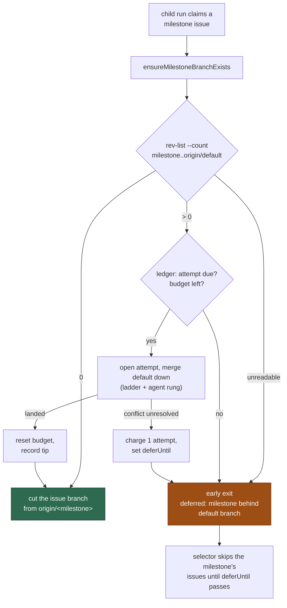

## Summary

A milestone child run now brings its milestone branch level with the default
branch **before** it cuts its issue branch, and defers the whole run when it
cannot — so no child branch is ever based on a milestone branch that is behind.
Closes #1780.

- **New `worker/deno/lib/milestone_presync.ts`.** `presyncMilestoneBranch` is
  one paced attempt at merging the default branch down, and every rule it
  applies is the periodic sweep's own: the ledger transitions from
  `milestone_sync_streak.ts` (`openConflictAttempt`,
  `concludeConflictAttempt`, `isConflictBudgetExhausted`,
  `resetConflictLedgerOnSuccess`, `recordDefaultSha`), the pacing guard
  `conflictAttemptDue`, the failure verdict `judgeSyncFailure` and the agent
  grant `grantAgentRun` — imported, never restated, so a child run and the
  sweep can never disagree about what a branch has spent. The ordinary path is
  sub-second: `git rev-list --count origin/<milestone>..origin/<default>` and,
  at zero, nothing else runs and the ledger is not touched.
- **`setup_branch_phase.ts` calls it** immediately after
  `ensureMilestoneBranchExists`, in the shared `${WORK_DIR}/<repo>` clone the
  sweep uses — never in the lane's worktree, whose checkout of the milestone
  branch git would then refuse to every other lane and to the sweep.
- **A deferral costs no agent spend and changes nothing on the issue.** The
  phase returns `early_exit` with reason
  `deferred: milestone behind default branch`, `expectedSkip: true` and its own
  `expectedNoPrOutcome` — so the issue keeps its pickup label, no failure is
  tracked, no `needs-human` is applied, no `Depends on` line is written, and the
  only comment is the ordinary claim-release comment, which states the reason.
  `issue_worker.ts` now carries a setup-phase `expectedSkip`/`outcome` through
  (it previously dropped both on the `early_exit` path).
- **Loop guard.** `findNextIssue` reads `milestone_sync_failures.json` once per
  scan — a local file, no API call — and `find_oldest_issue.ts` skips **every
  tier's** candidates in a milestone whose `deferUntil` is still in the future,
  logging `skipped: milestone behind default branch (paced until <deferUntil>)`
  once per paced milestone per scan and recording the new `milestone-behind`
  skip reason. Without it a paced milestone was claimed, deferred and commented
  on again every 30 seconds.
- **Docs.** `docs/INTERNALS.md` gains "Sync before new work — the child run's
  own pre-cut sync" (with a Mermaid flow) beside the conflict-ledger section,
  and the paced skip is listed in the issue-finder filtering-criteria table.

### Two deliberate judgements worth a reviewer's attention

**The child's attempt is granted the agent rung.** Only an attempt that climbed
the whole ladder may charge the branch's budget — `judgeSyncFailure` concludes
`not-charged` for a conflict the agent was never offered — and charging is what
writes the `deferUntil` that paces every other slot off the milestone. An
uncharged child attempt would therefore give the loop guard nothing to read, and
three uncharged children could otherwise spend a budget the agent never tried.
The grant is bounded by `grantAgentRun` against the run's own cycle deadline, so
a run without the runway for a full agent run climbs the deterministic rungs
only and its conflict is `not-charged`, exactly as in the sweep.

**An unwritable ledger warns and still merges.** Bringing the branch level is
idempotent, useful work; what a failed ledger write loses is the *pacing*, so
the fault is logged with that consequence named
(`… cannot be charged or paced`) rather than swallowed or turned into a hard
stop that would park every milestone child on a host with a bad work volume.
An unreadable *behind count*, by contrast, defers: a base nobody could measure
is a base no branch is cut from.

## Evidence

Backend/CLI change — no web interface to screenshot. Evidence is the test
suite and the full gate:

```text
deno test tests/milestone_presync_test.ts tests/milestone_presync_git_test.ts \
  tests/setup_branch_presync_test.ts tests/find_oldest_issue_milestone_paced_test.ts
  ok | 23 passed | 0 failed
deno test tests/issue_worker_test.ts tests/setup_branch_resume_test.ts \
  tests/milestone_branch_sync_test.ts tests/find_oldest_issue_test.ts
  ok | 188 passed | 0 failed
./quality.sh < /dev/null   Result: PASSED (with skipped checks)
```



## Test Plan

`worker/deno/tests/milestone_presync_test.ts` (the helper, real ledger files,
injected git):

- `a level branch runs no merge and touches no ledger`
- `a behind branch is synced and the new tip reported`
- `a spent conflict budget is refilled by a later success`
- `an unresolved conflict charges exactly one attempt and paces the branch`
- `a non-conflict git failure defers without charging`
- `a live deferral defers without attempting a merge`
- `a spent budget defers to the roll-back rather than merging`
- `an attempt a previous run left open concludes disrupted, not charged`
- `a behind count that cannot be read defers rather than cutting`
- `a ledger that cannot be written still syncs, loudly`
- `milestonePacedUntil` — live deferral, passed deferral, missing entry, no
  milestone, unparseable deferral

`worker/deno/tests/milestone_presync_git_test.ts` (real bare remote + clone,
the real `syncMilestoneBranchWithDefault`):

- `the issue branch starts at the milestone tip the pre-cut sync produced` —
  asserts the base SHA: `createFeatureBranchFromBase` leaves `HEAD` at the
  post-sync `origin/<milestone>` tip, and the default tip is an ancestor of it
- `a milestone branch already level is reported level and nothing is pushed`

`worker/deno/tests/setup_branch_presync_test.ts` (the phase, mock deps):

- `a behind milestone branch is synced before the child branch is cut` —
  asserts the sync's branch pair, its `cwd` (the shared clone) and the granted
  agent rung, and that the branch is cut afterwards from the milestone branch
- `a level milestone branch is not merged into`
- `a failed sync defers the run, charges the ledger once and cuts no branch`
- `a paced milestone branch defers without attempting a merge`
- `an issue with no milestone never reaches the pre-cut sync`

`worker/deno/tests/find_oldest_issue_milestone_paced_test.ts` (the selector):

- `a paced milestone's issue is skipped and the unpaced one selected`
- `a deferral that has passed leaves the milestone claimable`
- `no pacing function leaves the scan exactly as it was`

### Existing tests

No test was removed or weakened. `deno test` over the whole suite passes
through `./quality.sh`.
