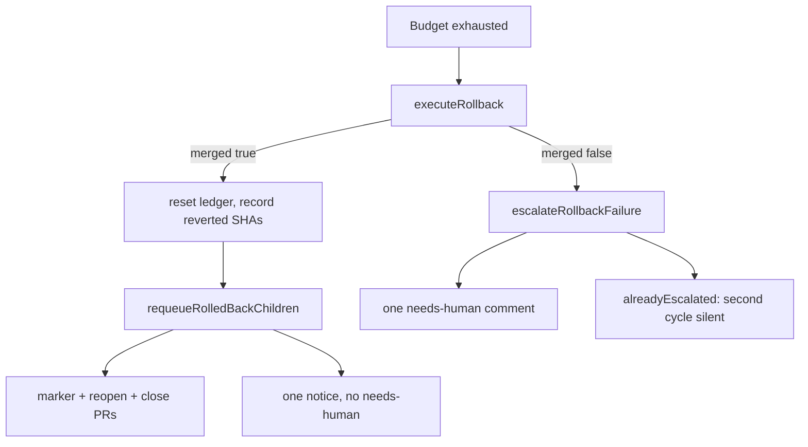

# Re-queue the children a milestone roll-back just reverted

## Summary

When a milestone branch spends its conflict budget, Issue #1778 hands off to a
roll-back and Issue #1771 undoes the merged children that sit on the
conflicting files. Until this change that was where it stopped: the reverted
issues stayed closed, their PRs stayed open, and a roll-back that could not
merge logged a warning and left the branch stuck.

This is the GitHub half. On `merged: true` each reverted child's issue is
reopened with the roll-back marker so the merged-PR closers leave it open, its
open PRs and any open summary PR are closed with a comment naming the revert,
and exactly one notice — no `needs-human` — lands on the parent planning
issue. On `merged: false` the same destination gets one `needs-human` comment
and a second cycle posts nothing. No new issue is ever filed. Closes #1781.

## Evidence

Backend/CLI change with no web interface to screenshot. The evidence is the
test suite and the full gate.

`./quality.sh < /dev/null` is run after the final edit. Targeted suites:

- `deno test tests/milestone_rollback_requeue_test.ts`
- `deno test tests/milestone_branch_sync_test.ts`
- `deno test tests/lib_sweep_coverage_test.ts`

## Acceptance Criteria

<!-- vibe-spec-review inputs="diff+issue-body" -->

- **met** — Exhausted ledger → roll-back; a reverted child's closed issue is
  reopened with the marker, its open PR and the summary PR are closed, exactly
  one notice is posted; an untouched sibling is never reopened —
  evidence: `worker/deno/tests/milestone_rollback_requeue_test.ts::requeueRolledBackChildren - reopens a closed child, posts the marker, closes its PR and the summary, one notice (Issue #1781)`
  and `::requeueRolledBackChildren - an untouched sibling is never reopened or labelled`
  and `worker/deno/tests/milestone_branch_sync_test.ts::syncMilestoneBranches - a successful roll-back resets the ledger and re-queues the child (Issue #1781)`
- **met** — A reverted child that carried `work-on` is reopened without it and
  listed in the checklist; one that carried `idle-task` gets `idle-task`
  re-applied —
  evidence: `::requeueRolledBackChildren - a work-on child is reopened without it and listed for a trusted re-label (Issue #1781)`
  and the idle-task assertion in the reopen/close test
- **met** — `merged: false` → exactly one `needs-human` comment on the parent
  (reopened if closed); a second cycle posts nothing and no issue is created —
  evidence: `::escalateRollbackFailure - one needs-human comment on the parent, and a second call posts nothing (Issue #1781)`
  and `worker/deno/tests/milestone_branch_sync_test.ts::syncMilestoneBranches - a failed roll-back escalates once and a second cycle posts nothing (Issue #1781)`
- **met** — After a successful roll-back the ledger reads zero attempts —
  evidence: `::syncMilestoneBranches - a successful roll-back resets the ledger and re-queues the child (Issue #1781)`
  asserts `conflictAttempts === 0`, `rollbacks === 1`, and the reverted SHAs
- **met** — `./quality.sh < /dev/null` passes — evidence: full gate after the
  final edit

## Standards Review

<!-- vibe-standards-review inputs="diff+CODING-STANDARDS.md" -->

- **clean** — Australian English throughout; fail-loud (`gh` that does not
  parse skips that child and is said out loud; a comment that did not go out
  leaves `countedAsEscalated` false so the next cycle retries); no
  `issue create`; `work-on` is never applied; the success notice never adds
  `needs-human`; tests drive exported functions with an injected `gh` and
  assert the exact comment/label/close/reopen argv, with no source-grepping;
  no wall-clock sleeps; the new module is claimed as sweep slice 12v rather
  than appended to an older slice; no hidden paths staged; the commit names
  Issue #1781 and carries the `Vibe-Coder-Run-Id` trailer

## Test Plan

Added — `worker/deno/tests/milestone_rollback_requeue_test.ts` (11 tests):

- `resolveIssueForRevertedPr` prefers the `issue-N-` branch shape, falls back
  to a GitHub closing keyword, and ignores a bare `See #12`
- `buildRollbackNotice` names the reverted PRs, reopened issues and the
  checklist, and never mentions `needs-human`
- `buildRollbackFailedComment` names the reason and asks for a human
- a closed child is reopened with the marker, `idle-task` is re-applied, its
  open PR and the summary PR are closed, and exactly one notice is posted
- a `work-on` child is reopened without that label and listed for a trusted
  re-label
- an untouched sibling is never reopened or labelled
- a failed roll-back posts one `needs-human` comment; a second call with
  `alreadyEscalated` posts nothing and never files an issue
- nowhere to post is one log line and counts as escalated
- the requeue comment carries a parseable roll-back marker

Added — `worker/deno/tests/milestone_branch_sync_test.ts`:

- a successful roll-back resets the ledger, records the reverted SHAs, emits
  `rolled_back`, and reopens the child with the marker
- a failed roll-back posts one `needs-human` comment, marks the streak
  escalated, leaves the budget spent, and a second cycle posts nothing

No test was removed or disabled.
