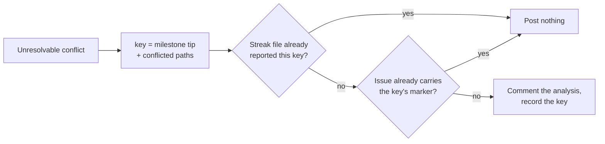

## Summary

Issue #1786 pointed at PR #1741, the `milestone/1653-…` summary PR, which has
been `CONFLICTING` while its milestone's tracking issue collected the same
"only a human can settle this" analysis over and over — four copies on #1653 in
36 minutes, from two different worker hosts.

The escalation was deduped on the **default branch's tip**
(`analysisEscalatedSha`). On a repository where something merges to `main`
every few minutes, that tip is different on every cycle, so the same
unresolved conflict looked new each time and was reported again. Each host also
keeps its own streak file, so the local record could not stop a second host
repeating a report the first had already made.

This keys the escalation on the **conflict itself** — the milestone branch's
tip plus the set of conflicted paths — and writes that key into the comment as
a hidden marker, so any host can see the report has already gone out. Closes
#1786.

The blocked PR itself was resolved too, outside this diff: see *The blocked PR*
below.

## Evidence

Backend/CLI change with no web interface to screenshot. The evidence is the
tests below and the full gate.

`./quality.sh < /dev/null` passes on this branch: 21 checks, `deno tests`
20063 passed / 0 failed, `Result: PASSED (with skipped checks)` (`config
integration` is skipped in this environment, as it is on `main`).

### The blocked PR

Resolving the escalation loop does not, on its own, merge PR #1741, so that
conflict was resolved as well and pushed as draft PR #1794 into
`milestone/1653-…`. `./quality.sh` passes on the merged tree (20159 tests, 0
failed). All four hunks were merged, not side-picked:

| File | Resolution |
| --- | --- |
| `docs/TROUBLESHOOTING.md` | Union — `main`'s #1670 paragraph, then the milestone's #1669 heading. |
| `worker/deno/lib/claude_runner.ts` | Union — the milestone's `usageLimit` (a superset: it carries `windows`) plus `main`'s `invocationsBilled`. |
| `worker/deno/lib/phases/execute_phase.ts` | Union — `main`'s #1670 reason/log structure with the milestone's "no invocation was billed" detail kept as a note. |
| `worker/deno/lib/phases/quality_gate_remediation_phase.ts` | `main`'s forward `git revert` (#1714) supersedes the milestone's `git reset --hard`, which the milestone side only annotated. |

It is a **draft** because landing it by squash was measured and does not clear
#1741: squash-merging it into the milestone branch and then merging that into
`main` still conflicts in `claude_runner.ts` and `execute_phase.ts`, because a
squash carries `main`'s content without its ancestry. `allow_merge_commit` is
`false` on this repository, which is the root cause open issue #1783 documents
and which needs a human: enable *Allow merge commits*, mark #1794 ready, and
merge it as a merge commit.

## Test Plan

Added — `worker/deno/tests/milestone_conflict_dedup_test.ts` (12 tests):

- `conflictEscalationKey` is stable across file order and duplicates, and
  changes for a different file set or a moved milestone tip.
- Characters that would break the HTML marker are stripped.
- `hasConflictEscalationComment` finds another host's marker, ignores a
  different conflict's marker, and fails open with a named log line on an
  unreadable or malformed thread.

Added — `worker/deno/tests/milestone_sync_conflict_analysis_escalation_test.ts`:

- `milestone sync - a second host does not repeat an escalation already on the
  issue (Issue #1786)` — two streak files, one issue; the second host posts
  nothing. Red before the fix (no marker in the body, second comment posted).

Modified — same file, `milestone sync - the same unresolvable conflict is
reported once even as the default branch moves; a different conflict is
reported again (Issues #1559, #1786)`. **Documented business-logic change**:
this test previously asserted "a conflict against a different commit is
reported again", which is the defect — it made every commit to `main` a fresh
escalation. It now asserts that a moved default tip is the *same* conflict, and
that a different conflicted file set, or a moved milestone tip, is a new one.
No test was removed or disabled.
