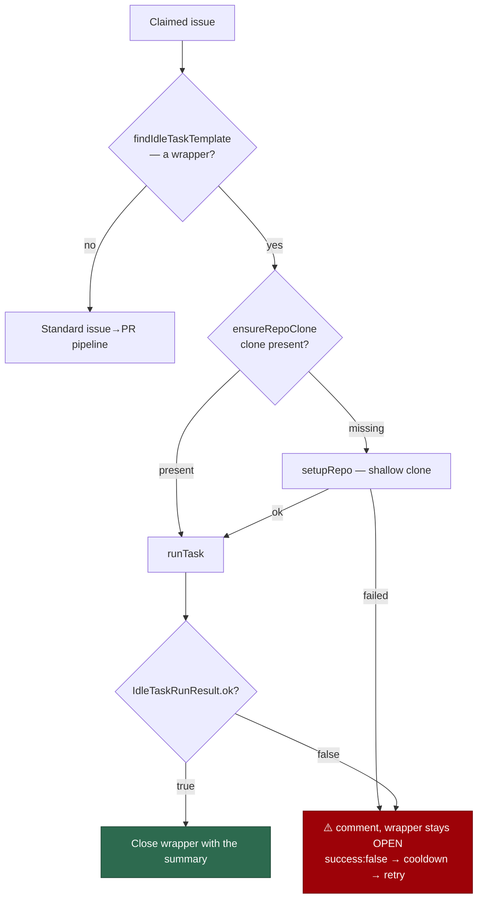

# PR Summary — Issue #179

## Summary

Two defects on the idle-task claim path closed NEAT-AI-Forests#18/#19 with an
`ENOENT` as their "result". Both are fixed. Closes #179.

1. **A failed scan closed its wrapper.** `routeIdleTaskInProcessIssue` ran
   `gh issue close … --comment 
` unconditionally once
   `handleIdleTaskIssue` reported `handled: true`, whether the scan had run or
   not — so an infrastructure failure (missing clone, detector crash, `ENOENT`)
   was recorded as the scan's outcome and nothing re-raised it until the next
   cadence tick. Now **only a scan that actually ran closes its wrapper**. A
   run returning `ok: false` posts the failure as a comment and leaves the
   wrapper **open**, so the ordinary failure path in `run_core`
   (`recordIssueCooldown` → `issueRetryCooldown`, default 600 s) gates the retry
   and a later claim runs the scan again.
2. **No clone for a newly monitored repo.** A template walks
   `${workDir}/<repo>`, and nothing on the idle-task path had ever cloned it —
   a repo freshly added to `.config.json` failed every scan on `readdir`. The
   route now calls the new `ensureRepoClone()` for a **recognised wrapper**
   before running the template. It reuses the setup phase's own
   `setupRepo()` **only when the clone is missing**; an existing clone is left
   completely untouched (no fetch, no `reset --hard`), so a read-only scan never
   disturbs another consumer's working tree. A clone that cannot be made fails
   loud: warn, failure comment, wrapper left open, template never run.

`findIdleTaskTemplate()` is extracted (unchanged logic) from
`handleIdleTaskIssue` so the route can tell a wrapper from ordinary work
*before* deciding whether a clone is needed. Ordinary issues are untouched —
they take the standard setup phase's clone exactly as before.

The `work-on-issue` CLI carried the identical close-on-failure defect; both
call sites now share `finaliseIdleTaskWrapper()`.

### Flow

## Evidence

Backend/CLI change — no web interface to screenshot. Verified by tests.

Full suite: `deno test --allow-all tests/` → **14 647 passed, 32 ignored, 10
failed**. All 10 failures are **pre-existing and environment-specific**
(`fleet_health_test.ts`, `host_workdir_guard_test.ts`,
`optional_feature_env_test.ts`, `setup_workdir_reminder_test.ts` — HOME/
container-mode assertions). Confirmed by stashing this branch and re-running the
same four files on a clean tree: the same 10 fail. This change adds none.

`./quality.sh` — `deno lint`, `deno fmt`, `deno type check`, markdownlint,
mermaid, and every guard check PASS; `deno tests` reports the same 10
pre-existing environment failures described above.

### NEAT-AI-Forests#18/#19

I could not reopen them from this run: the write-repo allowlist refuses a
cross-repo write from the agent subprocess —
`[SECURITY] [WRITE_REPO_BLOCKED] Refused issue-reopen to
stSoftwareAU/NEAT-AI-Forests from the agent subprocess — not on run allowlist
[stsoftwareau/vibecoder]`. They do not need a manual reopen: the per-repo
cooldown gate keys off the previous wrapper's `createdAt` (24 h default), so the
filer re-raises both templates on the next cadence tick after that window — and
with this fix in place, the scan either runs (the repo is cloned on demand) or
leaves its wrapper open for retry.

## Test Plan

New tests:

- `worker/deno/tests/ensure_repo_clone_test.ts` — existing clone left untouched
  (no `setupRepo` call); missing clone created via `setupRepo`; a failed clone
  fails loud with the underlying message; an unsafe path segment is never
  probed and is refused by `setupRepo`; the default `Deno.stat` probe on a real
  temp directory.
- `worker/deno/tests/idle_task_wrapper_closure_test.ts` — a successful run
  closes with its summary; a failed run comments (never `close`) with the
  failure prefix plus the verbatim summary; a `gh` failure is logged and
  swallowed; the comment builder keeps the summary verbatim.
- `worker/deno/tests/idle_task_process_issue_route_test.ts` — three added:
  a recognised wrapper's repo is cloned before the template runs; a clone
  failure never runs the template, never closes the wrapper, comments and warns
  loud; a non-wrapper never triggers a clone.
- `worker/deno/tests/idle_task_claim_handler_test.ts` — three added for the
  extracted `findIdleTaskTemplate` (title match with surrounding whitespace,
  body-fingerprint fallback, ordinary work matching nothing).

Modified tests (documented behaviour change — both previously asserted the
defect):

- `idle_task_process_issue_route_test.ts::routeIdleTaskInProcessIssue - failed
  template run …` — was "still closes the wrapper", now asserts a comment and
  no `close`. This is the NEAT-AI-Forests#18/#19 regression test.
- `work_on_issue_command_test.ts::runWorkOnIssueCommand - idle-task failure …`
  — same change on the CLI path.

Existing route tests gained an `ensureCloneFn` stub reporting "already cloned",
the state they implicitly assumed before this change.
