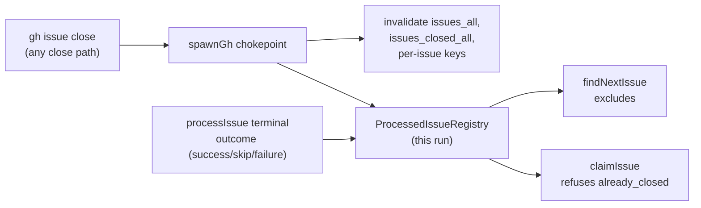

## Summary

The issue scan re-claimed NEAT-AI-Forests#21 twice after the worker had closed
it, because nothing local remembered the issue was finished: the success path
recorded no exclusion (only skips and failures took a cooldown), the cached
`issues_all` list has a 600 s TTL, and no close invalidated it. Every bounce
also counted in `WORKER_SUMMARY` while 13 open wrappers in the same repo were
never reached. Closes #181.

Three changes, all cheap and API-free on the hot path:

1. **`ProcessedIssueRegistry`** (`worker/deno/lib/processed_issue_registry.ts`)
   — a per-run record of every terminal outcome in the scan loop (success,
   skip, failure) and of every issue the worker itself closes. The production
   `findNextIssue` excludes what it holds (folded into the existing
   `isIssueInCooldown` predicate, so all four candidate tiers are covered), and
   `claimIssue` refuses a claim against an issue this run closed with
   `already_closed` — before any API call. One process is one run, so an entry
   lives exactly as long as the run.
2. **Close-aware cache invalidation at the `gh` chokepoint**
   (`worker/deno/lib/issue_close_notifier.ts`, hooked into `spawnGh`) — a
   successful `gh issue close` drops that repo's `issues_all`,
   `issues_closed_all`, `issue_labels_<n>` and `pr_linkage_open_v2_<n>`
   entries, and records the close in the registry. Hooking the single
   chokepoint covers every close path at once (idle-task wrapper closure,
   close-on-merge, the self-healing closes, milestone completion, the
   stale-workflow purge) instead of each one remembering to invalidate. A
   `gh issue reopen` clears the entry and invalidates the same keys.
3. **The claim's open-state check stays uncached** — `fetchIssueState` already
   reads through the uncached `runGhCommand` (no `IssueCache` is involved in
   the claim path; the `issue-view=150` telemetry counts calls, not cache
   hits). That invariant is now stated in its doc comment, and the registry
   check in front of it means a stale "OPEN" from any source can no longer let
   a closed issue be claimed.

Bookkeeping never fails silently: a close whose repo or issue number cannot be
derived from the argument vector is reported at WARN naming what was **not**
updated, and the registry — not the cache invalidation — is what the
correctness guarantee rests on.

## Evidence

Backend/CLI change with no web interface to screenshot. Evidence is the test
suite plus the local quality gate.

Regression proof (TDD): with `noteIssueProcessed` neutered, all four
`run_core_processed_issues_test.ts` cases fail; with the fix they pass:

```
FAILED | 0 passed | 4 failed (107ms)     # exclusion disabled
ok     | 4 passed | 0 failed  (33ms)     # exclusion in place
```

The pool test also reproduces the production shape: a bouncing issue that
costs almost no time re-entered the pool seconds later and was re-processed
forever (the un-fixed run only stops at the test's hard call cap).

Local `./quality.sh`: every check passes except `deno tests`, which reports
**10 pre-existing, environment-dependent failures** in
`fleet_health_test.ts`, `host_workdir_guard_test.ts`,
`optional_feature_env_test.ts` and `setup_workdir_reminder_test.ts` — all four
untouched by this PR. Verified pre-existing by running the same four files in a
clean worktree at the parent commit: the same 10 fail there
(`FAILED | 63 passed | 10 failed`). This PR's run: `14733 passed | 10 failed`,
with the failing set unchanged.



Acceptance criteria:

- *An issue closed by the worker is never claimed again in the same run,
  regardless of cache TTL* — the registry is consulted by both the scan and
  the claim; neither depends on the cache.
- *With two slots and one bouncing issue, the other slot advances* — covered by
  `processed exclusion - two slots, one bouncing issue …`.
- *`WORKER_SUMMARY` does not count re-processing of an already-closed issue* —
  the issue is never re-claimed, so it is never re-counted.

## Test Plan

- `worker/deno/tests/processed_issue_registry_test.ts` (new) — record/recall,
  case-insensitive repo matching, `closed` never downgraded by a later
  outcome, `forget` on reopen, shared-instance reset.
- `worker/deno/tests/issue_close_notifier_test.ts` (new) — a successful close
  records the issue and invalidates exactly that repo's close-sensitive cache
  keys; a failed close records nothing; non-close `gh` calls are ignored; a
  reopen clears the entry; both argument orders (`close 21 --repo o/r` and the
  milestone-completion `close --repo o/r 34`) resolve the issue number; an
  underivable close warns instead of failing silently.
- `worker/deno/tests/run_core_processed_issues_test.ts` (new) — serial loop and
  two-slot pool never re-process an issue this run finished; skip and failure
  outcomes are recorded with the right reason.
- `worker/deno/tests/gh_spawn_test.ts` — added two cases: a successful
  `gh issue close` through the chokepoint marks the issue finished for the run;
  a failed one marks nothing.
- `worker/deno/tests/claim_issue_test.ts` — added two cases: a claim against an
  issue this run closed is refused with `already_closed` and issues **no** `gh`
  call; an issue not closed this run still runs the normal claim path.
- Docs updated: `DESIGN-PRINCIPLES.md` (new principle — "An issue this run
  finished is never re-offered to the scan") and
  `docs/GH-API-OPTIMISATION.md` (new invalidation row plus "Issue closes are
  never left to the TTL").
