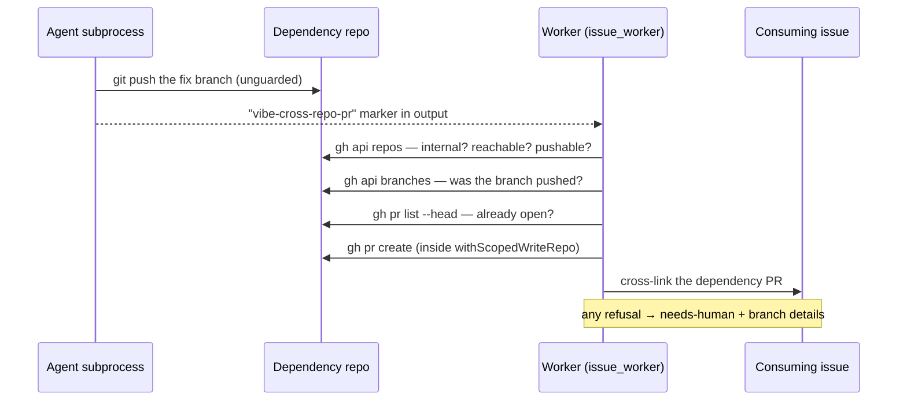

# Cross-repo dependency-PR bridge

## Summary

An agent whose remaining work is a PR in an internal `stSoftwareAU/*`
dependency could not open it. The coding guidelines require exactly that, but
the `gh` guard shim bakes the run's write-repo allowlist — the claim repo, and
nothing else — into the agent subprocess, so `gh pr create --repo
stSoftwareAU/<dep>` died with `[SECURITY] [WRITE_REPO_BLOCKED]`. There was no
sanctioned alternative: `openCrossRepoFixPr()` existed but nothing in the
issue-fix flow called it. `stSoftwareAU/GRQ#4206` burned two runs on the same
blocked call and left a finished fix on an unreferenced branch.

This implements **option 1 from the issue — the worker-side bridge, with no
change to the agent's boundary**:

- The agent pushes the fix branch (`git` is unguarded) and **declares** the PR
  with a marker in its output:
  `<!-- vibe-cross-repo-pr repo="…" branch="…" base="…" title="…" summary="…" -->`.
- The worker (`worker/deno/lib/cross_repo_pr_handoff.ts`) parses the
  declaration as untrusted model output, shape-validates every field before it
  becomes a `gh` argument, and validates the target: internal `stSoftwareAU/*`
  owner, reachable and pushable (`probeCrossRepoAccess`), the head branch
  actually present on the dependency remote, and not that repo's default branch.
  An already-open PR for the same head is reused, never duplicated.
- The single `gh pr create` runs through the worker's own `spawnGh` chokepoint
  inside a new `withScopedWriteRepo()` grant — the allowlist opens for that one
  call, closes again in a `finally`, and announces itself with
  `[SECURITY] [WRITE_REPO_SCOPED_GRANT]`. The agent's own egress boundary is
  untouched (SECURITY.md §6 now documents this as the fourth extension point).
- Success cross-links the dependency PR onto the consuming issue. **Any**
  refusal — malformed marker, unreachable repo, branch never pushed, failed
  `gh pr create` — escalates to `needs-human` with the branch details through
  the guarded `escalateToHuman` chokepoint, so a declared fix is never stranded
  silently. Release-gating is unchanged: the worker opens the PR and stops.

Prompt versions `prompts/coding_guidelines/v39.md` and `prompts/issue/v33.md`
add the instruction telling the agent to push and declare rather than retry the
blocked call.

Closes #182.

## Evidence

Backend/worker change — no web interface to screenshot. Verified by tests
(below) and by the `[SECURITY] [WRITE_REPO_SCOPED_GRANT]` line the wiring test
emits when the worker opens the PR the agent could not.

`./quality.sh` passes every check except `deno tests`, whose 10 failures
(`fleet_health_test`, `host_workdir_guard_test`, `optional_feature_env_test`,
`setup_workdir_reminder_test`) are **pre-existing in this container** — the same
10 fail on the unmodified base commit (verified by stashing the change and
re-running those files). Every test file touched by this change passes:
206 passed, 0 failed.

## Test Plan

New — `worker/deno/tests/cross_repo_pr_handoff_test.ts` (23 tests):

- Marker detection: absent, full, optional fields, single quotes.
- Malformed-not-ignored: missing required field, flag-shaped branch
  (`--repo other/evil`), traversal branch, flag-shaped title; summary
  sanitising and length cap.
- Refusals with no PR attempted: non-`stSoftwareAU` owner (no `gh` call at
  all), unreachable repo, no push permission, branch never pushed, head is the
  default branch.
- PR path: opens with the right `--repo/--head/--base/--title`, body
  cross-links the consuming issue, base defaults to the dependency's default
  branch, an open PR is reused instead of duplicated, a failed create surfaces
  the stderr.
- Boundary: with the allowlist seeded to the consuming repo only, the validated
  PR reaches `gh pr create` through the real `spawnGh` chokepoint and the
  boundary re-closes afterwards.
- Hand-off: success cross-links the PR; a refusal and a malformed marker both
  escalate to `needs-human` naming the repo and branch.

Extended — `worker/deno/tests/write_repo_allowlist_test.ts` (4 tests): a scoped
grant opens the boundary only for the wrapped call, is released when that call
throws, never removes an already-allowed repo, and is inert while enforcement
is off.

Extended — `worker/deno/tests/issue_worker_test.ts` (2 tests): a declared
dependency PR is opened by the worker and cross-linked on the issue during a
real `workOnIssue` run; an unreachable dependency repo escalates to
`needs-human` with the branch details instead of stranding the branch.
