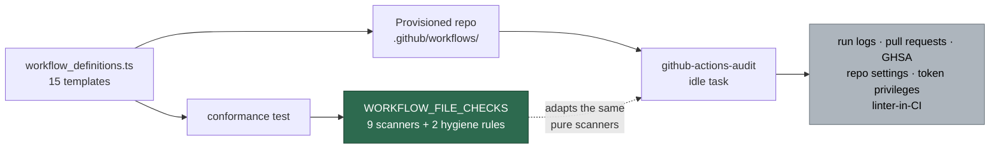

## Summary

The conformance test that holds every provisioned workflow template to the
fleet's own GitHub Actions audit ran **six** of the audit's scanners and
neither workflow-hygiene rule, so `scanRunInjection`, `scanArtifactUploads`
and `scanGitleaksDrift` never saw a template, and a template `run:` block
could drift out of strict mode unnoticed — which one had.

This PR replaces the hand-listed scanner calls with one exported table,
`WORKFLOW_FILE_CHECKS` (`worker/deno/lib/workflow_file_checks.ts`): eleven
entries covering every audit check decidable from the workflow **file**
alone — nine thin adapters over the pure pre-filers the audit template
already calls, plus the two hygiene rules `quality.sh` applies to this
repository's own workflows. Each entry is `{ id, label, run(files, ctx) }`
and duplicates no scanner logic. The conformance test loops the table over
every rendered template on both `Develop` and `main`, and a table test
pins the exact eleven ids so dropping a check is a deliberate edit.

Three supporting fixes:

- **`collectActionPins` reads the same-line trailing comment.** The
  templates render `uses: owner/action@<sha> # v7.0.1` (via `pinnedAction`),
  never the leading `# owner/action@vX` form, so the drift rule passed over
  them vacuously: **0 of 33** pins carried a version before, **33 of 33**
  after.
- **The markdown-lint template gains strict mode** — the one template the
  new strict-mode entry failed.
- **`actions/setup-java` bumped v5.6.0 → v6.0.0**, the one template failure
  the LLM-only review below found (audit check 16, a full major behind).

Closes #1822.

## Evidence

Backend/CLI change — no web interface to screenshot. The evidence is the
red→green test run and the full quality gate.

### Red → green on the strict-mode entry

Before the `workflow_definitions.ts` fix, with the new table in place:

```text
workflow templates - multi-line `run:` opens with `set -euo pipefail` => FAILED
error: AssertionError: Values are not equal: provisioned templates break
`multi-line `run:` opens with `set -euo pipefail`` on Develop:
missing-strict-mode (.github/workflows/markdown-lint.yml:46)
FAILED | 18 passed | 1 failed
```

After adding `set -euo pipefail` to the markdown-lint template's
`Detect Deno worker module` block — the same preamble this repository's own
`.github/workflows/markdown-lint.yml:70` already carried:

```text
ok | 19 passed | 0 failed
```

`./quality.sh` — full gate, foreground: **PASSED** (21 checks; `config
integration` skipped as usual, needs credentials).

### What the table covers, and what it deliberately cannot



The five greyed scans read run history, the network or repository state, not
the workflow file, so no template can satisfy or fail them —
`scanRecentRunsForDeprecations`, `scanGitleaksPrCoverage`,
`scanActionAdvisories`, `scanRepoSettings` and `scanWorkerTokenPrivileges`
are excluded by construction and the test header says so.

### LLM-only review: every template × checks 16, 17, 25

One-off manual review of the whole catalogue against the three audit checks
with no native pre-filer. **The catalogue holds 15 specs, not the 16 the
issue anticipated** (`WORKFLOW_SPECS`, `workflow_definitions.ts:925`) — all
15 are reviewed below, two of them Dependabot configuration files with no
`uses:`, no runtime and no container.

Check 16 was judged against the actual latest upstream release
(`gh api repos/<owner>/<action>/releases/latest`, 2026-09-09), which is
stricter than `github_actions_catalogue.ts` — that catalogue still records
`latestMajor: 4` for several actions the templates already pin ahead of.

| # | Template | 16 — major behind latest | 17 — EOL runtime | 25 — container tag+digest |
| - | -------- | ------------------------ | ---------------- | ------------------------- |
| 1 | gitleaks | pass — checkout v7.0.1, gitleaks-action v3.0.0 both latest | n/a — declares no runtime | n/a — no container |
| 2 | semgrep | pass — checkout v7.0.1 latest | n/a | **pass** — `semgrep/semgrep:1.173.0@sha256:6731…` carries tag **and** digest |
| 3 | dependency-review | pass — dependency-review-action v5.0.0 latest | n/a | n/a |
| 4 | markdown-lint | pass — setup-node v7.0.0 latest; setup-deno v2.0.4 (latest v2.0.5, same major) | pass — `node-version: "lts/*"` resolves to the current LTS | n/a |
| 5 | cargo-audit | pass — rust-toolchain v1 is the latest release | n/a — `toolchain: stable` | n/a |
| 6 | cargo-upgrade | pass — create-pull-request v8.1.1 latest | n/a | n/a |
| 7 | cargo-quality | pass — codecov-action v7.0.0 latest; install-action v2.85.5 (latest v2.87.9, same major) | n/a | n/a |
| 8 | deno-outdated | pass — all pins at latest major | n/a — `deno-version: v2.x` is not a check-17 runtime | n/a |
| 9 | deno-quality | pass | n/a | n/a |
| 10 | npm-audit | pass — setup-node v7.0.0 latest | pass — `"lts/*"` | n/a |
| 11 | npm-dependency-updates | n/a — Dependabot config, no `uses:` | n/a | n/a |
| 12 | eslint-quality | pass — setup-node v7.0.0 latest | pass — `"lts/*"` | n/a |
| 13 | java-dependency-check | **fixed** — `actions/setup-java` was v5.6.0, latest major v6; bumped to **v6.0.0** (`pinned_actions.ts:62`). Dependency-Check_Action and upload-artifact pass | pass — `java-version: "21"` is an LTS in premier support | n/a |
| 14 | java-dependency-updates | n/a — Dependabot config | n/a | n/a |
| 15 | shellcheck | pass — action-shellcheck pinned to `master` HEAD, **ahead** of its latest release (2.0.0, 2023) | n/a | n/a |

Bump note: `actions/setup-java` v6.0.1 published 2026-09-09T12:10Z is inside
the 24h supply-chain quarantine, so the pin took **v6.0.0** (2026-08-24) —
the newest release outside it. Upstream records the v6 ESM migration as not
user-facing breaking, and the template passes only `distribution:` and
`java-version:`.

## Acceptance Criteria

<!-- vibe-spec-review inputs="diff+issue-body" -->

- **met** — `WORKFLOW_FILE_CHECKS` exports eleven entries (nine scanner
  adapters, strict-mode, version-comment drift) and a test asserts the exact
  id list — evidence: `worker/deno/lib/workflow_file_checks.ts:119-186`;
  `worker/deno/tests/workflow_template_audit_conformance_test.ts::workflow
  file checks - the table is exactly the eleven expected checks` —
  reviewer: met
- **met** — the conformance test iterates the table and reports zero findings
  for every template on both `Develop` and `main` — evidence: the eleven
  generated tests in
  `worker/deno/tests/workflow_template_audit_conformance_test.ts:183-198`,
  all green — reviewer: met
- **met** — `collectActionPins` returns the version from a same-line trailing
  comment; the new hygiene tests pass and the existing ones are unchanged —
  evidence: `worker/deno/lib/workflow_hygiene_check.ts:186-246`;
  `worker/deno/tests/workflow_hygiene_check_test.ts::collectActionPins -
  reads the version from a trailing comment` — reviewer: met — reason: the
  reviewer marked it met "with two caveats" (a loose non-version fallback,
  and a trailing comment silently beating a disagreeing leading one); both
  are fixed in this diff — a pin annotated both ways now emits one entry per
  distinct claim, so the two forms disagreeing on **one** pin is a drift
  violation, covered by `findVersionCommentDrift - the two forms disagreeing
  on one pin is drift`
- **met** — before the template fix the strict-mode entry fails on
  `markdown-lint.yml`; after it, passes — stated red→green above — evidence:
  the Evidence section; fix at `worker/deno/lib/workflow_definitions.ts:862`
  — reviewer: met
- **met** — every pinned `uses:` line in every template carries a trailing
  `# <version>` comment — evidence:
  `worker/deno/tests/workflow_template_audit_conformance_test.ts::workflow
  templates - every pinned uses: carries a trailing version comment`, which
  also asserts `collectActionPins` resolves a version for all 33 pins —
  reviewer: met
- **partial** — the PR summary carries the **16**-row LLM-only review table —
  evidence: the 15-row table above — reviewer: partial — reason: the
  catalogue holds 15 `WorkflowSpec`s, not 16
  (`worker/deno/lib/workflow_definitions.ts:925`), so a 16-row table cannot
  be written; every template in the catalogue is reviewed against all three
  checks and the count is stated rather than padded
- **met** — `./quality.sh` passes — evidence: full gate run in the
  foreground, `Result: PASSED (with skipped checks)` — reviewer: met
- **partial** — the summary line's "one exported check table that the
  workflow-sync issue body and the issue prompt name too" — evidence:
  `WORKFLOW_FILE_CHECKS`'s only consumers are the conformance test and
  `docs/EXTENDING.md` — reviewer: partial — reason: none of the issue's "What
  Needs to Be Done" bullets asks for the workflow-sync body or the prompt to
  be changed (they require only that each `label` be *suitable* for one), so
  wiring those two surfaces belongs to their own sub-issues under #1755
- **unrequested** — new sweep slice `12n` in
  `docs/audits/lib-sweep-coverage.json` plus
  `docs/audits/security-sweep-1822-workflow-file-checks.md` — reviewer:
  unrequested — reason: `lib_sweep_coverage_test.ts` fails on any module
  under `worker/deno/lib/` claimed by no slice, so adding
  `workflow_file_checks.ts` requires it
- **unrequested** — the rewritten conformance-test section of
  `docs/EXTENDING.md` — reviewer: unrequested — reason: it named the six
  scanners the test used to run and would have been left stating something
  untrue ("a code change owes a docs change")

## Standards Review

<!-- vibe-standards-review inputs="diff+CODING-STANDARDS.md" -->

- **violation** — `WORKFLOW_FILE_CHECKS` had no paired test file, so every
  entry was asserted only to return **zero** findings: an adapter wired to
  the wrong scanner, or one returning `[]`, would have kept the gate green
  while covering nothing — evidence:
  `worker/deno/tests/workflow_file_checks_test.ts` (absent before) — reason:
  fixed here — each entry now gets a workflow that breaks the rule it names
  and must report it, a clean workflow it must pass, and a test that every
  id in the table has a fixture
- **violation** — the module's "deliberately not in the table" list named
  five excluded scans but omitted `checkLinterInCI`, a tenth pre-filer that
  also decides from workflow text — evidence:
  `worker/deno/lib/workflow_file_checks.ts:18` — reason: fixed here — it
  takes a `repoPath` and answers a repository-level question ("does *this
  repo* run a linter in CI"), which no single template can decide, so it is
  now named and excused on that ground rather than silently dropped
- **violation** — `docs/EXTENDING.md` claimed the table was "every audit
  check decidable from the workflow file alone", stronger than the code
  delivers, and its diagram drew the audit consuming the table — evidence:
  `docs/EXTENDING.md:338` — reason: fixed here — the claim is narrowed to
  "the checks a template can be held to" and the arrow reversed to
  "adapts the same pure scanners"
- **violation** — the `actions/setup-java` bump comment credited the native
  check 16, which could not have fired: `github_actions_catalogue.ts:117`
  still records `latestMajor: 4` — evidence:
  `worker/deno/lib/pinned_actions.ts:60` — reason: fixed here — the comment
  now says the finding is against real upstream state and that refreshing
  the stale catalogue is its own change
- **violation** — `docs/audits/security-sweep-1822-workflow-file-checks.md`
  cited slice **12b** for `workflow_hygiene_check.ts`, which the ledger
  places in **12e** — evidence: that file, line 22 — reason: fixed here; a
  ledger that mis-cites its predecessor is the false record it warns against
- **violation** — a trailing comment silently beat a disagreeing leading one
  on the same pin, so the issue's third required case was covered only
  across two files — evidence:
  `worker/deno/lib/workflow_hygiene_check.ts:225` — reason: fixed here — one
  entry per distinct claim, with a test for both the disagreeing and the
  agreeing case
- **violation** — the section banner still read "Audit checks #4 and #5" with
  the new check-16 assertion beneath it — evidence:
  `worker/deno/tests/workflow_template_audit_conformance_test.ts:285` —
  reason: fixed here
- **not fixed** — `EXPECTED_CHECK_IDS` duplicates the table's ids, so the
  test compares the list against the list — evidence:
  `worker/deno/tests/workflow_template_audit_conformance_test.ts:137` —
  reason: this is what the issue asks for verbatim ("a fixed expected list of
  eleven ids, so adding or dropping a check is a deliberate edit to both");
  deriving it from the table would defeat the purpose
- **clean** — Australian English throughout (artefact/behaviour/organisation
  in prose, `artifact` only in API identifiers); no hidden path staged; the
  commit carries `(Issue #1822)` and the `Vibe-Coder-Run-Id` trailer; every
  test calls real code with fixtures and asserts on returned structures — no
  source-grepping, no sleeps, no wall-clock budgets; no `catch` added, so a
  throwing scanner propagates; the new lib module is registered in the sweep
  ledger; `deno fmt`, `deno lint`, `deno check` and `markdownlint` green on
  every touched file

## Test Plan

Added — `worker/deno/tests/workflow_template_audit_conformance_test.ts`:

- `workflow file checks - the table is exactly the eleven expected checks` —
  ids unique and equal to the fixed expected list.
- Eleven generated tests, one per table entry, named for the entry's label
  and run over every rendered template on `Develop` **and** `main` (replaces
  the six hand-written per-scanner tests).
- `workflow templates - every pinned uses: carries a trailing version comment`
  — the text the audit's stale-pin check reads.

Added — `worker/deno/tests/workflow_hygiene_check_test.ts`:

- `collectActionPins - reads the version from a trailing comment`
- `collectActionPins - a trailing comment for another action is not borrowed`
- `findVersionCommentDrift - a trailing and a leading comment may disagree`
- `collectActionPins - a trailing comment need not be a bare version`
- `collectActionPins - one pin annotated both ways yields both claims`
- `collectActionPins - two agreeing comments on one pin yield one entry`
- `findVersionCommentDrift - the two forms disagreeing on one pin is drift`

Unchanged and still passing: every existing hygiene test (including
`collectActionPins - reads the version from the leading comment`) and every
existing structural assertion in the conformance test — non-workflow specs,
milestone coverage, no push trigger, concurrency, `timeout-minutes`, the
markdownlint-cli2 pin.

Added — `worker/deno/tests/workflow_file_checks_test.ts` (new file, 24
tests). The conformance test asserts every entry finds **nothing**, which
proves the templates clean but nothing about the table; this proves the
wiring from the other side. Each of the eleven entries gets a workflow that
breaks the rule it names and must report it, a compliant workflow it must
pass, and a fixture-coverage test so a new check cannot arrive without one.
Plus `the trigger check honours the default branch` — the same fixture is a
finding on `main` and silent on `Develop`.

Also touched: `docs/audits/lib-sweep-coverage.json` + a new sweep record,
because a module entering `worker/deno/lib/` must be claimed by a slice or
`lib_sweep_coverage_test.ts` fails.

```
deno test -A tests/workflow_file_checks_test.ts                  24 passed
deno test -A tests/workflow_template_audit_conformance_test.ts   19 passed
deno test -A tests/workflow_hygiene_check_test.ts                26 passed
deno test -A tests/lib_sweep_coverage_test.ts                    17 passed
./quality.sh                                                     PASSED
```
