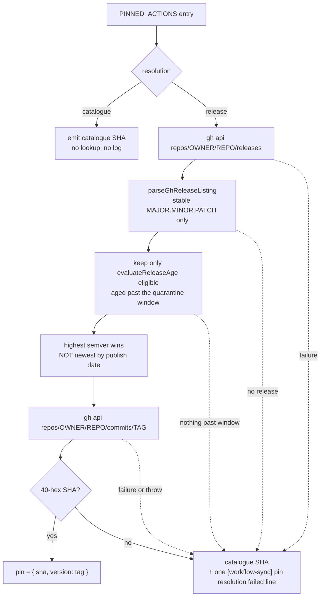

## Summary

Adds `worker/deno/lib/action_pin_resolver.ts`: a pure, injectable resolver that
maps every `PINNED_ACTIONS` entry to the 40-character commit SHA of the
**highest** upstream stable release published at least
`VIBE_BUMP_QUARANTINE_HOURS` ago, falling back to the catalogue SHA with one
logged reason, plus `applyResolvedPins()` which rewrites a rendered template's
`uses:` lines only. Closes #1823.

Highest, not newest: a backport patch cut on an older major yesterday is more
recently *published* than last month's newer major, so choosing by publish date
would walk the pin backwards and trip audit check 16 — the very finding this
exists to remove. `selectNewestAged` picks by date and is deliberately unused.

`ActionPin` gains `resolution?: "release" | "catalogue"`, and the catalogue
header now says plainly that it is the fallback floor rather than the final
emitted value. Three entries are marked `"catalogue"` rather than the two the
issue's first bullet names — the two branch-HEAD entries, **plus
`dtolnay/rust-toolchain`**, taken under the issue's Context clause that permits
a third "only with a source comment stating why, recorded in the PR summary".
The reason: upstream has published exactly one release ever, the rolling `v1`
tag from 2022-07-15, and no `MAJOR.MINOR.PATCH` release at all — so the
resolver has nothing to select and would emit a fallback line on every sync,
training operators to ignore the one signal that matters. The justification is
recorded in a source comment at `worker/deno/lib/pinned_actions.ts:107-112`.

Per the issue, the resolver is **not** wired into the bump phase (#1775) and
`workflow-sync`'s call site is not part of this change; the module is a library
with unit tests only, and the docs say so rather than describing a call that
does not yet exist.

## Evidence

Backend/library change with no web interface, so there is no screenshot to
capture. The evidence is the test suite and the gate:

- `deno test worker/deno/tests/action_pin_resolver_test.ts` — 20 passed.
- `deno test worker/deno/tests/tool_release_age_test.ts` — 64 passed.
- `deno test worker/deno/tests/pinned_actions_test.ts` — passes with the three
  new `resolution` tests.
- `deno task check:manifests` — 633 passed, 0 failed.
- `./quality.sh` — **PASSED** (21 checks; `config integration` SKIPPED, as it is
  on the default branch too).

Every resolver test is a real call to `resolveActionPins` over a recording fake
runner with a fixed clock, asserting on the returned pins, the `failures` array
and the captured log lines — no source-text inspection anywhere.

## Acceptance Criteria

<!-- vibe-spec-review inputs="diff+issue-body" -->

- **met** — `resolveActionPins` and `applyResolvedPins` are exported and pure
  over the injected runner; every listed test is a real call with a fake runner
  and an assertion on the returned pins, failures or log lines — evidence:
  `worker/deno/lib/action_pin_resolver.ts:205,275`;
  `worker/deno/tests/action_pin_resolver_test.ts` covers all nine listed
  scenarios over `createRunner` with a fixed clock — reviewer: met
- **met** — a release younger than the quarantine window is never selected, and
  among eligible releases the highest semver wins regardless of publish order —
  evidence:
  `worker/deno/tests/action_pin_resolver_test.ts::action_pin_resolver - skips a release still inside the window`
  and `::action_pin_resolver - a backport patch does not beat a newer major`;
  chooser at `worker/deno/lib/action_pin_resolver.ts:107` — reviewer: met
- **met** — every fallback path returns the catalogue SHA and produces exactly
  one `[workflow-sync] pin resolution failed` line naming the action and the
  reason — evidence: the single fallback funnel at
  `worker/deno/lib/action_pin_resolver.ts:245-252`, which all six failure exits
  and the rejecting-runner `catch` route through; every fallback test asserts
  `length === 1` — reviewer: met
- **met** — no code path returns a SHA that did not come from the runner output
  or the catalogue — evidence: the resolved SHA comes only from
  `parseGhCommitLine` re-checked against `^[0-9a-f]{40}$`
  (`worker/deno/lib/action_pin_resolver.ts:189`), and `applyResolvedPins`
  re-checks the shape before writing;
  `::applyResolvedPins - a malformed SHA throws rather than being skipped` —
  reviewer: met
- **met** — `./quality.sh` passes — evidence: full gate run on this tree,
  `Result: PASSED`, 21 checks (`config integration` SKIPPED on the default
  branch too) — reviewer: met
- **unrequested** — `dtolnay/rust-toolchain` marked `resolution: "catalogue"`,
  a third entry where the issue's first bullet says "exactly the two" —
  reviewer: unrequested — reason: taken under the issue's own Context clause
  permitting a third "only with a source comment stating why, recorded in the
  PR summary"; upstream cuts no `MAJOR.MINOR.PATCH` release, and the comment
  sits at `worker/deno/lib/pinned_actions.ts:107-112`. The reviewer noted the
  claim is asserted rather than tested — a resolver test cannot verify a live
  upstream without network access, so it stands as a documented assumption.
- **unrequested** — `resolveGitHubReleaseHistory` widened from
  `Promise<ReleaseCandidate[]>` to `Promise<Result<ReleaseCandidate[]>>` in
  `worker/deno/lib/tool_release_age.ts:606` — reviewer: unrequested — reason:
  the issue asked to export it rather than copy it; the widening is what lets
  the resolver report "the lookup did not run" separately from "upstream
  publishes no stable release", and the gate's fail-closed behaviour is
  preserved at `:770` (`listing.ok ? listing.value : []`).
- **unrequested** — the injected `log` sink is also passed to
  `normaliseQuarantineHours` — evidence:
  `worker/deno/lib/action_pin_resolver.ts:212` — reviewer: unrequested —
  reason: without it `VIBE_BUMP_QUARANTINE_HOURS=0` silently becomes 24h,
  which is the embargo switching itself off quietly. The reviewer correctly
  notes the sink can therefore carry a line that is not a
  `pin resolution failed:` line; that is a second, distinct loud signal, and
  the per-fallback "exactly one" guarantee is unaffected.
- **unrequested** — new sweep slice `12o` in
  `docs/audits/lib-sweep-coverage.json` plus its written record
  `docs/audits/security-sweep-1823-action-pin-resolver.md` — reviewer:
  unrequested — reason: not optional — `lib_sweep_coverage_test.ts` fails for
  any `worker/deno/lib/` module claimed by no slice, so `./quality.sh` cannot
  pass without it.
- **unrequested** — `"sweptAt"` backfilled on the pre-existing `12n` (#1822)
  slice — evidence: `docs/audits/lib-sweep-coverage.json` — reviewer:
  unrequested — reason: the ledger parser makes `sweptAt` mandatory, #1822
  landed without one, and `check:manifests` was therefore **already red on the
  milestone branch** before this change (`git show
  a74f4a5:docs/audits/lib-sweep-coverage.json` confirms). AC5 could not be met
  without repairing it.
- **unrequested** — `docs/EXTENDING.md` "Pinning third-party actions in
  templates" gains two bullets — reviewer: unrequested — reason: the repo
  standard "A Code Change Owes a Docs Change"; that section told contributors
  the catalogue SHA is what gets emitted, which is no longer the whole story.
- **unrequested** — tests beyond the issue's enumerated list (non-zero exit,
  whole-catalogue coverage, a bare tag with no `v`, a wider window, a rejecting
  runner, an unusable window, extra `applyResolvedPins` cases) and the exported
  constants `PIN_RESOLUTION_FAILURE_PREFIX` / `QUARANTINE_HOURS_ENV` —
  reviewer: unrequested — reason: additive coverage of the error paths the
  acceptance criteria assert over, and two names the tests assert against
  rather than duplicating literals.

### Reviewer caveats recorded rather than fixed

The Spec reviewer raised two accuracy caveats that do not change specified
behaviour, recorded here rather than silently dropped:

- `::action_pin_resolver - a malformed tag never reaches the runner` proves its
  guarantee via `parseGhReleaseListing`'s stable-semver filter rather than via
  the module's own `RELEASE_TAG_PATTERN`, which no test reaches. The required
  behaviour (no malformed tag in an API path) holds on both layers; the
  in-module check is documented as defence in depth at
  `worker/deno/lib/action_pin_resolver.ts:54-59`.
- If a chosen tag ever failed `RELEASE_TAG_PATTERN` the action falls back
  rather than trying the next-highest eligible release. Unreachable today for
  the same reason, and the issue does not prescribe next-best behaviour, so it
  is left as specified rather than widened.

## Standards Review

<!-- vibe-standards-review inputs="diff+CODING-STANDARDS.md" -->

- **violation** — a rejected pin was swallowed: `applyResolvedPins` kept the
  stale line with no log, no `failures` entry and no throw, contradicting both
  the module header and the sweep ledger's own "no silent failure" claim —
  evidence: `worker/deno/lib/action_pin_resolver.ts:280` — reason: **fixed
  here**. A malformed SHA now throws with the action and the rejected value
  named, before anything is returned, covered by
  `::applyResolvedPins - a malformed SHA throws rather than being skipped`.
  The ledger row was corrected to match.
- **violation** — the PR summary file was absent — evidence:
  `docs/archive/pr-summaries/pr-summary-1823.md` — reason: **fixed here**; this
  file.
- **violation** — the production path reads `VIBE_BUMP_QUARANTINE_HOURS` from
  the ambient environment rather than taking it as an argument, against "Prefer
  the argument to the ambient variable" — evidence:
  `worker/deno/lib/action_pin_resolver.ts:213` — reason: **stands**. The issue
  specifies this exact source ("Quarantine hours come from
  `normaliseQuarantineHours(Deno.env.get("VIBE_BUMP_QUARANTINE_HOURS"))` …
  `deps.quarantineHours` overrides for tests"). The standard's actual hazard —
  a test inheriting host state — cannot occur: `deps.quarantineHours`
  short-circuits the read and every test names its own window, so no test
  evaluates `Deno.env.get`.
- **violation** — the module ships with no production caller, against "only
  make changes that are directly requested or clearly necessary" — evidence:
  `worker/deno/lib/action_pin_resolver.ts:205,275` — reason: **stands, by
  instruction**. The issue's Context says explicitly "Do not wire this resolver
  into the worker's bump phase (#1775) … it is called by `workflow-sync` only",
  and that call site is #1755. Wiring it here would be the scope creep. The
  diff discloses the state in both `docs/EXTENDING.md` and the
  `pinned_actions.ts` header rather than describing a call that does not exist.
- **clean** — Australian English throughout (`behaviour`, `normalise`,
  `honouring`, `catalogue`, `defence`); no hidden paths staged; tests drive
  real code over an injected runner and clock with no `Deno.env.set`, no
  sleeps, no spawns; `Result<T, E>` used for control flow rather than throwing;
  `gh` commands built as `string[]` argv with the action and tag validated
  before interpolation; DRY — `evaluateReleaseAge`, `normaliseQuarantineHours`,
  `parseGhCommitLine`, `RELEASE_LOOKUP_TIMEOUT_SECONDS` and the shared
  `parseSemver`/`compareSemver` are reused rather than reimplemented; docs
  updated alongside the code; the new `lib/` module registered in the
  sweep-coverage ledger with its own written record; every commit references
  the issue and carries a `Vibe-Coder-Run-Id` trailer.

## Test Plan

Added `worker/deno/tests/action_pin_resolver_test.ts` (21 tests):

- highest qualifying release chosen across majors, and the tag→commit call is
  made for exactly that tag;
- a release 23 h old skipped in favour of the older qualifying one, and a 48 h
  release deferred under a 72 h window;
- a backport patch on an older major published yesterday not chosen over an
  older-published newer major;
- no releases, a runner error, a rejecting runner, a non-zero exit and a
  tag→commit lookup returning a non-SHA each fall back to the catalogue with
  exactly one log line naming the action and the reason;
- an unusable quarantine window is reported rather than silently defaulted;
- `"catalogue"` entries produce no runner call, no failure and no log;
- a malformed tag never reaches the runner (no command path carries it);
- `applyResolvedPins` rewrites `uses:` lines only, leaves `image:`, floating
  tag refs, unpinned actions and unrelated lines untouched, and **throws** on a
  malformed resolved SHA rather than silently keeping the stale line.

Extended `worker/deno/tests/tool_release_age_test.ts` (5 tests) for the
now-exported `resolveGitHubReleaseHistory` — happy path, an empty-but-`ok`
listing, a non-zero exit, a spawn failure and a malformed repo that never
reaches the API — and `worker/deno/tests/pinned_actions_test.ts` (3 tests) for
the `resolution` field, including that both branch-HEAD entries are
`"catalogue"`.
