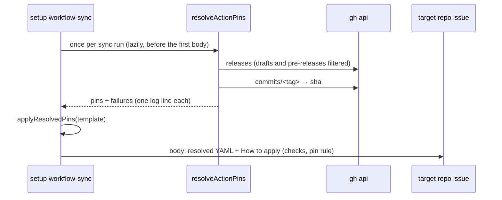

# workflow-sync resolves action pins when it files the issue

## Summary

`setup workflow-sync` now resolves the action pin catalogue **when it files an
issue** and renders every missing- and partial-workflow body against the
result, so the YAML a maintainer is handed carries the highest upstream
release that has aged past the supply-chain quarantine window rather than
whatever SHA `lib/pinned_actions.ts` was last edited with. The "How to apply"
section (and step 2 of "How to complete") now states the copy-verbatim rule,
the copy-the-pins-as-given rule, and lists the file-scoped checks the
committed file must survive — rendered from `WORKFLOW_FILE_CHECKS`, not
hand-copied.

Closes #1824.

- `WorkflowSyncOptions.resolvePins` is the injectable resolver; the default
  builds `resolveActionPins()` over the existing `runCommand` runner (adapted
  to the resolver's `runFn` shape) and `options.log`, so no new credential
  path is introduced.
- The lookup is **memoised and lazy**: `syncWorkflowsForAllRepos` resolves
  once for the whole fleet (pins do not vary by repo), a direct
  `syncWorkflowsForRepo` resolves immediately before the first body it
  renders, and a run that renders none — a `dryRun`, or a repo whose issues
  all exist already — never resolves at all.
- **Failure handling.** A per-action lookup failure falls back to the
  catalogue SHA with one `[workflow-sync] pin resolution failed: <action> —
  <reason>` line carrying `gh`'s own stderr; a wedged lookup is bounded by
  the resolver's timeout, which the adapter enforces because nothing else on
  the setup `gh` path applies a deadline. A malformed pin — the throw
  `applyResolvedPins` added in #1823 — is reported as that repository's
  **failed** sync result rather than being swallowed into a green run that
  filed nothing, and every per-spec skip is now logged.

## Evidence

Backend/CLI change — no web interface to screenshot. Evidence is the test
suite and the rendered body below.



Rendered "How to apply" for the gitleaks spec (abridged):

```text
### How to apply

1. Copy the YAML above **verbatim** — no value in it is repository-specific
   unless listed here, and nothing is listed for this template.
2. The action pins above are already resolved to the highest release that has
   aged past the fleet's supply-chain quarantine window (24 hours by default)
   — copy them as given, and do not re-resolve, bump or reformat them.
3. Save it as `.github/workflows/gitleaks.yml` and push to the default branch.

### Checks the committed file must pass

The file as committed must yield no finding from any of these checks:

- every `uses:` reference is pinned to a 40-character commit SHA
- every workflow and job declares least-privilege `permissions:`
  … (all 11 `WORKFLOW_FILE_CHECKS` labels)
```

Full gate: `./quality.sh` — **PASSED** (config integration skipped, as it is
on this host).

## Acceptance Criteria

<!-- vibe-spec-review inputs="diff+issue-body" -->

- **met** — A filed body's `uses:` pins are the resolver's output; the
  catalogue value appears only for an action the resolver reported as failed
  — evidence: `worker/deno/setup/workflow_sync.ts` (`applyResolvedPins` in
  both bodies);
  `worker/deno/tests/setup_workflow_sync_test.ts::syncWorkflowsForRepo - filed
  body carries the resolver's pin, not the catalogue's` and `::an action the
  resolver failed on keeps its catalogue SHA` — reviewer: met
- **met** — Both body variants list every `WORKFLOW_FILE_CHECKS` label and
  state the copy-verbatim and copy-pins-as-given rules, asserted against the
  table — evidence: `worker/deno/tests/setup_workflow_sync_test.ts::issueBody
  - names every file-scoped check and both copy rules` (and the
  `issueBodyPartial` twin), which iterate `WORKFLOW_FILE_CHECKS` rather than a
  hand-copied list — reviewer: met — reason: the reviewer noted the rule
  assertions compare the body against the constants it is rendered from, so
  they prove presence rather than wording; that is deliberate — the wording
  lives in one exported constant so body and test cannot drift, and the
  rendered prose is shown in Evidence above for a human to read
- **met** — `dryRun: true` performs no resolver call — evidence:
  `worker/deno/tests/setup_workflow_sync_test.ts::syncWorkflowsForRepo - a dry
  run never calls the resolver` (call count 0) — reviewer: met
- **met** — The resolver runs once per `syncWorkflowsForAllRepos` call,
  counted across two repos — evidence:
  `worker/deno/tests/setup_workflow_sync_test.ts::syncWorkflowsForAllRepos -
  resolves the pins once across every repo` (six bodies, one call) — reviewer:
  met
- **met** — `docs/EXTENDING.md` and `docs/SETUP.md` updated; `./quality.sh`
  passes — evidence: `docs/EXTENDING.md` § "Pins are resolved when the issue
  is filed, and the body says so", `docs/SETUP.md` `workflow-sync` row; full
  gate run after the final edit — **PASSED** — reviewer: partial — reason: the
  reviewer's gate run hit a transient type error from an uncommitted edit made
  while it read the tree; the gate was re-run clean after the final commit
- **unrequested** — Mermaid sequence diagram in `docs/EXTENDING.md` and the
  `docs/SETUP.md` setup-step bullet (the issue named only the table row) —
  reviewer: unrequested — reason: kept — the repo standards require a diagram
  where it aids understanding, and the bullet would otherwise contradict the
  row it summarises
- **unrequested** — `COPY_VERBATIM_CLAUSE` / `COPY_PINS_AS_GIVEN_RULE`
  exported from `worker/deno/setup/workflow_sync.ts` — reviewer: unrequested —
  reason: kept — the acceptance criterion demands the rules be asserted
  against the source of truth rather than a hand-copied string
- **unrequested** — a pin fault is reported as the repo's failed result, and
  every per-spec skip is logged (`worker/deno/setup/workflow_sync.ts`) —
  reviewer: unrequested — reason: kept — rendering a body can now throw
  (#1823's deliberate throw), and the pre-existing empty `catch` would have
  turned that into a green sync that filed nothing, which the fail-loud
  standard forbids
- **unrequested** — `PinResolver` returns `ResolvedActionPins` (`{pins,
  failures}`) where the issue wrote `Promise<ResolvedPins>` — reviewer:
  unrequested — reason: kept — it is `resolveActionPins`'s own return type, so
  the default resolver needs no adapter and a test can inject the real
  resolver

## Standards Review

<!-- vibe-standards-review inputs="diff+CODING-STANDARDS.md" -->

- **violation** — fail-loud: `applyResolvedPins`'s deliberate throw was
  swallowed by the per-spec `catch`, producing `ok: true, issuesRaised: 0` —
  evidence: `worker/deno/setup/workflow_sync.ts:706` — reason: fixed here —
  bodies are rendered outside the `catch` and a pin fault returns
  `ok: false` with the reason;
  `setup_workflow_sync_test.ts::a malformed pin fails loud rather than filing
  nothing` covers it
- **violation** — fail-loud: the per-spec `catch` discarded its error
  entirely — evidence: `worker/deno/setup/workflow_sync.ts:717` — reason:
  fixed here — every skip logs `[workflow-sync] <repo>: skipped <spec> — …`,
  covered by `::a spec skipped by a failure says so`
- **violation** — the adapter dropped `timeoutSeconds` on a false premise
  (`spawnGh` times a call out only when given a signal, and the setup runner
  gives none) — evidence: `worker/deno/setup/workflow_sync.ts:498` — reason:
  fixed here — the budget is enforced in the adapter, covered by
  `::pinResolverRunFn - a command that never settles is bounded by the budget`
- **violation** — the fallback reason lost its cause: a runner failure was
  mapped to `exitCode: 1`, and the resolver rebuilds its message from the exit
  code alone, so "HTTP 403" never reached the log — evidence:
  `worker/deno/setup/workflow_sync.ts:505` — reason: fixed here — a failure is
  returned as an error carrying stderr, covered by `::a failed lookup's reason
  reaches the fallback line`
- **violation** — comments claimed a laziness the hoisted `await pins()` no
  longer had — evidence: `worker/deno/setup/workflow_sync.ts:101` — reason:
  fixed here — resolution moved back after the dedup check, so the comment and
  the code agree again
- **violation** — DRY: the default resolver, runner and log defaulting were
  written twice — evidence: `worker/deno/setup/workflow_sync.ts:754` — reason:
  fixed here — `syncRunner`, `syncLog` and `defaultPinResolver` are each one
  helper, and `ResolvedPins` now reuses `ResolvedActionPins["pins"]`
- **violation** — test coverage: nothing exercised `pinResolverRunFn` or the
  default (no-injection) wiring — evidence:
  `worker/deno/setup/workflow_sync.ts:505` — reason: fixed here — four
  `pinResolverRunFn` cases plus two end-to-end cases that omit `resolvePins`
  and answer the release/commit lookups through the mock runner
- **violation** — a unit test inherited host state (ambient
  `VIBE_BUMP_QUARANTINE_HOURS` and the wall clock) — evidence:
  `worker/deno/tests/setup_workflow_sync_test.ts:1055` — reason: fixed here —
  the test names `quarantineHours` and `now`
- **violation** — a declaration split the import block — evidence:
  `worker/deno/tests/required_status_check_guidance_test.ts:28` — reason:
  fixed here — moved below the imports
- **clean** — Australian English throughout (`memoise`, `behaviour`,
  `catalogue`); docs updated alongside the code with no stale wording left;
  every test calls real code (no source-grepping, no wall-clock assertions);
  no hidden or credential-shaped paths staged; both rules kept as single
  exported constants so body and tests cannot drift.

The one standards finding left open is a wording caveat, not a defect: the
body says "no value in it is repository-specific", while the gitleaks
template's *comments* describe two optional additions (`environment:
scanning-secrets`, `GITLEAKS_CONFIG`) a repo may adopt later. The template is
explicitly written to run unmodified on a fresh repo, and the wording is the
issue's own, so it stands as specified.

## Test Plan

Added to `worker/deno/tests/setup_workflow_sync_test.ts`:

- `syncWorkflowsForRepo - filed body carries the resolver's pin, not the
  catalogue's` — an injected resolver returning a new SHA/tag for
  `actions/checkout` appears as `actions/checkout@<sha> # <tag>`, the
  superseded catalogue SHA does not, and the Semgrep `image:` line is
  unchanged. Confirmed red against the pre-change body (raw
  `spec.template`).
- `syncWorkflowsForRepo - an action the resolver failed on keeps its
  catalogue SHA` — the real `resolveActionPins` over a runner that cannot
  reach upstream: catalogue SHA in the body, one
  `[workflow-sync] pin resolution failed:` line logged.
- `issueBody` / `issueBodyPartial - names every file-scoped check and both
  copy rules` — iterates `WORKFLOW_FILE_CHECKS` and asserts each `label`
  plus both exported rule constants, so the assertion cannot drift from the
  table.
- `issueBodyPartial - renders the resolved pin, leaving the image reference
  alone`.
- `syncWorkflowsForRepo - a dry run never calls the resolver` — call count 0.
- `syncWorkflowsForAllRepos - resolves the pins once across every repo` —
  six bodies over two repos, call count 1.
- `a malformed pin fails loud rather than filing nothing` — `ok: false` with
  the reason, and nothing filed.
- `a spec skipped by a failure says so` — a per-spec skip is logged.
- `the default resolver pins from upstream through the setup runner` and
  `… falls back loudly when the runner fails` — the production path with no
  injected resolver.
- `a failed lookup's reason reaches the fallback line` — `gh`'s stderr
  survives into the log.
- Four `pinResolverRunFn` cases: success, failure-with-stderr,
  failure-without-stderr, and the timeout budget.

Updated (signature change only, catalogue pins injected):
`worker/deno/tests/required_status_check_guidance_test.ts` and the existing
orchestration tests in `setup_workflow_sync_test.ts`.

## Documentation

- `docs/EXTENDING.md` — new § "Pins are resolved when the issue is filed, and
  the body says so" (with sequence diagram), and the stale "wired up
  separately" note on the resolver corrected.
- `docs/SETUP.md` — the `workflow-sync` subcommand row and the repository
  sync phase bullet describe filing-time resolution, the fallback log line,
  the checks list, and the dry-run behaviour.
